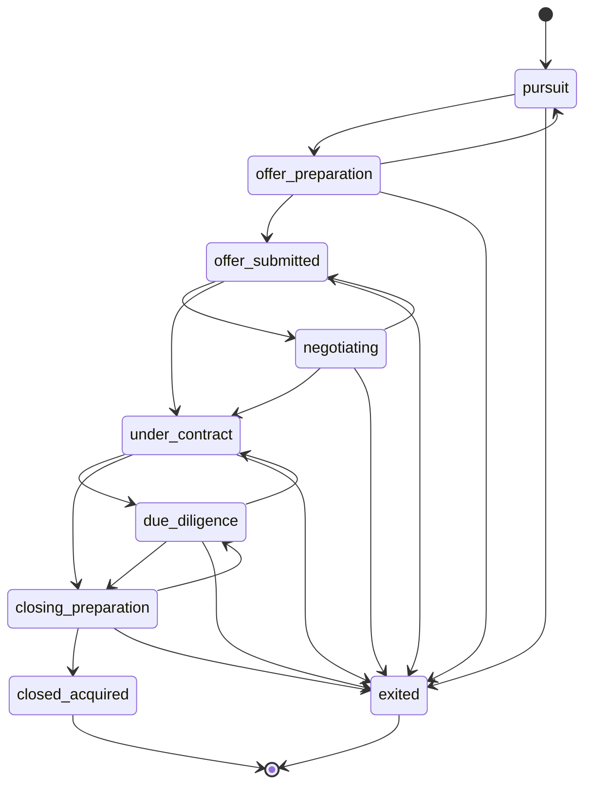
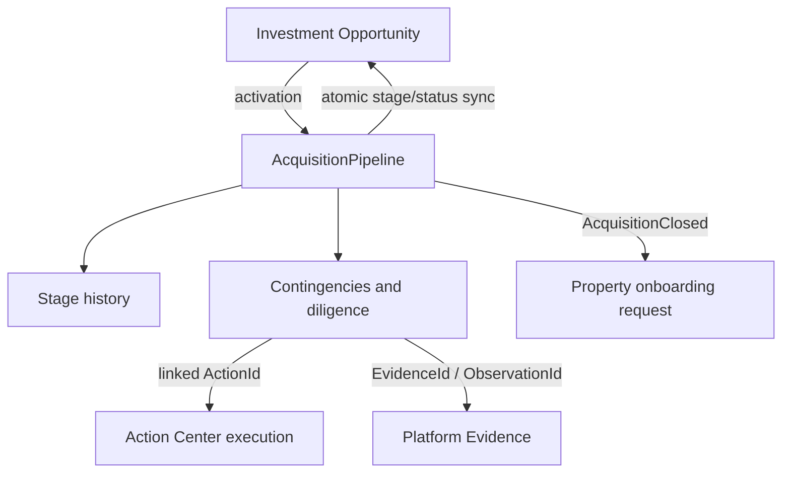
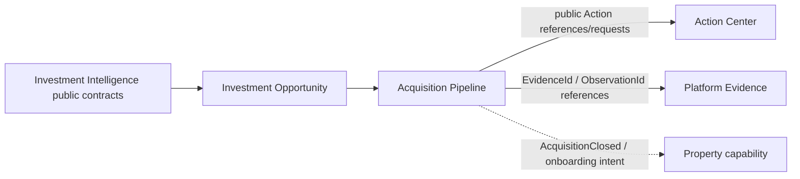

# ADR: Acquisition Pipeline Domain and Capability Boundaries

**Status:** Accepted
**Date:** 2026-07-22
**Decision owners:** Investment Opportunity, Platform, and Operations architecture

## Context

Investment Intelligence answers whether a property is economically and strategically attractive. The Investment Opportunity capability preserves that result as a durable opportunity with immutable analysis versions. A later operator workflow needs to answer a different question: **what must happen next, and what currently prevents this opportunity from advancing safely toward acquisition?**

That workflow is the Acquisition Pipeline. It is not a CRM, project board, legal closing system, document store, replacement for Action Center, second underwriting model, or Property operations workspace.

## Repository characterization

The following current contracts were inspected before this decision:

| Concern | Current owner and contract | Pipeline implication | Decision |
|---|---|---|---|
| Opportunity identity/status | `src/features/investment-opportunity/domain/model.ts`, `domain/investment-opportunity.ts`, `domain/policies.ts` | Status is coarse and currently includes `evaluating`, `researching`, `shortlisted`, `offer-submitted`, `under-contract`, `acquired`, and `rejected`. There is no `pursuit`, negotiating, diligence, or closing-preparation status. | Add a separate stage model. Synchronize coarse status through one policy after activation. |
| Opportunity mutation | `application/save-workflow.ts`, `application/services.ts` | Status, metadata, archive/restore, and analysis saves are centrally commanded and version checked. Existing status commands can currently mutate any permitted coarse transition. | IA-002 commands must become the only progression path for an active pipeline; existing commands must reject contradictory edits. |
| History and concurrency | `InvestmentOpportunity` activity, immutable analyses, repository `save(expectedVersion)` | Opportunity-local activity does not provide stage/offer history and its version is independent of future pipeline writes. | Pipeline is a separate aggregate with append-only history/activity and its own version. Cross-aggregate changes are atomic. |
| Analysis lineage | `OpportunityAnalysis` and `OpportunityAnalysisSnapshot` in `domain/model.ts`; `application/snapshot-builder.ts` | Analysis IDs, sequences, source summary, evidence IDs, policy versions, and lifecycle lineage are immutable. Reanalysis creates a new version. | Activation and offers retain immutable source-analysis references; reanalysis never rewrites an offer. |
| Action execution | `src/platform/actions/domain/action.ts`, `domain/action-source.ts`, `application/action-commands.ts` | `PlatformAction` owns action identity, assignments, schedule, priority, status, history, outcome links, and version. Sources can carry a capability and source ID. | Pipeline owns acquisition requirements and references/request Actions through public contracts. Action completion is not requirement satisfaction without an explicit mapping policy. |
| Evidence | `src/platform/evidence` (`Evidence`, `EvidenceReference`, `EvidenceId`) and `src/platform/observations` (`Observation`, provenance/source) | Canonical evidence and observation primitives exist; provider DTOs do not belong in a feature aggregate. | Pipeline stores evidence/observation references and operator outcomes, never payloads. A future Documents capability owns files. |
| Property/onboarding | `src/lib/properties.ts`, `src/app/actions/properties.ts` | Property records are currently CMS records; creation is an admin-only Supabase action guarded by `requireRole(["admin"])`. No customer acquisition-close onboarding command was found. | Close emits an onboarding intent/event. It does not directly create or activate a Property. |
| Platform primitives | `src/platform/kernel` identifiers/entities; action versions/history; existing activity/idempotency patterns | Reusable primitives exist. | IA-002 reuses them; no parallel pipeline kernel or event framework is introduced. |

### Characterization consequences

* `shortlisted` is portfolio prioritization, not proof that execution has begun. The pipeline's initial `pursuit` stage represents that commitment.
* Existing `offer-submitted`, `under-contract`, and `acquired` values are retained for portfolio compatibility but are insufficient to represent the full process.
* Existing Opportunity rejected reopening remains a coarse Opportunity behavior. It must not reopen an exited pipeline; pipeline reopening is deferred.
* The current property CMS is not a safe acquisition onboarding boundary, and no direct close-to-property behavior is assumed.

## Decision

### Capability and aggregate boundary

Acquisition Pipeline remains within the Investment Opportunity capability for IA-002:

`src/features/investment-opportunity/acquisition-pipeline/`

`AcquisitionPipeline` is an independent aggregate root referenced by `InvestmentOpportunityId`. There is exactly zero or one pipeline per opportunity. An opportunity may exist without a pipeline; a pipeline cannot exist without its opportunity. IA-002 does not permit a second pipeline after exit or close. Extraction to a top-level capability is reconsidered only if acquisitions have independent upstream sources, independent permissions/workspace, or reuse beyond Investment Opportunities.

The pipeline owns activation, stage and stage history, offers, accepted-agreement facts, contingencies, diligence requirements, closing-readiness projection inputs, exit/outcome facts, activity, and its own optimistic-concurrency version. It does not own analysis formulas, Market data, Action execution, document binaries, or Property operations.

### Domain language

* **Investment Opportunity** — durable potential acquisition and its Investment Analysis history.
* **Acquisition Pipeline** — governed process of actively pursuing one opportunity toward acquisition or exit.
* **Offer** — proposed terms presented to a counterparty.
* **Contract** — recorded facts of the accepted/executed agreement; distinct from an offer.
* **Contingency** — an agreement condition affecting whether the transaction proceeds.
* **Due-diligence item** — an investigation or verification; it may support a contingency but is not itself contractual.
* **Closing readiness** — explainable assessment of recorded requirements, not legal or lender approval.
* **Exit** — terminal end of active pursuit without acquisition.
* **Acquisition** — completed purchase, lease execution, or equivalent right to operate; not operational onboarding.

### Activation and relationship to Opportunity status

Activation is an explicit operator command. It requires an owner-authorized, unarchived, non-acquired opportunity with a supported route, no existing pipeline, and a current completed analysis. Activation atomically creates the pipeline at `pursuit`, synchronizes the opportunity to `shortlisted`, records source analysis ID/version, analyzed timestamp, recommendation, score, and confidence, and appends history/activity. The source facts are compact immutable lineage, not a second full snapshot.

Activation implies shortlist (the recommended Option B), so the operator does not perform two redundant commands.

Before activation, Opportunity status remains Opportunity-owned. After activation, pipeline stage is authoritative for acquisition progression; Opportunity status is a coarse synchronized projection for portfolio display, filters, and compatibility. The future canonical policy is `deriveOpportunityStatusFromAcquisitionStage()`.

| Pipeline state | Synchronized Opportunity status |
|---|---|
| no pipeline | existing Opportunity-controlled status |
| pursuit, offer-preparation | `shortlisted` |
| offer-submitted, negotiating | `offer-submitted` |
| under-contract, due-diligence, closing-preparation | `under-contract` |
| closed-acquired | `acquired` |
| exited | `rejected` |

Once active, ordinary Opportunity status commands may not contradict the pipeline (for example, directly marking acquired, under-contract, offer-submitted, or rejected). Those outcomes must be pipeline commands. An active pipeline opportunity cannot be archived; it must first exit. Historical exited/closed pipelines may later be archived without deleting history. Reopening an exited pipeline is deferred.

### Stages and transitions

The shared canonical stages are:

`pursuit` → `offer-preparation` → `offer-submitted` → `negotiating` → `under-contract` → `due-diligence` → `closing-preparation` → `closed-acquired`, with `exited` terminal from active stages.

Allowed transitions are:

| From | Allowed destinations |
|---|---|
| pursuit | offer-preparation, exited |
| offer-preparation | pursuit, offer-submitted, exited |
| offer-submitted | negotiating, under-contract, exited |
| negotiating | offer-submitted, under-contract, exited |
| under-contract | due-diligence, closing-preparation, exited |
| due-diligence | under-contract, closing-preparation, exited |
| closing-preparation | due-diligence, closed-acquired, exited |
| closed-acquired | none |
| exited | none |

Backward transitions require a reason code, actor, timestamp, and version. Terminal transitions require explicit confirmation, outcome facts, and idempotency. Explicitly supported shortcuts may skip negotiation or diligence only when prerequisite facts are recorded. `pursuit → closed-acquired` and `offer-preparation → closing-preparation` are prohibited absent a future import command.

### Shared routes and route-specific terms

Purchase and rental-arbitrage use one pipeline lifecycle, history, requirements, authorization, concurrency, and activity model. Route-specific offer and contract terms use discriminated unions (`purchase` versus `rental-arbitrage`); they must not be separate aggregates or one sparse object of optional fields. Purchase terms may include price, earnest money, financing, inspection/appraisal/title, concessions, and closing dates. Rental terms may include rent, lease term, deposit, landlord/STR authorization, utilities, setup period, possession, and commencement.

### Analysis, offer, and contract lineage

Every offer references the immutable Opportunity Analysis used to formulate it. Submitted offers preserve route, terms, contingencies, expiration, actor, timestamp, and source analysis. Reanalysis creates a new immutable Opportunity Analysis and never modifies submitted offers. A future `assessOfferAnalysisAlignment()` projection may report `aligned`, `materially-changed`, `analysis-stale`, or `analysis-missing`; materiality thresholds are deferred.

Offer statuses are `draft`, `submitted`, `countered`, `accepted`, `rejected`, `withdrawn`, `expired`, and `superseded`. Drafts are editable; submitted terms are immutable; counteroffers do not overwrite submitted terms; multiple sequential offers are allowed, with at most one current active offer.

An accepted offer is not automatically a contract. A contract records accepted agreement facts, source accepted offer when applicable, route, final terms, dates, contingencies, actor, and timestamp. Agreements negotiated outside Luxe Haven are supported by an explicit external source and entered facts; the system must not fabricate an accepted offer.

```mermaid
flowchart LR
  O[Investment Opportunity] --> AH[Immutable analysis history]
  AH --> A[Source analysis reference]
  A --> OF[Offer snapshot]
  OF --> R[Counterparty response]
  R --> C[Contract / external agreement facts]
  C --> CR[Closing readiness projection]
  CR --> ACQ[AcquisitionClosed event]
  ACQ -. onboarding intent .-> P[Property onboarding]
```

### Contingencies, diligence, and templates

Contingencies and diligence are separate records. Both may use `not-started`, `in-progress`, `satisfied`, `waived`, `failed`, and `not-applicable`. An Action Center blocker is an execution projection, not a permanent acquisition requirement outcome. A diligence item may support one contingency; a contingency may have several diligence items.

Route-specific requirement templates are operational defaults only. They may provide category, suggested stage/timing, normal/blocking hints, and evidence/action guidance, but are not jurisdictional checklists, legal advice, or professional approval.

### Action Center boundary

Action Center owns executable work: `PlatformAction` identity, assignee, schedule, priority, status, comments/history, and outcome links. Pipeline owns requirement identity, acquisition outcome, due date as an acquisition fact, blocking effect, and linked Action ID/status projection. Integration is request/reference out and observed outcome in through an application or event boundary. Completing an Action never automatically satisfies a legal or acquisition requirement without an explicit mapping policy.

### Evidence and documents

Pipeline stores `EvidenceId`, `ObservationId`, and future `DocumentId` references plus why a reference supports a requirement and the operator-recorded outcome. Platform Evidence/Observation owns immutable content, provenance, source, confidence, and identifiers. A future Documents capability owns files, versions, MIME type, storage, retention, and access control. Provider payloads and binary documents do not enter the pipeline aggregate.

### Closing readiness, exit, and acquisition

`buildAcquisitionClosingReadiness()` is a pure projection with `not-ready`, `conditionally-ready`, or `ready`. It considers the recorded agreement, route-applicable contingencies/diligence, dates, waivers, risks, and later funds/approval facts. Its language is “Ready based on recorded pipeline requirements,” never “legally cleared to close.” Blocking requirements cannot be silently ignored; explicit, authorized overrides require reason, actor, and timestamp. The override matrix is deferred.

Exit is terminal in IA-002. It records reason, explanation, stage, actor, timestamp, and related records, synchronizes Opportunity to `rejected`, and preserves history. Recommended reason codes include `offer-rejected`, `terms-unacceptable`, `inspection-failed`, `financing-failed`, `appraisal-failed`, `title-or-legal`, `regulatory-ineligible`, `landlord-declined`, `economics-deteriorated`, `operator-withdrew`, `counterparty-withdrew`, `opportunity-unavailable`, and `other`.

Closing requires a route-compatible contract/agreement, readiness permitting completion, actual closing/commencement date, final terms, actor, idempotency key, and expected versions. It transitions to `closed-acquired`, synchronizes Opportunity to `acquired`, appends immutable facts/history/activity, and emits `AcquisitionClosed`. It does not create a Property; a later onboarding request/event starts the separate Property lifecycle.

### Concurrency, transactions, authorization, and persistence

Opportunity and Pipeline have independent aggregate versions. Notes/tags/analysis saves must not conflict with offer or diligence edits unnecessarily. Activation, stage/status synchronization, exit, and close lock/validate both aggregates in one transaction or Supabase RPC; partial updates are invalid. Material commands require idempotency receipts: activation, offer submission, counterparty response, contract recording, terminal transitions, and close. Stale versions fail explicitly; there is no last-write-wins behavior for offers, contracts, requirements, transitions, or closing.

All records inherit owner scope from the Opportunity. Owner and actor are resolved server-side, never trusted from client fields. Future capabilities are `view_acquisition_pipeline`, `start_acquisition_pipeline`, `manage_acquisition_pipeline`, `manage_acquisition_offers`, `manage_acquisition_diligence`, and `close_acquisition`. Internal access requires an explicit Operations Console capability. Anonymous access is denied. Child records inherit access through the parent.

Expected normalized persistence entities are `acquisition_pipelines`, `acquisition_stage_history`, `acquisition_offers`, `acquisition_contracts`, `acquisition_contingencies`, `acquisition_due_diligence_items`, `acquisition_pipeline_activity`, and `acquisition_command_receipts`. Queryable lifecycle records are normalized; route-specific submitted-term snapshots may use versioned JSON. History, submitted offers, activity, overrides, and command receipts are append-only. IA-002A.1 creates no migration.

## Capability and dependency constraints

The arrows from Pipeline to Action Center/Evidence are public-contract or integration relationships, not imports of persistence or UI. Platform, Investment Intelligence, and Market Intelligence must not import Acquisition Pipeline. Pipeline may import Investment Opportunity public contracts and Platform primitives only; it must not import Action persistence/UI, document infrastructure, Market providers, or Supabase row types. UI must not define stage policy. Persistence rows are not domain contracts. One canonical owner must define stage-to-Opportunity-status mapping.

## Legal and product-language guardrails

Use “recorded,” “operator-reported,” “pipeline readiness,” “required item,” “agreement recorded,” and “due-diligence progress.” Do not claim “legally approved,” “compliant,” “clear title,” “guaranteed financing,” “safe investment,” “guaranteed clear to close,” or “attorney reviewed” unless an authoritative future integration actually supports the claim. Where appropriate, direct operators to attorneys, lenders, accountants, insurers, inspectors, title companies, and local authorities.

## Alternatives considered

1. **Stage only on Opportunity** — rejected: no independent history/concurrency and no offer/diligence lifecycle.
2. **Embed full pipeline in Opportunity** — rejected: oversized aggregate and unrelated write contention.
3. **New top-level Acquisition Management capability now** — deferred: no independent upstream sources or proven reuse.
4. **Use Action Center as pipeline** — rejected: actions model work, not transaction state.
5. **Treat diligence as contingencies** — rejected: investigations are not necessarily contractual.
6. **Treat accepted offer as contract** — rejected: accepted terms and executed agreement can differ and agreements may be external.
7. **Automatically create Property on close** — deferred: operational onboarding is separate and data may be incomplete.
8. **Separate purchase and rental pipelines** — rejected initially: shared lifecycle is substantial; discriminated terms provide safer reuse.

## Deferred decisions

Exact materiality thresholds, closing override matrix, jurisdictional templates, document storage/e-signature, lender/title/inspection integrations, automatic Property creation, collaboration/comments, notifications/calendar, approvals, UI/drag-and-drop, forecasting/analytics, multiple simultaneous active offers, imported historical acquisitions, pipeline reopening, and capital-allocation decisions are deferred to later IA-002 milestones.

## Consequences and implementation constraints

IA-002A.2 may introduce identifiers, value objects, aggregate behavior, stage policy, and route-term unions under `investment-opportunity/acquisition-pipeline`. IA-002A.3 must implement the canonical status mapping and activation eligibility. Later persistence must preserve append-only history and transaction boundaries described here. Existing Opportunity status commands must be guarded once a pipeline is active. No production pipeline workflow or migration is part of this milestone.
