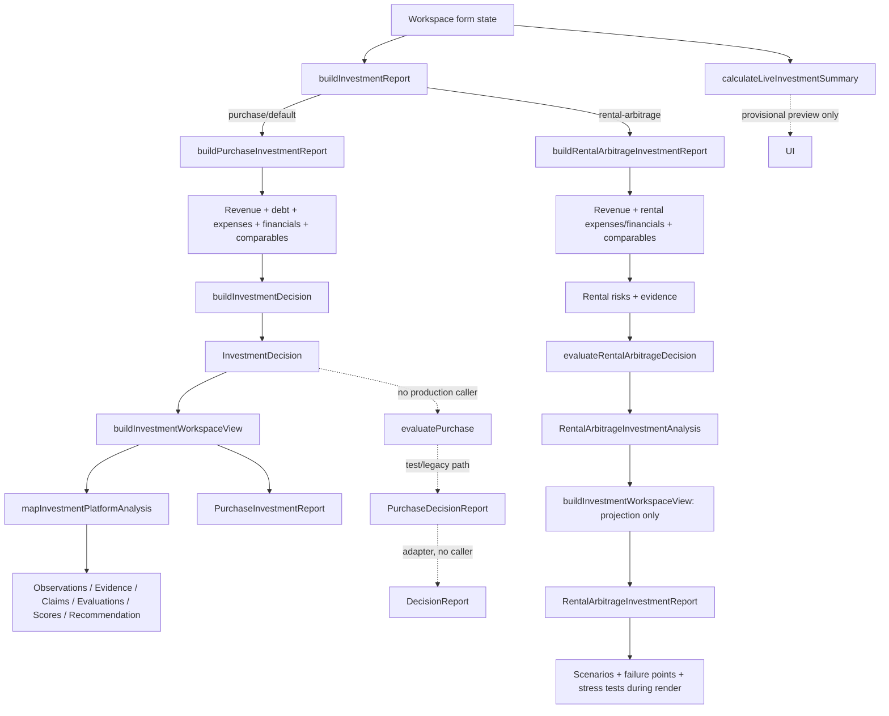
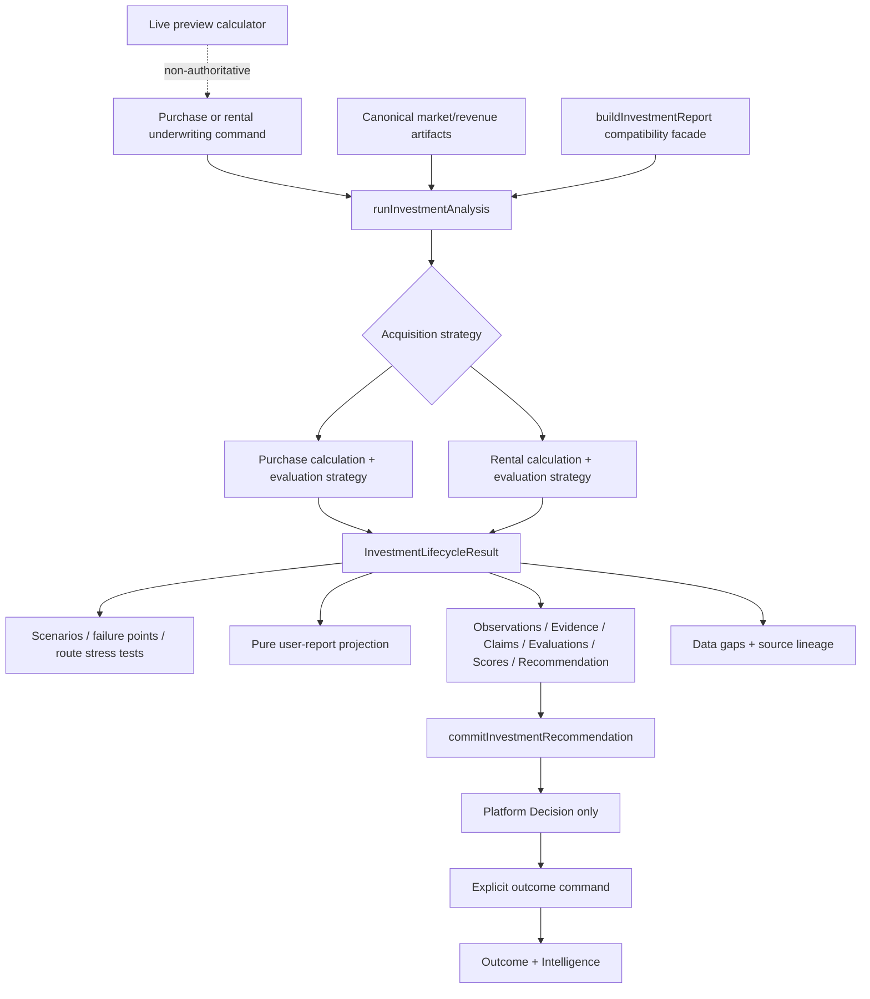
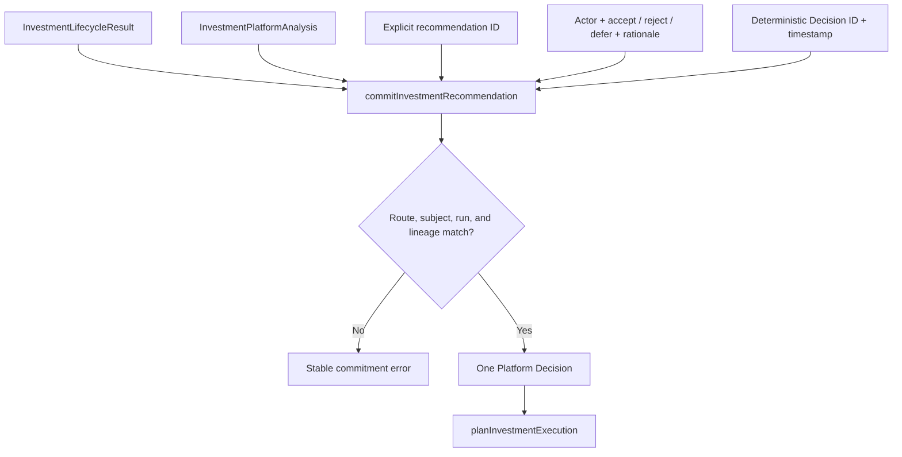
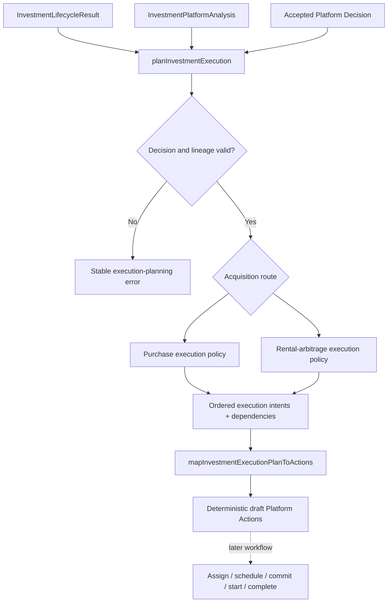
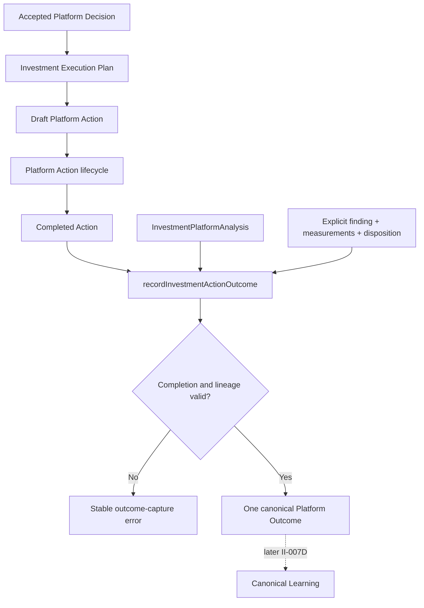

# Investment Intelligence Orchestration

## Status

II-006A current-state trace, updated by II-006B with the canonical application boundary, II-006C with canonical derived-analysis ownership, II-006D with one authoritative purchase decision policy, II-006E with cross-route canonical Platform analysis, II-007A with canonical recommendation commitment, II-007B with canonical execution planning, II-007C with canonical Action outcome capture, and II-007D with canonical Learning integration. The current-state findings describe the repository as traced on 2026-07-21 and remain as historical evidence; they do not designate every existing path as target architecture.

## Purpose

Investment Intelligence currently has one workspace entry point but not one complete application boundary. This trace follows raw workspace underwriting inputs through financial calculations, recommendations, user-facing reports, and Platform artifacts for purchase and rental arbitrage. It also identifies parallel and compatibility paths and recommends a canonical lifecycle boundary without changing production behavior.

## Acquisition Routes

### Purchase

The active purchase path is:

1. `InvestmentWorkspaceStateProvider` owns form values, creates three hard-coded comparables and fixed market medians, and assembles `BuildPurchaseInvestmentReportInput`.
2. `buildInvestmentReport` defaults a missing `acquisitionType` to purchase and dispatches to `buildPurchaseInvestmentReport`.
3. `buildPurchaseInvestmentReport` normalizes numbers to USD value objects. `calculateRevenueProjection` derives monthly and annual revenue. `calculateAnnualDebtService` derives mortgage cost. The service itself calculates revenue-based management, maintenance, and capital-reserve amounts plus cash invested.
4. `calculateExpenseProjection` totals mortgage and operating expenses. `calculateFinancialPerformance` derives NOI, annual cash flow, cap rate, cash-on-cash return, DSCR, and break-even occupancy. `calculateComparableAnalysis` derives comparable position and upside.
5. `buildInvestmentDecision` receives those already-calculated projections. It runs `assessInvestmentRisks`, `calculateInvestmentScore`, `buildSupportingEvidence`, `determineAcquisitionRecommendation`, and `buildAcquisitionStrategy`, then returns `InvestmentDecision`.
6. Workspace state stores that `InvestmentDecision`. `InvestmentAnalysisResults` calls `buildInvestmentWorkspaceView`; for purchase this also maps Platform analysis, but the component discards the `platform` member and retains only `projection`.
7. `InvestmentReport` dispatches by acquisition type to `PurchaseInvestmentReport`, which directly projects the decision into UI cards. It does not recalculate underwriting values.

The active purchase report does **not** contain scenarios or failure points. A separate path, `evaluatePurchase(PurchaseInvestmentAnalysis)`, calculates `buildPurchaseScenarios` and `calculatePurchaseFailurePoints`, then independently builds decision evidence, risks, opportunities, confidence, thesis, and recommendation. `adaptPurchaseDecisionReport` can convert that result to the generic `DecisionReport` UI contract. Neither function has a non-test caller, and `PurchaseDecisionSummary`, `PurchaseScenarioAnalysis`, `PurchaseFailurePointAnalysis`, and `DecisionReportLayout` are likewise not connected to the workspace.

Thus purchase has two decision layers with overlapping evidence, risk, confidence, and recommendation responsibilities: the active `buildInvestmentDecision` path and a richer, disconnected `evaluatePurchase` path.

### Rental Arbitrage

The active rental-arbitrage path is:

1. `InvestmentWorkspaceStateProvider` owns form and lease values, creates the same hard-coded comparables and market data, and assembles `BuildRentalArbitrageInvestmentReportInput`.
2. `buildInvestmentReport` discriminates on `AcquisitionType.RentalArbitrage` and dispatches to `buildRentalArbitrageInvestmentReport`.
3. `buildRentalArbitrageInvestmentReport` normalizes money and builds lease assumptions and a market snapshot. `calculateRevenueProjection` supplies shared revenue. The service itself derives revenue-based management, maintenance, and capital-reserve costs.
4. `calculateRentalArbitrageFinancialPerformance` jointly creates the rental expense projection and lease-specific performance: gross revenue, operating and lease expense, total expense, annual cash flow, monthly margin, initial capital, cash-on-cash return, break-even occupancy, payback, and lease coverage. `calculateComparableAnalysis` remains shared.
5. `assessRentalArbitrageRisks` and `buildRentalArbitrageEvidence` use rental-specific policies. `evaluateRentalArbitrageDecision` independently calculates the six-part investment score, recommendation, and confidence. The service returns `RentalArbitrageInvestmentAnalysis`.
6. Workspace state stores the analysis. `buildInvestmentWorkspaceView` returns only the compatibility projection for rental and produces no Platform analysis.
7. `RentalArbitrageInvestmentReport` renders the analysis and, during render, invokes `buildRentalArbitrageScenarios`, `calculateRentalArbitrageFailurePoints`, and `buildRentalArbitrageStressTests`.

Lease expense, lease coverage, return on startup capital, payback, utilities-included handling, lease failure points, and market stress tests are intentional rental-specific behavior. Revenue and comparable calculations are intentionally shared. Risk, evidence, scoring, recommendation, confidence, scenarios, and failure-point concepts are equivalent lifecycle responsibilities implemented separately. Unlike purchase's disconnected richer evaluator, rental's scenarios, failure points, and stress tests are live but are UI-owned derived calculations and do not influence the stored recommendation.

## Current Orchestration Boundaries

### buildInvestmentDecision

- Input: acquisition type, normalized property, market, purchase-style `InvestmentAssumptions`, revenue, expenses, financial performance, comparable analysis, and optional risk/scoring/evidence/recommendation policies.
- Output: `InvestmentDecision`, including the inputs plus risks, evidence, score, recommendation, confidence, and acquisition strategy.
- Responsibilities: post-financial risk assessment, scoring, evidence, recommendation/confidence policy, and acquisition strategy assembly.
- Callers: `buildPurchaseInvestmentReport` and tests. No rental or direct workspace caller.
- Limitations: despite accepting `AcquisitionType`, its concrete property, assumptions, expense, performance, policy, and strategy contracts are purchase-shaped. It does not calculate financials, scenarios, failure points, reports, or Platform artifacts. It is the purchase model consumed by the active UI and Platform adapters, but it does not support both routes.

### evaluatePurchase

- Input: `PurchaseInvestmentAnalysis` (structurally the shared analysis base specialized for purchase).
- Output: `PurchaseDecisionReport` containing thesis, report-specific evidence/risks/opportunities/confidence/recommendation, scenarios, and failure points.
- Responsibilities: purchase scenarios and failure points plus a second purchase-specific evidence, risk, confidence, thesis, opportunity, and recommendation pipeline.
- Callers: tests only. No non-test import exists.
- Limitations: it assumes financial analysis already exists, duplicates responsibilities of `buildInvestmentDecision`, returns a different recommendation/report vocabulary, creates no Platform artifacts, and is not the model rendered by the active workspace.

### evaluateRentalArbitrageDecision

- Input: precomputed revenue, rental financial performance, comparables, market, risk exposure, risks, and supporting evidence.
- Output: score, acquisition recommendation, and confidence.
- Responsibilities: rental-specific scoring, recommendation thresholds, and confidence aggregation.
- Callers: `buildRentalArbitrageInvestmentReport` and tests through that service.
- Limitations: it is only a decision sub-step, not end-to-end orchestration. It does not own calculations, risks/evidence, scenarios, stress tests, failure points, reports, or Platform artifacts; it has no injectable policy equivalent to the purchase path.

### buildInvestmentReport

- Input: a discriminated union of raw purchase or rental-arbitrage workspace inputs; purchase's discriminator is optional for backward compatibility.
- Output: `InvestmentDecision` for purchase or `RentalArbitrageInvestmentAnalysis` for rental arbitrage.
- Responsibilities: acquisition-route dispatch only.
- Callers: `InvestmentWorkspaceStateProvider`, tests, and the public services/capability export barrels.
- Limitations: the name implies report construction, but it returns analysis projections. Calculations occur in its route builders, not in the dispatcher. Outputs are asymmetric; scenarios and failure points are absent, purchase alone can map to Platform artifacts, and no user-facing `DecisionReport` is returned.

`buildInvestmentReport` is therefore the active application dispatcher, not an authoritative domain engine or UI assembler. It does not itself recalculate evaluator output; its two route builders perform the raw-input-to-analysis calculations. The purchase report builder then delegates decision work to `buildInvestmentDecision`; the rental builder delegates only score/recommendation/confidence to its evaluator.

## Workspace Flow

`src/app/(dashboard)/dashboard/investments/page.tsx` renders `InvestmentWorkspace`, whose provider owns all form values and generated analysis. Input cards update that state and mark existing analysis stale. Readiness is a UI validation projection from `buildInvestmentWorkspaceReadiness`. The Analyze button invokes the provider's client-side async command, including a synthetic 700 ms delay. The provider creates fixed market values and fixed comparable records, chooses the acquisition input shape, and synchronously invokes `buildInvestmentReport`. The returned union is stored only in React memory.

`InvestmentAnalysisResults` invokes `buildInvestmentWorkspaceView(analysis)`, then immediately selects `.projection`. `InvestmentReport` routes that model to the purchase or rental React report. Purchase rendering is projection/formatting only. Rental rendering additionally performs authoritative-looking scenarios, failure-point analysis, and stress testing; these results are not stored with the analysis and are recomputed on every render.

`calculateLiveInvestmentSummary` is an explicit provisional preview calculator. It independently derives revenue, variable and fixed expenses, debt/lease costs, NOI, cash flow, return, cap/lease coverage, break-even occupancy, safety margins, and status labels. Its guards and display statuses are appropriate to an immediate preview, but most numeric formulas duplicate route-builder/application formulas and must not be treated as authoritative underwriting.

Component/helper calculation classification:

- `calculateLiveInvestmentSummary`: valid provisional preview, with duplicated non-authoritative formulas.
- `createWorkspaceComparables` and fixed market medians: demo/input substitution, not calculation authority; they currently make missing real market inputs invisible.
- Purchase and rental report currency/label formatting, evidence filtering, and type narrowing: formatting/projection only.
- Rental report scenario, failure-point, and stress-test calls: duplicated/misplaced authoritative application calculations in the presentation layer.
- The unused purchase decision-report components: obsolete or transitional UI logic until a canonical report projection is selected.

## Platform Artifact Flow

For purchase, `buildInvestmentWorkspaceView` calls `mapInvestmentPlatformAnalysis(InvestmentDecision)`. That adapter invokes `InvestmentObservationProvider.build`, then independently maps decision supporting evidence to Platform `Evidence`, decision/risk assertions to `Claim`, claims to `Evaluation`, the acquisition recommendation to a Platform `Recommendation`, and investment score dimensions to Platform `Score` objects. All are derived from the same `InvestmentDecision` instance, but several semantic artifacts are reconstructed from its fields rather than emitted by the decision engine.

The observation provider accepts exactly `InvestmentDecision`, not a report or raw projection subtype. It supports purchase in practice and in its mapped contracts: property/expense/performance/strategy mappers require purchase-only fields. Rental arbitrage is not supported. Mapping covers revenue, purchase expenses, purchase financials, score, recommendation/confidence, acquisition strategy, risks, supporting evidence, and a summary.

Observation source lineage records capability/name as `investment-intelligence`, property subject ID, the injected clock for observed/recorded/retrieved/effective times, and mapper-specific provenance notes. Evidence source and compatibility IDs survive as metadata. It does not preserve lineage back to individual raw form fields, comparables, or upstream Platform artifact IDs. `normalizeInvestmentUpstream` can collect upstream market/revenue observation, evidence, recommendation, and intelligence IDs, but has no production caller and its output is not accepted by either route builder.

Given identical input and an injected fixed clock, observation content and ordering are deterministic. The default provider clock makes timestamps—and IDs if the Platform builder incorporates time—run-dependent. Missing optional inputs do not become explicit data-gap observations: optional property/market values are omitted, while the provider still produces a summary when risks/evidence are empty. In the workspace, synthetic comparables and market defaults further mask missing upstream information.

Commitments and outcomes are downstream, explicit lifecycle operations rather than analysis creation:

- `commitInvestmentRecommendation` accepts a purchase `InvestmentDecision`, its `InvestmentPlatformAnalysis`, and a human outcome. It selects the first Platform recommendation, creates a Platform `Decision`, and, on acceptance, creates diligence `Action`s from purchase acquisition-strategy priorities.
- `recordInvestmentOutcome` accepts that purchase projection, Platform analysis and commitment plus a completed action. It creates a measured `Outcome` and `IntelligenceReport`, preserving IDs for actions, decisions, recommendations, evaluations, claims, evidence, and observations.
- Neither adapter has a non-test production caller, and both require purchase-only strategy/performance fields. Rental commitments and outcomes are unsupported.

Current artifact ownership is therefore split. Observations, Evidence, Claims, Evaluations, Scores, and Recommendations share a purchase decision source at mapping time. Decisions and Actions are created later by the commitment adapter. Outcomes and Intelligence are created later by the outcome adapter. No single result or lifecycle service spans both acquisition routes.

## Duplicate Responsibilities

| Responsibility | Current owners | Intended owner | Classification |
| --- | --- | --- | --- |
| Revenue projection | `calculateRevenueProjection` through both route builders; `calculateLiveInvestmentSummary`; scenario builders | Shared financial engine called by route strategy | Duplicate preview / intentional scenario recalculation |
| Expense projection | Purchase route builder + `calculateExpenseProjection`; rental financial service; live preview; scenario/stress builders | Route financial strategy over shared primitives | Intentional route difference plus duplicate preview/scenario calculation |
| Debt service | `calculateAnnualDebtService`; private live-preview implementation; purchase failure-point financing math | Purchase financial strategy | Duplicate preview; intentional threshold calculation |
| Financial performance | `calculateFinancialPerformance`; `calculateRentalArbitrageFinancialPerformance`; live preview; scenario/stress builders | Route financial strategy | Intentional acquisition difference plus duplicate preview/derived analysis |
| Comparable analysis | `calculateComparableAnalysis` in both route builders | Shared analysis stage | Shared intentionally |
| Risks | `assessInvestmentRisks`; `buildPurchaseDecisionRisks`; `assessRentalArbitrageRisks`; Platform risk claims | Route evaluator, mapped once to reports/Platform | Duplicate purchase decision logic; intentional rental policy; adapter projection |
| Evidence | `buildSupportingEvidence`; `buildPurchaseDecisionEvidence`; `buildRentalArbitrageEvidence`; Platform evidence mapper | Route evaluator, mapped once to reports/Platform | Duplicate purchase decision logic; intentional rental policy; adapter projection |
| Score | `calculateInvestmentScore`; `evaluateRentalArbitrageDecision`; Platform score mapper | Route evaluator under common result contract | Intentional policy variation; adapter projection |
| Recommendation/confidence | `determineAcquisitionRecommendation`; purchase decision-report builders; `evaluateRentalArbitrageDecision`; rental scenario recommendations; Platform mapper | Route evaluator; scenario recommendations remain scenario-local | Duplicate purchase logic; intentional scenario output |
| Scenarios | `evaluatePurchase`; rental report component | Application orchestration result | Equivalent responsibility with inconsistent invocation |
| Failure points | `evaluatePurchase`; rental report component | Application orchestration result | Equivalent responsibility with inconsistent invocation |
| Stress tests | Rental report component | Rental route evaluator/application stage | Intentional rental-only behavior, misplaced in UI |
| Report assembly | Purchase/rental React reports; `evaluatePurchase`; `adaptPurchaseDecisionReport`; generic `buildInvestmentReport` name | Pure report projector from canonical lifecycle result | Parallel/legacy contracts and misleading naming |
| Platform analysis | `buildInvestmentWorkspaceView` and `mapInvestmentPlatformAnalysis` for purchase only | Canonical orchestration followed by Platform projection | Compatibility-only, incomplete route coverage |

## Legacy and Compatibility Paths

- Optional purchase `acquisitionType` is an explicit backward-compatibility path; the dispatcher defaults any non-rental input to purchase.
- `InvestmentDecision` predates the strategy-aware `InvestmentAnalysis` union. It is structurally purchase analysis plus `strategy`, while comments in `investment-platform-artifacts.ts` call it a legacy read projection. Active purchase UI and all Platform adapters still depend on it.
- `evaluatePurchase`, its builders, `adaptPurchaseDecisionReport`, `PurchaseDecisionReport`, `DecisionReport`, and their dedicated components form a richer parallel report path with no production caller.
- `buildInvestmentReport` is a current dispatcher with a legacy/misleading “report” name, not a report assembler.
- `buildInvestmentWorkspaceView` is explicitly a migration boundary: purchase receives Platform analysis; rental is a documented compatibility projection.
- `normalizeInvestmentUpstream`, commitment, and outcome adapters are public adapter-only paths exercised by tests but not connected to workspace orchestration.
- Application, service, adapter, component, and domain barrels expose most primitives publicly, allowing callers to bypass any intended orchestration boundary. Notably, `evaluatePurchase` and rental scenario utilities are file-addressable but not exported from the application barrel.

## Architectural Findings

1. The only production boundary supporting both acquisition routes is `buildInvestmentReport`, and it is only a dispatcher over two asymmetrical route builders.
2. No current candidate owns the complete lifecycle. `buildInvestmentDecision` is purchase-only post-financial orchestration; the two evaluators are route-specific partial stages; `buildInvestmentReport` omits report and Platform construction.
3. The active stored/UI model is `InvestmentDecision | RentalArbitrageInvestmentAnalysis`, which is close to `InvestmentAnalysis` but asymmetrical because purchase carries an acquisition strategy and rental does not.
4. Purchase recommendation logic exists twice. The active workspace uses `buildInvestmentDecision`; `evaluatePurchase` produces a separate recommendation vocabulary and is test-only.
5. Rental scenarios, failure points, and stress tests are derived from the stored analysis during rendering, so the visible report contains results absent from the application result and unavailable to Platform mapping.
6. The live summary deliberately duplicates formulas as a preview. Its UI placement and copy disclose this, but the architectural boundary must continue to prevent it from becoming underwriting authority.
7. Platform analysis is coherently derived from one purchase decision per mapping call, but does not support rental and is discarded by the active results component.
8. Observation lineage identifies the capability and projection stage, not raw or upstream sources. Missing inputs are omitted/defaulted rather than represented as explicit data gaps.
9. Platform `Decision`, commitments/actions, outcomes, and measured intelligence are separate adapters with no production invocation and purchase-only contracts.
10. Public exports expose both high-level dispatch and low-level calculators, so convention—not module enforcement—currently defines orchestration ownership.

## Recommended Canonical Boundary

Create a new application orchestration service—provisionally `runInvestmentAnalysis`—as the single boundary for both purchase and rental arbitrage. None of the existing candidates can become canonical without conflating incompatible responsibilities or preserving route asymmetry.

The new boundary should accept a discriminated raw underwriting command plus optional canonical upstream artifacts and policy/configuration. It should dispatch internally to purchase and rental strategies that compose the existing calculation and evaluation functions. Its stable discriminated result should contain:

- the route-specific financial analysis;
- scenarios, failure points, and route-specific stress tests;
- one recommendation, confidence, risk/evidence set, and score model;
- a user-facing report projection derived without recalculation;
- Platform observations/evidence/claims/evaluations/scores/recommendations derived from that same result;
- explicit data gaps and source lineage.

Human commitment (`Decision` and Actions) and measured execution (`Outcome` and Intelligence) should remain explicit downstream commands because they occur at different times and require user or operational input. The canonical analysis result must provide stable lineage IDs for those commands.

`buildInvestmentReport` should initially remain as a compatibility facade delegating to the new service and returning its existing projection. `buildInvestmentDecision`, `evaluatePurchase`, and `evaluateRentalArbitrageDecision` should remain internal composable engines until follow-up characterization proves which duplicated purchase policies are retained. This preserves formulas and contracts while establishing one application owner.

## II-006B Canonical Boundary

`runInvestmentAnalysis` is now the canonical application entry point. It accepts a `RunInvestmentAnalysisCommand` whose acquisition type is explicit and required, dispatches to the existing purchase or rental-arbitrage route builder, and returns an `InvestmentLifecycleResult`.

The lifecycle result is discriminated by acquisition type and wraps the existing authoritative route projection as `analysis`. Purchase narrows to `InvestmentDecision`; rental arbitrage narrows to `RentalArbitrageInvestmentAnalysis`. No future report, Platform, scenario, or data-gap fields have been added prematurely.

`buildInvestmentReport` remains the compatibility facade. It preserves the legacy optional purchase discriminator, normalizes an omitted discriminator to purchase, calls `runInvestmentAnalysis`, and unwraps `result.analysis`. Existing callers therefore retain the same return types and runtime values while new application callers have one explicit orchestration contract.

## II-006C Canonical Derived Analysis

`runInvestmentAnalysis` now calculates route-derived analysis from the completed authoritative route projection and returns it under the route-specific `derivedAnalysis` contract. Purchase results contain purchase scenarios and failure points. Rental-arbitrage results contain rental scenarios, failure points, and the complete stress-test summary.

The workspace now stores `InvestmentLifecycleResult` and calls the canonical boundary with an explicit acquisition type. `InvestmentReport` narrows that lifecycle result and passes it to the route report. The rental report renders the supplied scenarios, failure points, and stress tests; it no longer invokes application calculators during React rendering. The purchase report receives its derived analysis at the report boundary without adding new visible sections.

`buildInvestmentReport` continues to unwrap only `result.analysis`, so its return contract and default-to-purchase behavior remain unchanged. `calculateLiveInvestmentSummary` remains a separate, non-authoritative preview calculator.

## II-006D Purchase Decision Policy

The `buildInvestmentDecision` policy path remains the authoritative purchase evaluator. It preserves the active workspace behavior, emits the canonical `InvestmentRisk`, `SupportingEvidence`, `InvestmentScore`, confidence, recommendation, and acquisition-strategy models, supports injected policy thresholds, and is the source understood by current Platform adapters. `buildPurchaseInvestmentReport` continues to perform financial assembly and invokes that evaluator exactly once; `runInvestmentAnalysis` composes that route result with canonical scenarios and failure points.

The disconnected `evaluatePurchase` path is now projection-only. It accepts a completed `PurchaseInvestmentLifecycleResult`, reuses its scenarios and failure points by reference, maps canonical risks and evidence into the legacy report vocabulary, projects canonical confidence and recommendation without applying decision thresholds, and retains thesis/opportunity display assembly. Its former risk, evidence, confidence, and recommendation builders remain as unexported compatibility/characterization code for now; they have no production caller and no longer own a decision.

| Concern | `buildInvestmentDecision` path | Former `evaluatePurchase` path |
| --- | --- | --- |
| Risk inputs | Revenue, purchase financial performance, comparables, market, injectable risk policy | Financial performance plus downside scenarios and purchase/ADR/occupancy failure margins |
| Risk vocabulary | Canonical `InvestmentRisk`: ID, probability, `RiskSeverity`, optional financial impact and mitigation | Report-only `PurchaseDecisionRisk`: code, finding, impact, mitigation, string severity |
| Evidence model | Canonical typed/directional `SupportingEvidence`, including risk-derived cautions and source/confidence | Fixed six-item positive/negative report checklist based on financials, downside and failure margins |
| Score dimensions | Overall, revenue potential, financial strength, market strength, competitive position, risk exposure | No investment score |
| Score thresholds | Weighted policy targets in `InvestmentScoringPolicy` | None |
| Confidence inputs | Revenue confidence, comparable confidence, canonical evidence confidence | Revenue and expense confidence, downside cash flow, ADR/occupancy failure margins |
| Recommendation vocabulary | Canonical `AcquisitionRecommendation` | Equivalent string values in `PurchaseInvestmentRecommendation` |
| Scenario influence | None; scenarios describe the completed decision | Downside cash flow could change recommendation and confidence |
| Failure-point influence | Break-even occupancy participates through canonical financial risk/score; derived failure points do not re-decide | Occupancy, ADR and supported-price margins could change risks, confidence and recommendation |
| Platform compatibility | Direct source for observations, evidence, scores, claims, evaluations and recommendation | Requires report adapter; lacks canonical score/evidence/risk models |
| Active callers | Purchase route builder, workspace through `runInvestmentAnalysis`, Platform adapters | No production caller; now a lifecycle-to-report projection |

Golden characterization covers strong, marginal, weak, negative-cash-flow, high-leverage, low-occupancy, and weak-comparable-confidence purchases. It records both historical policy outputs rather than averaging or merging them. The matrix confirms material divergence: the former report policy upgrades the strong case, downgrades high leverage, upgrades weak-comparable confidence, uses different risk identifiers, and has no score. Selecting the active canonical policy therefore minimizes production behavior change and preserves Platform compatibility while eliminating duplicate decision ownership.

## II-006E Canonical Platform Analysis

`mapInvestmentPlatformAnalysis` now accepts `InvestmentLifecycleResult` and exhaustively maps purchase and rental-arbitrage routes into one `InvestmentPlatformAnalysis`. Both routes emit canonical Observations, Evidence, Claims, Evaluations, the six authoritative Platform Scores, and exactly one primary Recommendation. Purchase retains its established observation/evidence/strategy semantics. Rental adds lease economics, operating margin, lease coverage, failure-point, and stress-summary observations; its canonical supporting evidence and stress summary feed Platform Evidence without recalculation or competing recommendations.

`InvestmentPlatformRunContext` supplies a stable run ID, observed/recorded timestamps, optional canonical upstream artifacts, and explicit source-quality declarations. Observation, Evidence, Claim, Evaluation, and Recommendation IDs are derived from the run identity, making repeated mapping deterministic for a fixed lifecycle result and context. `InvestmentPlatformLineage` records market/revenue observation IDs, upstream Evidence and Recommendation IDs, and Intelligence report IDs only when supplied. Generated artifact metadata carries the run ID and the upstream references supported by each Platform contract.

Because the Platform has no approved general data-gap domain primitive, `InvestmentDataGap` remains a narrowly scoped Investment projection alongside—rather than inside—Platform Evidence. Gaps distinguish missing/substituted evidence from poor economics: absent upstream artifacts, synthetic or unverified comparables, weak comparable confidence, missing regulation sources, and unverified rental utilities responsibility can be reported explicitly. Negative cash flow or a weak score remains a business result, not a data gap.

`buildInvestmentWorkspaceView` now accepts the lifecycle result and returns `{ projection, platform }` for both acquisition routes. React still renders only the projection/lifecycle report data; Platform artifacts are available at the migration boundary without changing visible behavior. Purchase-only commitment and outcome adapters remain unchanged and downstream.

## II-007A Canonical Investment Commitment

Investment analysis and Platform projection stop at Recommendation. `commitInvestmentRecommendation` is the sole canonical application boundary that converts an explicit operator response into a Platform Decision. A Recommendation expresses Platform judgment; a Decision records operator commitment.

The command requires the canonical `InvestmentLifecycleResult`, its corresponding `InvestmentPlatformAnalysis`, an explicitly selected recommendation ID, an `accept`, `reject`, or `defer` response, operator identity, and a deterministic Decision ID and timestamp. It validates acquisition route, investment subject, Platform run, recommendation cardinality, and Investment Intelligence provenance before constructing the Decision. It supports purchase and rental arbitrage without consulting purchase strategy or other execution-planning fields.

The Decision directly references the selected Recommendation and the Evaluation, Claim, Evidence, and Observation IDs already carried by that Recommendation. Its context and metadata preserve the Platform run, property subject, acquisition route, operator identity, response, and authoritative score. Operator rationale is recorded separately as human rationale rather than being added to algorithmic Investment Evidence.

The prior `investment-commitment-adapter` selected the first Recommendation, defaulted to the current clock, supported purchase only, and created diligence Actions from purchase acquisition priorities. It is now a compatibility export of the canonical service; there is one Decision-construction implementation and no Action creation in commitment. There are currently no non-test production callers, so no implicit compatibility behavior was retained. Outcome recording remains a separate downstream adapter and execution planning belongs to II-007B.

## II-007B Investment Execution Planning

An accepted Investment Platform Decision may now be transformed into an `InvestmentExecutionPlan` through `planInvestmentExecution`. Commitment and planning remain separate commands: II-007A records whether the operator accepts the Recommendation, while II-007B defines the work authorized by an accepted Decision. Rejected, deferred, unrelated, mismatched, or superseded Decisions fail with stable application error codes and produce no plan.

Investment Intelligence owns route-specific `InvestmentExecutionIntent` policy. Purchase planning responds to market and regulation gaps, financing and material risks, property diligence, cost validation, failure points, final underwriting thresholds, and acquisition preparation. Rental-arbitrage planning responds to landlord permission, lease restrictions and economics, regulation and utilities gaps, comparable quality, setup capital, insurance, failure points, stress performance, lease execution, and launch readiness. Required work is distinguished from optional preparation, and dependencies use stable intent keys validated for missing references, duplication, self-reference, and cycles.

`mapInvestmentExecutionPlanToActions` is the sole Investment adapter that imports and constructs `PlatformAction` aggregates. It maps each intent to a deterministic draft Action with a caller-supplied Action ID, fixed timestamp, and deterministic creation-history ID. Draft is intentional: accepting the Investment Recommendation authorizes planning, but assignments, schedules, readiness, and execution have not yet been approved. Actions are not committed, assigned, marked ready, started, or completed by the planner.

The Platform Action model does not currently contain dependencies or arbitrary metadata. Dependencies and their source risk/data-gap references therefore remain authoritative in the execution plan. Each Action preserves its Decision, Recommendation, execution-plan, Platform-run, and subject/acquisition lineage through canonical Action sources; the planning actor is preserved as creator. The only Platform change is optional creation-history ID injection, with the existing random default retained for all other callers.

A Decision authorizes execution. An Execution Plan defines the required work. A Platform Action represents that work operationally.

## II-007C Investment Outcome Capture

A completed Investment Platform Action may now produce one canonical Platform Outcome through `recordInvestmentActionOutcome`. Action completion records that work was performed. The explicitly supplied Outcome disposition records what that completed work revealed. Completion describes execution state; Outcome describes business reality.

The command accepts the completed Action, its Investment Platform analysis and Decision, an explicit finding, actor identity, and deterministic Outcome identity and recording time. The Action carries Decision, Recommendation, execution-plan, Platform-run, subject, acquisition-route, and intent sources. The Platform analysis and Decision are required because the Action intentionally does not duplicate the complete Evaluation, Claim, Evidence, and Observation graph; the selected Recommendation supplies those transitive reasoning references to the Outcome.

`InvestmentOutcomeFinding` supports favorable, unfavorable, neutral, and inconclusive dispositions plus qualitative details, source references, assumption references, evidence references, and typed measurements. Actual and assumed values remain separate. When an assumed value is supplied, variance is derived deterministically and recorded alongside both values; capture never updates underwriting assumptions or reruns analysis.

The canonical Platform Outcome uses `status: completed` and `successful: true` to record that the completed work was measured successfully. Business impact remains independently represented by the finding disposition, so an inspection, quote, or regulatory review can be operationally complete and economically unfavorable. One primary result is allowed per Action once an Outcome reference is linked; linking remains a separate Platform Action operation and this command does not mutate the Action.

The former purchase-only `recordInvestmentOutcome` adapter inferred success/failure, mixed projected metrics with actuals, and created an `IntelligenceReport`. It had no production callers and is now a compatibility export of the canonical outcome command. There is one Investment Outcome-construction path, supporting both acquisition routes, and it creates no Intelligence/Learning, Decision, Action, or follow-up work.

## II-007D Investment Learning Integration

Canonical Investment Outcomes may now be interpreted into durable Platform Learning through `deriveInvestmentLearning`. Outcomes represent measured or observed reality. Learning represents the Platform's retained interpretation of that reality. Learning may influence future judgment, but it does not rewrite historical judgment.

The command accepts one or more Outcomes plus the prior lifecycle result, Platform analysis, Decision, and execution-plan ID needed to validate shared subject, route, run, Recommendation, Decision, and plan lineage. Mixed or duplicate Outcome batches fail with stable errors. Outcome and Action IDs remain in canonical explainability lineage; plan, run, subject, route, source actor, and deriving actor provenance remain structured Learning metadata.

Investment interpretation first produces semantic `InvestmentLearningCandidate` values. Candidates distinguish confirmed, contradicted, refined, and unresolved knowledge; declare scope; preserve assumption and Recommendation references; and carry confidence-impact and policy-impact suggestions. They do not contain revised confidence scores, changed policy thresholds, or replacement Recommendations. Semantically equivalent candidates are merged by stable keys and retain every supporting Outcome and Action reference.

Quantitative comparison uses a narrow initial tolerance policy. General assumptions are confirmed within 5% absolute variance, refined through 20%, and contradicted above 20%. Revenue-sensitive rent, ADR, and occupancy assumptions use stricter 3% and 10% boundaries. Measurements without an assumed value refine the model rather than falsely confirming or contradicting it. Qualitative interpretation is driven by the explicit Outcome disposition and execution intent: favorable confirms, unfavorable contradicts, neutral refines, and inconclusive remains unresolved.

Learning scope defaults to the individual investment subject. Market, strategy, or assumption-policy scope requires an explicit caller-supplied target and justification; one property-level Outcome is never generalized automatically. Confirmed findings normally suggest a minor confidence increase and no policy change. Contradictions suggest review and a moderate or major confidence decrease; regulatory prohibition, permission failures, or greater-than-50% numeric variance are major. Unresolved findings suggest no confidence increase. All implications require later governance before application.

`mapInvestmentLearningToPlatform` is the sole Investment adapter that constructs canonical `LearningInsight` artifacts. The Platform Learning contract now permits direct Outcome-backed explainability when no intermediate Intelligence report exists and exposes immutable insight metadata for deterministic derivation and lineage. Existing Intelligence-backed Learning remains supported. II-007D creates no Decision, Recommendation, Action, Outcome, Intelligence, scoring change, confidence mutation, policy mutation, or analysis rerun.

```mermaid
flowchart LR
  See[See: Observations and Evidence] --> Understand[Understand: Analysis and Recommendation]
  Understand --> Decide[Decide: Platform Decision]
  Decide --> Execute[Execute: Plan and Actions]
  Execute --> Reality[Outcomes: measured reality]
  Reality --> Derive[deriveInvestmentLearning]
  Prior[Historical lifecycle and judgment context] --> Derive
  Derive --> Candidates[Confirmed / contradicted / refined / unresolved candidates]
  Candidates --> Adapter[mapInvestmentLearningToPlatform]
  Adapter --> Learning[Canonical Platform Learning]
  Learning -. governed future use .-> Future[Future judgment]
  Learning -. no historical mutation .-> History[Historical analysis remains immutable]
```

## Proposed Follow-Up Batches

1. Define and characterize a discriminated `InvestmentLifecycleResult` and `runInvestmentAnalysis` interface without changing formulas; make `buildInvestmentReport` a compatibility facade.
2. Move purchase scenarios/failure points and rental scenarios/failure points/stress tests behind the new boundary; make React reports pure projections of returned values.
3. Reconcile the two purchase evidence/risk/confidence/recommendation pipelines with golden characterization tests, then select one policy path without formula changes in the same batch.
4. Generalize Platform mapping and the observation provider over the shared lifecycle result, including rental-specific observations, explicit data-gap artifacts, deterministic run context, and upstream lineage.
5. Connect the workspace to the canonical result and retain `calculateLiveInvestmentSummary` only as a clearly typed preview projection.
6. Define an explicitly governed application boundary for reviewing and applying Learning suggestions to future analysis inputs or policies; never modify historical artifacts.
7. Wire commitment, planning, Outcome, and Learning persistence only when user workflow scope permits.
8. Narrow public exports and deprecate compatibility/legacy report contracts after all callers migrate; remove paths only in a separately approved cleanup batch.
