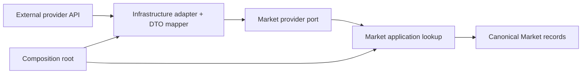
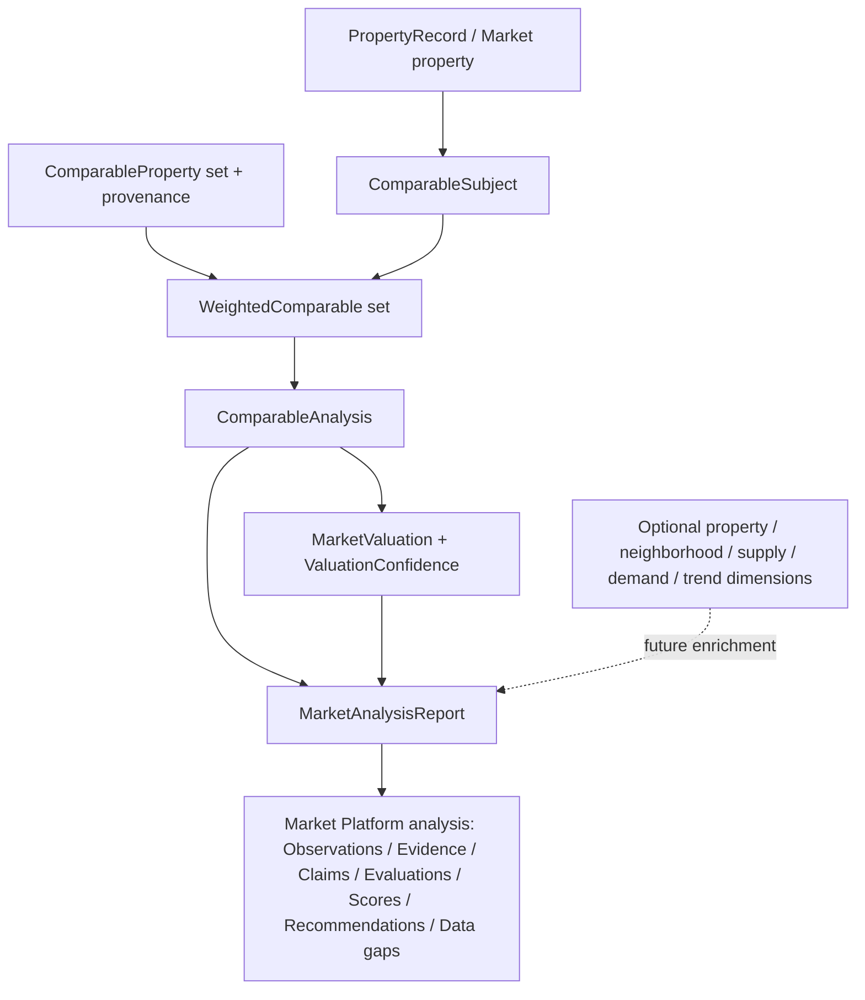
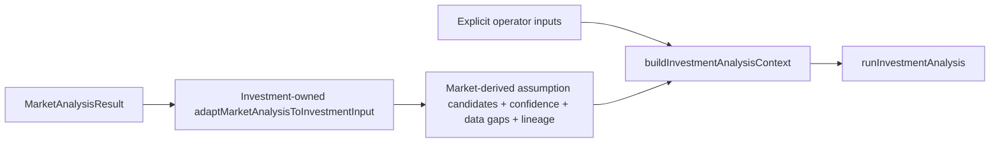
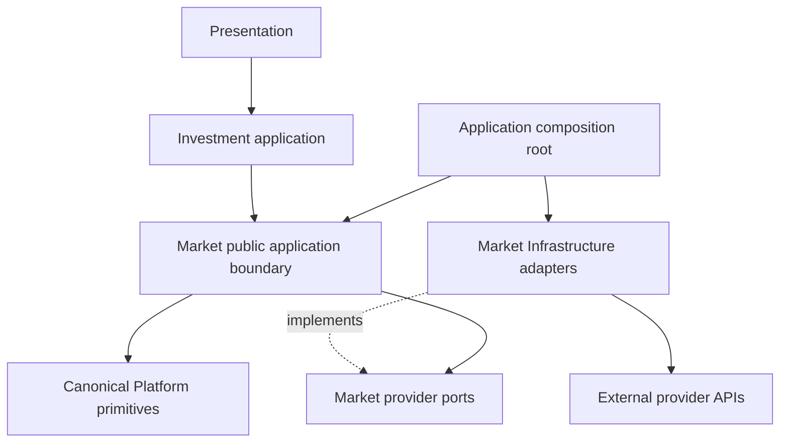
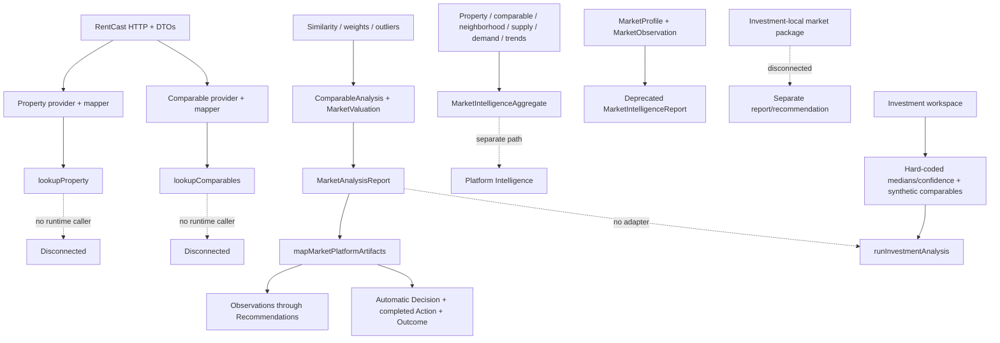
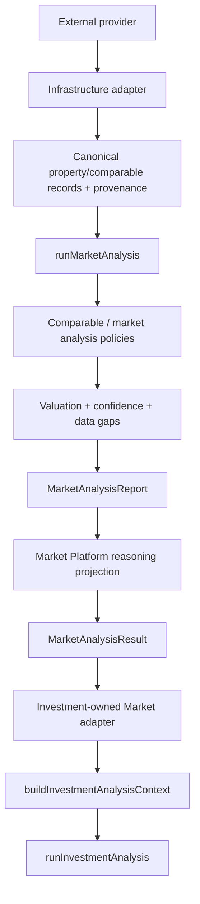

# Market Intelligence Boundary

## Status

RMI-001 current-state audit and architecture decision, completed 2026-07-21. This document records existing behavior; target-state names are decisions for subsequent implementation batches, not claims that those services already exist.

## Decision Summary

Market Intelligence is a provider-neutral capability. It owns property resolution, comparable discovery and normalization, comparable analysis, valuation, market observations, confidence, and explicit data gaps. It must expose one future orchestration boundary, `runMarketAnalysis(command, context)`, returning one stable `MarketAnalysisResult`.

Provider APIs terminate in Infrastructure. Application services depend on provider ports and canonical Market models, never on RentCast response types. Infrastructure adapters implement those ports and map provider payloads before returning. Provider selection and environment construction belong to the application composition root, not to Investment Intelligence.

Investment Intelligence may consume Market output through exactly one sanctioned adapter, provisionally named `adaptMarketAnalysisToInvestmentInput`. That adapter belongs on the Investment side of the boundary so Market never imports Investment contracts. It maps canonical Market facts, estimates, confidence, data gaps, and lineage into Investment input candidates; Investment retains authority over underwriting assumptions, precedence, revenue projections, cash flow, financing, and recommendations.

The repository does not yet implement either target boundary. The live workspace currently has **zero** Market-to-Investment integrations and instead constructs placeholder market data directly. That is the highest-priority integration gap for RMI-002; it must not be mistaken for a second sanctioned path.

## Responsibilities

### Market owns

- property identity and address resolution;
- provider-neutral property facts and provenance;
- comparable discovery, normalization, similarity, weighting, exclusion, and valuation;
- market-level ADR, occupancy, rental/value estimates, supply, demand, neighborhood, and trend observations when supported by evidence;
- valuation and market confidence methodology;
- explicit missing, weak, substituted, or stale-data gaps;
- provider ports, provider result semantics, normalization versions, and provider lineage;
- Market read reports and canonical Platform reasoning projections.

### Investment owns

- acquisition route selection;
- underwriting assumption precedence and approved-Learning application;
- revenue and expense projections;
- financing, debt service, cash flow, returns, scenarios, and failure points;
- investment risk, evidence, score, confidence, and recommendation policy;
- operator commitment, execution, Outcomes, Learning, and reanalysis.

Market estimates are evidence for Investment assumptions. They are not Investment decisions and must not silently overwrite explicit operator input.

## RMI-001A Capability Inventory

Status meanings: **Complete** means implemented and characterized in isolation; **Partial** means useful behavior exists but its orchestration or contract is incomplete; **Disconnected** means no non-test production caller; **Duplicated** means another implementation owns materially equivalent behavior; **Experimental** means its current contract should not be treated as permanent; **Deprecated** is explicitly marked compatibility code; **Missing** means no implementation exists.

| Capability | Status | Production use | Findings |
| --- | --- | --- | --- |
| Property lookup | Complete / Disconnected | No | `lookupProperty` uses a provider registry and returns canonical `PropertyRecord`; only tests call it. |
| Comparable lookup | Complete / Disconnected | No | `lookupComparables` returns canonical Market `ComparableProperty[]`; only tests call it. |
| Property provider registry | Complete / Disconnected | No | Supports keyed provider registration; default lookup still names RentCast. |
| Comparable provider registry | Complete / Disconnected | No | Mirrors property registry; only tests/factories use it. |
| Provider factories | Partial | No | Work for RentCast, but Application imports concrete Infrastructure and environment variables, reversing the desired port/adapter dependency. |
| Provider results/errors | Complete | Internal/tests | Provider-neutral success/failure contract and stable provider errors exist. |
| Canonical provider Observations | Partial / Disconnected | No | Converts successful canonical records into Platform Observations; failures produce no explicit gap Observation and timestamps default to the clock. |
| RentCast property client/adapter | Complete | No production caller | HTTP client, response DTOs, mapper, and provider adapter exist. |
| RentCast comparable/AVM adapter | Complete | No production caller | AVM response is normalized to Market comparables; invalid individual records are silently dropped. |
| Future MLS/Zillow/Regrid providers | Missing | No | Ports can support them, but no adapters exist. |
| Future STR performance provider | Missing | No | No canonical provider for ADR, occupancy, or STR revenue evidence exists. |
| Comparable similarity | Complete / Disconnected | No | Characterized policy with configuration and validation. |
| Comparable weighting | Complete / Disconnected | No | Similarity-derived normalized weights exist. |
| Comparable outlier detection | Complete / Disconnected | No | Used by valuation, but valuation itself is not in a production orchestration path. |
| Comparable analysis | Complete / Disconnected | No | Coherent `ComparableSubject → WeightedComparable[] → ComparableAnalysis` graph. |
| Market valuation | Complete / Disconnected | No | Weighted estimate, range, price-per-square-foot, exclusions, and valuation confidence are characterized. |
| Valuation confidence | Complete / Disconnected | No | Specific comparable-count/similarity/dispersion confidence model. |
| Market analysis report | Complete / Disconnected | No | `MarketAnalysisReport` assembles valuation summary, findings, evidence, and timestamp. |
| Canonical Market analysis finalizer | Partial / Disconnected | No | `buildCanonicalMarketAnalysis` creates report plus Platform artifacts, but accepts already-built analysis and valuation; it is not end-to-end orchestration. |
| Platform Observation provider | Complete / Disconnected | Indirect only | Used by `mapMarketPlatformArtifacts`, accepts `MarketAnalysisReport`. |
| Platform reasoning mapping | Experimental | No | Produces observations through recommendations, but also auto-creates Decision, completed Action, Outcome, and Intelligence in one mapper. |
| Rich Market aggregate | Partial / Disconnected | No | Property/comparable/neighborhood/supply/demand/trend/confidence/summary models and aggregate are well tested but not fed by providers or the valuation report path. |
| Aggregate-to-Intelligence mapping | Partial / Disconnected | No | Requires an externally supplied Outcome and is separate from `MarketAnalysisReport` mapping. |
| Legacy observation report | Deprecated / Disconnected | No | `buildMarketIntelligence` returns deprecated `MarketIntelligenceReport`. |
| Legacy `MarketObservation` / `MarketProfile` | Deprecated | No | Compatibility/provider read models; Platform Observations are canonical reasoning artifacts. |
| Market findings/evidence read models | Deprecated projection | Indirect | Explicitly marked projections; Claims/Evaluations/Evidence are canonical Platform artifacts. |
| `PropertyComparable` | Deprecated alias | Tests/internal | Alias for canonical Market `ComparableProperty`. |
| Demand/competition/location/property/STR/shared packages | Missing placeholders | No | Barrels contain only `export {}`. Hospitality lacks an infrastructure placeholder as well. |
| Investment-local market package | Duplicated / Disconnected | No | A separate `features/investment-intelligence/market-intelligence` graph and score policy exists with no production caller. |
| Workspace Market wiring | Missing | No | Workspace supplies fixed medians/confidence and synthetic comparables instead of calling Market. |
| Presentation package | Missing | No | No Market presentation/workspace exists. |
| Persistence/cache | Missing | No | No provider response, canonical record, report, or lineage persistence path. |

The isolated Market suite is healthy: 45 test files and 124 tests passed during this audit. Test maturity is substantially ahead of runtime integration maturity.

## RMI-001B Public API Inventory

No production file outside the capability imports `@/features/market-intelligence`, and no non-test caller invokes the principal services. “Caller” below therefore describes current internal composition; all public boundaries are runtime-disconnected.

| Public boundary | Input / return | Current dependencies | Current caller | Canonical decision |
| --- | --- | --- | --- | --- |
| `lookupProperty` / `LookupProperty` | address/provider → `ProviderResult<PropertyRecord>` | `PropertyProviderRegistry` | Tests only | Retain as property-resolution application service behind future orchestration. Remove provider defaulting from domain decisions. |
| `lookupComparables` / `LookupComparables` | address/subject hints/provider → `ProviderResult<ComparableProperty[]>` | `ComparableProviderRegistry` | Tests only | Retain as comparable-discovery service behind future orchestration. |
| `buildWeightedComparables` | subject + canonical comparables → weighted comparables | similarity + normalization policies | Tests only | Canonical internal policy. |
| `calculateComparableSimilarity` | subject/comparable/config → similarity | config | Weighted builder/tests | Canonical internal policy, not primary capability entry point. |
| `normalizeComparableWeights` | scores/threshold → weights | none | Weighted builder/tests | Canonical internal policy. |
| `detectComparableOutliers` | weighted comparables → included/excluded | deviation policy | valuation/tests | Canonical internal policy. |
| `calculateValuationConfidence` | comparables/value → confidence | none | valuation/tests | Canonical valuation policy. |
| `calculateMarketValuation` | comparable analysis → valuation | outliers + confidence | Tests only | Canonical internal valuation service. |
| `buildMarketAnalysisReport` | analysis + valuation + time → report | summary/findings/evidence | canonical finalizer/tests | Retain as projection assembler, not orchestration. |
| `buildCanonicalMarketAnalysis` | analysis + valuation → report + artifacts | report + Platform mapper | Tests only | Transitional finalizer. Future `runMarketAnalysis` becomes the authoritative boundary. |
| `buildMarketAnalysisSummary` | analysis + valuation → text | report policy | report/tests | Projection-only helper. |
| `buildMarketAnalysisFindings` | analysis + valuation → finding projections | thresholds | report/tests | Compatibility projection; canonical output is Claims/Evaluations/data gaps. |
| `buildMarketAnalysisEvidence` | analysis + valuation → evidence projections | report policy | report/tests | Compatibility projection; canonical output is Platform Evidence. |
| `MarketObservationProvider` | report → Platform observations | Market mappers | Platform mapper/tests | Canonical report-to-observation adapter, pending deterministic run context. |
| `mapMarketPlatformArtifacts` | report → full `MarketPlatformArtifacts` | all Platform artifact builders | canonical finalizer/tests | Split. Analysis may project reasoning artifacts, but must not auto-create Decision, Action, or Outcome. |
| `mapMarketAggregateIntelligence` | rich aggregate + Outcome → Intelligence report | Platform Intelligence | Tests only | Optional downstream projection; reconcile after one result model exists. |
| `buildMarketIntelligenceAggregate` | eight prebuilt dimensions → aggregate/readiness | score + readiness | Tests only | Rich but disconnected parallel orchestration. Fold valuable dimensions into future result; do not make a second public runner. |
| `buildMarketConfidence` | dimension scores/gaps → `MarketConfidence` | confidence helpers | Tests only | Candidate canonical aggregate-confidence policy; reconcile with valuation and Platform confidence. |
| `calculateOverallMarketScore` | aggregate dimensions → `MarketScore` | weight policy | aggregate/tests | Internal policy only. |
| `validateMarketIntelligenceReadiness` | dimensions → readiness | gap helpers | aggregate/tests | Candidate source for canonical data gaps/readiness. |
| `buildExecutiveMarketSummary` | section results → summary | none | Tests only | Read projection helper. |
| `buildMarketIntelligence` | profile/legacy observations/comparables → deprecated report | merge + score | No production caller | Compatibility facade only; do not extend. |
| `mergeProviderResults` | legacy observations → merged observations | provenance | legacy builder | Compatibility helper. |
| `scoreConfidence` | legacy observations → legacy confidence | provenance | legacy builder | Compatibility helper. |
| Property/comparable provider factories | environment/options → provider ports | concrete RentCast Infrastructure | Tests only | Move construction to a composition root; Application should accept ports. |
| Property/comparable registries | provider type → port | provider ports | lookups/factories/tests | Retain only if multi-provider runtime selection is required. |
| `observePropertyProviderResult` / `observeComparableProviderResult` | canonical provider result → observations | Platform observations | `executeObserved`/tests | Retain as boundary projection; add failure/data-gap semantics later. |
| Low-level Market mappers | report parts → observations | Platform observations | observation provider/tests | Internal adapter implementation, not public capability API. |

The root barrel also exports `RentCastClient`, `RentCastPropertyProvider`, `mapRentCastProperty`, RentCast options, and RentCast response DTOs. Those are not Market public application services and must be removed from the capability barrel in a compatibility-controlled batch. Infrastructure-specific imports may remain available from an explicit infrastructure entry point for composition roots.

Several well-tested rich builders—property, comparable, neighborhood, supply, demand, and trend intelligence—are not exported by the application barrel and have no runtime caller. They are classified as disconnected implementation candidates rather than hidden canonical entry points.

## RMI-001C Provider Boundary Audit

### Current providers

| Dependency | Infrastructure implementation | Provider payload | Canonical output | Leakage / gaps |
| --- | --- | --- | --- | --- |
| RentCast property API | `RentCastClient`, `RentCastPropertyProvider`, `mapRentCastProperty` | `RentCastPropertyResponse`, property/tax/assessment DTOs | `PropertyRecord`, `PropertySearchMatch`, `ProviderResult` | DTOs, client, mapper, and options leak from the capability root barrel. Mapper time defaults to `new Date()`. |
| RentCast AVM/comparables | same client, `RentCastComparableProvider`, `mapRentCastComparable` | `RentCastValueEstimateResponse`, `RentCastComparableRecord` | `ComparableProperty[]`, `ProviderResult` | DTO is infrastructure-local but client generic `requestValueEstimate<T>` exposes transport typing. Invalid comparables are discarded without explicit gaps. |
| Integrations provider registry | `features/integrations` metadata | provider registration only | capability metadata | Not wired to Market factories or lookup registries. |
| MLS | None | None | None | Missing. |
| Zillow | None | None | None | Missing. |
| Regrid | None | None | None | Missing. |
| STR performance provider | None | None | None | Missing; therefore real ADR, occupancy, and STR revenue evidence are unavailable. |

### Boundary findings

The concrete RentCast providers correctly return canonical Market records; raw response DTOs do not escape those provider methods at runtime. The public barrel nevertheless exposes those DTOs and concrete adapters, so compile-time provider leakage exists.

Application factories import concrete RentCast Infrastructure. This makes the application layer both define the port and construct its adapter. Target composition is:

Rules for every future provider:

1. Provider DTOs, HTTP status/header details, URLs, authentication, and SDK types remain under Infrastructure.
2. A provider adapter maps to `PropertyRecord`, `ComparableProperty`, canonical observations, or an explicit provider-neutral failure/data-gap before returning.
3. Retrieval time, run identity, and ID factories are injected; defaults may exist only at an outer production factory.
4. Provider-specific confidence inputs are normalized and provenance retains provider, retrieval time, sample size, notes, and normalization version.
5. Invalid or omitted records produce observable gaps/diagnostics rather than disappearing silently.
6. Investment never imports a provider port, factory, adapter, DTO, or provider enum.

## RMI-001D Canonical Domain Audit

### Current object families

| Object | Assessment | Decision |
| --- | --- | --- |
| `PropertyRecord` | Canonical provider-neutral property resolution model | Retain as `MarketProperty` equivalent; consider renaming only in a compatibility batch. |
| Market `ComparableProperty` | Canonical provider-normalized comparable | Retain. It is distinct from Investment's incompatible `ComparableProperty`; only one adapter may cross that boundary. |
| `ComparableSubject` | Canonical valuation subject | Retain. |
| `SimilarityScore`, `ComparableWeight`, `ComparableAdjustment`, `WeightedComparable` | Coherent comparable-analysis value graph | Retain as internal domain/policy results. |
| `ComparableAnalysis` | Canonical comparable-analysis result | Retain. |
| `MarketValueRange`, `ValuationConfidence`, `MarketValuation` | Canonical valuation graph | Retain. |
| `MarketAnalysisReport` | Current canonical Market read projection | Retain as report projection within the future lifecycle result. |
| `MarketAnalysisEvidence` / `MarketAnalysisFinding` | Deprecated report projections | Retain temporarily; Platform Evidence/Claims/Evaluations and explicit data gaps are authoritative. |
| `MarketIntelligenceAggregate` and eight component entities | Rich, internally coherent, parallel object graph | Reconcile into future result or projections; do not establish a second runner. |
| `MarketConfidence` | Rich multi-dimensional confidence | Candidate aggregate confidence model; overlaps valuation confidence, legacy confidence, and Platform confidence. |
| `ConfidenceScore` / `ConfidenceLevel` | Feature-local compatibility confidence | Retain inside Market methodology, map once to Platform confidence. Avoid exposing competing confidence meanings. |
| `MarketObservation` | Deprecated provider/read model | Platform Observation is canonical reasoning artifact. |
| `MarketProfile` | Legacy revenue-oriented profile | Transitional; overlaps aggregate, report, and Investment market snapshot. |
| `MarketIntelligenceReport` | Explicitly deprecated legacy report | Compatibility only. |
| `MarketPlatformArtifacts` | Provider-neutral but lifecycle-overreaching bundle | Replace with a stable Market Platform analysis projection that stops before operator Decision/Action/Outcome. |
| `MarketRisk` | Missing named canonical object | Currently represented by report findings and Platform Claims/Evaluations. Future result should expose explicit route-neutral risks or rely solely on canonical Platform projections. |
| `MarketDataGap` | Missing named canonical object | Currently a finding type/readiness issue. Add one explicit gap contract before provider integration is considered complete. |

### Selected canonical object graph

The valuation/report graph is the narrowest complete, provider-fed foundation. The richer aggregate contains valuable future dimensions but currently has no provider path and must not replace the working valuation graph wholesale.

The future `MarketAnalysisResult` should contain property, normalized comparables, comparable analysis, valuation, report, Platform analysis, confidence, data gaps, and lineage. It must be discriminated/versioned if multiple analysis strategies emerge. It must not contain automatic operator Decisions, execution Actions, or Outcomes.

## RMI-001E Market to Investment Integration Audit

### Current flow

There is no production import from Market Intelligence into Investment Intelligence. The active workspace directly constructs every market-facing Investment input:

| Investment input | Current source | Current transformation | Classification |
| --- | --- | --- | --- |
| Property address/characteristics | Workspace form | Copied into Investment command | Manual, valid operator input; no Market resolution. |
| Purchase price | Workspace form default/value | Copied directly | Manual underwriting input; Market valuation unused. |
| Monthly lease | Workspace form default/value | Copied directly | Manual underwriting input; rental estimate unused. |
| Projected ADR | Workspace default `$200` / form | Copied directly | Placeholder/manual assumption; no Market evidence. |
| Projected occupancy | Workspace default `75%` / form | Copied directly | Placeholder/manual assumption; no Market evidence. |
| Projected revenue | Investment calculator | ADR × occupancy policy | Correctly Investment-owned. |
| Median ADR | Hard-coded `$180` | Embedded in command | Placeholder duplication. |
| Median occupancy | Hard-coded `70%` | Embedded in command | Placeholder duplication. |
| Market trend | Hard-coded stable | Embedded in command | Placeholder duplication. |
| Revenue confidence | Hard-coded `80` | Embedded in command | Placeholder; ignores Market confidence. |
| Comparables | `createWorkspaceComparables` | Two synthetic Investment-shaped objects | Provisional/disconnected from Market comparable lookup. |
| Property value / taxes | User purchase price and annual taxes | No Market mapping | Market `PropertyRecord` facts unused. |
| Rental value | User monthly lease | No Market mapping | No canonical rental provider exists. |

Investment owns another incompatible `ComparableProperty` interface focused on ADR, occupancy, rating, reviews, and amenities. Market's canonical `ComparableProperty` includes provider identity, valuation fields, STR metrics, and provenance. Direct assignment is neither possible nor desirable; an explicit mapping policy is required.

The nested `features/investment-intelligence/market-intelligence` package defines a third report model and a simple score-based recommendation (`Pursue this market` / `Investigate further`). It has no production caller and must be treated as legacy/disconnected, not as the integration adapter.

### Canonical integration decision

Exactly one integration route is sanctioned:

The adapter should map, where supported:

- Market ADR and occupancy estimates to Investment assumption candidates, never directly to projections;
- Market comparable records to the Investment comparable input projection;
- valuation/property facts to purchase-price, tax, or rent candidates only when semantically appropriate;
- Market confidence to input confidence/provenance, not Investment decision confidence;
- Market gaps and weak/substituted evidence to explicit Investment gaps;
- Market run, observation, evidence, report, and provider lineage into the Investment Platform run context.

Explicit operator input retains precedence over Market-derived candidates, consistent with II-008C. The adapter must not calculate Investment revenue, expenses, cash flow, score, or recommendation. Until RMI-002 implements this adapter and replaces workspace placeholders, there is no real Market-to-Investment runtime path.

## RMI-001F Architecture Decision Record

### Context

The repository contains mature isolated calculations and provider adapters but no runtime Market consumer. Multiple reports, confidence models, aggregate graphs, and Platform projections compete for authority. Public exports expose Infrastructure, and the largest Platform mapper advances Decision/Action/Outcome lifecycle stages automatically.

### Decision

1. Introduce one future public orchestration boundary: `runMarketAnalysis(command, context): Promise<MarketAnalysisResult>`.
2. The command accepts provider-neutral property/market search intent and analysis policy inputs. Provider choice is an injected strategy/configuration concern, not an Investment concern.
3. The deterministic context owns market run ID, observed/retrieved/recorded/generated times, and ID factories.
4. The runner composes property resolution, comparable discovery, normalization, comparable analysis, valuation, report construction, confidence, data gaps, and Platform reasoning projection.
5. Existing lookup services remain focused internal/public utilities; calculators/builders become policies behind the runner.
6. `buildMarketAnalysisReport` remains a report assembler. `buildCanonicalMarketAnalysis` becomes a compatibility/finalization facade or delegates to the runner once raw-input orchestration exists.
7. `MarketIntelligenceAggregate` becomes an enrichment/projection within the same result, not a second orchestration boundary.
8. Market analysis stops at Market recommendations. It does not automatically create operator Decisions, Actions, or Outcomes.
9. The capability root exports application/domain contracts only. Concrete providers and DTOs move behind an Infrastructure/composition-root import path.
10. Investment consumes only `MarketAnalysisResult` through one Investment-owned adapter. Direct RentCast, provider-port, or Market-domain imports elsewhere in Investment are prohibited.

### Target dependency direction

Provider traffic flows in the opposite data direction—External Provider → Infrastructure Adapter → Canonical Market Models → Market Application Services → Market Analysis Result → Investment—but compile-time dependencies remain inward through ports and outward only in the composition root.

### Consequences

- Future providers can be added without changing Investment.
- Market calculations and provider normalization become independently testable and deterministic.
- Provider DTO leakage and environment construction require compatibility-safe cleanup.
- The current workspace remains placeholder-driven until the canonical adapter is implemented.
- Existing report and aggregate tests remain valuable characterization; no formulas are changed by RMI-001.
- Platform lifecycle semantics must be corrected before declaring the current Market Platform artifact bundle canonical.

### Rejected alternatives

- **Investment calls RentCast directly:** violates capability ownership and makes every provider an Investment dependency.
- **Keep both report and aggregate runners public:** preserves duplicate orchestration truth.
- **Make the rich aggregate canonical immediately:** it lacks provider composition and would discard the working valuation/report path.
- **Use `buildCanonicalMarketAnalysis` unchanged as the runner:** it accepts already-derived analysis and valuation, so it does not own the lifecycle named by its API.
- **Allow Market to emit completed Decision/Action/Outcome artifacts during analysis:** collapses analysis, operator commitment, execution, and measurement.

## Architecture Diagrams

### Current state

### Target state

## Proposed Implementation Batches

1. **RMI-002A — Stable lifecycle contracts:** define `RunMarketAnalysisCommand`, deterministic run context, and `MarketAnalysisResult`; delegate to current policies without formula changes.
2. **RMI-002B — Provider composition:** move concrete factory wiring to a composition root, inject clocks/IDs, and stop exporting RentCast DTOs from the capability barrel.
3. **RMI-002C — Canonical provider ingestion:** compose property and comparable lookup into the runner; emit explicit provider failures/data gaps and preserve lineage.
4. **RMI-002D — Reconcile analysis graphs:** retain the valuation/report graph as the base and incorporate useful aggregate dimensions as optional enrichment; characterize confidence equivalence before consolidation.
5. **RMI-002E — Correct Platform projection:** produce deterministic observations, evidence, claims, evaluations, scores, recommendations, and gaps; remove automatic Decision/Action/Outcome creation from the canonical path while preserving compatibility if needed.
6. **RMI-003 — Single Investment adapter:** implement `adaptMarketAnalysisToInvestmentInput`, replace workspace market placeholders, and prove operator-input precedence and route-safe mappings.
7. **Later providers:** add STR performance first for ADR/occupancy evidence, then MLS/Regrid/Zillow adapters behind the unchanged ports and runner.

## Validation Record

- Repository and call-site audit: complete.
- Market capability tests: 45 files, 124 tests passing.
- RMI-001 production behavior changes: none.
- Provider leakage: documented; root barrel cleanup deferred to compatibility-controlled RMI-002B.
- Market-to-Investment runtime adapter: missing; exactly one sanctioned target path documented for RMI-003.
