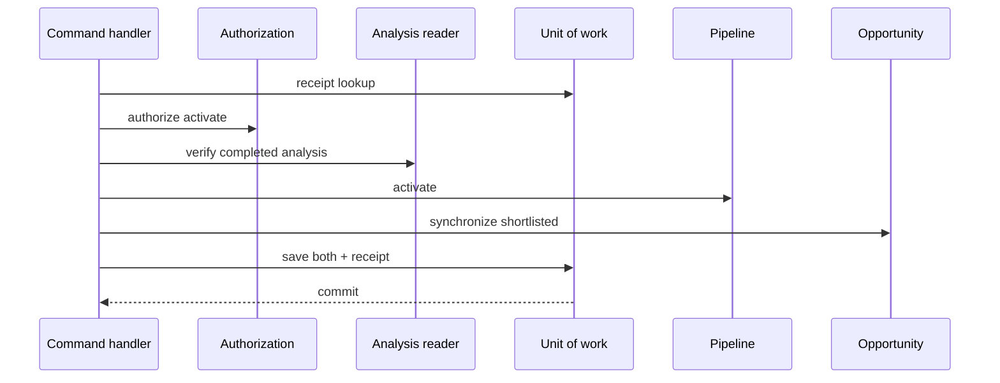
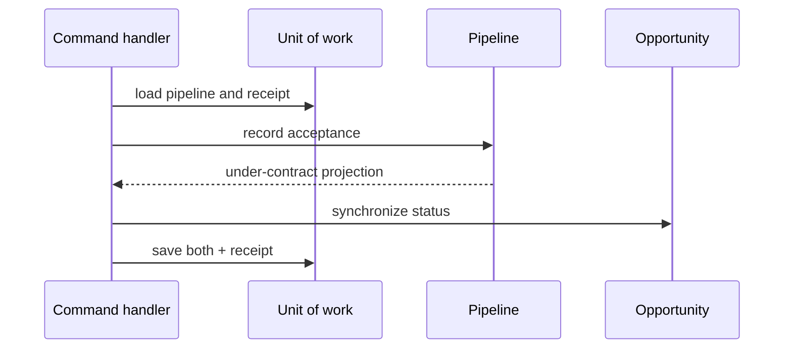
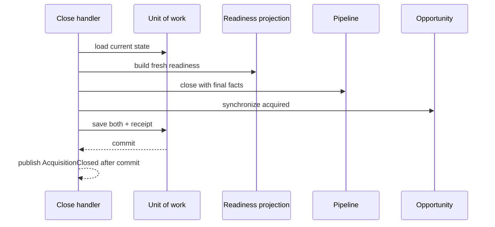

# IA-002A.6 — Acquisition Pipeline Application Layer

The acquisition application boundary now provides typed command context, capability authorization, owner-scoped reader ports, unit-of-work coordination, command receipts, and stable application projections. Domain aggregates remain the source of lifecycle and commercial policy; handlers only load, authorize, orchestrate, persist through ports, and translate failures.

## Conventions

- Mutating commands carry an explicit `AcquisitionCommandId` and expected aggregate versions.
- Receipt lookup precedes version checks, so a successful retry returns the original projection without replaying domain behavior.
- Pipeline and opportunity synchronization is coordinated through `AcquisitionUnitOfWork`.
- Analysis, Action, and Evidence access is represented by minimal reader ports; no provider repositories enter the domain.
- Readiness is rebuilt from the current aggregate. It is never accepted from a client as authority.
- Event publication is a post-commit port. The current in-memory adapter intentionally does not claim durable delivery guarantees.

## Sequence: activation

## Sequence: offer acceptance

## Sequence: closing

The application layer is intentionally persistence- and UI-independent. Supabase adapters, production outbox behavior, server actions, and Property onboarding remain future work.
