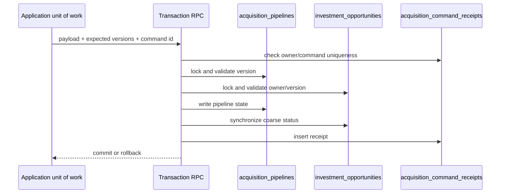

# IA-002A.7 — Persistence, Transactions, and RLS

## Persistence design

The migration `20260724090000_acquisition_pipeline_persistence.sql` uses one owner-bearing `acquisition_pipelines` row and normalized child tables for stage history, activity, offers, counterparty responses, contracts, contingencies, due diligence, requirement history, and command receipts. Route-specific terms, activation lineage, outcomes, and closing facts remain JSONB value snapshots so the domain’s discriminated unions are not flattened into nullable columns.

`opportunity_id` is unique, enforcing the IA-002A zero-or-one cardinality. Every child has a foreign key to the pipeline and policies inherit ownership through that parent. History tables are append-only at the database boundary; lifecycle policy remains in the domain.

## Transaction boundary

`save_acquisition_pipeline_transaction` is a security-definer transaction boundary for the production unit of work. It locks the pipeline and opportunity rows, checks expected versions, updates the coarse opportunity status, writes the command receipt, and returns an idempotent result when the owner/command key already exists. A stale version raises SQLSTATE `40001`; anonymous or cross-owner access raises `42501`.

## RLS verification posture

All acquisition tables have RLS enabled. The owner context can read and mutate its pipeline; a different owner and anonymous session cannot see parent or child rows. Child policies use an ownership join rather than trusting application filtering. `is_admin()` remains the only explicit internal-console exception, matching existing repository conventions.

## Mapper and adapter follow-up

The next implementation slice should add explicit row mappers and a Supabase gateway around this RPC. Hydration must reconstruct branded identifiers and dates, then call `AcquisitionPipeline.restore`; invalid snapshots must be rejected rather than repaired. Read ports for analyses, Actions, and Evidence should use existing public contracts and remain owner-scoped.

No Property creation, UI, route, or provider integration is introduced by this persistence design.
