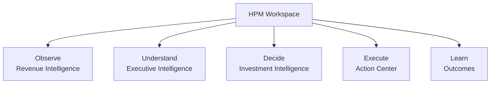
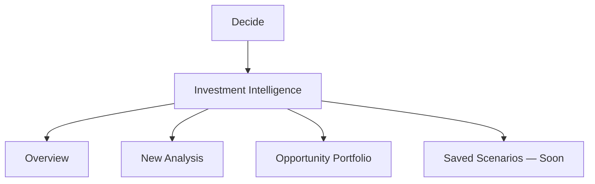

# IA-002B.1 — Workspace-driven navigation

## Outcome

The HPM Workspace now uses lifecycle workspaces as its global information architecture. Feature destinations live inside their workspace. The Operations Console shares shell rhythm and interaction primitives while retaining operational domain groups.

## Information architecture

Previously, Decide contained Investments, New Analysis, and Opportunity Portfolio as nested global-sidebar branches. The new configuration has no lifecycle children. The lifecycle stage is the primary item label and the workspace name is supporting text.

## Route ownership and compatibility

| Destination | Canonical route | Compatibility |
| --- | --- | --- |
| Overview | `/dashboard/investments` | Replaces the former form at this route |
| New Analysis | `/dashboard/investments/new` | Existing form and query-string reanalysis behavior preserved |
| Opportunity Portfolio | `/dashboard/investments/opportunities` | `/dashboard/investments/portfolio` remains routable |
| Opportunity detail | `/dashboard/investments/opportunities/[id]` | Legacy `/portfolio/[id]` remains routable |
| Historical analysis | `/dashboard/investments/opportunities/[id]/analyses/[analysisId]` | Legacy historical URLs remain routable |

All investment paths resolve to the `decide` workspace through one route matcher. Global links use the canonical routes; legacy URLs remain as compatibility aliases.

## Shell and selected state

The shell uses a 320px expanded sidebar and an 80px collapsed rail. HPM lifecycle entries use a flat, restrained contained active surface with a single icon treatment. A subtle line connects lifecycle icons without branches. Operations uses a dark raised active surface with a narrow gold border. Keyboard focus uses a teal focus ring independent of selected state.

Desktop and mobile render from the same navigation configuration. On mobile, navigation is a modal drawer, closes after route selection or Escape, prevents background scrolling, and restores focus to its trigger.

## Accessibility

The global and local navigation have named landmarks. Active links use `aria-current="page"`, unavailable destinations expose `aria-disabled`, abbreviated badges include full screen-reader meaning, collapse controls have accessible labels, focus is visible, and motion is disabled under reduced-motion preferences.

## Operations Console relationship

Operations remains separate from HPM lifecycle:

- Operations: Customers, Properties, Support
- Services: Guidebook Projects, Design Projects, Service Catalog
- Infrastructure: Integrations, Sync History, Provider Health, Audit
- Settings: Internal Workspace

Customers is the primary customer-account concept; the overlapping Organizations entry was removed.

## Rollout

The implementation uses the existing capability system rather than adding a vendor or authorization model. Preview validation should cover 1440, 1280, 1024, 768, and 390px, keyboard operation, 100–150% zoom, route aliases, and both admin and customer roles. Saved Scenarios remains intentionally unavailable and never links to a dead route. Executive Intelligence uses the existing `/dashboard` destination for its limited state; Outcomes remains deferred until a canonical route exists.
