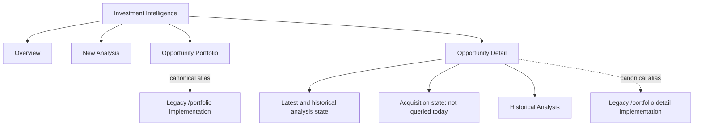
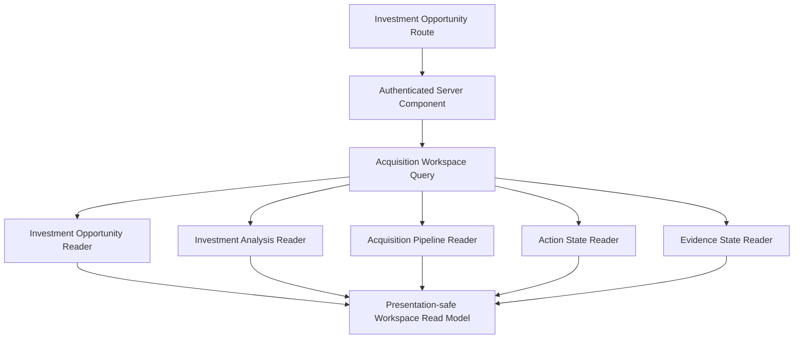

# IA-002B.2.1 — Acquisition route and read-model characterization

Date: 2026-07-23  
Evidence base: repository state at this milestone; current source names and contracts take precedence over earlier design documents.

## Executive decisions

1. The canonical opportunity URL remains `/dashboard/investments/opportunities/[opportunityId]`.
2. Pipeline identity does not enter public URLs. A pipeline is a 0..1 child of an opportunity and is discovered by `AcquisitionPipelineRepository.findByOpportunity(opportunityId)`.
3. Acquisition begins as a section of opportunity detail. A future `/dashboard/investments/opportunities/[opportunityId]/acquisition` route is reserved only if workflow density later warrants it; it still uses the opportunity ID.
4. No pipeline is a successful workspace result (`status: "opportunity-only"`, `pipeline: null`), not a not-found error.
5. The next boundary should use the repository-standard hybrid: authenticated server-component query plus server actions for commands. Route handlers are unnecessary for first-party page reads.
6. No acquisition command is UI-eligible today. Domain and application handlers are locally complete, but the route composition, concrete external adapters, true transaction-plan writer, and guarded remote verification are incomplete.
7. Read-only opportunity queries are production-active. Pipeline repository reads are locally complete and suitable as an input to a new mapper, but the current `buildAcquisitionPipelineView` is not presentation-safe because it returns full domain collections.
8. The overview remains lightweight. It must not import pipeline infrastructure or hydrate acquisition aggregates.
9. Canonical `/opportunities` modules currently re-export `/portfolio` implementations. They are aliases, not HTTP redirects. Both URLs render and authorize identically. This is transitional technical ownership, not a second identifier scheme.
10. Opportunity and pipeline aggregate versions are separate canonical integers. Both belong in the page read model when a pipeline exists; command forms transport only the versions required by that command.

## Current-state map



There is no Acquisition Pipeline page, server action, route handler, or browser composition. Acquisition code is reachable only through domain/application/infrastructure exports and tests.

## Route inventory

All routes use the authenticated `(dashboard)` layout. `DashboardLayout` calls `requireUser()` and passes the profile role into `ClientWorkspaceShell`; anonymous users are redirected by the session boundary before page execution. All investment routes inherit `dashboard/investments/layout.tsx`, which renders local Investment Intelligence navigation. Global active state resolves through the centralized `/dashboard/investments` prefix and selects Decide.

| Public route | Filesystem module | Classification | Purpose/title | Owner and component | Query/auth/not-found | Loading/error/compatibility |
| --- | --- | --- | --- | --- | --- | --- |
| `/dashboard/investments` | `src/app/(dashboard)/dashboard/investments/page.tsx` | canonical | Workspace overview; title `Overview` in shell, `Investment Intelligence` in content | Decide / Investment Intelligence; async server component | `getInvestmentOpportunityRequestContext`; `loadPortfolioWorkspace(..., {limit: 5})`; owner is Supabase auth user | No route loading file. Loader failure renders bounded recent-opportunity error without blocking actions. `strategy`, `opportunity`, or `mode` query parameters redirect to `/new` with all query parameters preserved. |
| `/dashboard/investments/new` | `.../investments/new/page.tsx` | canonical | New Analysis | Decide / Investment Intelligence; server page containing client `InvestmentWorkspaceStateProvider` | Route layout authenticates; reanalysis calls request context and `buildOpportunityReanalysisInput` | No dedicated loading/error file. Query-owned initial values; transient client state. |
| `/dashboard/investments/opportunities` | `.../opportunities/page.tsx` | canonical | Opportunity Portfolio | Decide / Investment Intelligence; server route-module alias | Re-exports legacy portfolio page; auth context then `loadPortfolioWorkspace` | Canonical module has no loading file at root. Auth-context failure currently renders an empty portfolio, conflating unavailable and empty. |
| `/dashboard/investments/opportunities/compare` | `.../opportunities/compare/page.tsx` | canonical | Opportunity Comparison | Server route-module alias | `buildOpportunityComparisonView`; owner-scoped repository | Canonical loading alias exists. Query/application errors become `ComparisonError`; no `notFound`. |
| `/dashboard/investments/opportunities/[id]` | `.../opportunities/[id]/page.tsx` | canonical | Investment Opportunity | Server route-module alias to legacy detail | `loadOpportunityDetail`, then `listOpportunityNotes`; owner-scoped context; missing/auth-context failure calls `notFound()` | Canonical loading alias exists. No route error boundary. |
| `/dashboard/investments/opportunities/[id]/analyses/[analysisId]` | `.../opportunities/[id]/analyses/[analysisId]/page.tsx` | historical-deep-link | Immutable historical Investment Analysis | Server route-module alias | `buildOpportunityAnalysisDetailView`; owner/opportunity/analysis scoped; missing calls `notFound()` | No canonical loading alias at this exact depth. Legacy module has a loading file. |
| `/dashboard/investments/portfolio` | `.../portfolio/page.tsx` | obsolete | Legacy portfolio implementation still publicly routable | Transitional implementation owner | Same query and auth as canonical alias | Legacy loading file exists. No redirect occurs. Retain until canonical modules own implementation. |
| `/dashboard/investments/portfolio/compare` | `.../portfolio/compare/page.tsx` | obsolete | Legacy comparison implementation | Transitional implementation owner | Same as canonical alias | Loading file exists; no redirect. |
| `/dashboard/investments/portfolio/[id]` | `.../portfolio/[id]/page.tsx` | obsolete | Legacy opportunity-detail implementation | Transitional implementation owner | Same as canonical alias; missing and cross-owner are both `notFound()` | Loading file exists; no redirect. |
| `/dashboard/investments/portfolio/[id]/analyses/[analysisId]` | `.../portfolio/[id]/analyses/[analysisId]/page.tsx` | historical-deep-link | Legacy immutable historical analysis | Transitional implementation owner | Same as canonical alias | Loading file exists; no redirect. |
| `/dashboard/investments/analyses/[analysisId]` | none | planned | Proposed workspace-level immutable analysis route | Not implemented | No query | Do not create until ID/ownership semantics are specified; current analysis IDs are opportunity-scoped. |
| `/dashboard/investments/opportunities/[id]/acquisition` | none | planned | Optional specialized acquisition workflow | Not implemented | Future opportunity-centered workspace query | Add only when section density justifies a route. |
| `/dashboard/investments/acquisitions/[pipelineId]` | none | obsolete | Pipeline-ID-centered alternative | Rejected | — | Pipeline identity remains internal. |
| `/dashboard/investments/[id]`, `/dashboard/opportunities`, `/dashboard/opportunities/[id]` | none | obsolete | Searched alternatives | Not implemented | — | Must not become aliases. |

No acquisition-related route is `internal-only`. The compatibility behavior created in IA-002B.1 is module aliasing, not `redirect()`; therefore permanent/temporary redirect status and redirect analytics do not apply. Planned removal of `/portfolio`: after canonical modules directly own implementation and inbound-link/analytics review, no later than Acquisition Workspace production enablement.

## Overview characterization

`InvestmentIntelligencePage` is an authenticated server component. `getInvestmentOpportunityRequestContext()` creates a user-scoped `SupabaseInvestmentOpportunityRepository`; `loadPortfolioWorkspace` receives the auth user ID explicitly and is bounded to five projected cards. The underlying repository list asks for at most 100 aggregate bundles before application filtering, then the view slices five. Repository ordering is `updated_at desc, id asc`; application/in-memory determinism follows repository order.

Actual recent row source is `PortfolioOpportunityCardView`:

```ts
type PortfolioOpportunityCardView = Readonly<{
  id: string;
  name: string;
  address: string;
  route: InvestmentOpportunityRoute;
  status: OpportunityStatus;
  archived: boolean;
  tags: readonly string[];
  recommendation?: string;
  score?: number;
  scoreMaximum?: number;
  confidence?: string;
  lastAnalyzedAt?: Date;
  updatedAt: Date;
}>;
```

Overview rendering uses `id`, `name`, `address`, `route`, `status`, and `updatedAt`. Rows link to canonical `/opportunities/[id]`; actions link to `/new` and `/opportunities`. Empty and failure states are distinct. Saved Scenarios is `aria-disabled` with no link.

Pipeline existence, stage, version, activation, and readiness are absent. The overview query imports opportunity application contracts, not pipeline infrastructure. It does hydrate full opportunity bundles (analyses, tags, activity) inside the Supabase repository even though the overview consumes six fields. This is acceptable only as a bounded transitional read. IA-002B.2.2 should create a lightweight opportunity reader/projection rather than extend this query with pipelines. At most a separately bounded active-acquisition summary/count belongs on overview; full acquisition state does not.

## Opportunity Portfolio

Query: `loadPortfolioWorkspace(repository, ownerId, filter)`.

Repository call: `repository.list({ ownerId, includeArchived: true, limit: 100 })`; filtering and offset pagination occur afterward in application memory. Default returned page limit is 12, clamped to 1–50. Search covers name, display address, and tag text. Filters support status, route, archived inclusion, search, limit, and numeric offset cursor.

Metrics count non-archived records across the loaded set. Archived opportunities are excluded unless requested. Results preserve repository ordering; Supabase supplies updated descending with ID ascending tie-break. The card includes current analysis recommendation, score, confidence, and last-analyzed timestamp when present. It does not expose analysis ID/sequence, stale analysis, pipeline existence/stage/version, acquisition activation, or acquisition route beyond the opportunity's purchase/rental-arbitrage route.

Owner scope is enforced twice: explicit typed owner in the repository query and Supabase gateway equality/RLS. Canonical card links use `/dashboard/investments/opportunities/[id]`. Current limitation: the Supabase gateway fetches opportunity child bundles per row (N+1 bundle hydration), and the application then filters a maximum of 100; cursor semantics are not a database-stable search cursor.

## Opportunity detail

`InvestmentOpportunityDetailPage` loads:

1. `getInvestmentOpportunityRequestContext()`;
2. `loadOpportunityDetail(repository, ownerId, createInvestmentOpportunityId(id))`;
3. `listOpportunityNotes(noteRepository, id, ownerId)`.

`loadOpportunityDetail` returns the actual `OpportunityDetailView`:

```ts
type OpportunityDetailView = Readonly<{
  id: string;
  name: string;
  address: string;
  route: InvestmentOpportunityRoute;
  status: OpportunityStatus;
  archived: boolean;
  aggregateVersion: number;
  allowedStatusTransitions: readonly OpportunityStatus[];
  tags: readonly string[];
  createdAt: Date;
  updatedAt: Date;
  latestAnalysis?: OpportunityAnalysisVersionView;
  previousAnalyses: readonly OpportunityAnalysisVersionView[];
  activity: readonly {
    id: string;
    type: OpportunityActivity["type"];
    actorLabel: string;
    details: Readonly<Record<string, unknown>>;
    occurredAt: Date;
  }[];
}>;
```

It renders identity, name, address, route, status, archive state, tags, notes, latest and previous analysis summaries, and unbounded opportunity activity. It does not query or render Acquisition Pipeline state, activation, offers, contract, requirements, or readiness.

The page imports application/domain public exports and presentation components; it does not import persistence. Its request-context factory does import Supabase infrastructure, which is correctly server-only but currently doubles as composition. Cross-owner repository lookup returns `null`, identical to missing, and the page calls `notFound()`. Note lookup first verifies the parent under the same owner.

Client command controls call server actions for metadata, status, archive/restore, and notes. They carry `expectedVersion` and a client-generated command ID. Presentation currently labels direct opportunity status as “Pipeline status” and allows direct transitions including `offer-submitted`, `under-contract`, `acquired`, and `rejected`. This is a current boundary violation once a pipeline exists: `updateOpportunityStatusAction` does not check `AcquisitionPipelineRepository.exists` or `findByOpportunity`. IA-002B.2.2 must make pipeline-authoritative statuses unavailable through direct opportunity commands after activation.

## New and historical Investment Analysis

### Transient execution

`/new` initializes client form state in `InvestmentWorkspaceStateProvider`. Strategy is URL/query based; form inputs/results are React client state. `analyzeInvestmentWorkspace` is a role-gated server action (`admin` or `owner`) that parses Zod input, calls market providers and the Investment Intelligence application service, and returns a workspace result.

On completion, `storeInvestmentAnalysis` persists a hashed opaque save token in `investment_analysis_save_tokens` with owner ID, serialized result/input, analyzed timestamp, and a 30-minute expiry. Browser presentation receives the raw token, not its hash. Expired, absent, or other-owner tokens resolve to `null`; save actions map this to stable `ANALYSIS_TOKEN_EXPIRED`.

Changing form inputs marks client analysis stale and clears the save token. Current history writes still use `/dashboard/investments?strategy=...`; the overview compatibility redirect forwards these to `/new`.

### Persisted version

Saving a token creates or appends an `OpportunityAnalysis` inside an `InvestmentOpportunity`. The stored version has its own `OpportunityAnalysisId`, monotonic sequence, route, `investmentAnalysisId`, immutable result snapshot, source summary, policy versions, lineage, creator, and timestamp. It is distinct from transient workspace execution and from pipeline activation's completed-analysis reference.

Save/reanalysis flow:

- `saveAnalysisAsNewOpportunityAction` resolves the token, creates an opportunity with initial analysis, optionally adds a note, and currently returns a legacy `/portfolio/[id]` redirect path.
- `saveAnalysisToOpportunityAction` resolves the token and appends with expected opportunity version.
- Reanalysis begins at `/new?opportunity=...&mode=reanalyze`; `buildOpportunityReanalysisInput` restores user assumptions only. Market, Learning, derived metrics, recommendation, and confidence are refreshed.
- Historical detail calls `buildOpportunityAnalysisDetailView`, returning an immutable snapshot projection with opportunity ID, analysis ID/sequence/route, recommendation, score, confidence, financials, market, risks, data gaps, evidence, source summary, lineage, policy versions, and analyzed timestamp.

Historical analysis IDs are opportunity-scoped in the current reader. There is no global `/analyses/[analysisId]` lookup and no current projection of linked pipeline ID. Pipeline activation stores a source `OpportunityAnalysisId` and integer analysis version, but no browser boundary composes it.

## Investment Opportunity boundary

Canonical public identity is `InvestmentOpportunityId = Identifier<investment-opportunity-${string}>`. Owner identity is `OpportunityOwnerId`; route is `purchase | rental-arbitrage`. The aggregate owns name, property reference, status, analyses/current analysis, tags, activity, timestamps, archive timestamp, and integer aggregate version. Notes are a separate owner-scoped repository.

Statuses:

- `evaluating`
- `researching`
- `shortlisted`
- `offer-submitted`
- `under-contract`
- `acquired`
- `rejected`

All are currently directly mutable subject to `assessOpportunityStatusTransition`. Acquisition Pipeline `statusProjection()` becomes authoritative after activation and maps pipeline transitions back to opportunity status in acquisition handlers. However, the opportunity application service and server action do not know whether a pipeline exists. Therefore:

- pre-activation: direct user status edits are currently supported;
- post-activation target policy: pipeline commands own `offer-submitted`, `under-contract`, `acquired`, and exit-derived status;
- direct presentation controls must be gated by a composed pipeline-existence read;
- pipeline activation itself moves the opportunity to `shortlisted`.

The domain relationship is enforced by `AcquisitionPipelineRepository.exists(opportunityId)` only during activation; the current detail page never calls it.

## Acquisition Pipeline query readiness

There is no `getAcquisitionPipeline` application query. The repository supports `findById`, `findByOpportunity`, and `exists`, returning the mutable aggregate type by clone/restore. `buildAcquisitionPipelineView(pipeline)` returns identifiers/stage/version/status plus full `offers()`, `contingencies()`, `dueDiligenceItems()`, and `activity()` collections. Although frozen/cloned, these are domain structures and unbounded; classify it `not-presentation-safe`.

`getAcquisitionClosingReadiness` accepts `{ context: AcquisitionApplicationCommandContext; pipelineId }`, authorizes `acquisition.pipeline.read`, opens the unit of work, loads by pipeline ID, throws stable `ACQUISITION_PIPELINE_NOT_FOUND`, and returns the pure domain `AcquisitionClosingReadiness`. It does not accept opportunity ID or represent no-pipeline. It is `locally-complete` plus `requires-remote-verification`; a future mapper is required for browser use.

| Query/capability | Input and dependency | Current output/absence | Readiness |
| --- | --- | --- | --- |
| Opportunity portfolio | owner + filter; opportunity repository | bounded `PortfolioWorkspaceView`; empty flag | production-ready, with hydration/query-efficiency debt |
| Opportunity detail | owner + opportunity ID; opportunity and note repositories | `OpportunityDetailView \| null` | production-ready |
| Historical analysis | owner + opportunity ID + analysis ID | immutable detail view or null | production-ready |
| Pipeline by opportunity | typed opportunity ID; pipeline repository | `AcquisitionPipeline \| null` | locally-complete; requires mapper and route composition |
| Pipeline command view | aggregate | unbounded domain-backed view | not-presentation-safe |
| Closing readiness | command context + pipeline ID; unit of work/auth | domain readiness or application error | locally-complete; requires remote verification and mapper |

## Aggregate public-state inventory

| Fact | Current source | Classification |
| --- | --- | --- |
| Pipeline ID, opportunity ID, route, stage, version | pipeline core | Canonical stored state |
| Activation actor/time/source analysis | pipeline core JSON | Canonical stored state |
| Terminal state | `isTerminal()` | Derived domain projection |
| Exit outcome | activity/terminal transition; no separate persisted exit field visible in core contract | Derived from canonical history/activity |
| Closing facts | pipeline core `closing_facts` | Canonical stored state; mapper currently casts `as never` |
| Offers, current offer, sequence, status | normalized offers | Canonical stored state; current offer derived/flagged |
| Responses | normalized counterparty responses | Canonical stored state |
| Accepted agreement basis | normalized agreement plus legacy core field | Canonical stored state |
| Contract | normalized contract | Canonical stored state |
| Offer-analysis / offer-contract alignment | domain projection functions, not joined into current view | Derived domain projection |
| Contingencies and diligence | normalized requirement tables | Canonical stored state |
| Requirement status/blocking/priority/outcome/waiver/concerns | requirement rows/outcome JSON | Canonical stored state |
| Action/Evidence/Document links | opaque arrays on requirements | Canonical stored references only |
| Current Action status/blocking | `AcquisitionActionStateReader` port | External current-state enrichment; no concrete adapter found |
| Evidence exists/available | `AcquisitionEvidenceStateReader` port | External current-state enrichment; no concrete adapter found |
| Document metadata/availability | no reader port | Unavailable; references only |
| Requirement history | normalized history rows | Canonical stored state, loaded into aggregate; repository save does not emit `requirementHistory` rows |
| Closing readiness, blockers, warnings, counts, evaluated version | `buildAcquisitionClosingReadiness` | Derived domain projection |
| Stage history and activity | normalized append-only rows | Canonical stored state |
| Labels, relative dates, money/date strings | React presentation | Presentation-only formatting |

Persistence gaps and mapper risks:

- Repository hydration covers core, history, activity, offers, responses, agreement, contract, contingencies, diligence, requirement history, reference arrays, and closing facts when gateway bundles provide them.
- `save()` never serializes `requirementHistory`; the gateway input supports it, so history can hydrate but not be emitted through this repository.
- `relatedDueDiligenceItemIds` on contingencies always hydrates as an empty array; schema rows do not provide the reverse relation.
- `closing_facts`, requirement `source`, `waiver`, `concerns`, commercial `source`, and reference arrays use casts wider than validated domain contracts.
- Core mapper requires history/activity lengths to match. That invariant may be invalid once commercial/requirement activity exists without a corresponding stage-history row; remote round-trip evidence remains pending.
- Repository stores owner `00000000-...` when constructed without owner ID. Production composition must always bind owner scope.

## External dependencies

| Dependency | Public contract | Concrete adapter found | Authorization/fallback | Readiness and absence semantics |
| --- | --- | --- | --- | --- |
| Analysis | `AcquisitionAnalysisReader.getCompletedAnalysisReference` → ID/version/opportunity/route/analyzedAt/fingerprint | none | owner supplied to port; activation fails `ACQUISITION_ANALYSIS_NOT_FOUND` when absent | requires adapter; absence blocks activation |
| Action Center | `AcquisitionActionStateReader.getActionStates` → ID/status/blocked | none | owner supplied to port | optional enrichment for reads; absence should warn/unavailable, not erase references |
| Evidence | `AcquisitionEvidenceStateReader.getEvidenceStates` → ID/exists/available | none | owner supplied to port | optional enrichment for reads; unavailable evidence can block readiness only under explicit domain policy |
| Documents | opaque `documentId` + relationship only | no reader port | none | references persist; metadata must not be displayed until an authorized public reader exists |

No timestamps are present in Action/Evidence reader results, so freshness cannot currently be stated. Evidence provenance withdrawal/supersession is also absent from the acquisition port.

## Production composition and verification

`composeAcquisitionProduction` constructs the Supabase pipeline repository, receipt repository, and `SupabaseAcquisitionUnitOfWork`; it passes through injected authorization, analysis, Action, Evidence, and event publisher dependencies. It is not called by any application route. No concrete implementations of those injected ports were found.

| Adapter | Status | Evidence/constraint |
| --- | --- | --- |
| Supabase pipeline repository | wired-locally | Complete mapper/test surface; no route gateway composition |
| Supabase receipt repository | wired-locally | Constructed by factory |
| Supabase unit of work | placeholder | Executes repositories sequentially in process; does not call transaction RPC |
| Transaction RPC client | wired-locally | RPC wrapper exists, but `SupabaseAcquisitionUnitOfWork` does not use it |
| Authorization | not-wired | Required injected port; no concrete implementation |
| Analysis reader | not-wired | Required injected port; no concrete implementation |
| Action-state reader | not-wired | Required injected port; no concrete implementation |
| Evidence-state reader | not-wired | Required injected port; no concrete implementation |
| Document reader | not-wired | No port |
| Clock | deployment-specific | Optional handler dependency; no production composition field |
| Event publisher | not-wired | Required injected port; no concrete implementation/outbox |
| Logger/metrics | wired-locally | Observability helpers exist, not part of route composition |
| Health probe | deployment-specific | Interface/config check exists; concrete probe not found |

Remote verification is explicitly incomplete. The guarded IA-002A.7.6 harness has not verified RLS, owner/anonymous matrices, concurrency, rollback, RPC grants, complete hydration, cleanup, or deterministic ordering on an approved Supabase project.

The “transaction-plan writer” limitation means the current unit of work does not atomically commit pipeline, opportunity, receipt, and child mutations. A transaction RPC exists, but the repository/handler mutation plan is not connected to it. A failure between repository calls can leave split state; command receipts do not make that safe. Event publication has no durable outbox.

## Command eligibility matrix

“Complete” means implemented and covered locally, not remotely verified.

| Capability | Domain | Application | Persistence | Production composed | Remote verified | UI eligible | Reason |
| --- | --- | --- | --- | --- | --- | --- | --- |
| Read pipeline | yes | repository only; no presentation query | hydration locally complete with gaps above | no route composition | no | read-only after IA-002B.2.2 mapper/composition | Read itself is non-mutating, but owner-bound gateway and unavailable-state mapping are required. |
| Activate pipeline | yes | yes | local repository/RPC pieces | no | no | no | Cross-aggregate atomic activation and analysis/authorization adapters are not production-wired. |
| Create offer draft | yes | yes | local mappers | no | no | no | Transaction writer and command boundary absent. |
| Submit offer | yes | yes | local mappers | no | no | no | Also synchronizes opportunity status; atomicity unverified. |
| Record response | yes | domain methods; handler exports must be confirmed per response variant | local mappers | no | no | no | No server action/composition. |
| Record contract | yes | yes | local mappers | no | no | no | Cross-state transition and remote persistence unverified. |
| Manage requirements | yes | handlers/domain locally implemented | local mappers with history-save gap | no | no | no | Requirement history write path incomplete; external readers absent. |
| Build readiness | yes | query exists | read hydration locally complete | no | no | read-only projection after mapper | Safe as a derived read once pipeline can be loaded and failures distinguished. |
| Begin closing | yes | yes | local | no | no | no | Stale-version and atomic persistence need production verification. |
| Close acquisition | yes | yes | local | no | no | no | Cross-aggregate atomicity is mandatory. |
| Exit pipeline | yes | yes | local | no | no | no | Opportunity synchronization/atomicity not verified. |

The server boundary should report why a command is unavailable: actor unauthorized, capability not deployed, infrastructure unverified, stage disallows action, or required facts missing. These are not interchangeable disabled booleans.

## Authorization and concealment

Current route security:

- `(dashboard)` calls `requireUser` for every route.
- Analysis and opportunity mutation actions additionally call `requireRole(["admin", "owner"])`.
- Read context uses `supabase.auth.getUser()` and uses `user.id` as owner ID.
- Opportunity gateway queries include `.eq("owner_id", ownerId)` and Supabase RLS is intended to enforce owner-or-admin access.
- Application queries create typed owner IDs and repository `findById` requires owner.
- Missing and other-owner detail reads both become `notFound()`, preventing ownership leakage.
- Current admin reads still use the admin user's own ID at the application filter even if RLS permits `is_admin()`. Admin does not automatically impersonate another owner; this is the current policy.

Future boundary decisions:

- opportunity absent or owned by another actor: same `notFound()` result;
- opportunity exists/no pipeline: successful `opportunity-only` state with `pipeline: null`;
- pipeline persistence unavailable: successful opportunity shell with `acquisition-unavailable`, correlation-safe reason, and retry guidance;
- corrupt hydration: unavailable acquisition state plus internal incident, never “no pipeline”;
- unauthorized command: stable failure code with no resource ownership details.

Route-level auth and application/repository owner scoping must both remain.

## Error and state inventory

| Condition | Source/stable code | Current UI behavior | Target behavior |
| --- | --- | --- | --- |
| Authentication | `requireUser` / `requireRole` | redirect or action access-denied | preserve |
| Authorization/cross-owner | repository null; `OPPORTUNITY_ACCESS_DENIED`; acquisition `ACQUISITION_NOT_AUTHORIZED` | detail 404; action stable message | preserve concealment |
| Opportunity not found | null / `OPPORTUNITY_NOT_FOUND` | detail 404; action mapped | preserve |
| Archived opportunity | `OPPORTUNITY_ARCHIVED` | stable action message | reload/restore guidance |
| Expired token | `ANALYSIS_TOKEN_EXPIRED` | rerun-analysis message | preserve |
| Duplicate analysis | `ANALYSIS_ALREADY_SAVED` | stable action message | link/reload existing |
| Version conflict | `CONCURRENT_OPPORTUNITY_MODIFICATION`; pipeline version codes | refresh message for opportunity; no UI for pipeline | stable conflict with current version and reload |
| Pipeline absent | repository null | not queried; conflated with absence of feature | explicit `opportunity-only` |
| Pipeline unavailable | persistence read failure | no route behavior | `acquisition-unavailable`, retryable where appropriate |
| Hydration/corruption | `ACQUISITION_PERSISTENCE_MAPPING_INVALID` | no route behavior | unavailable + incident/correlation; not retry-looped |
| Dependency unavailable | no composed readers | no route behavior | limitation per enrichment |
| Remote unverified | deployment fact, no code | no UI | capability limitation, commands absent |
| Unexpected opportunity persistence | `OPPORTUNITY_PERSISTENCE_FAILED` | safe generic retry | preserve; never leak raw Supabase message |

Current loading/empty distinctions:

- overview has no loading file; recent query failure and empty are distinct;
- portfolio has legacy loading UI, but auth-context failure is rendered as empty;
- canonical portfolio root has no canonical loading module;
- detail and comparison have loading aliases;
- historical canonical route lacks a loading alias;
- no-pipeline/loading/unavailable/corrupt/unauthorized are not represented because pipeline is not queried;
- pipeline-with-no-offer, no-contract, no-requirements, no-activity, and readiness-unavailable have no presentation today.

IA-002B.2.2 must model those acquisition states separately.

## Recommended boundary and responsibility map



Use an authenticated server-component query for initial reads and server actions for commands. Reuse:

- `requireUser`/`requireRole`;
- server-only request composition;
- Zod input parsing;
- stable discriminated action results;
- command IDs and expected versions;
- application authorization plus owner-scoped repository queries;
- `notFound()` concealment;
- `revalidatePath` after successful commands.

Do not return aggregates or persistence rows. Do not instantiate Supabase in presentation. Do not add a route handler/client query layer until an external API consumer exists.

Responsibility:

| Section/field | Source owner |
| --- | --- |
| Name, location, route, opportunity status, archive, opportunity version, updated time | Investment Opportunity |
| Latest analysis ID/sequence, recommendation, score, confidence, analyzed time/staleness | Investment Analysis/Opportunity immutable analysis projection |
| Pipeline existence, ID (internal DTO field only), activation, stage, terminal, pipeline version, stage history | Acquisition Pipeline |
| Current offer/response/agreement/contract summaries and alignment | Acquisition Pipeline |
| Requirement counts, priorities, blockers, outcomes and references | Acquisition Pipeline |
| Closing readiness/evaluated version | Acquisition Pipeline domain projection using current inputs |
| Action current status | Action Center enrichment |
| Evidence availability/provenance | Evidence enrichment |
| Document IDs/relationships | Acquisition Pipeline references; metadata unavailable |
| Labels, status tones, formatted money/date, human relative time | UI mapper |

No layer may duplicate another capability's canonical state. Pipeline stores Action/Evidence/Document references, never embedded mutable external records. Opportunity status may mirror pipeline projection but the pipeline is authoritative after activation.

## Proposed workspace state (for IA-002B.2.2)

```ts
type AcquisitionWorkspaceState =
  | Readonly<{
      status: "opportunity-only";
      opportunity: InvestmentOpportunityWorkspaceSummary;
      analysis: InvestmentAnalysisWorkspaceSummary | null;
      pipeline: null;
      activation: AcquisitionActivationAvailability;
    }>
  | Readonly<{
      status: "pipeline-active";
      opportunity: InvestmentOpportunityWorkspaceSummary;
      analysis: InvestmentAnalysisWorkspaceSummary | null;
      acquisition: AcquisitionPipelineWorkspaceSummary;
    }>
  | Readonly<{
      status: "pipeline-terminal";
      opportunity: InvestmentOpportunityWorkspaceSummary;
      analysis: InvestmentAnalysisWorkspaceSummary | null;
      acquisition: AcquisitionPipelineTerminalSummary;
    }>
  | Readonly<{
      status: "acquisition-unavailable";
      opportunity: InvestmentOpportunityWorkspaceSummary;
      analysis: InvestmentAnalysisWorkspaceSummary | null;
      reason: AcquisitionWorkspaceUnavailableReason;
    }>;
```

This is a proposal, not an implemented public contract.

Recommended sections and ownership are Header, Decision context, Lifecycle, Commercial, Requirements, Closing, Activity, and Actions as mapped above. Pipeline ID may be present as an opaque internal DTO value needed by server actions, but must not appear in the URL or user-facing label.

## Bounds, versions, and freshness

Workspace summary bounds:

- activity: latest 15, deterministic occurred-at/ID order;
- stage history: latest 10;
- offers: current offer plus at most two prior summaries;
- responses: latest response for the current/selected offers;
- contract: current contract only;
- requirements: counts plus at most 10 critical/high unresolved blockers; full lists belong on later detail sections;
- analysis: latest plus at most five historical references;
- Action and Evidence enrichment: unique referenced IDs within returned requirement bounds only.

Existing opportunity readers do not enforce these detail bounds: opportunity detail returns all analysis versions/activity/notes, and portfolio repository bundle hydration returns full children. Acquisition repository also hydrates the complete aggregate. IA-002B.2.2 must map and slice server-side before returning a DTO.

Versions/freshness:

- `opportunity.aggregateVersion`: page DTO and opportunity command transport;
- `pipeline.pipelineVersion`: acquisition DTO and acquisition command transport;
- analysis sequence/version and analyzed time: decision context and activation input;
- readiness `evaluatedPipelineVersion`: display and closing command freshness check;
- requirement `updatedAt`: detail freshness;
- Action/Evidence freshness: unavailable in current ports; extend ports before claiming timestamp freshness;
- command receipt IDs/results remain server/application concerns; expose stable command ID/replayed result, not persistence tokens.

## Capability availability proposal

The read DTO should include structured limitations, not booleans alone:

```ts
type AcquisitionCapabilityLimitation =
  | { kind: "not-authorized"; capability: string }
  | { kind: "not-deployed"; capability: string }
  | { kind: "infrastructure-unverified"; capability: string }
  | { kind: "stage-disallowed"; capability: string; stage: string }
  | { kind: "facts-missing"; capability: string; codes: readonly string[] };
```

At current repository state: `canRead` becomes true only after route composition and mapper work; every mutation capability is false with `not-deployed` and `infrastructure-unverified`. Domain-stage limitations are additive, never substitutes for deployment/auth facts.

## Route-to-read-model target

| Route | Required identifiers | Target read model |
| --- | --- | --- |
| `/dashboard/investments` | none; legacy analysis query params only | lightweight Investment Intelligence overview |
| `/dashboard/investments/new` | optional opportunity query for reanalysis | transient New Analysis state |
| `/dashboard/investments/opportunities` | filter/query cursor | Opportunity portfolio projection |
| `/dashboard/investments/opportunities/[opportunityId]` | opportunity ID | opportunity + analysis + optional acquisition workspace |
| `/dashboard/investments/opportunities/[opportunityId]/analyses/[analysisId]` | opportunity and analysis IDs | immutable historical analysis |
| optional future `/.../[opportunityId]/acquisition` | opportunity ID | specialized acquisition detail using same workspace query family |

No route requires a public pipeline ID.

## Decision log

| Decision | Resolution | Evidence/consequence |
| --- | --- | --- |
| Canonical detail route | `/dashboard/investments/opportunities/[opportunityId]` | Existing canonical link and owner-scoped detail already exist. |
| Pipeline ID in URL | no | Operator identity is opportunity-centered; repository supports `findByOpportunity`. |
| Acquisition section or route | section first; nested opportunity route only if needed | No pipeline UI exists; avoid premature route. |
| No-pipeline result | valid `opportunity-only`, `pipeline: null` | Relationship is 0..1; absence is not failure. |
| Query pattern | authenticated server component + application query | Matches current Next server boundary. |
| Commands | server actions after remote gate | Matches opportunity/action workflows; no external API requirement. |
| Disabled commands | all acquisition mutations | No atomic production writer/route composition/remote verification. |
| Immediately safe reads | existing opportunity/analysis reads; pipeline/readiness only after mapper/composition | No mutation; preserve unavailable distinctions. |
| Legacy policy | `/portfolio` remains routable alias temporarily | Current code does not redirect; move implementation ownership before removal. |
| Bounds | 15 activity, 10 history/blockers, current + two offers, five analysis references | Avoid aggregate hydration into browser. |
| Versions | expose opportunity and pipeline domain versions separately | Required for optimistic concurrency. |
| Infrastructure unavailable | render opportunity plus `acquisition-unavailable` | Never hide opportunity or call it no-pipeline. |

## Unresolved before IA-002B.2.2

| Item | Owner | Consequence | Deadline |
| --- | --- | --- | --- |
| Decide whether canonical historical URL remains opportunity-nested or adds a global alias | Investment Intelligence engineering | Query ID contract and breadcrumbs | Before IA-002B.2.2 contract merge |
| Define concrete acquisition authorization policy for admin versus owner | Platform security | Read/action capability projection | Before production composition in IA-002B.2.2 |
| Select/implement production pipeline gateway and transaction-plan integration point | Persistence engineering | Reads may be composed; commands remain off | Before any command action is built |
| Extend Action/Evidence ports with freshness/provenance only if UI requires it | Capability owners | Cannot claim fresh/superseded state | Before final workspace DTO |
| Define document reader or affirm references-only v1 | Document capability owner | No document metadata links | Before Requirements DTO is finalized |
| Correct current New Analysis history URLs from overview path to `/new` | Investment Intelligence engineering | Current compatibility redirect masks stale client URL writes | Before IA-002B.2.2 UI work |
| Replace canonical route-module aliases with canonical implementation ownership | Platform routing | Legacy removal cannot begin | Before Acquisition Workspace production rollout |

## Characterization test coverage

`tests/architecture/acquisition-route-characterization.test.ts` freezes canonical route files, centralized ownership, Decide selection for canonical and legacy children, module-alias compatibility, query preservation, absence of child-route fallback, route-page persistence isolation, domain/presentation direction, and the current opportunity-only browser boundary.

Existing tests already freeze:

- deterministic portfolio projection/filtering/pagination;
- cross-owner opportunity detail returning `null`;
- opportunity detail/history projection;
- acquisition domain lifecycle/status authority;
- pipeline repository lookup/hydration and mapper round trips;
- requirement/readiness behavior;
- application authorization/idempotency/concurrency;
- production config fail-fast behavior.

Remote RLS/concurrency/rollback/hydration evidence remains explicitly outside this milestone.
