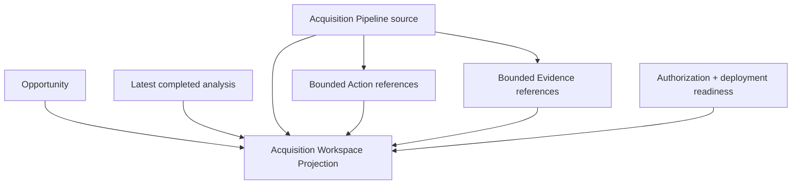
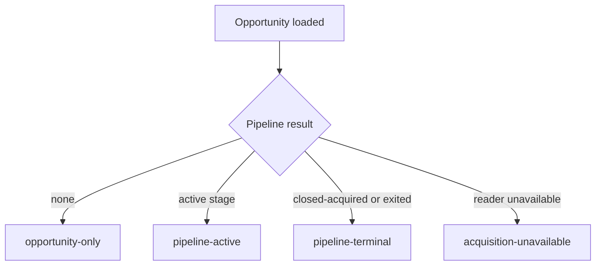

# IA-002B.2.2 — Acquisition Workspace query contracts and projections

## Outcome

The Investment Opportunity feature now exposes one application query contract that produces a presentation-safe, immutable Acquisition Workspace. It is opportunity-centered and requires no public pipeline identity.

No route, server action, route handler, React component, Supabase adapter, migration, or production command activation was added.

## Composition



Reader ports accept owner ID and opportunity ID and return minimal source projections. The pipeline reader returns `AcquisitionWorkspacePipelineSource`, never an aggregate or persistence row. Action and Evidence readers receive sorted, unique, bounded identifiers. Documents remain opaque reference counts.

## Workspace states



Missing or unauthorized opportunities are query failures, not workspace states. No pipeline is a successful `opportunity-only` result. Pipeline reader failure preserves the opportunity as `acquisition-unavailable`. A corrupt or identity-mismatched pipeline fails with `ACQUISITION_WORKSPACE_PIPELINE_INVALID` and never returns a partial acquisition summary.

## Query input and execution

`GetAcquisitionWorkspaceQuery` contains:

- owner ID;
- actor reference;
- opportunity ID as the primary identity;
- optional activity, history, prior-offer, and priority-requirement bounds.

The query accepts no request, URL, session, or presentation string.

Execution order:

1. validate bounds and identity inputs;
2. authorize the read;
3. load the owner-scoped opportunity;
4. load analysis and pipeline concurrently;
5. return opportunity-only when pipeline is absent;
6. collect at most 25 unique Action and Evidence reference IDs;
7. load optional enrichments concurrently;
8. project an active, terminal, unavailable, or opportunity-only workspace.

The injected `now()` is evaluated once. Pure projections receive that timestamp explicitly.

## Bounds

`ACQUISITION_WORKSPACE_LIMITS` is the canonical policy:

| Collection | Default | Maximum |
| --- | ---: | ---: |
| Activity | 12 | 50 |
| Stage history | 10 | 30 |
| Prior offers | 3 | 10 |
| Priority requirements | 8 | 25 |
| Readiness blockers | — | 10 |
| Readiness warnings | — | 10 |

Collections where omission matters return total counts and truncation flags. The source reader remains responsible for not supplying an unbounded aggregate-shaped source.

## Opportunity and analysis

`InvestmentOpportunityWorkspaceSummary` exposes identity, safe location, route, opportunity status, archive state, tags, product timestamps, and a discriminated headline value. It omits owner ID, notes, history, and aggregate methods.

`InvestmentAnalysisWorkspaceSummary` exposes only the latest completed persisted analysis:

- analysis ID and version;
- route;
- recommendation, score, and confidence;
- optional assumption fingerprint;
- analyzed timestamp;
- centralized age classification;
- canonical opportunity-nested historical URL.

Age policy:

- current: fewer than 45 days;
- aging: 45–89 days;
- stale: 90 days or more.

Evaluation time is explicit. Transient save tokens and full analysis inputs/reports are not source fields.

## Lifecycle and terminal outcomes

Lifecycle order comes from `ACQUISITION_STAGES`; available transitions come from `getAllowedAcquisitionStageTransitions`. Specialized stages map to specialized command types rather than a generic transition.

Backward history remains visible and previously completed stages remain completed. `exited` is appended as an exit state with a progress index of `-1`, not treated as normal forward completion.

Terminal stages are explicit:

- `closed-acquired` requires closing facts and maps an acquired outcome;
- `exited` requires exit facts and preserves reason, prior stage, explanation, and reconsideration eligibility.

Missing terminal facts make the pipeline invalid.

## Commercial projection

The commercial summary separates:

- current offer;
- bounded prior offer headers;
- latest response;
- accepted agreement basis;
- recorded contract;
- analysis and contract alignment.

Purchase and rental headline terms remain discriminated. Prior offers do not include full terms. Counter terms appear only on the response summary and do not overwrite offer terms. External agreements are explicit and remain distinct from a final recorded contract.

## Requirements and enrichment

Requirement totals cover contingencies, diligence, and every status. Blocking, high-priority, and recently resolved lists are separately bounded.

Ordering is deterministic:

1. blocking;
2. failed;
3. overdue;
4. critical, high, normal, low;
5. due date;
6. stable ID.

Concern output contains only highest severity, total, blocking count, and a headline. Requirement output contains Action, Evidence, and Document counts only.

Action completion does not satisfy a requirement. Missing Action state increases unavailable counts. Withdrawn, superseded, missing, or otherwise unavailable Evidence increases unavailable Evidence counts without exposing content or ownership.

## Readiness and freshness

Closing readiness is a pure mapping of the domain projection. Its freshness rule is:

```text
current = readiness.evaluatedPipelineVersion === pipeline.version
```

Blockers and warnings are deterministically ordered, bounded to ten each, and retain total counts.

`AcquisitionWorkspaceVersions` exposes:

- opportunity version always;
- pipeline version when a pipeline exists;
- latest analysis version when present;
- readiness pipeline version when present.

These are canonical domain versions. No row version, ETag, session token, actor, command ID, or server timestamp is included in a command descriptor.

## Capabilities and limitations

Every capability is a structured availability:

- available;
- unauthorized;
- not applicable;
- domain blocked;
- not deployed;
- not verified;
- dependency unavailable.

Precedence is:

1. unauthorized;
2. not applicable;
3. domain blocked;
4. not deployed;
5. not verified;
6. dependency unavailable;
7. available.

Read can remain available while every write is unavailable. Infrastructure limitations are factual operator-safe statements:

- remote transaction verification incomplete;
- remote RLS verification incomplete;
- Action state unavailable;
- Evidence state unavailable;
- document reader unavailable;
- durable event delivery unavailable.

They do not expose RPC, table, or deployment implementation names.

## Next actions

The projection emits at most one primary action and a secondary exit action for active pipelines. Stage, commercial state, requirements, capabilities, and versions determine the action.

Command descriptors contain only:

- semantic command type;
- opportunity ID;
- optional internal pipeline ID;
- expected opportunity version;
- optional expected pipeline version.

They omit owner, actor, authoritative time, command ID, and raw handler names. Terminal workspaces expose review navigation only.

## Degradation and errors

Fatal:

- invalid bounds;
- authentication or authorization failure;
- opportunity reader unavailable;
- missing/cross-owner opportunity;
- invalid canonical versions;
- corrupt or mismatched pipeline source;
- missing terminal outcome facts.

Degradable:

- latest-analysis reader failure → `analysis: null`;
- Action reader failure → Action limitation and conservative capabilities;
- Evidence reader failure → Evidence limitation and conservative capabilities;
- absent document reader → counts only plus informational limitation;
- pipeline reader failure → `acquisition-unavailable`, preserving opportunity and analysis.

Expected outcomes use Platform `Result`. Raw domain, persistence, SQL, Supabase, stack, and ownership details are never returned.

## Purity and architecture

Projection builders:

- perform no repository access;
- perform no authorization lookup;
- call no clock;
- mutate no input;
- use explicit evaluation time;
- use public domain policies;
- return deeply frozen readonly output;
- never return an aggregate-owned collection directly.

Architecture tests prevent React, Next.js, Supabase, persistence DTO, command handler, unbounded collection, document metadata, and inverted platform dependency leakage.

## Deferred to IA-002B.2.3

- concrete owner-scoped Opportunity, Analysis, Pipeline, Action, and Evidence adapters;
- production authorization adapter;
- Supabase and health-gated composition;
- remote verification signals;
- server-component integration;
- command server actions;
- any UI or mutation enablement.
