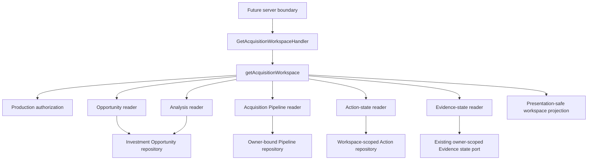
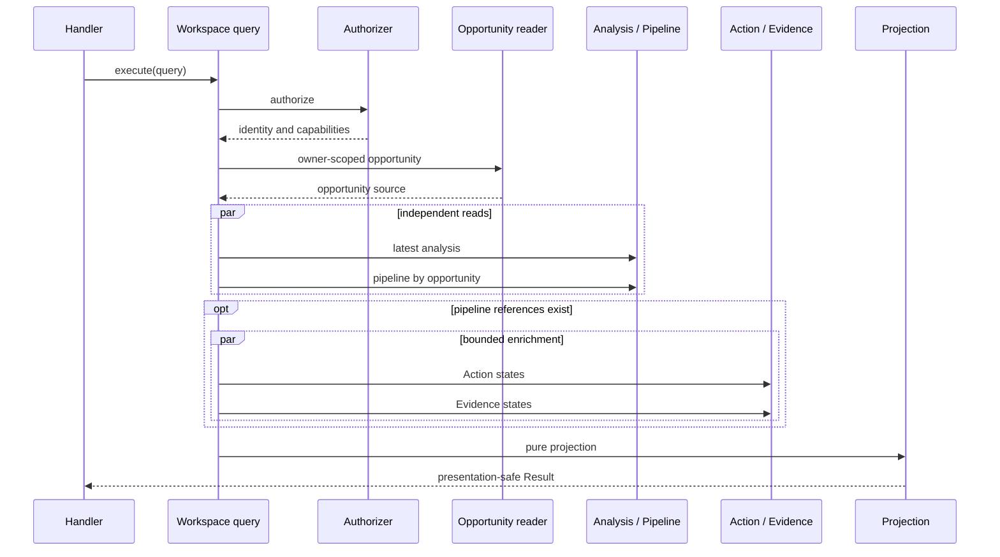

# IA-002B.2.3 — Production Query Adapters and Authorization

## Outcome

The Acquisition Workspace application query now has one centrally composed,
authorized production read boundary. It translates current Opportunity,
Analysis, Acquisition Pipeline, Action, and Evidence infrastructure into the
presentation-safe contracts established by IA-002B.2.2.

No route, React component, server action, route handler, migration, command
activation, or new domain behavior is part of this milestone.

## Reader responsibilities

| Reader | Production source | Scope enforcement | Output policy |
|---|---|---|---|
| Opportunity | `InvestmentOpportunityRepository` | `findById(id, ownerId)` | Identity, safe location, state, version, tags, timestamps, typed headline value |
| Analysis | `InvestmentOpportunityRepository.listAnalyses` | Owner passed to repository | Latest persisted sequence only; no assumptions, comparables, or financial report |
| Pipeline | `AcquisitionPipelineRepository` | Adapter is bound to the same owner as the repository | Aggregate is restored by the repository, immediately mapped, and never returned |
| Action | Existing owner-scoped `AcquisitionActionStateReader` | Owner passed to existing port | Current ID, status, blocked flag, update time only |
| Evidence | Existing `AcquisitionEvidenceStateReader` | Owner passed to existing port | ID and availability only |
| Documents | None | Not applicable | `documentReaderAvailable` is forced to `false`; opaque reference counts remain in the workspace |

The Action adapter uses the existing feature-safe state port rather than
importing the Platform Action repository. An authoritative `updatedAt` is
required; older adapters without it degrade Action enrichment instead of
fabricating freshness.

## Authorization and orchestration

`ProductionAcquisitionWorkspaceAuthorizer` obtains an authenticated principal
through `AcquisitionWorkspacePrincipalReader`. Read permission requires:

1. an authenticated principal;
2. the principal actor to match the query actor;
3. the principal owner to match the requested owner.

Capability authorization is returned separately from deployment readiness.
Consequently, an authorized read can remain available while every write
capability is `not-deployed` or `not-verified`.

The application query retains the ordering guarantee:

No data reader is invoked when authentication/authorization fails.

## Degradation and error translation

| Condition | Result |
|---|---|
| Authorization failure | Stable not-authenticated or not-authorized error |
| Opportunity repository failure | Stable retryable opportunity-unavailable error |
| Opportunity absent | Stable not-found error |
| Analysis failure | Workspace continues with `analysis: null` |
| Pipeline read/hydration failure | Opportunity remains visible as `acquisition-unavailable` |
| Action failure | Workspace continues with an Action limitation and conservative capabilities |
| Evidence failure | Workspace continues with an Evidence limitation and conservative capabilities |
| Document metadata unavailable | Reference counts remain; document limitation is explicit |
| Invalid projected canonical pipeline | Stable non-retryable pipeline-invalid error |

Infrastructure errors, SQL, table names, RPC names, stack traces, and
persistence rows never enter the result.

## Pipeline restoration and current limitation

The production Pipeline adapter uses the current owner-bound
`AcquisitionPipelineRepository`. The repository hydrates normalized core,
history, activity, offers, responses, agreement, contract, contingencies, and
diligence rows and restores the aggregate before the adapter maps it.

The current aggregate state does not retain the full `AcquisitionExit` object;
activity records only retain the exit reason and optional explanation. The
adapter therefore refuses to fabricate reconsideration or exit lineage and
treats an exited source as unavailable. This is an explicit pre-existing
domain/persistence limitation, not new persistence behavior in this milestone.
Closed-acquired projection is supported when canonical closing facts are
present in the restored aggregate. Remote persistence verification remains
outside this milestone.

## Instrumentation

`ProductionAcquisitionWorkspaceQueryObserver` records duration and outcome for:

- authorization;
- Opportunity, Analysis, Pipeline, Action, and Evidence reads;
- projection;
- total handler execution.

The handler writes one structured completion event containing only owner ID,
opportunity ID, optional pipeline ID, duration, degraded limitation codes, and
result state. It records no prices, terms, scores, requirement bodies, or other
financial/business content.

## Composition

`composeAcquisitionWorkspaceProduction` is the sole production composition
entry point for the query boundary. It wires repositories, adapters,
authorization, deployment status, clock, logger, metrics, and the handler.
Future route/server integration receives the composed handler; route files
must not instantiate repositories or readers.

The injected Pipeline repository must already be constructed with the same
`ownerId` supplied to composition. The adapter rejects a query whose owner does
not match that binding.

## Verification coverage

The integration suite covers:

- opportunity-only and active-pipeline workspaces;
- owner mismatch and authorization-before-load;
- pipeline hydration degradation;
- latest-analysis selection;
- bounded Action reads with no body/history leakage;
- Evidence availability-only translation;
- safe logs and per-operation timing;
- document-reader honesty;
- architecture boundaries prohibiting React, Next.js, Supabase, routes,
  actions, and migrations in the application/query boundary.

## Deferred work

- authenticated Next.js server-component integration;
- route handlers and server actions;
- remote Supabase/RLS/transaction verification;
- durable event verification;
- complete persisted exit outcome restoration;
- document metadata capability;
- command enablement and acquisition UI.
