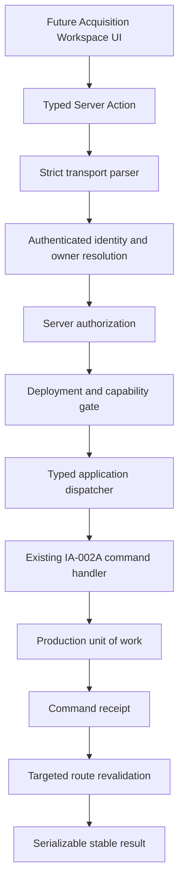
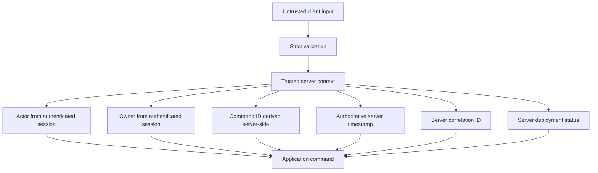
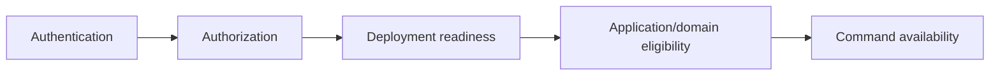

# IA-002B.2.4 — Acquisition Server Command Boundary

## Outcome

The repository now has a typed, authenticated Server Action boundary for
Acquisition Workspace mutations. The boundary parses untrusted transport data,
resolves actor and owner identities on the server, authorizes the command,
enforces a centralized fail-closed rollout registry, creates trusted command
metadata, dispatches to existing IA-002A handlers, maps safe results, and
revalidates canonical Investment Intelligence routes.

No Acquisition Workspace UI, database migration, new domain command, direct
Supabase mutation, route handler, or remote command enablement is included.



## Transport choice

The established repository pattern is Next.js Server Actions plus
`revalidatePath`. Eight explicitly named actions are exported from
`src/app/actions/acquisition-workspace-commands.ts`. There is no public generic
command bus and no duplicate route-handler transport.

The shared executor is framework-independent. Next.js authentication and cache
APIs remain in the server-only production runtime.

## Current command inventory and rollout

| Server command | Existing application handler | Initial rollout |
|---|---|---|
| Activate pipeline | `activateAcquisitionPipeline` | Not remotely verified |
| Ordinary stage transition | `transitionAcquisitionStage` | Not remotely verified |
| Exit pipeline | `exitAcquisitionPipeline` | Not remotely verified |
| Begin closing preparation | `beginClosingPreparation` | Not remotely verified |
| Close acquisition | `closeAcquisition` | Not remotely verified |
| Create offer draft | `createAcquisitionOfferDraft` | Not remotely verified |
| Submit offer | `submitAcquisitionOffer` | Not remotely verified |
| Record contract | `recordAcquisitionContract` | Not remotely verified |
| Update offer draft | None | Read-model-only |
| Record counterparty response | None | Read-model-only |
| Initialize/update requirements | None | Read-model-only |
| Link Action/Evidence/Document references | None | Read-model-only |

The last four families are represented in the deployment registry so their
absence is explicit, but no fake application dispatch path or generic patch
command was created.

`createFailClosedAcquisitionCommandRegistry` enables no commands. Implemented
handlers return `ACQUISITION_COMMAND_NOT_VERIFIED`; missing handlers return
`ACQUISITION_COMMAND_NOT_DEPLOYED`. Changing a flag string is insufficient to
enable writes. Production promotion requires a registry assembled from an
explicit release decision after remote transaction and RLS verification.

## Trust boundary



Client inputs contain opportunity identity, optional internal pipeline
identity, expected versions, a UUID idempotency key, and command-specific
operator data. They cannot contain owner ID, actor ID, role, command ID,
correlation ID, command timestamp, deployment status, or callback URL.

The production identity resolver uses the existing `requireRole` session
boundary. Owner identity is resolved from that trusted user record. The
authorization decision occurs before deployment gating and before application
dispatch. A concealed authorization failure returns the same not-found
contract used for inaccessible resources.

The IA-002A handler still performs application authorization and repositories
remain owner-scoped as defense in depth.

## Input validation and serialization

Every implemented command has a specific strict Zod schema. Unknown fields are
rejected. Pipeline mutations require pipeline ID and expected pipeline version;
every command requires expected opportunity version and a UUID idempotency key.

Purchase and rental-arbitrage offers are separate discriminated contracts.
Contract and closing inputs are also route-discriminated.

Money crosses the framework boundary as:

```ts
type AcquisitionMoneyInput = Readonly<{
  amount: string;
  currency: "USD";
}>;
```

Amounts accept at most two fractional digits, must be finite, and are bounded
before conversion at the application adapter. No browser-side floating-point
calculation is authoritative.

Business timestamps use offset-bearing ISO 8601 strings. The adapter converts
them to `Date` only after validation. Server execution timestamps always come
from the injected server clock. Date-only calendar inputs are not currently in
the implemented handler contracts; a future date-only transport must define a
separate calendar-date policy rather than passing a timezone-ambiguous string.

Results contain only strings, numbers, booleans, arrays, and plain readonly
objects. No `Date`, aggregate, value object, repository row, `Error`, `Map`,
`Set`, or platform `Result` crosses the Server Action transport.

## Idempotency and optimistic concurrency

The client supplies one UUID per operator intent. The server deterministically
creates:

```text
acquisition-command-{idempotencyKey}
```

It also computes a stable `v1:` request fingerprint from the validated command.
The fingerprint is transported in the trusted application context and stored
through the existing command receipt repository.

- Same key and same fingerprint replays the stored result.
- Same key and a different fingerprint maps to
  `ACQUISITION_COMMAND_IDEMPOTENCY_CONFLICT`.
- A new key is a new intent and domain invariants still apply.
- Replay does not add pipeline activity or stage history.

Application receipt handling was completed for closing preparation and close
commands, so all exposed mutation handlers participate in the same receipt
boundary.

Expected opportunity and pipeline versions are converted to canonical
application versions. Persistence/application concurrency errors map to
`ACQUISITION_COMMAND_VERSION_CONFLICT` with `reloadRequired: true`. The
boundary never reloads and retries a business command automatically and never
returns the replacement aggregate.

## Availability and authorization precedence



The deterministic precedence is:

1. validation error;
2. not authenticated;
3. concealed not-found or not-authorized;
4. not deployed/not verified/dependency unavailable;
5. application/domain blocker;
6. execution.

UI state is never trusted as authorization or deployment evidence.

## Stable result and error translation

The transport union distinguishes:

- `succeeded`;
- `validation-error`;
- `not-authenticated`;
- `not-found`;
- `not-authorized`;
- `conflict`;
- `blocked`;
- `unavailable`;
- `failed`.

`mapAcquisitionServerCommandError` is the only infrastructure/application error
mapper. It converts not-found, authorization, concurrency, receipt reuse,
domain eligibility, and dependency failures without returning raw exception
messages. Unexpected failures return only a correlation ID.

Success returns opportunity/pipeline identity, canonical command receipt
identity, resulting stage/workspace category, versions, and revalidation
paths. The UI re-reads the Acquisition Workspace query after mutation; no offer,
contract, requirements collection, activity stream, aggregate, or persistence
result is returned.

## Transaction and receipt boundary

Server Actions perform no persistence writes. The typed dispatcher maps
validated DTOs to existing application command contracts. Application handlers
own domain execution, and the production unit of work owns normalized
transaction behavior.

The boundary relies on domain activity/history for product audit, command
receipts for idempotency, and structured server telemetry for operations. It
does not create a second presentation-owned audit stream.

The current remotely unverified normalized transaction and RLS behavior is
enforced, not merely documented: the production registry prevents dispatcher
invocation.

## Revalidation

Revalidation is centralized:

| Outcome | Paths |
|---|---|
| Activation | Overview, Opportunity Portfolio, opportunity detail |
| Exit/close | Overview, Opportunity Portfolio, opportunity detail |
| Stage/status-changing commercial commands | Opportunity Portfolio, opportunity detail |
| Draft/detail-only commands | Opportunity detail |
| Validation, authorization, blocked, unavailable, conflict, failure | None |

Only canonical `/dashboard/investments/opportunities/...` paths are invalidated;
legacy portfolio routes are not separate cache ownership targets. The root
layout is never globally invalidated.

## Instrumentation and security

Command telemetry includes low-cardinality command/result status plus safe
internal command, correlation, actor, owner, opportunity, optional pipeline,
expected-version, duration, replay, and revalidation-count fields. It excludes
money, terms, assumptions, notes, concerns, closing facts, full payloads,
tokens, document references, and database errors.

The production auth/composition runtime imports `server-only`; action exports
use `"use server"`. Architecture tests prevent direct Supabase calls,
repository operations, generic untyped dispatch, aggregate results, trusted
identity fields in transport, and client-side import of command internals.

## Deferred work

- remote Supabase transaction-plan verification;
- remote RLS verification;
- explicit production promotion of individual registry entries;
- offer revision and counterparty-response application handlers;
- requirements and reference-link application handlers;
- document capability authorization;
- Acquisition Workspace forms/dialogs and client optimistic behavior;
- durable event-delivery redesign.
