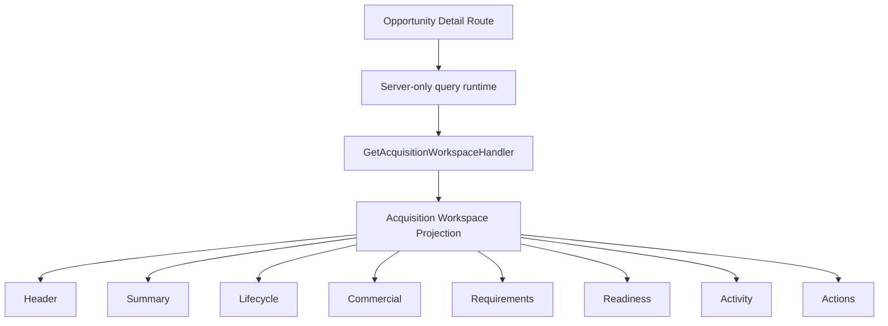
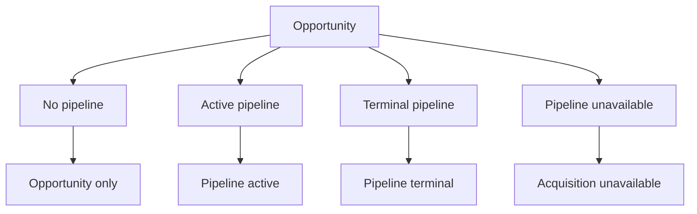

# IA-002B.2.5 — Investment Opportunity Detail Integration

## Outcome

`/dashboard/investments/opportunities/[opportunityId]` is the canonical
operational workspace for an Investment Opportunity. The route is a thin
authenticated server composition: it resolves the trusted request context,
executes `GetAcquisitionWorkspaceHandler`, maps safe top-level failures, and
passes the resulting presentation contract to data-agnostic components.

The page does not access repositories, restore aggregates, evaluate
authorization, or reconstruct acquisition policy.

## Route and composition

| Concern | Decision |
| --- | --- |
| Canonical public identity | Investment Opportunity ID |
| Canonical route | `/dashboard/investments/opportunities/[opportunityId]` |
| Pipeline ID in URL | Not required |
| Workspace query | One `GetAcquisitionWorkspaceHandler.execute` call |
| Legacy detail | `/dashboard/investments/portfolio/[id]` remains a compatibility route |
| Historical analysis | `/dashboard/investments/opportunities/[opportunityId]/analyses/[analysisId]` |
| Global workspace selection | Decide / Investment Intelligence |
| Local workspace context | Opportunity Portfolio |

The server-only runtime composes the production workspace query using the
existing owner-scoped Opportunity repository and normalized Acquisition
Pipeline repository. Action and Evidence enrichment follow the query's
documented degradation policy. Missing production enrichment never causes the
page to fabricate content.

## Section ownership

| Page section | Workspace projection |
| --- | --- |
| Header and opportunity summary | `InvestmentOpportunityWorkspaceSummary` |
| Decision context | `InvestmentAnalysisWorkspaceSummary` |
| Activation guidance | `AcquisitionActivationSummary` |
| Lifecycle | `AcquisitionLifecycleWorkspaceSummary` |
| Commercial | `AcquisitionCommercialWorkspaceSummary` |
| Requirements | `AcquisitionRequirementsWorkspaceSummary` |
| Closing readiness | `AcquisitionClosingReadinessWorkspaceSummary` |
| Recent activity | `AcquisitionActivityWorkspaceSummary` |
| Next actions | `AcquisitionWorkspaceNextAction[]` |
| Availability notice | `AcquisitionWorkspaceCapabilities` and limitations |

Components format dates, money, and canonical product labels. They do not
derive domain eligibility, transitions, readiness, or command availability.
Historical analysis navigation uses the href supplied by the read model.

## Workspace states

- **Opportunity only** renders the opportunity, latest decision context, and
  activation guidance. Absence of a pipeline is a valid state.
- **Pipeline active** renders lifecycle, commercial, requirements, readiness,
  activity, and next-action summaries.
- **Pipeline terminal** retains the historical workspace and adds the acquired
  or exited outcome. Mutation controls are not exposed.
- **Acquisition unavailable** keeps the opportunity and analysis visible and
  presents a factual availability notice without leaking infrastructure detail.

No analysis, uninitialized requirements, absent readiness, and empty activity
have explicit guidance rather than empty tables.

## Actions and capabilities

Next actions are rendered directly from the workspace projection and preserve
primary, secondary, and tertiary priority. Link actions may navigate when
enabled. Command actions remain non-interactive in this milestone because
mutation UI is deferred; their projected blockers and capability limitations
remain visible. The page does not infer availability from pipeline stage or
nullable data.

## Loading and errors

The route-level loading UI uses progressive placeholders for the header,
summary, lifecycle, commercial, requirements, readiness, activity, and actions.
Animation respects reduced-motion preferences.

Error handling follows these rules:

- missing, concealed, or unauthorized opportunities call `notFound()`;
- an unavailable acquisition dependency renders the successful
  `acquisition-unavailable` workspace state;
- unexpected failures reach a route error boundary with a generic message and
  retry control;
- raw domain, persistence, and infrastructure messages are never displayed.

## Responsive and accessibility behavior

The workspace uses a two-column summary at large widths, side-by-side
commercial and requirements sections where space permits, and a single-column
flow on smaller screens. The lifecycle changes from a horizontal progression
to a vertical list without horizontal page overflow.

The implementation provides:

- a breadcrumb navigation landmark;
- one page-level heading and ordered section headings;
- an ordered lifecycle with text and symbol state cues;
- `aria-current="step"` for the current lifecycle stage;
- screen-reader text for badges and status;
- keyboard-visible focus treatment for links;
- semantic time elements;
- disabled command explanations that do not rely on color;
- dark and light text contrast consistent with the workspace shell.

## Deferred work

This milestone intentionally does not add offer, contract, requirement,
closing, or exit forms; client optimistic state; server-command invocation; or
new domain behavior. A later command-UI milestone can connect projected command
descriptors to the existing authenticated command boundary without changing
this read composition.

