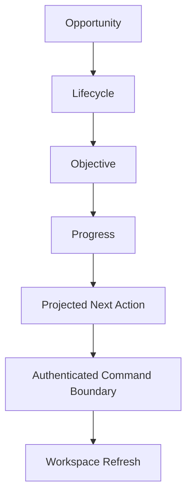

# IA-002B.3.1 — Acquisition Lifecycle Experience

## Outcome

The Investment Opportunity detail workspace now leads with acquisition
orientation rather than a collection of status cards. For an active or
terminal pipeline, the first operational content answers:

1. Where am I?
2. What is the objective?
3. What has been completed?
4. What remains?
5. What is blocking or increasing risk?
6. What action does the workspace projection recommend?

All lifecycle facts, health, blockers, warnings, history, and actions originate
from the Acquisition Workspace read model. Presentation adds product language
and responsive formatting but does not reproduce transition or eligibility
policy.



## Experience lifecycle

The operator-facing progression groups the detailed acquisition stages into a
stable mental model:

| Experience stage | Workspace source |
| --- | --- |
| Discovery | Existing opportunity identity |
| Analysis | Latest completed analysis |
| Pursuit | `pursuit` |
| Offer | `offer-preparation`, `offer-submitted`, and `negotiating` |
| Contract | `under-contract` |
| Due diligence | `due-diligence` |
| Closing | `closing-preparation` |
| Acquired | `closed-acquired` |

Exit is a distinct terminal branch and is never presented as successful forward
progress. The detailed source stages and history remain unchanged; grouping is
only an operator-facing presentation projection.

Completed stages include a checkmark and completion date where one is present.
The current stage is larger, accented, focusable, and announced with
`aria-current="step"`. Upcoming and unavailable stages use explicit text, not
color alone.

## Objective and guidance

Each acquisition stage has product guidance describing:

- its purpose;
- the current objective;
- important risks to watch;
- remaining lifecycle steps.

The prominent current-objective surface uses the primary
`AcquisitionWorkspaceNextAction` label and description whenever it exists.
Stage guidance is the fallback explanation, not a substitute action policy.

Opportunity-only workspaces retain the activation projection from
IA-002B.2.2. Missing analysis and activation limitations remain intentional
empty states rather than inferred pipeline errors.

## Progress model

Progress is derived from the displayed lifecycle states:

```text
completed visible stages / total reachable visible stages
```

The current terminal stage counts as complete. Unreachable stages are excluded
from the denominator. The UI displays completed stages, remaining steps, and a
percentage only as a transparent expression of this stage ratio. It does not
introduce a task-weighted score or fabricate an estimated completion date.

## Health, blockers, and warnings

The health badge consumes `AcquisitionWorkspaceHealth` directly:

- `healthy` → Healthy
- `attention` → Attention required
- `blocked` → Blocked
- `terminal` → Completed

Blockers and warnings are separate surfaces:

- blockers combine projected blocking requirements, closing-readiness
  blockers, and blockers attached to the primary next action;
- warnings combine projected closing-readiness warnings and non-terminal
  workspace health reasons.

The presentation deduplicates identical display entries but does not decide
whether a fact blocks progression.

## Recommended action and command feedback

The recommended action label, description, priority, enabled state, href,
command descriptor, and blockers are read-model owned.

Link actions navigate directly. Form-free commands currently supported by the
server boundary—activation and beginning closing preparation—have a typed
client action surface with:

- pending feedback;
- success feedback followed by `router.refresh()`;
- version-conflict feedback and explicit reload;
- blocked or unavailable feedback without raw server messages.

Commands requiring commercial terms, requirement edits, closing facts, or exit
confirmation remain disabled until their dedicated workflow UI exists. The
production deployment registry continues to fail writes closed while remote
verification is incomplete. Client state cannot override capability or
deployment gating.

## Terminal experiences

Acquired workspaces use a completion treatment, show 100% lifecycle progress
when the terminal stage is current, preserve lifecycle history, and expose no
mutation CTA.

Exited workspaces use a distinct red terminal branch, identify the exit stage
and reason, preserve history, and expose no primary mutation action.

Acquisition-unavailable workspaces continue to show the opportunity and
analysis without rendering a corrupt partial lifecycle.

## Responsive behavior

- Large desktop renders the progression horizontally.
- Tablet uses a compressed grid while retaining stage labels and state text.
- Mobile renders a vertical progression with the current stage visible in
  normal document flow.
- Objective, stage guidance, progress, blockers, and warnings stack without
  horizontal page overflow.

Progress transitions respect reduced-motion preferences.

## Accessibility

The experience provides:

- an ordered-list timeline;
- `aria-current="step"` on the current stage;
- text equivalents for completed, current, upcoming, unavailable, and exited;
- keyboard focus on the current lifecycle stage;
- a labeled progressbar with numeric value;
- separate blocker and warning headings;
- `aria-live` command feedback;
- `role="status"` for successful completion;
- `role="alert"` for conflicts and safe command failures;
- visible focus treatment;
- no color-only lifecycle meaning.

## Ownership and deferred work

The Acquisition Workspace query continues to own lifecycle facts, health,
capabilities, versions, and next actions. The server command boundary owns
authentication, authorization, concurrency, idempotency, deployment gating,
execution, and revalidation.

Offer editing, negotiation, contract editing, requirement management, closing
facts, document management, and exit confirmation remain deferred to their
dedicated workflow milestones.

