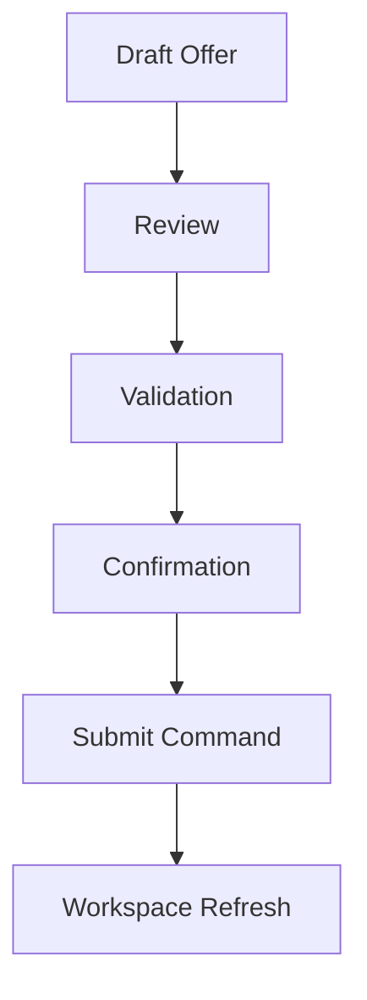
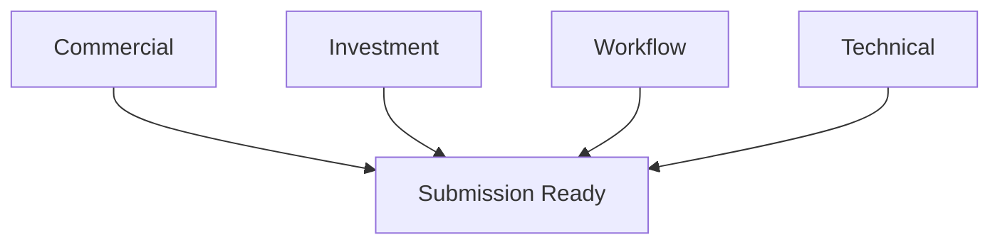
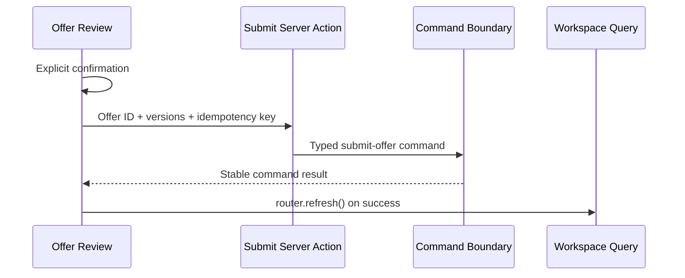

# IA-002B.3.2.3 — Offer Review and Submission Experience

## Outcome

When the Acquisition Workspace projects `submit-offer` as the primary
commercial action, the Commercial workspace presents a dedicated decision
checkpoint before invoking the command boundary.

The checkpoint moves from understanding to confidence to commitment:

No optimistic commercial or lifecycle mutation occurs in the browser.

## Review flow

The experience presents:

1. a concise offer summary;
2. route-specific headline terms;
3. source-analysis lineage and qualitative alignment;
4. projected commercial drift;
5. categorized preflight checks;
6. a single submission-readiness state;
7. separate blockers and warnings;
8. explicit confirmation;
9. typed command execution and recovery feedback.

The review is only rendered for the current offer when the primary
`AcquisitionWorkspaceNextAction` is `submit-offer`.

## Route-specific summaries

### Purchase

The bounded review displays:

- purchase price;
- financing type;
- proposed closing date;
- offer expiration;
- an explicit pointer to detailed earnest-money terms.

### Rental arbitrage

The bounded review displays:

- monthly rent;
- lease term;
- proposed commencement;
- operating-permission request;
- offer expiration;
- explicit pointers to detailed security-deposit and utility terms.

Detailed terms are not present in the Acquisition Workspace headline
projection and are never fabricated by presentation. The canonical offer and
domain command perform authoritative complete-term validation.

## Investment alignment and drift

The offer retains source-analysis ID, version, and analyzed time. The review
shows this basis beside the latest completed analysis and its recommendation.

Qualitative presentation uses the existing alignment projection:

- `aligned` → **Aligned**;
- `changed` → **Watch closely**;
- unavailable/absent → **Alignment unavailable**.

Projected difference explanations form the Commercial Drift list. The review
does not calculate CoC, NOI, ADR, occupancy, cap rate, or threshold policy
because those metrics are not in the bounded presentation-safe contract.
Adding them requires a future application projection, not a UI calculation.

## Validation model

Checks are grouped as follows:

| Category | Projected checks |
| --- | --- |
| Commercial | Headline terms available; expiration projected |
| Investment | Source analysis linked; latest analysis freshness; alignment |
| Workflow | Current draft; offer editable; projected action blockers |
| Technical | Expected pipeline version; submit command descriptor; deployment/dependency availability |

The server remains authoritative. The UI does not claim that an expected
version is still current; it states that the version will be validated by the
server.

### Blocking and warning policy

The following presentation facts block the confirmation button:

- offer is not the current draft;
- offer is no longer editable;
- submit is not the projected command;
- expected pipeline version is missing;
- projected next action contains a domain blocker;
- projected deployment or dependency state is unavailable.

Missing expiration, stale/missing latest analysis, and changed/unavailable
alignment are warnings in the bounded review unless the projected next action
or server command promotes them to blockers.

This avoids recreating domain eligibility rules in presentation.

## Readiness

The page exposes exactly one state:

- **Ready to submit** — no projected blockers/unavailability and the projected
  action is enabled;
- **Not ready** — one or more resolvable blockers remain;
- **Submission unavailable** — deployment, verification, authorization, or
  dependency state prevents safe invocation.

Each issue includes an explanation and a resolution appropriate to the
projection.

## Confirmation

Submission uses an in-application modal dialog rather than a browser confirm.
The operator must explicitly acknowledge:

- the reviewed terms;
- alignment;
- blockers and warnings;
- intent to make the offer immutable.

The dialog:

- uses `role="dialog"` and `aria-modal="true"`;
- moves focus inside on open;
- traps Tab and Shift+Tab;
- closes on Escape when not submitting;
- restores focus to the opening button;
- disables cancellation and duplicate submission while pending.

## Command flow

The client transports only:

- opportunity ID from the projected command descriptor;
- pipeline ID;
- offer ID;
- expected opportunity version;
- expected pipeline version;
- a UUID idempotency key generated for the interaction.

The existing server boundary resolves actor, owner, command ID, timestamp,
authorization, deployment status, and transaction behavior.

## Pending and success

Pending feedback has three named phases:

1. Validating offer;
2. Submitting offer;
3. Refreshing workspace.

On success, the UI announces:

> Offer submitted. Waiting for counterparty response.

It then refreshes the canonical workspace. The offer, commercial status,
lifecycle stage, and activity are re-read from the application query.

## Conflict, blocked, and unavailable

- **Conflict** explains that the acquisition changed and requires an explicit
  reload before another submission.
- **Blocked** displays the stable server blocker and preserves the draft.
- **Unavailable** distinguishes deployment/infrastructure gating from business
  invalidity and preserves the draft.
- Other safe failures report that submission did not occur without showing raw
  domain or infrastructure detail.

The browser never retries a conflicted business command against a new version.

## Responsive and accessibility behavior

- Review cards use two columns on large displays and stack on smaller screens.
- Route-specific term grids wrap without horizontal page overflow.
- Validation categories retain headings and status icons with text labels.
- Readiness, warnings, and blockers do not rely on color.
- Pending and success use `role="status"`/live regions.
- Conflict and command failures use `role="alert"`.
- The confirmation dialog supports keyboard-only use, focus containment,
  Escape, and focus restoration.
- Reduced-motion preferences disable the progress spinner animation.

## Deferred work

Offer drafting and editing, document attachments, messages, e-signatures,
counteroffer review, and contract generation remain outside this milestone.
Performance metric comparisons require a future approved workspace projection
before UI implementation.

