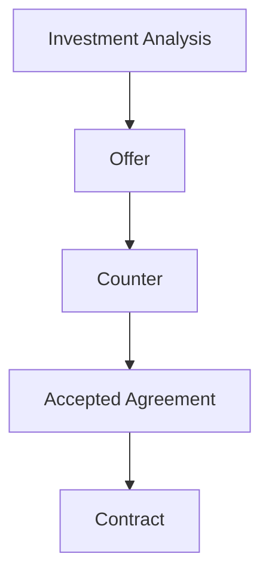

# IA-002B.3.2 — Offer & Negotiation Experience

## Outcome

The Opportunity detail Commercial section is now a dedicated negotiation
workspace. It establishes one current commercial position and makes its offer,
response, agreement, contract, analysis basis, and bounded history legible as a
single lineage.

The experience answers:

1. What is the current position?
2. What are the active headline terms?
3. What did the counterparty most recently do?
4. Which headline terms changed?
5. Is the position still aligned with the recorded analysis basis?
6. Has an agreement been accepted, and has it become a contract?
7. What projected action comes next?



## Commercial lifecycle

Commercial state is presented independently from acquisition stage:

```text
Draft → Submitted → Countered → Accepted → Contracted
                    ├→ Rejected
                    ├→ Expired
                    └→ Withdrawn
```

The workspace resolves the display state from the canonical commercial
projection in precedence order:

1. recorded contract;
2. accepted agreement;
3. latest counterparty response;
4. current-offer status;
5. no offer.

This is display composition only. Domain commands and transition policies remain
in the Acquisition Pipeline application and domain layers.

## Current position and health

The dark current-position surface displays:

- negotiation state;
- current offer sequence;
- submission date;
- absolute expiration date;
- an explicit expired-offer warning.

Commercial health is intentionally categorical:

- **Healthy** — current position is projected as aligned;
- **Attention required** — alignment is missing/unavailable or analysis is
  stale;
- **Blocked** — projected alignment reports changed commercial basis;
- **Expired** — current offer has the canonical expired status.

No commercial score or client-derived expiration timestamp is introduced.

## Route-specific offer presentation

Purchase offers display the bounded fields currently exposed by
`AcquisitionOfferHeadlineTerms`:

- offer price;
- financing type;
- proposed closing date.

Rental-arbitrage offers display:

- proposed monthly rent;
- lease term;
- proposed commencement date;
- whether operating permission is requested.

The workspace does not fabricate earnest money, security deposit, detailed
conditions, utilities, or other terms that the bounded query projection does
not return. Those remain in the dedicated offer workflow.

## Negotiation timeline and history

The negotiation timeline combines:

- prior immutable offer references;
- current offer creation and submission;
- latest counterparty response;
- accepted agreement;
- recorded contract.

Events are sorted chronologically with stable ID tie-breaking. Actor labels are
capability-safe classifications such as Operator, Seller, or Commercial
lineage; personal counterparty data is not displayed.

The separate Offer History panel uses the bounded prior-offer projection,
orders by offer sequence, marks records read-only, and reports truncation.
Historical headline terms are not invented because the summary intentionally
does not expose them.

## Counteroffer comparison and deltas

When the latest response is a counter with headline terms, the workspace
renders:

- a field-by-field table comparing “You” and “Counter”;
- highlighting only on changed fields;
- a compact delta list containing only changes.

Purchase deltas support price, closing date, and financing changes.
Rental-arbitrage deltas support monthly rent, lease term, commencement, and
operating-permission request changes. Route mismatches are made explicit rather
than coerced into a weak shared shape.

Detailed conditions are outside this comparison because they are not part of
the bounded workspace contract.

## Investment alignment

The alignment panel consumes `analysisAlignment` without recalculating
underwriting:

- `aligned` → Within investment thesis;
- `changed` → prominent changed-basis warning and projected differences;
- `unavailable` or absent → clear unavailable state;
- stale latest analysis → explicit stale badge.

The offer retains lineage through its source analysis ID and version. The
workspace does not calculate cash-on-cash return, NOI, or threshold deltas
because those values are not currently in the presentation-safe projection. It
instead directs the operator to review the linked analysis before accepting
changed terms.

## Agreement and contract lineage

Accepted agreement and executed contract are separate visual states.

The agreement card identifies:

- acceptance date;
- offer, counteroffer, or external basis;
- safe offer/response reference where available;
- whether contract execution remains outstanding.

The contract block appears only when a canonical contract projection exists and
shows its source, effective date, and safe identifier. Acceptance never implies
execution.

## Negotiation action

The commercial workspace receives only the primary
`AcquisitionWorkspaceNextAction` when its type is commercial:

- create offer;
- edit offer;
- submit offer;
- record response;
- record contract.

Label, description, enabled state, priority, command descriptor, and blockers
remain read-model owned. The shared command feedback surface supplies pending,
success/refresh, conflict/reload, blocked, and unavailable states.

Commands requiring offer terms, response decisions, acceptance details, or
contract terms remain disabled until their dedicated form experience exists.
Production deployment and remote-verification gates continue to fail closed.

## Empty and terminal states

- **No offer** explains how the first offer establishes analysis lineage and
  renders the projected action.
- **No response** is represented by the submitted current position without a
  fabricated response event.
- **Accepted** remains pending contract execution.
- **Contracted** shows both agreement and contract lineage.
- **Rejected**, **expired**, and **withdrawn** remain inactive, read-only
  commercial outcomes.

## Responsive and accessibility behavior

- Current position and headline terms stack on mobile.
- Comparison rows retain semantic table roles and three explicit columns.
- Timeline events use an ordered list and remain readable vertically.
- Changed comparison fields have text and emphasis in addition to color.
- Expiration warnings use `role="alert"`.
- Headings provide stable navigation through the commercial workspace.
- All action feedback uses the shared accessible live-region behavior.
- No hover interaction is required to understand commercial state.

## Deferred read-model enhancements

Future query-contract work may add approved projections for:

- earnest money and security deposit;
- selected material condition deltas;
- full response history rather than latest response;
- historical offer headline terms;
- analysis return-impact metrics and approved thresholds;
- server-derived relative expiration guidance.

Those enhancements must be added to the application read model before the
presentation displays them.

