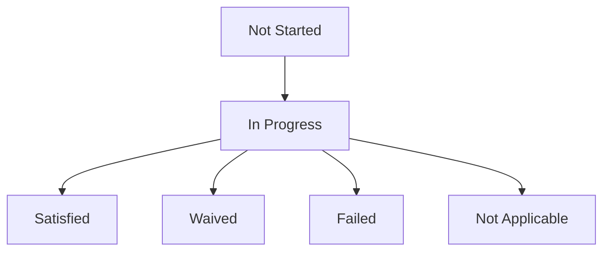
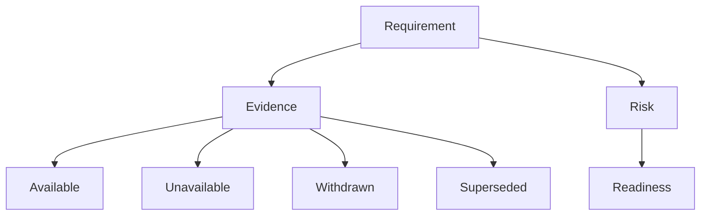

# IA-002B.3.4 — Due Diligence Experience

## Outcome

The former Requirements summary is now a dedicated, read-only Due Diligence
Workspace. It explains current readiness, the projected objective, critical
blockers, requirement progress, supporting evidence state, recorded risks,
related requirements, and recent resolution activity.

The experience continuously answers:

- what remains unresolved;
- what blocks safe progression;
- what evidence is available or unavailable;
- what recorded risks affect the acquisition;
- which contingency and diligence work are related;
- which projected action comes next.

## Diligence model

Contingencies and due diligence tasks remain distinct domain concepts:

| Concept | Purpose |
| --- | --- |
| Contingency | Contract or agreement protection that may prevent safe progression |
| Due diligence task | Investigation or verification supporting the acquisition decision |

Both use the canonical requirement lifecycle:



The workspace does not add requirement states or infer mutations.

## Workspace read-model enhancements

The application projection now returns bounded presentation-safe collections
for:

- contingencies;
- due diligence tasks;
- requirement descriptions;
- requirement updated time;
- evidence state counts;
- related contingency/diligence references;
- concern-based risk summaries;
- recently resolved requirements.

These are produced by the pure Acquisition Workspace projection. The React
components do not consume aggregates or persistence rows.

No evidence content, provenance payload, Action body, document title, document
URL, MIME type, storage location, or file preview enters the workspace
contract.

## Current readiness, health, and progress

The current-readiness surface displays exact counts:

- total requirements;
- completed requirements;
- remaining requirements;
- unresolved blockers.

Completed means:

```text
satisfied + waived + not applicable
```

Failed requirements remain unresolved for progress purposes. No arbitrary
percentage or weighted score is introduced.

Health is categorical:

- **Failed** when one or more requirements have failed;
- **Blocked** when unresolved projected blockers exist;
- **Attention required** when visible requirements are overdue, evidence is
  unavailable, or critical concerns remain;
- **Healthy** otherwise.

Closing readiness remains a separate domain-derived projection. The diligence
summary reports its state and whether reevaluation is required without
recalculating closing policy.

## Current objective and recommendation

The current recommendation is rendered only from the primary
`AcquisitionWorkspaceNextAction` when its type is:

- initialize requirements;
- manage due diligence;
- review closing readiness.

Its label, description, enabled state, blockers, and command descriptor remain
application owned. The shared command surface continues to enforce deployment
gating and does not add a generic requirement patch workflow.

When no projected diligence action exists, stage context may explain what to
review, but no presentation-owned CTA is invented.

## Blockers and warnings

Critical blockers include:

- unresolved blocking requirements from the workspace projection;
- blocking failed requirements retained in the bounded requirement lists.

Each blocker explains:

- why it is surfaced;
- its acquisition-readiness impact;
- the safe next review step.

Warnings are a separate collection containing:

- overdue visible requirements;
- requirements with unavailable, withdrawn, superseded, or inaccessible
  Evidence references;
- closing-readiness warnings.

The UI does not promote a warning to a domain blocker.

## Requirement detail

Requirement cards use native `<details>` and `<summary>` elements for a
keyboard-accessible, mobile-friendly disclosure.

Each detail displays:

- type/category;
- lifecycle status;
- priority;
- due date;
- blocking state;
- linked Action count;
- Evidence counts by current state;
- opaque document count;
- related requirements;
- summarized concerns;
- updated timestamp.

The detail is explicitly read-only. No editing, waiver, status transition, or
reference mutation is introduced.

## Evidence visualization



Evidence is presented only through exact aggregate counts:

- linked;
- available;
- unavailable;
- withdrawn;
- superseded.

Missing or cross-owner evidence remains unavailable without ownership leakage.
Evidence completion never independently satisfies a requirement.

## Risk model

The risk workspace projects bounded concern summaries from canonical
requirement outcomes:

- stable presentation ID;
- related requirement;
- title;
- safe summary;
- severity;
- blocking state;
- Evidence reference count.

The domain currently does not model concern likelihood, lifecycle status, or a
formal mitigation recommendation. The UI therefore displays likelihood as
“Not projected” and provides only a factual review recommendation based on the
blocking flag.

No risk score is introduced.

## Requirement relationships

The domain exposes:

- contingency → related due diligence item IDs;
- due diligence item → related contingency ID.

The workspace presents these as **Requirement relationships**, not as a
directional dependency rule. This avoids claiming that one item may not
progress until another completes when the domain only records a relationship.

Relationships are keyboard focusable and use visible requirement names when
the related item is included in the bounded projection. Otherwise, the opaque
requirement ID is retained.

## History limitation

The normalized persistence model contains requirement-history rows, but the
current production workspace reader does not expose them through
`AcquisitionWorkspacePipelineSource`. This milestone therefore shows the
existing bounded `recentlyResolved` projection as **Recent requirement
changes**.

It does not fabricate a full event timeline. Complete requirement history
requires an explicit production-reader and application-contract enhancement.

## Empty states

- No requirements: “Requirements have not yet been initialized.”
- No Evidence: “No supporting evidence has been linked.”
- No risks: “No acquisition risks identified.”
- No relationships: “No requirement relationships projected.”
- No recent changes: “No recent requirement changes.”

Each state explains when or how the information becomes available.

## Responsive and accessibility behavior

- Desktop uses two-column contingency/task, Evidence/risk, and
  relationship/warning layouts.
- Tablet stacks major sections.
- Mobile uses native requirement disclosures as accessible accordions.
- Requirement status includes icon, text, and badge—not color alone.
- Disclosure summaries are keyboard operable and have visible focus.
- Related-requirement items are keyboard focusable.
- Current objective and recommendation remain in normal document order.
- Counts and state labels are available to screen readers.
- Disclosure animation respects reduced-motion preferences.

## Deferred work

This milestone does not add:

- requirement editing;
- status transitions or waivers;
- Evidence creation;
- document storage or previews;
- Action creation;
- complete requirement event history;
- directional dependency enforcement;
- risk likelihood workflow;
- closing workflow.

