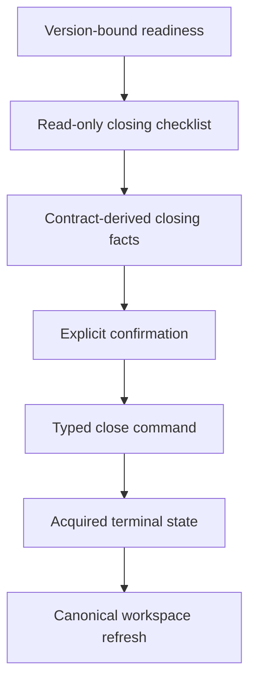
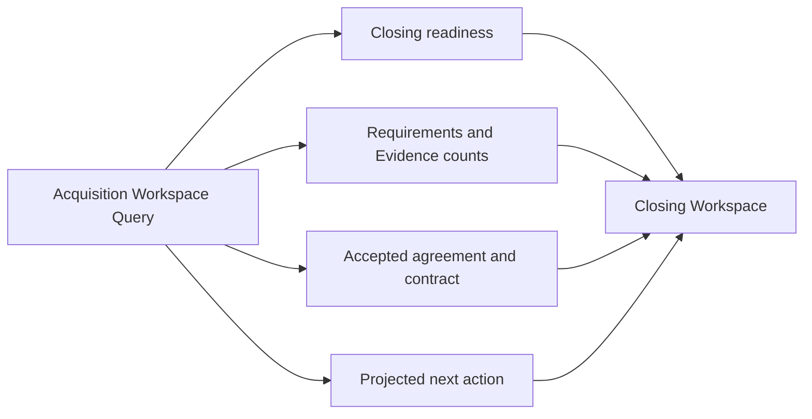

# IA-002B.3.5 — Closing Experience

## Outcome

The opportunity detail page now treats closing as an operational workflow rather
than a passive readiness badge. The Closing Workspace consumes only the
presentation-safe Acquisition Workspace projection and the typed acquisition
server command boundary.

Closing remains an irreversible business commitment:



No component imports a repository, persistence row, aggregate, Supabase client,
or authorization implementation.

## Closing workflow

The workspace represents these operator states:

1. **Not ready** — readiness is absent, stale, or blocked.
2. **Conditionally ready** — no domain blocker is projected, but warnings need
   explicit operator attention.
3. **Ready** — readiness matches the current pipeline version and all projected
   closing checks pass.
4. **Closing preparation** — the pipeline is eligible for the terminal command.
5. **Acquired** — the pipeline is terminal and immutable closing facts are
   displayed as history.

Readiness freshness is never inferred from elapsed time:

```text
current = readiness.evaluatedPipelineVersion === pipelineVersion
```

## Readiness ownership



The UI maps these projections into operator language. It does not recalculate
domain readiness or mutate checklist items.

### Checklist

The read-only checklist explains:

- contract recorded;
- requirements resolved;
- linked Evidence available;
- readiness current;
- commercial basis consistent;
- closing lifecycle stage eligible.

Checks are derived from bounded workspace fields. The server and domain remain
authoritative when a command executes.

### Blockers and warnings

Domain readiness blockers retain their source type and resolution semantics.
Warnings remain visually and semantically distinct. A stale readiness projection
is always blocking for closing, regardless of how recently it was evaluated.

The current objective selects the first safe resolution path:

1. unavailable production capability;
2. stale or missing readiness;
3. first projected blocker;
4. projected next action;
5. final fact review.

## Closing facts

Before closing, the workspace presents proposed final facts from the recorded
contract projection. It remains read-only.

Purchase:

- contract purchase price;
- scheduled closing date;
- financing type;
- resulting ownership state.

Rental arbitrage:

- contracted monthly rent;
- lease term;
- commencement date;
- operating-permission status.

After acquisition, the workspace uses the immutable terminal closing-facts
projection instead.

The current bounded contract does not project settlement statements, wire
details, escrow facts, lender records, signatures, property onboarding, or
document metadata. The experience does not invent these fields.

## Commercial consistency

The checklist uses `contractAlignment` to distinguish an aligned contract from
a material difference. A changed alignment is a blocker with explicit
reconciliation guidance. Accepted agreement and contract remain separate
product concepts.

## Command boundary

The terminal action uses `closeAcquisitionAction` with:

- opportunity ID;
- pipeline ID;
- expected opportunity version;
- expected pipeline version;
- a per-intent UUID idempotency key;
- route-discriminated closing facts.

Actor, owner, command ID, authorization, authoritative timestamp, deployment
status, and transaction behavior remain server-owned.

The confirmation is an accessible application dialog, not a browser confirm.
It traps focus, supports Escape, restores focus, requires an acknowledgement,
and announces:

```text
Preparing closing → Executing closing → Refreshing workspace
```

No optimistic terminal mutation occurs. Success refreshes the canonical
workspace. Conflict, blocked, unavailable, and safe-failure results have
dedicated treatments.

## Production gate

The current production command registry classifies closing as
`not-remotely-verified`. Consequently:

- read-only closing and acquired experiences are available;
- the projected action explains the infrastructure limitation;
- the confirmation control cannot execute while capability is unavailable;
- the server independently rejects direct or stale client invocation;
- query access remains available.

This is intentional fail-closed behavior. Local passing tests are not treated as
remote transaction or RLS verification.

## Acquired state

The terminal experience displays:

- acquired outcome;
- immutable route-specific closing facts;
- completion time;
- permanent commercial basis;
- completed bounded lifecycle history;
- no active acquisition actions.

The surrounding workspace continues to provide the final commercial summary,
activity, analysis, and lifecycle record.

## Responsive and accessibility behavior

- Desktop uses paired readiness/objective, checklist/conditions, and
  facts/summary regions.
- Tablet and mobile stack the same semantic order.
- The checklist is a semantic list with text and icon state.
- Status is never communicated by color alone.
- Blockers and warnings have explicit headings.
- The dialog has `role="dialog"`, `aria-modal`, labelled/described relationships,
  focus trapping, Escape handling, and focus restoration.
- Pending and command outcomes use live status or alert regions.
- Motion respects reduced-motion preferences.

## Deferred work

- closing-fact editing and specialized correction workflows;
- settlement statements and accounting integrations;
- escrow, lender, wire, and signing integrations;
- property and revenue onboarding;
- remote transaction-plan and RLS verification;
- enabling the production close command.

These limitations do not weaken the read model or allow a client to bypass the
existing server command boundary.
