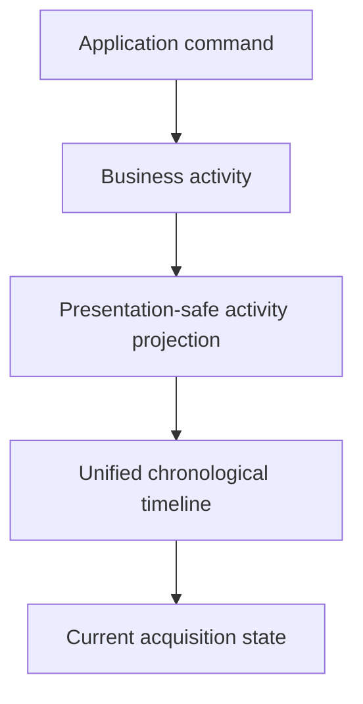
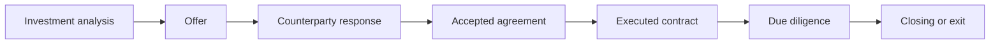

# IA-002B.3.6 — Activity, Timeline & Decision Lineage

## Outcome

The opportunity detail workspace now contains one canonical Activity & Decision
Lineage experience. It replaces the previous recent-event card and joins the
bounded historical perspectives already present in the Acquisition Workspace:

- pipeline activity;
- lifecycle stage history;
- commercial lineage;
- requirement outcomes;
- current Evidence relationships;
- closing outcomes;
- successful business-command outcomes.

This is an operator history, not a raw audit or infrastructure log.



## Timeline philosophy

Every projected event explains:

- what happened;
- who initiated it;
- what business object was affected;
- what outcome followed;
- which pipeline version recorded it;
- which stage it came from and led to;
- which safe object references are related.

Labels are explicit business language. For example:

```text
Offer submitted
Waiting for counterparty response
```

rather than a technical mutation description.

Raw activity metadata, command payloads, receipt rows, SQL, RPC names, document
content, and Evidence content are not exposed.

## Activity projection

`AcquisitionActivityWorkspaceItem` now includes:

- `category`;
- `summary`;
- `affectedObject`;
- `outcome`;
- `pipelineVersion`;
- `fromStage`, when present;
- `toStage`;
- bounded safe references.

The pure projection maps domain activity types to product language,
deterministically sorts newest first, and preserves total/truncation metadata.
It performs no repository access and consumes no clock.

Supported projected categories are:

- lifecycle;
- commercial;
- requirements;
- closing;
- system.

Evidence does not currently produce an independent domain activity stream. The
Evidence filter therefore finds requirement events carrying safe requirement
relationships, while the Evidence Lineage panel reports the current opaque
reference state honestly.

## Time grouping

Timeline groups are:

- Today;
- Yesterday;
- Earlier this week;
- Last week;
- Earlier.

Grouping uses the workspace projection’s `updatedAt` as an explicit reference
date. It does not call the browser clock, reorder the canonical activity array,
or introduce server/client hydration differences.

## Filters and search

Filters are local presentation state:

- All;
- Lifecycle;
- Commercial;
- Requirements;
- Evidence;
- Closing.

Search covers only safe presentation metadata:

- summary;
- business outcome;
- affected object;
- activity type/category;
- safe reference type and ID.

Search does not inspect document bodies, Evidence content, requirement bodies,
raw activity metadata, or persistence data. Filtering never changes
chronological order.

## Decision lineage



The lineage graph is constructed from existing bounded projections. It clearly
marks the current or terminal outcome without inventing absent historical
records.

## Related lineage views

### Lifecycle history

Lifecycle progression remains distinct from chronological activity. Completed,
current, upcoming, unreachable, exited, and terminal stages retain their
canonical projected state. “You are here” marks the current stage.

### Commercial lineage

The chain connects:

- latest analysis;
- bounded prior offers;
- current offer;
- latest response;
- accepted agreement;
- contract.

If prior offers are truncated, the UI reports the visible and total counts.

### Requirement lineage

Requirement activity is shown from the bounded pipeline activity window.
Recently resolved totals from the requirements projection provide additional
context.

Complete normalized requirement-history rows are persisted by the acquisition
repository but are not currently exposed by the Acquisition Workspace reader.
The UI states this limitation and does not imply that the bounded panel is a
complete requirement audit.

### Evidence lineage

Evidence remains an opaque reference. The workspace shows current counts for:

- available;
- unavailable;
- withdrawn;
- superseded.

It connects those states to their requirement and current outcome. It does not
project Evidence transition timestamps, provenance, review events, document
previews, or content, so it explicitly describes the panel as a current
relationship view rather than a complete Evidence history.

### Command outcomes

Successful business operations are inferred from canonical activity such as:

- acquisition activated;
- offer submitted;
- contract recorded;
- requirement resolved;
- acquisition closed;
- pursuit exited.

Command receipts remain the idempotency record inside the application boundary.
They are not exposed to presentation, and replay status is not reinterpreted as
a business event.

## Expandable details

Each event uses a native `details` disclosure. The read-only detail contains:

- pipeline version;
- stage change or current stage;
- related safe record references.

No edit action, event replay, rollback, or version restore is provided.

## Empty and terminal experiences

With no projected events:

```text
No acquisition history yet.
History begins when acquisition starts.
```

An empty search/filter result is distinguished from no history.

Acquired workspaces highlight `Acquisition complete` and retain the full bounded
narrative. Exited workspaces highlight `Acquisition ended`, preserve the exit
reason, and retain all prior timeline entries.

## Accessibility and responsive behavior

- The timeline is a semantic ordered list grouped beneath labelled sections.
- Filters use buttons with `aria-pressed`.
- Search has a programmatic label.
- Event details use keyboard-accessible native disclosures.
- Current, terminal, and category states have text labels and are not
  color-only.
- Desktop uses a central timeline with contextual lineage panels.
- Tablet and mobile collapse to a single-column card sequence.
- Horizontal filter overflow remains keyboard and touch accessible.
- Decorative motion respects reduced-motion preferences.

## Deferred capability

A future paginated history query may safely add:

- complete pipeline activity beyond the workspace bound;
- typed normalized requirement-history projections;
- Evidence transition history through an approved public reader;
- presentation-safe receipt outcomes if product value warrants them.

That future query must preserve owner scoping, concealment, deterministic
ordering, and the existing application boundary. This milestone does not add a
database migration, repository query, command log API, event replay, or
rollback.
