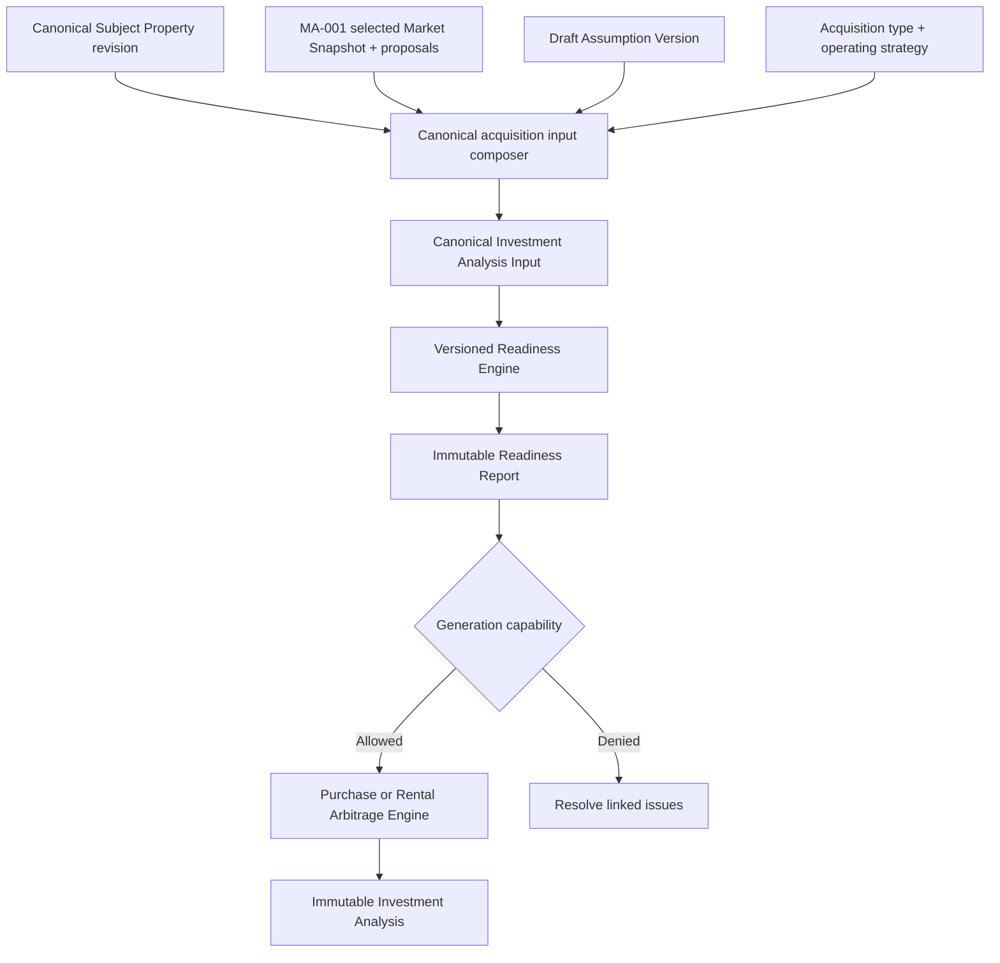

# IA-008 — Acquisition Input Model & Analysis Readiness

## Status

**Status:** Planned  
**Owner:** Investment Intelligence  
**Epic:** Investment Intelligence v1  
**Depends on:** IW-001 Canonical Subject Property, MA-001 Live Market Snapshot Integration, canonical versioned assumptions, Purchase Underwriting Engine, and Rental Arbitrage Engine  
**Primary product outcome:** Every underwriting route receives one canonical, acquisition-aware input contract and one deterministic readiness result that states whether a defensible analysis can be generated.

## Purpose

Separate input collection and normalization from analysis generation.

The Acquisition Input Model defines:

- which inputs and assumptions exist;
- their semantic types and units;
- which acquisition routes and operating strategies use them;
- where each value originated;
- whether each value is present, valid, applicable, current, and complete;
- which Market evidence or user judgment supports it;
- which immutable version an analysis will consume.

The Readiness Engine answers:

> Can the platform produce a valid and defensible Investment analysis with the
> currently selected property, route, strategy, Market evidence, and assumptions?

IA-008 is the single product-policy authority for missing-input validation,
blocking conditions, warnings, informational guidance, and analysis-generation
gating. It remains independent of form layout and presentation framework.

## Current-state baseline

The repository already contains:

- one `runInvestmentAnalysis` application boundary discriminated by purchase or
  rental-arbitrage acquisition type;
- separate purchase and rental-arbitrage assumption/result types;
- a source-neutral `buildInvestmentAnalysisContext` composer;
- canonical assumption keys for shared and route-specific values;
- Market, user, system-default, and applied-Learning assumption sources;
- numeric input policies;
- assumption fingerprints;
- route-switching helpers;
- a workspace readiness evaluator with preview and full-analysis capabilities.

The existing readiness model is a useful migration seed, but it currently:

- accepts a flat `InvestmentWorkspaceReadinessValues` UI-shaped object;
- couples property address fields and acquisition values to form state;
- groups validation at a coarse section level;
- does not carry canonical assumption IDs, versions, units, provenance, or
  effective periods;
- does not distinguish missing from invalid at the field-result level;
- leaves warning, optional-gap, invalid-assumption, and route-incompatibility
  collections largely unpopulated;
- currently treats Market integration unavailability as blocking even though
  MA-001 requires manual underwriting to remain available;
- resets route-specific values through UI/default-shaped transition logic;
- does not persist a pinned readiness result with immutable analysis lineage.

IA-008 evolves these contracts without duplicating the existing engines. Engine
functions retain defensive domain validation, but feature/UI code must not maintain
independent readiness policy.

## Architecture boundary



Investment Intelligence owns:

- acquisition input schema and discriminated route contracts;
- assumption definitions, applicability, precedence, and lineage;
- readiness policy and issue taxonomy;
- capability-specific generation gates;
- transition planning between routes and strategies;
- binding exact input/readiness versions to an analysis.

Market Intelligence owns:

- Market Snapshot validity and evidence;
- Market-derived proposals, confidence, gaps, and freshness;
- provider acquisition and selection.

The Underwriting Workspace owns:

- collecting user values;
- displaying readiness;
- linking issues to controls;
- requesting evaluation and generation.

The UI does not decide whether analysis may proceed.

## Goals

IA-008 must:

- establish one canonical input boundary for every underwriting analysis;
- distinguish shared inputs from route- and strategy-specific inputs;
- support purchase and rental arbitrage without a giant ambiguous optional object;
- preserve assumption origin, evidence, precedence, and versioning;
- classify absent, invalid, incompatible, stale, weak, and informational states;
- provide deterministic overall and capability-specific readiness;
- distinguish user-resolvable incompleteness from policy/integrity blocking;
- eliminate duplicated readiness rules from actions, pages, and components;
- preserve manual underwriting during Market outages or unsupported coverage;
- support route and strategy changes without silently discarding assumptions;
- retain historical readiness policy/results with immutable analyses;
- remain extensible to new acquisition models and hospitality strategies.

## Non-goals

IA-008 does not:

- calculate revenue, expenses, returns, risks, scores, or recommendations;
- retrieve Market data or call providers;
- reconcile provider conflicts;
- mutate Market Snapshots;
- generate or persist the Investment analysis itself;
- define every future strategy's financial formulas;
- replace field-level input parsing while a user is typing;
- infer missing values merely to make a draft appear ready;
- treat a completeness percentage as the analysis gate.

## Core invariants

1. Every evaluation pins one Canonical Subject Property ID/revision.
2. Every evaluation pins one acquisition type and one operating-strategy
   definition/version.
3. Every value has a canonical key, semantic type, unit, applicability, origin,
   and lineage.
4. The canonical input is a discriminated union by acquisition type.
5. Inapplicable fields are not missing fields.
6. A present value may still be invalid, incompatible, stale, or unsupported.
7. Zero, false, and empty are semantically distinct.
8. System defaults are explicit assumptions, never invisible substitutions.
9. Market unavailability alone is not a blocker when policy permits defensible
   manual assumptions.
10. A Market-derived value does not become authoritative merely because it exists.
11. An override preserves the superseded proposal and evidence.
12. Readiness is deterministic for the same canonical input and pinned policy.
13. The server re-evaluates readiness immediately before generation.
14. Only the readiness gate authorizes generation; UI enablement is advisory.
15. Engines retain defensive invariant checks but do not define competing product
    readiness policy.
16. Historical analyses preserve their input, readiness, and policy versions.
17. Route or strategy transitions never silently erase prior versioned values.
18. Completeness score is explanatory and never overrides blockers.

## Canonical high-level model

```text
Investment Analysis Input
├── Identity and version
├── Canonical Subject Property reference
├── Acquisition context
├── Operating strategy reference
├── Market context
├── Revenue assumptions
├── Operating-expense assumptions
├── Route-specific acquisition terms
├── Capital requirements
├── Applied overrides/defaults/Learning
└── Metadata and lineage
```

Every engine consumes a route-narrowed projection from this canonical input.
Engines do not consume raw form state, provider DTOs, or an unversioned bag of
optional numbers.

## Input identity and versioning

```ts
type InvestmentInputIdentity = Readonly<{
  inputId: string;
  inputVersion: number;
  assumptionVersionId: string;
  assumptionVersion: number;
  schemaVersion: string;
  createdAt: string;
  createdBy: string;
}>;
```

A saved draft input version is immutable. Editing creates a successor version.
Unsaved UI typing may remain transient, but analysis generation always
canonicalizes and persists the exact accepted input/assumption version first.

Input identity is distinct from:

- Subject Property identity;
- Market Snapshot identity;
- scenario identity;
- analysis identity;
- recommendation identity.

## Canonical route union

```ts
type CanonicalInvestmentAnalysisInput =
  | PurchaseInvestmentAnalysisInput
  | RentalArbitrageInvestmentAnalysisInput;

type InvestmentInputBase = Readonly<{
  identity: InvestmentInputIdentity;
  subjectProperty: CanonicalSubjectPropertyReference;
  operatingStrategy: OperatingStrategyReference;
  marketContext: InvestmentInputMarketContext;
  revenue: RevenueAssumptionSet;
  operatingExpenses: OperatingExpenseAssumptionSet;
  capital: SharedCapitalAssumptionSet;
  metadata: InvestmentInputMetadata;
}>;

type PurchaseInvestmentAnalysisInput =
  & InvestmentInputBase
  & Readonly<{
      acquisitionType: "purchase";
      acquisition: PurchaseAcquisitionAssumptionSet;
      financing: PurchaseFinancingAssumptionSet;
    }>;

type RentalArbitrageInvestmentAnalysisInput =
  & InvestmentInputBase
  & Readonly<{
      acquisitionType: "rental-arbitrage";
      lease: RentalArbitrageLeaseAssumptionSet;
      startup: RentalArbitrageStartupAssumptionSet;
    }>;
```

This shape makes invalid states harder to represent:

- a purchase input cannot omit its purchase/financing groups;
- a rental-arbitrage input cannot accidentally use purchase financing;
- route-specific requiredness can be statically narrowed;
- future routes add union members without making every existing field optional.

## Subject Property reference

The input references, rather than copies as authority:

- Canonical Subject Property ID;
- Subject Property revision;
- property type;
- bedrooms;
- bathrooms;
- sleeps when required by strategy;
- canonical location/coordinates;
- relevant physical characteristics;
- completeness result/reference.

The input may retain a frozen analysis projection for reproducibility, but IW-001
remains authoritative for the property aggregate.

### Minimum identity

At minimum, generation requires:

- stable Subject Property ID;
- pinned revision;
- valid location identity sufficient for the selected workflow;
- property type;
- strategy-required physical characteristics.

Requirements such as bedrooms, bathrooms, sleeps, square feet, or coordinates are
policy- and strategy-specific. They must not be universally hard-coded merely
because the current form displays them.

Property images are informational and never affect readiness.

## Acquisition context

Acquisition type initially supports:

- `purchase`;
- `rental-arbitrage`.

Future routes may include existing property, co-host acquisition, owner-occupied,
or another explicitly modeled acquisition. Operating strategy is separate:

- purchase is an acquisition structure;
- STR, MTR, LTR, house hack, co-host, and boutique hospitality are operating
  strategies.

The model must not use “strategy” to mean acquisition type in one contract and
operating strategy in another.

## Operating strategy reference

```ts
type OperatingStrategyReference = Readonly<{
  strategyId: string;
  strategyType:
    | "str"
    | "mtr"
    | "ltr"
    | "house-hack"
    | "co-host"
    | "boutique-hospitality";
  definitionVersion: string;
  scenarioId?: string;
}>;
```

Only strategies supported by the selected engine/policy may generate.

IW-003 may introduce additional versioned strategy definitions. IA-008 consumes
their input-requirement contract; it does not calculate their outcome.

## Canonical assumption

Every assumption is a first-class versioned value:

```ts
type CanonicalInvestmentAssumption<T> = Readonly<{
  assumptionId: string;
  key: string;
  value?: T;
  valueType: "money" | "percentage" | "integer" | "decimal" | "boolean" | "enum" | "distribution";
  unit?: Readonly<{
    symbol?: string;
    currency?: string;
    period?: string;
  }>;
  applicability: "applicable" | "conditional" | "not-applicable";
  origin: InvestmentAssumptionOrigin;
  effectivePeriod?: Readonly<{ from: string; to: string }>;
  confidence?: Readonly<{
    score?: number;
    level: string;
    sourceReference?: string;
  }>;
  lineage: readonly InvestmentAssumptionLineageReference[];
}>;
```

Missing is represented by absence/status, never by a sentinel `0`, empty string,
`NaN`, or fabricated default.

## Assumption origin

Supported origins include:

```ts
type InvestmentAssumptionOrigin =
  | Readonly<{
      type: "market-derived";
      snapshotId: string;
      snapshotVersion: number;
      observationIds: readonly string[];
      mappingVersion: string;
    }>
  | Readonly<{
      type: "user-entered";
      userId: string;
    }>
  | Readonly<{
      type: "user-override";
      userId: string;
      supersededAssumptionId: string;
      reason?: string;
    }>
  | Readonly<{
      type: "system-default";
      policyVersion: string;
    }>
  | Readonly<{
      type: "imported";
      importId: string;
      sourceType: string;
      transformationVersion: string;
    }>
  | Readonly<{
      type: "applied-learning";
      applicationId: string;
    }>;
```

This extends, rather than discards, the current Market/user/system-default/applied
Learning sources.

Readiness evaluates provenance because:

- a manual value may be sufficient but lower confidence;
- a Market proposal may be stale or unsupported;
- an override may require acknowledgment;
- an imported value may require review;
- an unapproved system default may be unacceptable for a Decision-critical field.

Origin does not decide validity by itself.

## Assumption precedence

Value composition uses an explicit versioned precedence policy.

A typical draft precedence may be:

```text
Explicit current user override
  → explicit user-entered value
  → approved applied Learning
  → accepted Market-derived proposal
  → approved system default
  → missing
```

This order is not universal. Per-key policy determines:

- which origins are permitted;
- whether Learning may replace or only suggest;
- whether Market proposals auto-populate;
- whether defaults require acknowledgment;
- whether old-snapshot evidence may be retained;
- what happens when two values at the same precedence conflict.

The composer records rejected/superseded candidates rather than silently losing
them.

## Shared inputs

Shared categories initially include:

### Subject Property

- Canonical Subject Property ID/revision;
- property type;
- bedrooms and bathrooms;
- sleeps where strategy-relevant;
- location and coordinates;
- relevant physical characteristics.

### Revenue

- ADR;
- occupancy;
- seasonality or monthly distribution;
- average length of stay;
- booking/channel mix when modeled;
- revenue confidence/context.

### Operating expenses

- cleaning;
- utilities;
- insurance;
- maintenance;
- supplies;
- management/co-host fee;
- booking-platform fees when modeled;
- software;
- reserve contribution;
- other supported recurring costs.

### Shared capital

- furnishing budget;
- initial operating reserve where applicable;
- other strategy-required startup capital not owned by a route-specific group.

“Shared” means semantically reusable, not universally required. Applicability and
severity depend on route, strategy, engine capability, and policy.

## Purchase-specific input

Purchase groups include:

### Acquisition

- purchase price;
- closing costs;
- renovation budget;
- furnishing budget reference;
- initial capital reserve;
- ownership/use context.

### Financing

- financing mode;
- down payment amount or percentage;
- loan principal, entered or versioned derivation;
- interest rate;
- amortization/loan term;
- financing costs;
- property taxes;
- insurance;
- HOA when applicable;
- PMI when conditionally applicable.

Conditional rules are explicit:

- a cash purchase does not require interest rate or loan term;
- PMI is not missing when policy says it is inapplicable;
- HOA may be optional, confirmed zero, unknown, or not applicable—these are not the
  same state;
- derived loan amount records formula/policy and inputs.

## Rental-arbitrage-specific input

Rental-arbitrage groups include:

### Lease

- monthly contractual/proposed rent;
- lease term;
- security deposit;
- lease acquisition costs;
- utility responsibility;
- landlord fee/concession structure;
- first-month/prepaid obligations when modeled;
- permitted-use/STR approval status where required by policy.

### Startup

- furnishing budget reference;
- setup costs;
- licenses/permits when modeled;
- initial reserve;
- other one-time launch costs.

The current engine fields—monthly lease, security deposit, lease term, furnishing
budget, startup costs, and utilities included—remain supported during migration.
New fields cannot become generation blockers until the corresponding engine and
policy consume them.

## Canonical input composition

Composition is separate from readiness:

1. load pinned Subject Property revision;
2. load selected acquisition route and operating-strategy definition;
3. load draft Assumption Version;
4. load selected MA-001 Market Snapshot/proposals when present;
5. apply explicit user values/overrides and approved Learning/default policy;
6. normalize units, currencies, periods, enums, and precision;
7. produce a canonical route-discriminated input;
8. preserve missing, rejected, superseded, and inapplicable values;
9. freeze/persist the version used for evaluation.

Composition validates structural integrity and lineage. It does not decide
readiness severity.

## Field evaluation

Each applicable field receives a deterministic result:

```ts
type InvestmentInputFieldStatus =
  | "complete"
  | "missing"
  | "invalid"
  | "needs-review"
  | "not-applicable";

type InvestmentInputIssueSeverity =
  | "blocking"
  | "warning"
  | "informational";

type InvestmentInputFieldEvaluation = Readonly<{
  assumptionKey: string;
  category: InvestmentReadinessCategory;
  status: InvestmentInputFieldStatus;
  severity?: InvestmentInputIssueSeverity;
  issueCode?: string;
  explanation: string;
  remediation?: Readonly<{
    action: string;
    fieldTarget?: string;
  }>;
}>;
```

Status and severity are separate:

- `missing` describes the value state;
- `blocking` describes the effect on a capability;
- an optional missing value may be informational;
- a present stale Market value may be `needs-review` with a warning;
- an out-of-range value is `invalid` and normally blocking;
- an inapplicable value creates no missing issue.

## Issue taxonomy

Readiness issues distinguish:

- `required-missing`;
- `invalid-value`;
- `cross-field-conflict`;
- `route-incompatible`;
- `strategy-incompatible`;
- `lineage-invalid`;
- `evidence-gap`;
- `stale-evidence`;
- `low-confidence`;
- `unreviewed-default`;
- `unreviewed-import`;
- `override-acknowledgment`;
- `unsupported-capability`;
- `authorization`;
- `operational-unavailable`;
- `informational`.

Issue codes are stable machine-readable identifiers. Human titles/descriptions may
evolve without breaking persistence or tests.

## Readiness categories

The report groups evaluations into:

- Subject Property identity;
- Subject Property characteristics;
- Market evidence;
- revenue;
- operating expenses;
- acquisition/financing for purchase;
- lease/startup for rental arbitrage;
- capital requirements;
- operating strategy;
- lineage/integrity.

Categories provide navigation and summaries. The underlying gate uses issues and
policy, not category color or completion percentage.

## Overall readiness

```ts
type InvestmentAnalysisReadinessStatus =
  | "ready"
  | "ready-with-warnings"
  | "incomplete"
  | "blocked";
```

Meanings:

- **Ready:** all generation requirements are satisfied and no warnings remain.
- **Ready with warnings:** generation is permitted; explicit warnings remain.
- **Incomplete:** user-resolvable required inputs are missing; generation is not
  permitted.
- **Blocked:** invalid, incompatible, unauthorized, unsupported, or integrity
  conditions prevent generation and cannot be solved merely by completing a
  normal missing field.

`incomplete` and `blocked` both deny generation but communicate different recovery
paths.

Runtime workflow states such as `running`, `complete`, `stale`, and `failed` are
not readiness statuses. They belong to execution/workspace state and may be
displayed alongside readiness.

## Capability-specific readiness

Readiness is evaluated for a named capability:

```ts
type InvestmentAnalysisCapability =
  | "draft-preview"
  | "full-analysis"
  | "strategy-comparison"
  | "investment-memorandum";
```

The same input may be:

- ready for a lightweight revenue preview;
- incomplete for full purchase analysis;
- blocked for strategy comparison because a selected strategy is unsupported;
- not applicable for a memorandum until an immutable analysis exists.

The primary IA-008 gate is `full-analysis`. Capability-specific evaluation
preserves the useful distinction already present in the current readiness code
without mixing execution state into the domain result.

## Blocking rules

Illustrative full-analysis rules:

### Shared

- missing Subject Property identity/revision → incomplete;
- invalid or mismatched Subject Property lineage → blocked;
- unsupported operating strategy → blocked;
- missing ADR required by selected engine → incomplete;
- missing occupancy required by selected engine → incomplete;
- invalid percentage/currency/unit → blocked;
- missing optional image → informational.

### Purchase

- missing purchase price → incomplete;
- missing financing inputs for a financed purchase → incomplete;
- financing values that cannot produce a coherent capital structure → blocked;
- missing PMI when conditionally required → incomplete or warning per policy;
- confirmed no HOA → complete, not missing.

### Rental arbitrage

- missing monthly contractual lease → incomplete;
- missing lease term → incomplete;
- prohibited/unsupported lease-use context when required → blocked;
- confirmed zero security deposit → complete.

### Market evidence

- Market provider outage with valid manual ADR/occupancy → warning or
  informational, not automatically blocking;
- no Market Snapshot with permitted manual underwriting → warning;
- stale or low-confidence Market proposal → warning or blocking only when an
  explicit Decision policy requires qualified evidence;
- missing Market value for a field satisfied manually → no missing-field blocker,
  but provenance/confidence warning may remain.

Rules are versioned, route-aware, strategy-aware, capability-aware, and tested.

## Warning rules

Warnings may include:

- manual ADR/occupancy without Market support;
- aging or low-confidence Market evidence;
- limited comparable coverage;
- user override materially different from Market proposal;
- insurance or maintenance represented by an acknowledged provisional default;
- unreviewed imported assumptions;
- omitted optional sensitivity inputs;
- evidence/assumption horizon mismatch that does not prevent the selected analysis.

Warnings never silently become blockers through UI logic.

## Informational guidance

Informational items may include:

- missing property image;
- optional booking mix not modeled;
- optional HOA confirmed not applicable;
- newer Market Snapshot available but not selected;
- additional evidence that may improve confidence;
- values preserved from another route but inactive.

Information does not affect generation.

## Market readiness

Market readiness consumes MA-001's provider-neutral contract:

- selected snapshot/reference or explicit manual mode;
- snapshot compatibility;
- accepted Market proposals;
- active overrides;
- gaps;
- confidence;
- freshness/effective period;
- mapping version;
- assumption lineage.

It does not:

- call providers;
- select a provider;
- parse provider DTOs;
- require a snapshot in every geography;
- infer absent Market values.

The input records:

```ts
type InvestmentInputMarketContext =
  | Readonly<{
      type: "snapshot";
      snapshotId: string;
      snapshotVersion: number;
      mappingVersion: string;
    }>
  | Readonly<{
      type: "manual";
      reason?: string;
    }>;
```

## Cross-field validation

Readiness validates relationships, not only individual fields:

- down payment, loan amount, and purchase price reconcile under the chosen
  financing model;
- cash financing does not carry contradictory debt assumptions;
- occupancy is compatible with percentage semantics;
- seasonality distribution reconciles with annual assumptions under policy;
- utility responsibility and utility expense do not conflict;
- security deposit and startup capital do not double-count the same cash;
- revenue/expense horizons and currencies are compatible;
- selected strategy supports the route;
- Subject Property and Market Snapshot refer to the same canonical subject/context;
- user override lineage refers to the superseded Market proposal.

Canonical normalization precedes these checks.

## Readiness report

```ts
type InvestmentAnalysisReadinessReport = Readonly<{
  readinessId: string;
  readinessVersion: number;
  inputId: string;
  inputVersion: number;
  assumptionVersionId: string;
  acquisitionType: "purchase" | "rental-arbitrage";
  operatingStrategy: OperatingStrategyReference;
  capability: InvestmentAnalysisCapability;
  status: InvestmentAnalysisReadinessStatus;
  generationAllowed: boolean;
  categoryResults: readonly InvestmentReadinessCategoryResult[];
  issues: readonly InvestmentReadinessIssue[];
  completeness?: Readonly<{
    score: number;
    policyVersion: string;
  }>;
  policyVersion: string;
  evaluatedAt: string;
}>;
```

Each issue includes:

- stable code;
- severity;
- category;
- assumption/property key;
- explanation;
- remediation target;
- supporting gap/evidence IDs;
- acknowledgment requirement;
- generation effect.

## Determinism and ordering

For the same canonical input and policy version, evaluation returns:

- the same status;
- the same gate;
- the same issue codes/severities;
- stable category and issue ordering;
- the same completeness result.

Actor and evaluation time do not affect policy output. Time-sensitive freshness is
evaluated using an explicit `evaluatedAt` input and pinned policy.

## Completeness score

The workspace may show a percentage, but it must be:

- policy-derived;
- category-aware;
- based only on applicable inputs;
- reproducible;
- explained;
- subordinate to status.

Example:

```text
Analysis readiness
92% complete
Ready with warnings

No blockers
2 warnings
```

A 99% complete input with one Decision-critical invalid value remains blocked. A
smaller route with every applicable requirement satisfied may be 100% complete.

## Analysis generation gate

Generation is allowed only when:

- capability is `full-analysis`;
- readiness is `ready` or `ready-with-warnings`;
- `generationAllowed` is true;
- canonical input and assumptions have been persisted/frozen;
- the server re-evaluation matches the expected input/policy fingerprint;
- warning acknowledgment requirements are satisfied;
- no concurrent edit created a newer selected draft.

```ts
interface AuthorizeInvestmentAnalysisGeneration {
  execute(input: Readonly<{
    workspaceId: string;
    inputId: string;
    inputVersion: number;
    expectedReadinessId: string;
    expectedPolicyVersion: string;
    commandId: string;
  }>): Promise<InvestmentAnalysisGenerationAuthorization>;
}
```

The analysis command receives an authorization/input reference or the canonical
validated projection—not raw form values.

Client-side disabled buttons improve experience but are not security or domain
enforcement.

## Defensive engine validation

“No feature implements independent readiness rules” does not mean calculation
functions stop validating invariants.

Engines continue rejecting impossible values such as:

- non-finite or negative money where prohibited;
- percentage outside allowed range;
- incoherent loan structure;
- unsupported discriminant.

These are defensive preconditions. Their constraints must align with IA-008's
canonical definitions through shared value objects/policies or contract tests.
They must not become an alternative user-facing readiness engine.

## Persistence and immutability

Persist:

- canonical input ID/version/schema;
- Assumption Version and complete origins/lineage;
- route and strategy definition version;
- selected Market context and mapping;
- readiness result, issues, gate, policy, and evaluation time used for generation;
- warning acknowledgments;
- analysis-to-input/readiness lineage;
- transition lineage where relevant.

Draft evaluations may be replaceable/cached for current UX, but the exact
generation evaluation attached to an analysis is immutable.

Do not persist:

- raw form strings as canonical numeric values;
- focus, touched, dirty, hover, or client validation state;
- duplicate provider DTOs or payloads;
- readiness percentages calculated by the browser;
- overwritten historical readiness results.

## Assumption versioning

Every analysis references:

- canonical input ID/version;
- Assumption Version;
- readiness ID/version;
- validation/readiness policy version;
- strategy definition version;
- selected Market Snapshot/mapping version when applicable;
- calculation/recommendation policy versions.

Any canonical assumption change produces a new draft Assumption Version. Cosmetic
form changes do not.

Analysis V1 never changes when a later assumption or readiness policy changes.

## Acquisition-type transition

Changing acquisition type creates a transition plan:

```ts
type AcquisitionInputTransitionPlan = Readonly<{
  from: string;
  to: string;
  sourceInputVersion: number;
  preserved: readonly string[];
  deactivated: readonly string[];
  newlyRequired: readonly string[];
  requiresReview: readonly string[];
  conflicts: readonly string[];
  confirmationRequired: boolean;
}>;
```

Purchase → Rental Arbitrage:

- preserves genuinely shared Subject Property, revenue, expense, and capital
  assumptions;
- deactivates purchase/financing assumptions without deleting their history;
- requests lease/startup inputs;
- re-evaluates origin applicability;
- creates a new input/assumption version;
- re-runs readiness.

The reverse behaves symmetrically.

The current transition helper resets route-specific and some operating values from
defaults. IA-008 replaces this with canonical applicability/deactivation so
legitimate shared values are not silently discarded.

## Operating-strategy transition

Changing STR → MTR, LTR, or another supported strategy:

- pins a new strategy definition/version;
- preserves semantically applicable assumptions;
- deactivates strategy-specific assumptions;
- flags values requiring review due to horizon/unit/meaning changes;
- requests newly required values;
- evaluates Market Snapshot compatibility;
- creates a new input/assumption version;
- re-runs readiness.

For example, ADR/occupancy semantics may not apply unchanged to LTR monthly rent.
The transition must not preserve values solely because field names look similar.

## Transition history

Deactivated values remain in historical versions and may be recoverable if the
user switches back. They are not included in the active route input and do not
create missing/invalid issues while inapplicable.

Transition application is explicit and idempotent. A stale transition plan cannot
overwrite a newer draft.

## User experience

The Underwriting Workspace displays:

- status and generation gate;
- optional completeness score;
- blockers, warnings, and information counts;
- category summaries;
- Market/manual origin summary;
- unreviewed overrides/defaults/imports;
- direct remediation links;
- policy/version detail where useful.

Example:

```text
Analysis readiness
92% complete
Ready with warnings

✓ Subject Property
✓ Revenue
✓ Expenses
✓ Financing
⚠ Market evidence — moderate confidence
⚠ Comparables — six qualified

Blocking issues
None
```

Color alone never communicates readiness. Focus moves to the relevant input after
selecting an issue.

## Runtime state versus readiness

The UI composes, but does not conflate:

```text
Readiness: ready-with-warnings
Execution: idle
Result: stale
```

Possible execution/result states such as draft, running, complete, stale, and
failed remain in workspace orchestration. A provider failure may affect Market
warnings while the canonical manual input remains ready.

## Application boundaries

Names are illustrative:

```ts
interface ComposeCanonicalInvestmentInput {
  execute(input: Readonly<{
    workspaceId: string;
    subjectPropertyId: string;
    subjectPropertyRevision: number;
    acquisitionType: string;
    operatingStrategyId: string;
    draftAssumptionVersionId: string;
    selectedMarketSnapshotId?: string;
  }>): Promise<CanonicalInvestmentAnalysisInput>;
}

interface EvaluateInvestmentAnalysisReadiness {
  execute(input: Readonly<{
    workspaceId: string;
    canonicalInputId: string;
    canonicalInputVersion: number;
    capability: InvestmentAnalysisCapability;
    policyVersion?: string;
    evaluatedAt: string;
  }>): Promise<InvestmentAnalysisReadinessReport>;
}

interface PlanAcquisitionInputTransition {
  execute(input: Readonly<{
    workspaceId: string;
    inputId: string;
    expectedInputVersion: number;
    targetAcquisitionType?: string;
    targetOperatingStrategyId?: string;
  }>): Promise<AcquisitionInputTransitionPlan>;
}
```

The browser receives field/category/readiness projections, not executable rule
definitions.

## Integration boundaries

### Consumes

- IW-001 Canonical Subject Property/revision;
- MA-001 selected Market Snapshot, proposals, overrides, and gaps;
- canonical Assumption Store/version;
- acquisition type;
- operating-strategy definition/version;
- approved Learning/default/import references;
- workspace authorization;
- engine capability registry.

### Produces

- canonical route-discriminated Investment input;
- field/category evaluations;
- deterministic Readiness Report;
- blockers, warnings, and informational guidance;
- capability-specific generation gate;
- route/strategy transition plan;
- analysis-generation authorization context;
- input/readiness lineage.

### Consumed by

- Purchase Underwriting Engine;
- Rental Arbitrage Engine;
- IW-002 Underwriting Workspace;
- IW-003 Strategy Comparison;
- IW-004 Investment Memorandum;
- Opportunity Management and future portfolio/learning workflows.

### Does not produce

- Market evidence;
- provider requests;
- financial calculations;
- recommendation or Decision;
- Investment analysis persistence.

## Security and tenancy

All composition, evaluation, transition, and gate operations enforce:

- workspace authorization;
- Subject Property access;
- Assumption Version ownership;
- Market Snapshot isolation;
- scenario/opportunity access where applicable;
- analysis-input/readiness isolation;
- server-side generation authorization.

Users cannot:

- evaluate guessed IDs across tenants;
- bind another workspace's snapshot or assumptions;
- bypass blockers by changing client state;
- submit a stale readiness token;
- infer another tenant's data through errors.

Provider credentials and payloads never enter IA-008.

## Idempotency and concurrency

Handle:

- repeated evaluation;
- autosave during evaluation;
- multiple tabs editing one draft;
- route/strategy switch during Market acquisition;
- Market proposal accepted after readiness result;
- duplicate generation clicks;
- policy change between review and generation.

Required behavior:

- evaluation is deterministic by input fingerprint and policy;
- stale input versions produce an actionable conflict;
- transition commands use expected version and command identity;
- a new canonical assumption invalidates the selected readiness result;
- generation re-evaluates or verifies the exact fingerprint;
- one generation command produces at most one immutable analysis;
- newer Market evidence never silently changes the pinned input.

## Observability

Record safe:

- correlation ID;
- workspace, input, assumption, Subject Property, and optional snapshot IDs;
- acquisition/strategy/capability;
- schema and policy versions;
- status and generation gate;
- issue counts/codes by category and severity;
- transition summary;
- evaluation latency;
- stale/conflict/idempotency outcome;
- resulting analysis ID after authorized generation.

Do not log sensitive addresses, raw assumption values unnecessarily, provider
payloads, credentials, or cross-tenant identifiers.

## Performance

- Draft readiness evaluation should feel immediate.
- Evaluation makes no provider calls.
- Deterministic results may be cached by canonical input fingerprint, capability,
  policy, and evaluation time/freshness bucket.
- Server generation revalidation remains bounded and does not rerun Market
  acquisition.
- Route/strategy transitions return a plan before mutating the draft.

Specific latency thresholds should be set after representative input-policy
measurements.

## Testing requirements

### Unit

Cover:

- input composition and discriminated narrowing;
- assumption origin and precedence;
- missing versus zero/false/not-applicable;
- purchase readiness;
- cash and financed purchase conditions;
- rental-arbitrage readiness;
- field status versus severity;
- incomplete versus blocked;
- ready and ready-with-warnings;
- Market manual fallback;
- low-confidence/stale evidence;
- cross-field validation;
- deterministic issue ordering;
- completeness without gate override;
- route and strategy transitions.

### Contract and policy

Verify:

- UI/form types do not become engine input contracts;
- one readiness policy service owns product validation;
- engine defensive invariants align with canonical definitions;
- MA-001 gaps/origins map without provider DTOs;
- policy, schema, route, and strategy versions are retained;
- unsupported strategy/route combinations are explicit;
- historical policy results remain unchanged.

### Integration and persistence

Cover:

- IW-001 property revision composition;
- MA-001 Market proposal acceptance/override/manual fallback;
- applied Learning/default/import origin;
- Assumption Version creation;
- readiness persistence;
- stale-result invalidation after edit;
- server generation gate;
- purchase and rental analysis invocation;
- acquisition/strategy switching;
- duplicate generation idempotency;
- immutable analysis lineage.

### Authorization and RLS

Verify:

- authorized workspace access;
- other-owner and anonymous denial;
- Subject Property, Market Snapshot, assumption, input, readiness, scenario, and
  opportunity isolation;
- stale/guessed token denial;
- server-side gate enforcement.

### UI and accessibility

Cover:

- ready, ready-with-warnings, incomplete, and blocked states;
- category expansion;
- direct issue-to-field navigation;
- missing, invalid, warning, information, and not-applicable display;
- manual Market fallback;
- override/default/import acknowledgment;
- route/strategy transition plan and confirmation;
- concurrent/stale conflict;
- keyboard and screen-reader behavior;
- non-color status communication.

### Regression

Confirm:

- purchase analyses still generate with equivalent valid inputs;
- rental-arbitrage analyses still generate with equivalent valid inputs;
- current preview capability remains available under its own gate;
- manual analysis works during Market integration outage;
- MA-001 origins and overrides remain intact;
- historical analyses/readiness remain reproducible;
- readiness-policy changes do not alter prior reports;
- engine invariant tests remain intact;
- Investment Memoranda retain original input/readiness lineage.

## Acceptance criteria

IA-008 is complete when the platform can:

- build one canonical route-discriminated input for every supported analysis;
- distinguish shared, purchase-only, rental-only, conditional, and inapplicable
  assumptions;
- preserve origin, evidence, precedence, and versioning for every assumption;
- evaluate field, category, and capability readiness consistently;
- distinguish missing, invalid, needs-review, and not-applicable states;
- classify issues as blocking, warning, or informational;
- distinguish user-resolvable incomplete from structurally/policy blocked;
- permit valid manual underwriting when Market data is unavailable;
- prevent full analysis when the server-side gate denies generation;
- preserve warnings and acknowledgments with generated analysis lineage;
- switch acquisition type or operating strategy without silently deleting history;
- preserve historical input/readiness results after policy changes;
- complete both purchase and rental-arbitrage workflows without independent UI
  readiness rules.

## Definition of Done

The milestone is done only when:

- every supported underwriting workflow composes the canonical input contract;
- the canonical input is a discriminated acquisition-route union;
- one versioned readiness service owns product validation and generation gating;
- shared and route-specific assumptions use common definitions while respecting
  conditional applicability;
- assumption origin, precedence, evidence, and versions are immutable and
  traceable;
- manual MA-001 fallback does not become blocked solely by provider unavailability;
- analysis generation verifies readiness server-side against the exact input;
- purchase and rental engines receive compatible route-narrowed projections;
- historical analyses retain exact input, assumptions, readiness, and policy;
- unit, contract, policy, integration, persistence, UI, accessibility,
  authorization, RLS, concurrency, idempotency, and regression tests pass;
- lint, typecheck, relevant tests, production build, migration/RLS validation, and
  `git diff --check` pass;
- verified end to end for:
  - one ready purchase analysis;
  - one ready rental-arbitrage analysis;
  - one ready-with-warnings manual Market fallback;
  - one incomplete input;
  - one blocked invalid/incompatible input;
  - one acquisition transition;
  - one operating-strategy transition;
  - one historical analysis under an older readiness policy.

## Required implementation sequence

1. Characterize current purchase/rental engine preconditions and readiness behavior.
2. Define canonical assumption registry, semantic types, units, origins,
   applicability, and precedence.
3. Define route-discriminated canonical input and compatibility projections for
   existing engines.
4. Separate readiness state from execution/result state.
5. Implement field/category/capability evaluation and stable issue taxonomy.
6. Implement deterministic server generation gate and immutable Readiness Report.
7. Connect IW-001 and MA-001 property/Market/override lineage.
8. Replace flat route transition/reset logic with canonical transition plans.
9. Persist input, assumption, readiness, acknowledgment, and analysis lineage.
10. Migrate Purchase and Rental Arbitrage workflows behind characterization tests.
11. Remove duplicated component/action readiness rules after parity is proven.
12. Complete contract, integration, authorization/RLS, UI, accessibility,
    concurrency/idempotency, regression, and end-to-end verification.

## Architectural outcome

IA-008 creates the stable boundary between collecting evidence-backed assumptions
and running an Investment engine:

```text
Canonical Subject Property
  + selected Market evidence or explicit manual mode
  + versioned assumptions and origins
  + acquisition type
  + operating strategy
  → Canonical Investment Analysis Input
  → Versioned Readiness Evaluation
  → Explicit server-side generation gate
  → Purchase or Rental Arbitrage Engine
  → Immutable Investment Analysis
```

Future acquisition routes and strategies can add requirement definitions and
route projections without duplicating validation across UI workflows. Every
analysis remains explainable not only in what it calculated, but in why the
platform considered its inputs sufficiently complete and defensible to calculate
at all.
