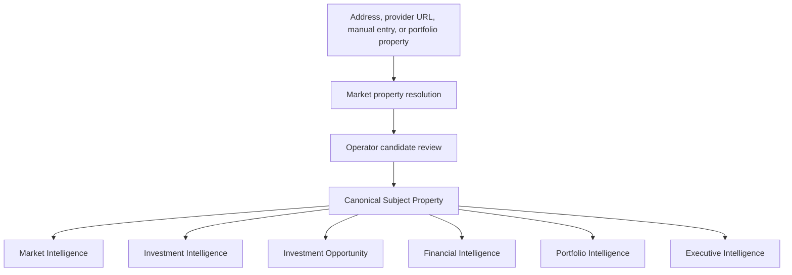

# IW-001 — Canonical Subject Property

## Status

**Status:** Planned  
**Product owner:** Investment Intelligence  
**Domain authority:** Shared Platform Property Identity  
**Epic:** IW-001 — Investment Decision Workspace  
**Depends on:** Market Intelligence property resolution and canonical Platform Observations

## Purpose

Establish one durable, provider-neutral representation of the physical property
under evaluation.

Every Investment Intelligence workflow, Market Intelligence lookup, underwriting
analysis, comparable search, financial projection, opportunity, and later
portfolio-acquisition workflow must reference a Canonical Subject Property rather
than a provider DTO or transient UI form.

The Subject Property describes what the physical asset is. It does not describe
how the asset will be acquired, how it may perform, or whether Luxe Haven should
invest.

## Architecture decision

Canonical Subject Property is a shared platform identity boundary initiated by the
Investment Decision Workspace and enriched through Market Intelligence. Investment
Intelligence is the product owner, but it must not become the exclusive domain
owner because Market, Opportunity, Financial, Portfolio, Executive, and Learning
capabilities all require the same identity without depending on Investment
Intelligence.

The existing Market `resolveMarketProperty` boundary remains responsible for
provider search, candidate normalization, ambiguity, and provider failures. Its
`MarketProperty` result becomes a resolution/enrichment input to the canonical
property boundary; it is not a second durable property authority.

The existing `InvestmentOpportunity` remains the aggregate root for opportunity
workflow, route, ownership, and saved analysis versions. It references a Subject
Property ID and never owns a copy of the mutable current property profile.



## Goals

The capability must:

- provide one durable property identity regardless of discovery path;
- separate physical facts from market estimates, assumptions, and calculations;
- preserve the evidence and provenance supporting every adopted provider fact;
- preserve conflicting observations without silently overwriting them;
- support incremental, auditable enrichment;
- remain stable when providers are added, replaced, or removed;
- support point-in-time property revisions for reproducible analysis;
- provide a shared subject reference for all later investment workflows.

## Non-goals

The Canonical Subject Property does not:

- calculate or own revenue, expenses, cash flow, valuation, return, or forecasts;
- determine scores, confidence in an investment, recommendations, or decisions;
- own underwriting assumptions or scenarios;
- own market observations or comparable properties;
- own purchase, arbitrage, co-host, or operating-strategy terms;
- own opportunity lifecycle, ownership workflow, acquisition status, or portfolio
  membership;
- expose provider-specific DTOs to downstream capabilities;
- merge a subject property with every listing found at the same address.

Those concerns belong to Market Intelligence, Investment Intelligence, Investment
Opportunity, Financial Intelligence, or Portfolio Intelligence as appropriate.

## Core invariants

1. The Subject Property ID is generated by Luxe Haven and never derived from an
   external identifier, address, or coordinate.
2. Identity is stable. Enrichment creates a new immutable revision under the same
   Subject Property ID.
3. Historical revisions and evidence are append-only. The current profile is a
   projection of the latest accepted revision.
4. Every provider-sourced adopted value references the observation or evidence
   supporting it.
5. Conflicting observations remain available after resolution.
6. A provider reference never becomes canonical identity.
7. Financial estimates and investment conclusions cannot be stored as physical
   property facts.
8. Analyses persist the Subject Property ID and revision used, so later enrichment
   never changes a historical result.
9. Tenant/workspace authorization is resolved before property data, evidence, or
   references are returned.
10. Provider enrichment is idempotent for the same provider record, retrieval, and
    mapping version.

## Aggregate model

```text
Canonical Subject Property
├── Stable Identity
├── Current Adopted Profile
│   ├── Canonical Address
│   ├── Coordinates
│   ├── Physical Characteristics
│   └── Amenities
├── External References
├── Fact Resolutions
├── Completeness Projection
└── Revision and Enrichment History
```

The aggregate is immutable by revision, not frozen forever. A command loads the
current revision, validates new evidence and resolution decisions, and appends a
new revision. Existing revisions are never mutated.

## Identity

### Required

- Subject Property ID;
- workspace/tenant scope;
- canonical address;
- latitude and longitude;
- property type;
- revision number;
- created timestamp;
- last-enriched timestamp;
- created-by actor or system reference.

The Subject Property ID must never depend on:

- RentCast, RealtyAPI, AirDNA, AirROI, Mashvisor, BNBCalc, MLS, Airbnb,
  Vrbo, Realtor, Redfin, Zillow, or county identifiers;
- formatted address text;
- latitude/longitude or geohash;
- Investment Opportunity or analysis IDs.

Provider and public-record identifiers are external references. Opportunity,
analysis, scenario, and portfolio records reference the Subject Property ID.

### Duplicate prevention

Creation must perform a scoped duplicate check using normalized address, unit,
coordinates, parcel references when present, and existing external references.
Potential matches produce an explicit candidate-selection or merge-review state;
provider ordering or first-match behavior is prohibited.

Merging two durable Subject Property IDs is a separately authorized future
capability. IW-001 must prevent casual destructive merges.

## Canonical address

Required address fields:

- street;
- unit when materially part of identity;
- city/locality;
- state/region;
- postal code;
- country code;
- formatted display value;
- normalization version.

The original submitted address, provider-returned address, and canonical normalized
address remain distinct and auditable. Normalization must not discard unit,
directional, numbered-street, locality, region, postal, or country distinctions
that could change identity.

## Coordinates

Required coordinate fields:

- latitude;
- longitude;
- coordinate source;
- retrieval/effective timestamp;
- confidence or accuracy when supplied;
- transformation version.

Derived location projections may include:

- geohash;
- timezone;
- administrative or market boundaries.

Geohash and timezone are derived/versioned projections, not identity. Coordinates
support comparable search, distance, mapping, and market lookup, but they may be
superseded by a later accepted observation. Historical coordinate evidence remains
preserved.

## Physical characteristics

Supported facts include:

- property type;
- bedrooms;
- bathrooms;
- sleeps/accommodates;
- square feet;
- lot size;
- stories;
- year built;
- parking characteristics;
- pool;
- hot tub;
- waterfront;
- view characteristics;
- pet suitability;
- other versioned canonical amenities.

Each physical fact is represented by:

- a current adopted value or explicit unresolved/missing state;
- a reference to its adopted observation;
- all material competing observations;
- a resolution status;
- the resolution method and actor/policy;
- resolved timestamp;
- canonical unit and transformation version.

Estimated value, taxes, purchase price, rent, ADR, occupancy, RevPAR, revenue,
expenses, and returns are not physical characteristics.

## Workflow and acquisition context

Purchase, rental arbitrage, existing-property, co-host, and unknown are valid
Investment Decision Workspace intents, but they are not facts about the physical
property.

Acquisition context must be stored on the workspace command, analysis, or
Investment Opportunity and reference the Subject Property ID. It must not be
embedded in the Canonical Subject Property aggregate. This permits the same
property to be evaluated concurrently under multiple strategies without changing
its identity.

Ownership context and portfolio membership are likewise separate relationships.
The Subject Property may expose relationship references in a composed read model,
but does not own them.

## External references

A Subject Property may have zero or more typed external references, including:

- RentCast;
- RealtyAPI plus the origin provider;
- MLS;
- Airbnb;
- Vrbo;
- Realtor;
- Redfin;
- Zillow;
- county parcel;
- Internal Portfolio;
- future providers qualified through MI-002.

Each reference stores:

- intermediary/provider;
- origin source when different;
- external identifier;
- reference type (`property`, `parcel`, `listing`, or `portfolio-property`);
- URL when permitted;
- first-seen and last-verified timestamps;
- active, inactive, superseded, or disputed status;
- resolution confidence and method;
- evidence reference;
- mapping version.

Listing identifiers do not prove physical-property identity by themselves. Multiple
Airbnb or Vrbo listings may refer to the same property, and one building address
may contain multiple units. Reference attachment requires explicit identity
evidence.

## Provenance and canonical Observations

Every provider or internal fact enters through a canonical Observation or a
provider-neutral evidence record suitable for conversion to one. At minimum it
preserves:

- origin source;
- delivery intermediary;
- provider record and field reference;
- retrieved timestamp;
- effective timestamp or range when known;
- reported, modeled, derived, or manually asserted method;
- provider confidence and methodology when supplied;
- Luxe Haven confidence assessment separately;
- transformation/mapping version;
- permitted immutable evidence reference or digest;
- actor for manual assertion or resolution.

Provider confidence, identity-resolution confidence, fact confidence, completeness,
and underwriting confidence are distinct concepts and must not be collapsed into
one score.

Example:

```text
Observation type: property.bedrooms
Value: 4
Subject: subject-property-123
Origin source: Realtor
Delivery intermediary: RealtyAPI
Retrieved: 2026-08-12T15:00:00Z
Effective: unknown
Method: reported
Transformation: realtyapi-realtor-property.v1
Luxe Haven confidence: high
```

## Conflict resolution

If providers disagree, the aggregate preserves every observation and records a
separate resolution:

```text
RentCast observation: bedrooms = 3
RealtyAPI/Realtor observation: bedrooms = 4
Manual verified observation: bedrooms = 4

Adopted value: 4
Resolution method: operator-verified
Supporting observation: manual verified observation
Competing observations: retained
```

Resolution policies may consider source fitness, effective date, freshness,
specificity, direct verification, and prior reconciliation performance. They must
not use provider order as a tie-breaker or silently overwrite a value.

Automatic resolution is permitted only through a versioned deterministic policy.
Manual correction creates a new attributable observation and resolution; it does
not erase provider evidence.

## Completeness and readiness

Completeness is a deterministic, versioned projection over the current adopted
profile. It is not provider confidence and does not prove underwriting quality.

Required sections:

- identity;
- location;
- physical characteristics;
- amenities;
- external references.

Each section reports:

- `complete`, `partial`, `missing`, `conflicted`, or `not-applicable`;
- required and present fields;
- blocking and material gaps;
- policy version;
- evaluated timestamp.

A percentage may be shown only when its numerator, denominator, field weights, and
policy version are explicit. Underwriting readiness is a separate route-specific
policy that consumes completeness, Market evidence, and required assumptions.

## Enrichment history

Properties are not recreated when new evidence arrives:

```text
Create from normalized address
  → RentCast enrichment
  → RealtyAPI/Realtor enrichment
  → operator verification
  → Airbnb listing attachment
  → Internal Portfolio actual relationship
```

Every enrichment event records:

- event ID;
- Subject Property ID;
- prior and resulting revision;
- provider/source;
- request or operation reference;
- added observations and external references;
- resolution changes;
- actor or system;
- occurred timestamp;
- mapping and policy versions;
- idempotency key.

Historical analyses remain linked to the exact property revision they used.

## Workflows

### Address search

```text
Address entry
  → normalize address
  → provider search
  → candidate matches
  → operator selects or rejects
  → review normalized property
  → create Canonical Subject Property
  → Market Intelligence
  → Investment Intelligence
```

### Manual creation

```text
Manual entry
  → normalize and validate
  → duplicate-candidate check
  → review
  → create Canonical Subject Property
  → optional later enrichment
```

### Provider URL

```text
Provider URL
  → provider adapter lookup
  → identity candidate resolution
  → review
  → create or attach to Canonical Subject Property
```

Provider-URL discovery is future scope until a qualified adapter exists.

### Existing portfolio property

```text
Authorized Internal Portfolio property
  → resolve canonical relationship
  → create or select Canonical Subject Property
  → capture current property revision
  → re-underwrite without changing portfolio actuals
```

## Validation

Required before durable creation:

- valid workspace/tenant authorization;
- valid canonical address;
- valid latitude and longitude;
- supported or explicit canonical property type;
- stable Subject Property ID;
- deterministic duplicate-candidate check;
- operator confirmation for ambiguous provider matches;
- provenance for provider-sourced required facts.

Recommended:

- bedrooms;
- bathrooms;
- unit resolution where relevant.

Optional:

- square footage;
- lot size;
- year built;
- parking;
- sleeps;
- amenities;
- external listing references.

Invalid provider authentication, rate limiting, timeout, unavailable service, or
malformed response is not `not found` and must not silently fall back to manual
facts.

## Application commands

The capability requires provider-neutral commands equivalent to:

- `searchSubjectPropertyCandidates`;
- `createSubjectPropertyFromCandidate`;
- `createSubjectPropertyManually`;
- `reviewSubjectProperty`;
- `enrichSubjectProperty`;
- `resolveSubjectPropertyFact`;
- `attachExternalPropertyReference`;
- `getSubjectPropertyRevision`;
- `getCurrentSubjectProperty`.

Names are illustrative until implementation design. Commands require authenticated
workspace scope, command/idempotency identity, expected aggregate revision for
mutation, deterministic clock/ID context, and explicit actor.

## Persistence requirements

Persistence must support:

- stable subject-property identity and workspace scope;
- append-only property revisions;
- append-only observations/evidence or stable references to canonical Platform
  Observations;
- adopted fact resolutions;
- typed external references;
- append-only enrichment history;
- optimistic concurrency;
- idempotent commands;
- tenant-scoped authorization and row-level security;
- point-in-time reconstruction;
- no ordinary deletion of historical evidence used by an analysis.

Raw provider payload retention must follow provider terms and MI-002. When payload
retention is prohibited, preserve permitted field-level facts, metadata, and a
digest/source reference sufficient for audit.

## Integrations

### Consumes

- Market Intelligence property-resolution candidates;
- qualified provider adapters;
- address normalization/geocoding;
- canonical Platform Observations and evidence;
- authorized Internal Portfolio property identity.

### Provides

- Market Intelligence subject identity;
- Investment Intelligence subject and exact revision;
- Investment Opportunity durable property reference;
- Financial Intelligence property scope;
- Portfolio Intelligence property relationship;
- Executive Intelligence drill-down identity;
- Learning Intelligence outcome-to-subject lineage.

Downstream capabilities consume the public Subject Property contract or a
capability-owned projection. They must not import provider DTOs, resolution
internals, or persistence models.

## Migration from current contracts

IW-001 must reconcile, not duplicate, existing property concepts:

| Existing contract | IW-001 treatment |
|---|---|
| `MarketPropertyResolutionResult` | Retain as provider search/resolution result |
| `MarketProperty` | Treat as provider-neutral resolution/enrichment input and transitional projection |
| `PropertyRecord` | Keep infrastructure-normalized compatibility model until adapters migrate |
| Investment workspace address state | Treat as command input only |
| `InvestmentOpportunity.propertyIdentity` | Migrate/reference stable Subject Property ID |
| Saved analysis property data | Preserve immutable snapshot plus Subject Property ID/revision |
| Operational `properties` record | Relate through explicit Internal Portfolio reference; do not assume identity |
| `CanonicalPropertyProjection` | Retain as operational/guest read model, not Subject Property authority |

No big-bang rename is required. Compatibility adapters may project the Canonical
Subject Property into current Market and Investment contracts while callers
migrate.

## Acceptance criteria

A user can:

- manually create a canonical property after validation and duplicate review;
- search by address and review normalized provider candidates;
- explicitly choose among ambiguous candidates;
- review the adopted property profile and material gaps before underwriting;
- persist a Subject Property whose ID is independent of every provider;
- enrich it with new observations without changing its ID;
- preserve provider/origin references, provenance, conflicts, and resolutions;
- attach multiple typed listing references without conflating listing and property
  identity;
- use the same Subject Property across analyses, scenarios, opportunities, and
  authorized portfolio workflows;
- reproduce a historical analysis from the Subject Property revision it used.

The implementation proves that:

- provider DTOs do not cross the Market Infrastructure boundary;
- acquisition strategy is not stored as a physical property fact;
- enrichment appends a revision and never mutates historical revisions;
- conflicting evidence is retained after an adopted value is selected;
- completeness and the underwriting-readiness decision are distinct;
- provider failure cannot be misreported as property not found;
- authorization precedes reads and writes;
- optimistic concurrency and idempotency prevent lost or duplicate enrichment;
- replacing a provider requires an adapter and mapping, not downstream rewrites.

## Required implementation sequence

1. Confirm shared ownership, naming, identifiers, and compatibility boundaries in
   an architecture decision.
2. Define the domain contracts, revision semantics, fact-resolution policy,
   external-reference types, and completeness projection.
3. Define repository and authorization ports.
4. Implement persistence, concurrency, idempotency, and point-in-time reads.
5. Adapt current Market property resolution into candidate creation/enrichment.
6. Add manual creation, review, ambiguity, and conflict-resolution workflows.
7. Migrate Investment Workspace and Opportunity references.
8. Add provider enrichment behind MI-002-qualified adapters.
9. Add architecture, domain, persistence, authorization, and end-to-end tests.

Provider expansion, underwriting changes, and new financial calculations are not
part of IW-001.

