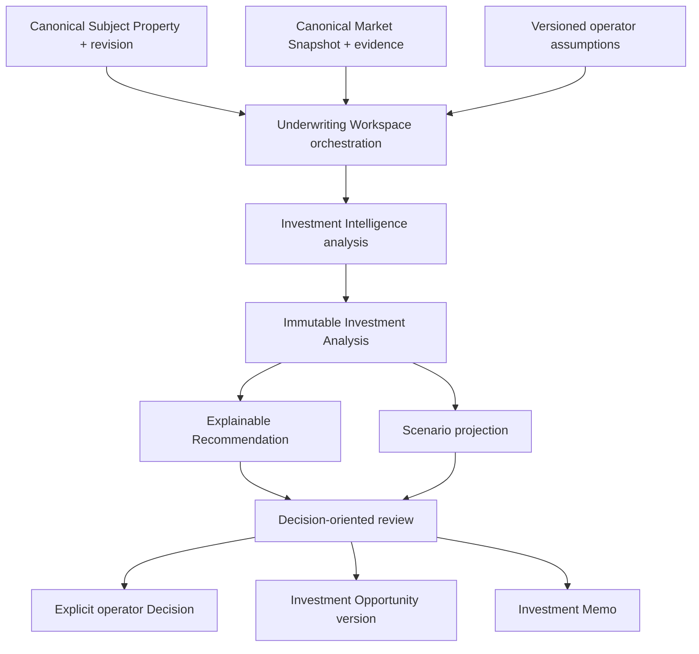

# IW-002 — Investment Underwriting Workspace

## Status

**Status:** Planned  
**Owner:** Investment Intelligence  
**Epic:** IW-001 — Investment Decision Workspace  
**Depends on:** IW-001 Canonical Subject Property, canonical Market analysis and snapshots, Investment analysis orchestration, Investment Opportunity, scenarios, and Platform reporting

## Purpose

Provide one decision-oriented workspace where an investor can evaluate a Canonical
Subject Property, generate underwriting analyses, compare supported hospitality
strategies and scenarios, inspect evidence, and make or record an acquisition
decision.

The workspace orchestrates Canonical Subject Property, Market Intelligence,
Financial Intelligence, Investment Intelligence, Investment Opportunity, and
reporting. It owns workflow and presentation composition—not calculations,
canonical facts, provider integration, or decision policy.

The workspace answers:

> Should we invest in this property, under which supported strategy, and why?

IW-001 answers the separate question:

> What physical property are we evaluating?

## Experience principles

1. Lead with the recommendation and its rationale, then allow progressive
   disclosure into metrics and calculations.
2. Never present a conclusion without evidence, confidence, freshness, and material
   gaps.
3. Preserve the distinction between property facts, market evidence, operator
   assumptions, calculated outputs, recommendations, and operator decisions.
4. Make scenario tradeoffs visible; do not reduce comparison to one winning number.
5. Preserve every generated analysis as an immutable, point-in-time artifact.
6. Allow draft refinement without rewriting historical analyses.
7. Keep provider names and failures behind provider-neutral Market contracts except
   where provenance or operator diagnostics legitimately require attribution.
8. Prefer explicit insufficient-evidence states over fabricated completeness.

## Architecture boundary



The diagram shows experience composition, not a new calculation pipeline. The
workspace calls existing application services and renders their returned canonical
artifacts. It does not reconstruct formulas in React, server actions, or workspace
reducers.

## Goals

The workspace must:

- guide an investor through a complete supported underwriting process;
- present recommendation, confidence, evidence, and risk before calculation detail;
- support multiple scenarios for the same Subject Property;
- compare only semantically compatible strategies and metrics;
- preserve immutable analysis, assumption, evidence, policy, and lineage snapshots;
- support draft save/resume separately from completed analysis history;
- make changes between analyses and recommendations explainable;
- scale from explicit manual inputs to qualified provider-backed evidence;
- save a selected analysis into Investment Opportunity without rerunning it;
- produce a versioned investment memorandum from a saved immutable source.

## Non-goals

The workspace does not:

- calculate financial, market, comparable, score, confidence, or recommendation
  values;
- own Market Snapshots or refresh providers directly;
- own provider adapters, retry policy, or credentials;
- own canonical property identity or physical facts;
- own formula, tax, financing, or recommendation policy;
- create synthetic evidence or fill unsupported data silently;
- mutate a historical analysis when assumptions or market evidence change;
- treat an engine recommendation as an operator Decision;
- implement unsupported investment strategies merely by adding UI labels.

## Canonical orchestration

```text
Canonical Subject Property revision
  → Canonical Market Snapshot
  → Versioned Underwriting Assumptions
  → Investment Analysis
  → Explainable Recommendation
  → Scenario Comparison
  → Explicit operator Decision and/or Save Opportunity
```

Execution order and presentation order are intentionally different. Revenue,
expenses, returns, risks, evidence, score, and confidence must be calculated before
the recommendation can be produced. The UI presents the completed recommendation
before showing detailed calculations.

## Supported scope and strategy evolution

The repository currently has canonical analysis support for:

- purchase;
- rental arbitrage.

Initial IW-002 implementation must use those existing discriminated routes and
their canonical outputs.

The desired strategy vocabulary includes:

- short-term rental;
- medium-term rental;
- long-term rental;
- co-host;
- house hack.

These are future strategy routes or operating models. Each requires an approved
domain contract, assumptions, formulas, evidence requirements, risk policy,
recommendation policy, tests, and comparable metric semantics before becoming
selectable. A label in the workspace must never stand in for a real engine.

Within a supported route, the current scenario types—such as base, optimistic,
conservative, cash purchase, seller financing, leveraged purchase, rental
arbitrage, renovation, value-add, and custom—remain scenario variants rather than
new property identities.

## Primary user stories

### Evaluate a property

As an investor, I can evaluate one Canonical Subject Property in one workspace so I
do not need to move between disconnected calculators.

### Understand the recommendation

As an investor, I can see why the platform recommends an outcome, the strongest
supporting evidence, the largest risk, confidence, freshness, and the next useful
action.

### Compare strategies and scenarios

As an investor, I can compare supported operating strategies and assumption
scenarios using compatible metrics and shared point-in-time evidence.

### Save progress

As an investor, I can save a draft and resume it without converting incomplete work
into an immutable completed analysis.

### Compare analyses

As an investor, I can compare immutable historical analyses and understand whether
property facts, market evidence, assumptions, policies, calculations, risk,
confidence, or recommendations changed.

## Workspace stages

IW-002 composes the existing application stages into this user-facing flow:

1. property setup;
2. property resolution and review;
3. market acquisition and review;
4. assumption configuration;
5. readiness review;
6. investment analysis;
7. decision review;
8. scenario comparison;
9. opportunity save, memo export, or archive.

The current application stage vocabulary—`setup`, `resolving-property`,
`property-review`, `running-market-analysis`, `market-review`,
`configuring-investment`, `running-investment-analysis`, `decision-review`, and
`error`—remains the initial orchestration contract unless changed in a separately
approved compatibility batch.

## Workspace layout

```text
Property Summary
Recommendation
Supporting Evidence
Investment Scorecard
Key Financial Metrics
Strategy and Scenario Comparison
Assumptions
Market Intelligence
Risks and Mitigations
Activity
```

The hierarchy intentionally answers “Should I invest?” before “Show me every
calculation.” Accessibility, mobile behavior, loading, empty, degraded, stale, and
error states are part of each section rather than separate pages.

## 1. Property Summary

Displays:

- Canonical Subject Property ID and pinned revision;
- canonical address, image when permitted, and location;
- adopted physical characteristics;
- acquisition route/workspace intent;
- completeness and blocking gaps;
- enrichment freshness;
- provider/source coverage summarized without implying authority.

Actions:

- review or request a property correction;
- enrich the current property through qualified Market adapters;
- refresh market evidence;
- view property evidence and conflicts.

Editing an adopted property fact is an IW-001 command that creates a new property
revision. It does not mutate the revision pinned by a historical analysis.

## 2. Recommendation

The primary decision card displays:

- canonical recommendation status and summary;
- confidence in the recommendation using the engine’s native vocabulary;
- analysis status (`complete`, `partial`, or `degraded`);
- top supporting evidence;
- largest material risk or evidence gap;
- freshness;
- recommended next action;
- link to the full rationale.

The workspace must render the canonical recommendation contract. It must not invent
a second recommendation enum. The current customer-facing projection supports:

- strong opportunity;
- opportunity;
- proceed with conditions;
- needs investigation;
- high risk;
- do not proceed;
- insufficient evidence.

Presentation copy such as “Proceed,” “Monitor,” or star ratings may be introduced
only as a documented, tested projection of the canonical status. A star graphic
must not replace the underlying score, recommendation, confidence, or explanation.

No detailed calculations appear in the primary card, but every recommendation must
link to the calculations and evidence that produced it.

## 3. Supporting Evidence

Evidence categories:

- property;
- market;
- comparable;
- financial;
- portfolio;
- assumptions;
- applied Learning when eligible.

Each evidence item displays or links to:

- evidence ID;
- supported or challenged claim;
- source and origin/intermediary lineage;
- retrieved and effective time;
- confidence and method;
- supporting Observation IDs;
- applicable Subject Property and revision;
- Market Snapshot and analysis lineage;
- freshness, gaps, conflicts, and substitutions.

Provider confidence, evidence confidence, recommendation confidence, and
completeness remain distinct.

## 4. Investment Scorecard

The scorecard renders only canonical score components returned by Investment
Intelligence, currently including:

- revenue;
- financial;
- market;
- competitive position;
- risk;
- overall investment score.

Every component shows its weight, explanation, and evidence link. Market,
financial, risk, or confidence scores not returned by a canonical contract must
display as unavailable rather than be reconstructed in presentation.

Confidence is not automatically a numeric score. If the canonical engine returns a
level, the workspace renders the level; numeric presentation requires a separately
owned and versioned mapping.

## 5. Key Financial Metrics

Where supported by the selected route, the read-only metrics include:

### Revenue

- ADR;
- occupancy;
- RevPAR;
- annual revenue;
- seasonality or monthly revenue projection.

### Expenses

- operating expenses;
- mortgage or proposed lease;
- utilities;
- cleaning;
- taxes;
- insurance;
- management.

### Returns

- NOI;
- cash flow;
- cap rate;
- cash-on-cash return;
- ROI;
- break-even occupancy.

The workspace displays the value, unit, time horizon, source calculation/policy
version, and unavailable state. It never calculates a missing metric from other
displayed values.

## 6. Strategy and Scenario Comparison

One Canonical Subject Property may have many analyses and scenarios. Every
comparison item references:

- the same Subject Property ID;
- the exact Subject Property revision used;
- a Market Snapshot ID/version;
- a supported acquisition/operating route;
- a versioned assumption set;
- an immutable analysis or scenario snapshot;
- policy and engine versions.

Scenarios intended for controlled assumption comparison should share the same
Subject Property revision and Market Snapshot. A market refresh creates a new
snapshot and new analysis baseline; it never replaces evidence in existing
scenarios.

The comparison displays, when semantically compatible:

| Strategy/scenario | Annual revenue | NOI | Cash-on-cash | Risk | Recommendation |
|---|---:|---:|---:|---|---|
| Candidate A | Canonical value | Canonical value | Canonical value | Canonical value | Canonical value |
| Candidate B | Canonical value | Canonical value | Canonical value | Canonical value | Canonical value |

It also shows:

- changed assumptions;
- evidence and snapshot differences;
- financial differences;
- benefits and tradeoffs;
- recommendation and confidence differences;
- unavailable or non-comparable metrics.

Cross-route comparison requires a compatibility policy. The workspace must not rank
purchase and arbitrage, or future STR/MTR/LTR/co-host/house-hack routes, using a
metric whose definition, capital basis, time horizon, or risk semantics differ.

## 7. Assumptions

Editable categories include route-supported fields such as:

### Acquisition

- purchase price or proposed lease;
- down payment;
- interest rate;
- closing costs;
- financing terms.

### Operations

- cleaning;
- utilities;
- insurance;
- taxes;
- management;
- maintenance and route-supported costs.

### Revenue

- occupancy;
- ADR;
- seasonality overrides;
- other route-supported revenue assumptions.

Each committed assumption change creates a new draft assumption version with:

- assumption key and typed value;
- source (`operator`, approved Learning, Market, or default);
- prior value/reference;
- actor;
- changed timestamp;
- reason when required;
- applicable route;
- validation and unit;
- provenance and evidence when not operator-authored.

UI keystrokes do not create durable versions. A committed valid change does.
Generating an analysis freezes the exact assumption version into the immutable
analysis. Editing afterward creates a new draft and never changes the completed
analysis.

## 8. Market Intelligence

Displays the canonical Market analysis/snapshot and its:

- property resolution;
- qualified comparables;
- market trends;
- ADR, occupancy, supply, demand, and revenue evidence when supported;
- valuation and long-term rent where supported;
- confidence, risks, and gaps;
- freshness and time-horizon fitness;
- provider/origin lineage;
- link to the Market Intelligence detail.

Unsupported metrics are explicit. Long-term rent is not ADR, sale valuation is not
purchase price, and provider listing availability is not booked occupancy.

`Refresh Market Data` invokes the authenticated Market application boundary. A
successful refresh creates a new Market analysis/snapshot. Existing analyses retain
their prior Market snapshot and evidence.

## 9. Risks and Mitigations

Risk categories:

- market;
- operational;
- financial;
- regulatory;
- property;
- evidence/confidence gap.

Each risk includes:

- stable risk ID and category;
- severity;
- likelihood when canonically available;
- explanation;
- evidence and affected assumptions/metrics;
- mitigation or next investigation step;
- owner and status only when owned by an appropriate downstream workflow.

Presentation must not fabricate likelihood or mitigation. A mitigation suggestion
is not an Action until an authorized workflow records it.

## 10. Activity

The activity projection may include:

- workspace draft created or resumed;
- Subject Property selected or revised;
- Market Snapshot refreshed;
- assumption version committed;
- analysis generated;
- scenario duplicated, preferred, superseded, or archived;
- recommendation changed between immutable analyses;
- opportunity saved;
- memo generated;
- explicit Decision recorded;
- analysis archived.

Activity facts are append-only, safe for the viewer’s authorization scope, and
contain references rather than sensitive provider payloads or assumption bodies
when inappropriate.

## Version and immutability model

```text
Draft Workspace
├── Subject Property ID + selected revision
├── selected Market Snapshot
└── current Assumption Version
          │
          ▼ Generate
Immutable Analysis V1
          │
          ├── new assumption draft
          ├── new Market Snapshot
          └── new Subject Property revision
                     │
                     ▼ Generate
Immutable Analysis V2
```

Each analysis preserves:

- analysis and workspace-run identity;
- Subject Property ID and revision;
- Market Snapshot/analysis identity;
- assumption version and source resolution;
- evidence and Observation lineage;
- calculations and route-specific outputs;
- score, risks, recommendation, and confidence;
- engine and policy versions;
- analyzed timestamp and actor.

Historical analysis pages read saved snapshots only. They do not call providers,
refresh evidence, rerun formulas, or adopt later property revisions.

## Lifecycle separation

`Draft → Ready → Recommended → Accepted → Archived` is useful experience language
but must not become one overloaded domain state machine.

IW-002 keeps these lifecycles distinct:

| Concern | Authority | Example states |
|---|---|---|
| Workspace orchestration | IW-002 application | setup, market review, configuring, decision review, error |
| Analysis quality | Investment analysis | complete, partial, degraded |
| Recommendation | Investment Intelligence | strong opportunity through insufficient evidence |
| Scenario | Investment Opportunity scenario | draft, calculated, preferred, archived, superseded |
| Operator Decision | canonical Decision/commitment | accepted, rejected, deferred, superseded as supported |
| Opportunity workflow | Investment Opportunity | evaluating through acquired/rejected |
| Storage visibility | owning aggregate | active or archived |

The workspace composes these states; it does not collapse them.

## Workspace actions

### Initial supported actions

- select or review Canonical Subject Property;
- refresh Market data;
- generate analysis;
- commit assumption version;
- duplicate scenario;
- compare compatible scenarios;
- mark a preferred scenario through the existing scenario workflow;
- save analysis as an Investment Opportunity version;
- generate/export an Investment Memo through Platform reporting;
- archive a draft, scenario, analysis view, or opportunity only through its owning
  capability;
- record an explicit operator Decision when the canonical commitment workflow is
  connected.

### Future actions

- share;
- collaborate;
- request review;
- initiate lender or broker package;
- initiate due diligence;
- ingest documents;
- apply approved AI-assisted assumption recommendations.

Every mutating action is authenticated, authorized, idempotent, concurrency-safe,
and owned by an application command. UI visibility is never authorization.

## Save and resume

Draft persistence and immutable analysis persistence are different:

- a draft stores selected identities, current assumption version, and workflow
  position;
- an analysis stores completed canonical outputs and lineage;
- an Investment Opportunity stores durable workflow plus immutable saved-analysis
  versions.

Saving an analysis as an opportunity uses the existing owner-scoped save boundary
and must not rerun Market or Investment analysis. Resume restores only user-sourced
draft assumptions. It must not hydrate prior Market, default, derived, Learning,
score, confidence, recommendation, or evidence outputs as user inputs.

## Historical comparison and change explanation

Analysis comparison must attribute changes to one or more explicit causes:

- Subject Property revision changed;
- Market Snapshot/evidence changed;
- operator assumption changed;
- approved Learning input changed;
- engine or policy version changed;
- data gap was resolved or introduced;
- source substitution or confidence changed.

The comparison must not claim causality from timestamp alone. When multiple inputs
changed, it reports them separately and identifies attribution as uncertain unless
the engine supplies a supported explanation.

## Investment Memo

The memo is a versioned report projection over a saved immutable analysis or
selected scenario. It includes:

- property and strategy summary;
- recommendation and confidence;
- key evidence and material gaps;
- assumptions;
- financial metrics;
- comparable and Market summary;
- risks and mitigations;
- scenario tradeoffs;
- lineage, freshness, and policy versions;
- explicit operator Decision when recorded.

Export never recalculates the analysis. The report records its source analysis or
scenario version and follows Platform reporting authorization, retention, storage,
and sharing policy.

## Integrations

### Consumes

- IW-001 Canonical Subject Property and revision;
- canonical Market analysis/snapshot and comparable analysis;
- Investment analysis orchestration and decision projection;
- Financial Intelligence snapshots or canonical financial projections where
  semantically applicable;
- Investment Opportunity and scenario application services;
- canonical recommendation, evidence, Decision, and reporting contracts;
- eligible applied Learning through existing source-precedence policy.

### Produces or initiates

- versioned workspace drafts;
- immutable Investment analyses through Investment Intelligence;
- scenarios and comparisons through Investment Opportunity;
- saved Investment Opportunity analysis versions;
- explicit operator Decisions through the commitment boundary;
- Investment Memos through Platform reporting;
- authorized candidate references for Portfolio and Executive projections.

The workspace itself does not directly create Executive Insights, Portfolio
membership, Actions, Outcomes, or Learning. Those are downstream projections or
authorized lifecycle commands.

## Error and degraded-state handling

The workspace preserves canonical failure classes:

- invalid input;
- property not found, ambiguous, or unsupported;
- Market provider unavailable, disabled, or rate limited;
- insufficient Market evidence;
- Investment analysis failure;
- authorization;
- persistence;
- concurrency;
- expired save token;
- duplicate run;
- unexpected failure.

A provider failure is not property-not-found. A partial/degraded analysis remains
visibly partial/degraded. Retrying does not discard the draft. Errors shown to the
client are safe and correlated without exposing credentials, provider payloads, or
stack traces.

## Authorization and tenancy

- authenticate before property, Market, analysis, opportunity, scenario, or report
  reads;
- resolve workspace membership and property scope before loading evidence;
- require owning-capability permissions for every mutation;
- prevent cross-tenant IDs from revealing existence;
- retain owner/actor identity for drafts, analyses, scenarios, decisions, and
  reports;
- keep provider credentials and clients server-side.

## Acceptance criteria

The workspace allows an authorized user to:

- evaluate one Canonical Subject Property and pin the revision used;
- generate a supported purchase or rental-arbitrage analysis;
- review recommendation and rationale before detailed calculations in the UI;
- inspect supporting evidence, sources, confidence, freshness, and material gaps;
- view read-only canonical financial metrics and unavailable states;
- edit route-supported assumptions independently by scenario;
- freeze every generated analysis with its assumptions, evidence, property
  revision, Market snapshot, outputs, and policy versions;
- duplicate and compare compatible scenarios;
- refresh Market evidence without changing historical analyses;
- save and resume a draft without presenting it as a completed analysis;
- save an immutable analysis as an Investment Opportunity without rerunning it;
- compare historical analyses and see the inputs or versions that changed;
- generate an Investment Memo from a saved immutable source;
- archive through the appropriate owning workflow.

The implementation proves that:

- no workspace presentation or server-action module calculates financial metrics,
  scores, confidence, or recommendations;
- recommendation presentation order does not alter calculation dependency order;
- Market Snapshot, Subject Property, provider, and formula ownership remain outside
  the workspace;
- unsupported strategy labels cannot generate analyses;
- assumption edits cannot mutate completed analyses;
- Market refresh creates a new snapshot/baseline and preserves old evidence;
- recommendation and operator Decision remain distinct;
- cross-route comparison requires explicit semantic compatibility;
- provider and authorization failures retain their canonical classifications;
- save, resume, duplicate, refresh, and export operations are idempotent and
  concurrency-safe where applicable.

## Future extensions

The boundary supports:

- collaborative underwriting and review;
- broker and lender packages;
- due-diligence checklists;
- secure document ingestion;
- AI-assisted assumption recommendations subject to approval and provenance;
- additional qualified investment strategies;
- portfolio optimization and acquisition pipeline integration;
- automated monitoring and re-underwriting;
- benchmark comparison with BNBCalc or future MI-002 decision benchmarks without
  importing their conclusions.

## Required implementation sequence

1. Complete or approve IW-001 identity/revision contracts used by the workspace.
2. Characterize existing workspace, recommendation, scenario, opportunity, report,
   and error contracts with tests.
3. Define the draft, assumption-version, readiness, and orchestration contracts.
4. Define the decision-oriented read model using canonical returned artifacts only.
5. Implement property review and Market refresh with immutable snapshot lineage.
6. Implement assumption versioning and analysis generation without formula changes.
7. Compose recommendation-first sections, evidence, metrics, risks, and degraded
   states.
8. Integrate scenario duplication/comparison and semantic compatibility checks.
9. Integrate draft resume, opportunity save, and memo export without reruns.
10. Add authorization, concurrency, idempotency, accessibility, responsive,
    architecture, and end-to-end tests.

New investment strategies, provider selection, formula changes, and recommendation
policy changes require separate requirements and are not implementation shortcuts
within IW-002.

