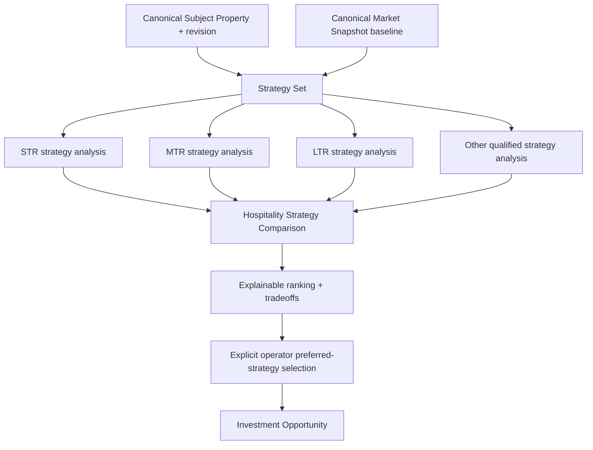

# IW-003 — Hospitality Strategy Comparison

## Status

**Status:** Planned  
**Owner:** Investment Intelligence  
**Epic:** IW-001 — Investment Decision Workspace  
**Depends on:** IW-001 Canonical Subject Property, IW-002 Investment Underwriting Workspace, canonical Market snapshots, strategy-specific analysis engines, Investment Opportunity scenarios, and canonical recommendation/evidence contracts

## Purpose

Evaluate multiple hospitality operating strategies for one Canonical Subject
Property and identify which supported strategy is expected to produce the strongest
overall business outcome.

Strategy Comparison determines how the property may be operated. It does not
determine whether the property exists, acquire market data, or calculate financial
metrics.

The capability compares completed canonical strategy analyses across financial
performance, market fit, operational complexity, risk, confidence, and evidence.
It owns comparison and ranking policy—not the underlying strategy calculations.

## Architecture boundary



The same Subject Property revision and Market Snapshot baseline are pinned for the
comparison. Each strategy consumes only the evidence within that snapshot that is
semantically applicable to its operating model. Shared snapshot identity does not
make STR ADR valid LTR rent evidence or long-term vacancy valid booked STR
occupancy.

## Goals

The capability must:

- compare supported hospitality strategies using the same Subject Property revision
  and point-in-time Market evidence baseline;
- isolate strategy-specific assumptions, calculations, risks, and evidence use;
- present decision tradeoffs rather than isolated revenue projections;
- distinguish financial performance from operational burden and evidence quality;
- explain recommendations and ranking without hiding them behind one score;
- preserve immutable strategy analyses, comparisons, and preference history;
- support sensitivity comparison without mutating source analyses;
- allow new strategy types through versioned contracts rather than comparison
  rewrites;
- support future AI-proposed strategies only after explicit review and validation.

## Non-goals

Hospitality Strategy Comparison does not:

- own Canonical Subject Property or property enrichment;
- own or refresh Market Snapshots;
- call market-data providers or select providers;
- calculate revenue, expenses, returns, risk, confidence, or recommendations;
- import provider-specific models or DTOs;
- invent unsupported strategy analyses;
- convert a ranked result into an operator Decision automatically;
- add a property to a portfolio or acquisition pipeline automatically;
- compare semantically incompatible values as though they were equivalent.

## Core invariants

1. Every strategy candidate references the same Subject Property ID and revision.
2. Every candidate references the same Market Snapshot baseline ID/version.
3. Each candidate records the subset of Market evidence it used, ignored, or found
   insufficient.
4. Strategy-specific assumptions cannot leak into another strategy.
5. Comparison consumes immutable analysis outputs and never recalculates them.
6. A new comparison version is created when candidates, evidence baseline,
   assumptions, analysis outputs, or comparison policy change.
7. Prior comparisons and preferred-strategy selections remain immutable and
   auditable.
8. Ranking is deterministic for the same inputs and policy versions.
9. Highest projected revenue alone can never determine the winner.
10. Automatic ranking cannot create an accepted Decision, opportunity transition,
    Action, or portfolio membership.

## Canonical model

```text
Hospitality Strategy Comparison
├── Comparison Identity and Version
├── Canonical Subject Property Reference
├── Market Snapshot Baseline
├── Strategy Set
│   ├── Strategy Definition Reference
│   ├── Assumption Version
│   ├── Canonical Analysis Reference
│   ├── Applicable Evidence Set
│   ├── Recommendation and Confidence
│   └── Sensitivity References
├── Compatibility Assessment
├── Dimension Comparisons
├── Explainable Ranking
├── Tradeoffs and Data Gaps
└── Preferred-Strategy Selection History
```

## Shared comparison baseline

Every candidate shares:

- Canonical Subject Property ID and exact revision;
- canonical address and geographic context from that revision;
- Market Snapshot ID, version, effective period, and freshness;
- comparable-observation collection available at comparison creation;
- property characteristics;
- comparison currency and annualization policy;
- comparison generated time;
- comparison and compatibility policy versions.

The baseline is immutable within one comparison version.

### Applicable evidence subsets

Strategies do not necessarily use identical observations. The snapshot may contain
multiple evidence families:

- STR nightly rates, calendars, occupancy, RevPAR, and STR comparables;
- MTR monthly rates, typical stays, vacancy, and MTR comparables;
- LTR monthly rent, lease vacancy, concessions, and LTR comparables;
- sale valuation and acquisition comparables;
- regulatory, seasonality, supply, demand, and operating-cost evidence.

Each strategy analysis records:

- evidence IDs consumed;
- evidence IDs rejected as semantically inapplicable;
- substitutions and derivations;
- blocking or material gaps;
- time-horizon fitness;
- confidence impact.

“Same Market Snapshot” therefore means the same immutable evidence envelope and
retrieval baseline—not that every strategy uses every observation.

## Strategy definition

A versioned Strategy Definition contains:

```text
Strategy Definition
├── Strategy Type and Version
├── Name and Description
├── Operating Model
├── Required Property Facts
├── Required Market Evidence
├── Revenue Assumption Contract
├── Expense Assumption Contract
├── Operational Profile Contract
├── Risk Policy Reference
├── Confidence Policy Reference
├── Analysis Engine Reference
├── Recommendation Policy Reference
└── Comparison Metric Semantics
```

Strategy definitions are versioned independently from analyses. Updating a
definition never changes a historical strategy analysis or comparison.

To become executable, a strategy definition must have:

- a stable type and version;
- typed and validated assumptions;
- a canonical analysis engine;
- explicit formulas and units owned outside comparison;
- required evidence and insufficient-evidence behavior;
- risk, confidence, and recommendation policies;
- comparable metric semantics;
- characterization and policy tests;
- migration and deprecation rules.

## Target strategy catalog

The target catalog includes:

- short-term rental (STR);
- medium-term rental (MTR);
- long-term rental (LTR);
- rental arbitrage;
- owner-occupied/house hack;
- co-hosting;
- boutique hospitality.

Additional candidates may include executive rental, corporate housing, medical
travel, traveling nurses, student housing, event-focused operations, and hybrid
seasonal strategies.

### Initial implementation constraint

The repository currently has canonical engines only for:

- purchase;
- rental arbitrage.

Existing scenario variants can be compared only within their supported route. STR,
MTR, LTR, co-host, house-hack, boutique, and hybrid strategies remain target
catalog entries until each passes the executable Strategy Definition gate.

IW-003 must not implement those strategies by relabeling a purchase or rental
arbitrage result. Cross-strategy ranking begins only when at least two compatible,
independently implemented strategy engines exist.

## Strategy-specific inputs

Every strategy owns a separate, versioned assumption set.

### Revenue

- rate grain appropriate to the strategy;
- ADR or monthly rent where semantically applicable;
- occupancy or vacancy with explicit denominator;
- length of stay or lease term;
- seasonality;
- booking/channel mix;
- concessions, discounts, and cancellation behavior;
- ancillary revenue where supported.

### Expenses

- cleaning and turnover;
- utilities;
- furnishings and replacement;
- maintenance;
- management or co-host fees;
- supplies;
- platform/channel fees;
- licensing and permits;
- insurance;
- staffing and contracted operations;
- strategy-specific reserves.

### Operations

- self-managed;
- third-party managed;
- co-host operated;
- owner occupied;
- staffed hospitality;
- automation assumptions;
- service-level and guest-experience requirements.

### Risk

- seasonality;
- regulatory exposure;
- vacancy or occupancy sensitivity;
- operational complexity;
- staffing;
- guest turnover;
- channel or revenue concentration;
- property suitability;
- evidence weakness.

Changing one strategy’s assumptions creates a new assumption version for that
strategy only. It does not alter another strategy or a prior analysis.

## Required strategy-analysis contract

Comparison accepts only canonical, immutable strategy-analysis results containing:

- strategy type and definition version;
- Subject Property ID and revision;
- Market Snapshot baseline and applicable evidence IDs;
- assumption version;
- revenue, expense, and return outputs with units and periods;
- operational-profile outputs;
- risks;
- confidence and methodology;
- canonical recommendation and rationale;
- data gaps and substitutions;
- engine, calculation, risk, confidence, score, and recommendation policy versions;
- analyzed timestamp and lineage.

Missing outputs remain unavailable. Comparison does not derive them from other
fields.

## Comparison compatibility gate

Before comparison, every candidate pair must pass:

### Identity compatibility

- same workspace/tenant authorization;
- same Subject Property ID;
- same Subject Property revision;
- same Market Snapshot baseline.

### Time compatibility

- compatible effective periods;
- same comparison/annualization horizon or an approved conversion;
- compatible currency date and inflation assumptions where applicable.

### Metric compatibility

- same canonical metric identifier;
- same unit, numerator, denominator, and timing;
- same capital basis for return metrics;
- same treatment of financing, taxes, owner labor, and reserves;
- same gross/net revenue boundary.

### Evidence compatibility

- required evidence family available or explicit data gap;
- evidence not repurposed across incompatible strategies;
- freshness and time-horizon fitness within strategy policy;
- substitutions visible.

### Policy compatibility

- supported engine and schema versions;
- comparable risk and confidence semantics;
- recognized recommendation mapping;
- approved comparison policy.

A failed gate produces a specific `not-comparable` or `partially-comparable` state
with reasons. It never produces a misleading rank.

## Comparison dimensions

The capability compares multiple dimensions independently.

### Financial performance

Where canonically available and compatible:

- annual revenue;
- NOI;
- cash flow;
- cap rate;
- cash-on-cash return;
- ROI;
- payback period;
- break-even occupancy or vacancy;
- initial cash required;
- downside cash flow.

### Market fit

- comparable alignment;
- evidence coverage;
- demand strength;
- seasonality;
- market maturity;
- supply competition;
- property/strategy suitability;
- regulation fit;
- time-horizon fitness.

### Operational complexity

- turnover frequency;
- cleaning intensity;
- guest or tenant communication;
- staffing requirements;
- maintenance burden;
- channel management;
- licensing/compliance burden;
- owner involvement;
- automation potential.

Operational complexity must come from a versioned strategy policy or canonical
operational assessment. The comparison UI must not assign arbitrary points.

### Risk

- financial;
- market;
- operational;
- regulatory;
- property suitability;
- evidence and confidence gaps;
- concentration and tail risk.

### Confidence

Strategy confidence may consider:

- applicable market-evidence quality;
- Subject Property completeness;
- source/provider agreement;
- assumption sensitivity;
- historical calibration against Internal Portfolio actuals;
- missing or substituted evidence;
- strategy-engine maturity;
- time-horizon fitness.

Comparison consumes the confidence result. It does not calculate confidence.

## Decision matrix

The decision matrix presents canonical values and explanations:

| Strategy | Financial | Market fit | Operations | Risk | Confidence | Overall explanation |
|---|---:|---:|---:|---:|---:|---|
| STR | Canonical result | Canonical result | Canonical result | Canonical result | Canonical result | Explainable outcome |
| MTR | Canonical result | Canonical result | Canonical result | Canonical result | Canonical result | Explainable outcome |
| LTR | Canonical result | Canonical result | Canonical result | Canonical result | Canonical result | Explainable outcome |

Cells display `unavailable`, `insufficient-evidence`, or `not-comparable` when
appropriate. Presentation must not coerce qualitative results into numeric scores
without a canonical, versioned policy.

The Overall result is a structured explanation, not an arithmetic average:

- strongest supported dimensions;
- material weaknesses;
- evidence quality;
- principal risk;
- limiting assumptions;
- sensitivity;
- why it ranks above or below each alternative;
- what new evidence could change the result.

## Recommendation

Each strategy displays the canonical recommendation returned by its strategy
engine. The comparison layer must not invent a second recommendation vocabulary.

The current Investment contracts include engine and customer-facing vocabularies.
Any UI projection such as:

- Proceed;
- Proceed with Conditions;
- Monitor;
- Not Recommended;

requires a documented and tested mapping to the canonical recommendation, including
an insufficient-evidence state. Every recommendation includes:

- rationale;
- supporting and challenging evidence;
- limiting assumptions;
- principal risks;
- mitigation opportunities or next investigation steps;
- confidence, freshness, and policy version.

## Explainable ranking

Ranking considers:

- compatible financial outcomes;
- evidence quality and coverage;
- confidence;
- operational complexity;
- risk and downside resilience;
- market fit;
- material gaps and substitutions.

Ranking must:

- use a versioned deterministic policy;
- disclose dimension treatment, exclusions, ties, and unavailable metrics;
- preserve Pareto tradeoffs rather than fabricate a winner when none dominates;
- support `no clear leader` and `insufficient evidence`;
- explain pairwise advantages and disadvantages;
- never rank solely by projected revenue;
- never silently treat missing evidence as zero risk or zero performance.

The current `compareInvestmentScenarios` projection awards points for metric wins
and breaks ties using recommendation order. That behavior is suitable only for its
characterized same-route scenario scope. It is not the IW-003 cross-strategy
ranking policy and must not be reused for STR/MTR/LTR ranking without a separately
approved compatibility and policy batch.

## Preferred strategy

The ranking result and preferred strategy are separate:

- `top-ranked` is a policy result;
- `preferred` is an explicit operator selection;
- `accepted` is a canonical Decision/commitment state when recorded.

Selecting a preferred strategy records:

- preference event ID;
- comparison ID/version;
- strategy analysis ID;
- operator and timestamp;
- rationale or acknowledgement when required;
- aggregate expected version and idempotency key.

Changing preference appends a new event and supersedes the prior preference. It
does not alter rankings or historical selections.

## Sensitivity analysis

Users may compare canonical sensitivity outputs for changes such as:

- occupancy or vacancy;
- ADR or monthly rent;
- interest rate;
- cleaning and turnover cost;
- utilities;
- insurance;
- management cost;
- regulatory/license cost;
- seasonality or demand.

Sensitivity belongs to the originating strategy engine. IW-003 only aligns and
compares returned sensitivity results when shock definitions, units, baselines, and
horizons are compatible.

Each sensitivity result references:

- strategy analysis ID;
- base assumption version;
- changed assumption and shock;
- canonical output deltas;
- breakpoints/failure points;
- policy version;
- calculated timestamp.

## Versioning and immutability

```text
Comparison V1
├── Property Revision 3
├── Market Snapshot 8
├── STR Analysis 1
├── LTR Analysis 1
└── Comparison Policy 1

Market or assumptions change
  ↓

Comparison V2
├── Property Revision 3
├── Market Snapshot 9
├── STR Analysis 2
├── LTR Analysis 2
└── Comparison Policy 1
```

A comparison never points to mutable “latest” records. It pins:

- Subject Property revision;
- Market Snapshot;
- strategy definitions;
- assumption versions;
- analysis results;
- applicable evidence;
- comparison, compatibility, and ranking policies.

Historical comparisons are read from stored snapshots and never rerun on open.

## Workflow

```text
Select Canonical Subject Property revision
  → select Market Snapshot baseline
  → create Strategy Set
  → configure independent assumptions
  → validate strategy/evidence readiness
  → generate strategy analyses through owning engines
  → assess compatibility
  → create immutable comparison
  → review dimension tradeoffs and ranking
  → operator selects preferred strategy
  → save analysis/preference to Investment Opportunity
  → optionally generate Investment Memo
```

If one strategy fails analysis, the comparison records it as unavailable with the
failure classification. It does not remove the strategy silently or compare its
draft assumptions against completed outputs.

## AI-proposed strategies

Future AI may propose Strategy Definitions or assumption drafts for executive
rental, luxury vacation rental, corporate housing, medical travel, traveling
nurses, student housing, events, or hybrid seasonal use.

AI proposals:

- begin as untrusted drafts;
- identify source observations and rationale;
- cannot create formulas, policy authority, or provider access;
- must pass schema, evidence, compatibility, and readiness validation;
- require explicit operator review;
- become ordinary versioned strategies after approval;
- use the same analysis, comparison, authorization, and immutability contracts;
- never become preferred or accepted automatically.

Prompt text and model output are not canonical evidence unless ingested through an
approved Observation/evidence workflow.

## Integrations

### Consumes

- IW-001 Canonical Subject Property and revision;
- canonical Market Snapshot and applicable evidence;
- strategy definitions;
- strategy-specific underwriting engines;
- canonical financial projections;
- risk, confidence, score, evidence, and recommendation contracts;
- Investment Opportunity scenario and persistence services;
- Internal Portfolio calibration when eligible.

### Produces or initiates

- immutable strategy-comparison snapshots;
- explainable dimension and ranking projections;
- explicit preferred-strategy selection events;
- scenario/comparison references on Investment Opportunity;
- Investment Memo comparison sections through Platform reporting;
- authorized candidate projections for Portfolio and Executive Intelligence.

IW-003 does not directly create an Investment Opportunity, Executive Insight,
Portfolio plan, Decision, Action, Outcome, or Learning. It invokes the owning
application boundary or provides an attributable source projection.

## Authorization, concurrency, and idempotency

- authenticate and authorize the workspace and every source artifact before
  comparison;
- ensure every strategy analysis belongs to the same authorized Subject Property
  and tenant scope;
- reject cross-tenant existence disclosure;
- require expected aggregate version for strategy-set and preference mutation;
- require idempotency identity for comparison creation and preferred selection;
- make generated comparisons immutable;
- keep provider payloads and credentials out of comparison records and clients.

## Error and degraded states

Required states include:

- too few or too many candidates for the supported UI/policy;
- duplicate candidate;
- unsupported strategy;
- strategy not ready;
- analysis unavailable;
- subject revision mismatch;
- Market Snapshot mismatch;
- time-horizon mismatch;
- incompatible metric;
- insufficient evidence;
- partially comparable;
- no clear leader;
- stale evidence;
- authorization;
- concurrency;
- persistence;
- unexpected failure.

The current same-route comparison supports two to four unique scenarios. IW-003 may
retain that initial UI limit, but any change requires an explicit policy and
usability decision rather than an arbitrary unbounded list.

## Acceptance criteria

The platform allows an authorized user to:

- create a strategy set for one Canonical Subject Property revision;
- pin one Market Snapshot baseline across all strategy candidates;
- configure assumptions independently without cross-strategy mutation;
- generate only strategies backed by approved canonical engines;
- see which Market evidence each strategy used, rejected, substituted, or lacked;
- compare compatible financial, market-fit, operational, risk, confidence, and
  sensitivity outputs;
- receive an explainable recommendation for each strategy;
- understand the pairwise tradeoffs and rationale behind ranking;
- see `not comparable`, `no clear leader`, and `insufficient evidence` states;
- select a preferred strategy explicitly without altering the ranking;
- preserve immutable strategy analyses, comparisons, and preference history;
- save the selected strategy and comparison reference through Investment
  Opportunity;
- generate an Investment Memo from the immutable comparison;
- accept future operator-reviewed AI strategies without changing the comparison
  model.

The implementation proves that:

- Subject Property and Market Snapshot ownership remain external;
- comparison code performs no financial, risk, confidence, or recommendation
  calculations;
- every candidate pins the same Subject Property revision and Market Snapshot;
- strategy-specific evidence subsets preserve semantic distinctions;
- assumptions cannot leak between strategies;
- incompatible metrics cannot participate in ranking;
- missing evidence is not treated as zero;
- highest revenue alone cannot determine rank;
- ranking, preference, recommendation, and operator Decision remain distinct;
- prior comparisons do not change after refresh, enrichment, policy change, or
  preference change;
- unsupported strategy labels cannot invoke an existing engine under a new name;
- AI proposals require validation and operator approval.

## Required implementation sequence

1. Define the canonical Strategy Definition and strategy-analysis contracts.
2. Characterize and retain the existing same-route scenario comparison as a
   compatibility path.
3. Define comparison baseline, evidence-applicability, and metric-semantics
   contracts.
4. Define compatibility and no-comparison states.
5. Define operational-complexity, cross-strategy risk, confidence, and ranking
   policy ownership without adding formulas to the comparison UI.
6. Implement immutable comparison and preferred-selection persistence.
7. Integrate IW-002 comparison presentation and Investment Opportunity references.
8. Implement historical comparison and Investment Memo projections.
9. Add authorization, concurrency, idempotency, architecture, domain, persistence,
   accessibility, and end-to-end tests.
10. Add each new strategy engine in a separate approved batch before enabling it in
    IW-003.

Provider selection, new financial formulas, and new strategy engines are not part
of the IW-003 comparison implementation itself.

