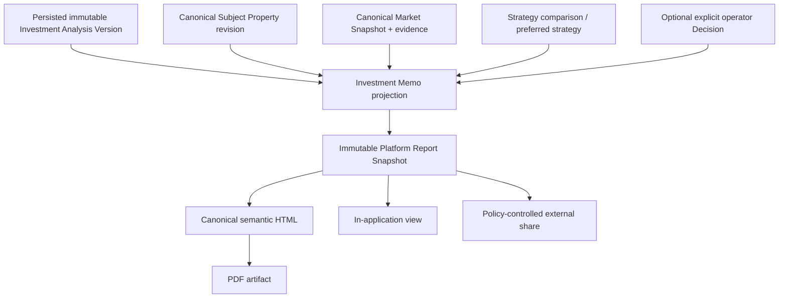

# IW-004 — Investment Memorandum

## Status

**Status:** Planned  
**Owner:** Investment Intelligence  
**Reporting authority:** Platform Reporting  
**Epic:** IW-001 — Investment Decision Workspace  
**Depends on:** IW-001 Canonical Subject Property, IW-002 Investment Underwriting Workspace, optional IW-003 Hospitality Strategy Comparison, persisted Investment Opportunity analysis versions, canonical reporting, and reporting storage/sharing policy

## Purpose

Generate a structured, evidence-based Investment Memorandum that explains the
recommendation, supporting evidence, financial projections, assumptions, risks,
sensitivity, and selected or recommended operating strategy for one Canonical
Subject Property.

The memorandum is the canonical narrative report of a persisted underwriting
analysis. It transforms immutable technical intelligence into an explainable,
auditable artifact suitable for authorized decision review, collaboration, and
historical reference.

The memorandum consumes intelligence produced elsewhere. It performs no business
calculation and owns no recommendation or Decision.

## Architecture decision

Investment Memorandum is the product-specific projection of Platform Reporting’s
existing `investment-decision` report type. It must use the canonical reporting
registry, snapshot, template, renderer, artifact, storage, sharing, retention,
activity, and version contracts.

IW-004 must not introduce a parallel report aggregate, PDF pipeline, public-storage
path, share-token system, or report lifecycle.



## Report versus Decision

The memorandum records the recommendation generated by Investment Intelligence and,
when available, a separately recorded operator Decision.

- a recommendation is an intelligence output;
- a preferred strategy is an operator selection;
- a Decision is an explicit commitment/defer/reject record;
- a memorandum is a narrative report over those artifacts.

If no operator Decision exists, the document must say that the recommendation is
pending decision. It must not label the analysis date, report generation date, or
preferred-strategy selection date as the “decision date.”

## Goals

The memorandum must:

- summarize the underwriting recommendation in plain language;
- explain why the recommendation was reached;
- preserve supporting and challenging evidence;
- capture the exact assumptions used;
- present financial projections without recalculating them;
- record material risks, gaps, and mitigation suggestions;
- preserve alternative strategies and tradeoffs when available;
- support professional, audience-appropriate presentation;
- remain reproducible from immutable sources and pinned rendering inputs;
- preserve source, policy, template, renderer, and artifact lineage;
- support controlled internal and external sharing.

## Non-goals

The memorandum does not:

- calculate or derive financial metrics;
- edit assumptions, property facts, Market Snapshots, or analyses;
- own recommendations, confidence, risks, preferred strategy, or Decisions;
- replace historical analyses or Strategy Comparisons;
- turn suggested next steps into canonical Actions automatically;
- create an Investment Opportunity or Portfolio acquisition record;
- expose provider payloads, secrets, prohibited data, or unauthorized evidence;
- become an editable source of truth after generation.

## Source eligibility

A memorandum may be generated only from a persisted immutable Investment Analysis
Version authorized to the requesting workspace.

The existing reporting boundary requires:

- report type `investment-decision`;
- supported scope `investment-scenario`;
- opportunity ID;
- analysis-version ID;
- active compatible template;
- required entitlement;
- valid source projection and lineage.

IW-004 may include a selected scenario, IW-003 comparison, preferred strategy, and
explicit Decision only when each artifact:

- belongs to the same authorized workspace;
- references the same Investment Opportunity and source analysis lineage;
- references the compatible Subject Property;
- passes source-version and semantic compatibility checks.

An ephemeral workspace result must be saved as an immutable analysis version before
memo generation. Report generation never causes or reruns underwriting.

## Canonical source envelope

Every memo snapshot pins:

- report ID, report number, series key, and version;
- workspace and audience scope;
- Investment Opportunity ID;
- analysis-version ID and sequence;
- workspace-run and lifecycle-result identity when retained;
- Subject Property ID and exact revision;
- Market Snapshot/analysis ID and version;
- selected scenario and strategy-definition version when applicable;
- IW-003 comparison ID/version and preference event when applicable;
- explicit operator Decision ID/version when applicable;
- assumption version;
- evidence and Observation references;
- calculation, engine, risk, score, confidence, and recommendation policy versions;
- report projection, template, and renderer versions;
- source evaluated/analyzed times;
- report generated time;
- locale, currency, timezone, and formatting policy;
- artifact checksums.

The memo never resolves a mutable `latest` source while rendering a historical
version.

## Document structure

```text
Investment Memorandum
├── Executive Summary
├── Property Overview
├── Investment Recommendation and Decision Status
├── Recommended or Preferred Hospitality Strategy
├── Market Intelligence
├── Financial Summary
├── Supporting Evidence and Methodology
├── Assumptions
├── Risk Assessment
├── Sensitivity Analysis
├── Alternative Strategies
├── Suggested Next Steps
└── Appendices and Lineage
```

The current Platform `investment-decision` report already requires:

- decision summary;
- property profile;
- market intelligence;
- financial performance;
- risk analysis;
- investment score;
- recommendation;
- evidence and methodology.

IW-004 maps its product sections onto those canonical report sections. New
first-class sections such as sensitivity or alternative strategies require a
versioned report projection/template change; they must not be embedded as
unstructured data to bypass registry validation.

## 1. Executive Summary

The first page should display, when canonically available:

- recommendation and plain-language summary;
- recommendation confidence using the source vocabulary;
- analysis quality/freshness;
- recommended or operator-preferred strategy;
- overall investment score;
- strongest supporting reasons;
- primary risk or evidence gap;
- suggested mitigation/next investigation;
- explicit operator Decision status, or `Decision pending`;
- report and source-analysis versions.

The summary fits one page under the approved template. It does not omit material
conditions or insufficient-evidence status to achieve that layout.

Example presentation:

```text
Recommendation: Proceed with Conditions
Decision status: Pending operator decision
Confidence: High
Primary strategy: Short-Term Rental
Investment score: 91 / 100
Primary reasons: year-round demand; projected NOI; comparable alignment
Primary risk: seasonality
Suggested mitigation: evaluate a compatible hybrid strategy
```

Numeric confidence such as `87%` may appear only when returned by a canonical
confidence contract. A qualitative level must not be converted to a percentage in
the report layer.

## 2. Property Overview

Displays:

- Canonical Subject Property ID and revision;
- canonical address and location;
- acquisition route;
- adopted property characteristics;
- property completeness and material conflicts;
- enrichment status and effective time;
- permitted property images with source/usage attribution;
- external-reference coverage summarized without making a provider canonical.

The overview represents the physical property independently from its operating
strategy. Images are included only when storage, provider terms, attribution, and
sharing rights permit their use for the selected audience.

## 3. Investment Recommendation and Decision Status

Captures:

- canonical recommendation status and rationale;
- confidence and analysis status;
- analysis version and analyzed timestamp;
- selected/preferred strategy when available;
- supporting and challenging evidence;
- limiting assumptions and gaps;
- explicit Decision status, actor, and occurred timestamp when available.

The report renders the canonical recommendation vocabulary or an approved,
versioned presentation mapping. The current customer-facing recommendation
contract supports:

- strong opportunity;
- opportunity;
- proceed with conditions;
- needs investigation;
- high risk;
- do not proceed;
- insufficient evidence.

Presentation labels such as `Proceed`, `Monitor`, or `Do Not Proceed` require a
tested mapping. The memorandum never converts `insufficient evidence` into
`Monitor` merely to produce a directional answer.

## 4. Recommended or Preferred Hospitality Strategy

Documents:

- strategy type, definition version, and operating model;
- whether it is engine-recommended, operator-preferred, or accepted;
- expected guest/tenant profile when canonically supplied;
- strategy-specific assumptions;
- operational profile and complexity;
- applicable Market evidence;
- strategy rationale, risks, and confidence;
- IW-003 comparison/ranking reference when available.

STR, MTR, LTR, house hack, co-hosting, boutique hospitality, or another strategy
may appear only when an approved strategy engine and definition produced the source
analysis. An unsupported UI label cannot become a memo strategy.

## 5. Market Intelligence

Summarizes:

- Market Snapshot/analysis identity and effective period;
- subject-property resolution;
- comparable set and qualification;
- ADR, occupancy, RevPAR, supply, demand, and historical trends when supported;
- valuation and long-term rent where supported;
- confidence, freshness, time-horizon fitness, and material gaps;
- origin and delivery-intermediary provenance;
- source substitutions and disagreements.

Every material market statement references supporting evidence/Observation IDs.
The main narrative may use footnotes or reference numbers; the appendices retain
the complete permitted references.

Unsupported values display as unavailable. Long-term monthly rent is not ADR, sale
valuation is not purchase price, and listing availability is not booked occupancy.

## 6. Financial Summary

Summarizes canonical values returned by the source analysis.

### Revenue

- annual revenue;
- ADR or strategy-appropriate rate;
- occupancy or vacancy;
- RevPAR where applicable;
- seasonal/monthly projection where available.

### Expenses

- operating expenses;
- mortgage or proposed lease;
- cleaning;
- insurance;
- taxes;
- utilities;
- management;
- strategy-specific material expenses.

### Returns

- NOI;
- cash flow;
- cap rate;
- cash-on-cash return;
- ROI;
- break-even occupancy/vacancy;
- initial cash required and payback period where available.

Each metric includes:

- canonical metric identifier;
- display value and unit;
- period/horizon;
- qualification (`projected`, `estimated`, `manual`, or `unavailable`);
- source analysis;
- calculation/policy version;
- confidence only when supplied at that metric grain;
- evidence references where applicable.

The report does not derive a missing metric from displayed values.

## 7. Supporting Evidence and Methodology

Evidence categories may include:

- market;
- financial;
- property;
- comparable;
- portfolio;
- operational;
- assumptions;
- applied Learning.

Each evidence reference preserves:

- evidence and Observation IDs;
- claim supported or challenged;
- source and origin/intermediary provenance;
- retrieved and effective time;
- confidence and method;
- Subject Property and Market Snapshot lineage;
- freshness;
- gaps, conflicts, and substitutions;
- human-readable explanation;
- disclosure class and audience eligibility.

Evidence remains immutable. If evidence cannot legally or safely be disclosed, the
memo records an allowed summary and restricted-reference marker rather than
embedding the prohibited material.

## 8. Assumptions

Documents every source assumption used by the analysis, grouped by route:

- acquisition;
- financing;
- revenue;
- operations;
- expenses;
- taxes and insurance;
- strategy-specific assumptions.

Each assumption records:

- key and label;
- typed value and unit;
- source (`operator`, Market, approved Learning, or default);
- override/explicit-input status;
- evidence or source reference;
- effective period;
- validation/qualification;
- assumption and policy version.

The memo cannot edit an assumption. A changed assumption requires a new draft,
analysis, and memo version.

## 9. Risk Assessment

Includes:

- market;
- operational;
- financial;
- regulatory;
- property;
- strategy;
- evidence/confidence gaps.

Each risk displays:

- stable risk ID and category;
- description;
- severity;
- likelihood only when canonically supplied;
- supporting/challenging evidence;
- affected assumptions and metrics;
- mitigation suggestion or next investigation;
- policy version.

Mitigation text is not a canonical Action. An Action exists only after an
authorized execution/diligence workflow records it.

## 10. Sensitivity Analysis

Summarizes canonical sensitivity results for supported changes such as:

- occupancy/vacancy;
- ADR/rent;
- interest rate;
- insurance;
- cleaning/turnover;
- utilities;
- management or regulatory cost.

For each sensitivity:

- source strategy analysis;
- base assumption/version;
- defined shock and unit;
- affected metrics;
- breakpoints/failure points;
- resulting recommendation only if recalculated by the owning engine;
- confidence and policy version.

The memorandum does not apply shocks or infer a revised recommendation.

## 11. Alternative Strategies

When a compatible IW-003 comparison exists, the memo records:

| Strategy | Recommendation | Confidence | Key tradeoff | Selection status |
|---|---|---|---|---|
| Candidate A | Canonical result | Canonical result | Canonical explanation | Recommended/preferred |
| Candidate B | Canonical result | Canonical result | Canonical explanation | Alternative |

The section preserves:

- strategies considered;
- applicable evidence and data gaps;
- compatible comparison dimensions;
- why a strategy ranked above or below another;
- `no clear leader` or `not comparable` states;
- operator preference separately from policy ranking.

“Reason not selected” must come from canonical comparison explanation or explicit
operator rationale. The report must not invent retrospective justification.

## 12. Suggested Next Steps

May include:

- verify insurance quotes;
- obtain contractor estimates;
- confirm local regulations;
- schedule inspection;
- validate comparable properties;
- request financing pre-approval;
- resolve a blocking property or evidence gap.

Every suggestion references the risk, condition, gap, or evidence that motivates
it. Suggested steps are recommendations, not executable Actions. The memo links to
an authorized diligence or execution workflow when one exists.

## Appendices

May include:

- comparable summaries;
- Market Snapshot metadata;
- complete assumption table;
- financial tables;
- sensitivity outputs;
- Strategy Comparison details;
- activity and version history;
- evidence references and methodology;
- policy, template, renderer, and source versions;
- disclosure and redaction notes.

Appendices increase transparency without crowding the decision narrative. Report
snapshot size remains subject to the Platform Reporting limit; oversized evidence
must be referenced rather than embedded.

## Reproducibility and determinism

Canonical memo content is deterministic for the same:

- persisted analysis version;
- compatible scenario/comparison/preference/Decision references;
- projection version;
- template ID/version;
- renderer version;
- locale, currency, timezone, and formatting policy;
- pinned generation context, including generated timestamp where rendered.

Given identical inputs, the structured projection and canonical semantic HTML must
produce identical normalized content and checksums. PDF byte identity is required
only when the renderer and all PDF metadata are deterministic and pinned; otherwise
the report preserves renderer version and checksum and treats the PDF as a new
artifact rendering of the same immutable snapshot.

Retry after a rendering/storage failure reuses the existing report snapshot. It
does not recreate the source analysis.

## Versioning

```text
Analysis Version 3
  → Memo Series / Report Version 3
      ├── immutable report snapshot
      ├── canonical HTML artifact
      └── PDF artifact

New analysis or materially different source selection
  → new memo/report version
```

Regenerating artifacts from the same report snapshot does not create a new
underwriting analysis. A new report version is required when source analysis,
selected strategy/comparison, Decision, template content, or projection changes.

Supersession preserves both report versions. Archiving hides without deleting
commercial decision history.

## Export formats

### Initial

- in-application semantic HTML;
- printable HTML;
- PDF.

### Future

- DOCX;
- presentation summary;
- due-diligence or lender package;
- secure share link.

HTML is the canonical visual artifact. PDF consumes canonical HTML. Renderers never
evaluate business metrics.

Every export displays or embeds:

- report number/version;
- source analysis version;
- Subject Property ID/revision;
- generated timestamp;
- projection/template/renderer versions;
- confidentiality/audience classification;
- artifact checksum or verification reference where appropriate.

## Audience and disclosure profiles

Internal, partner, advisor, lender, and other external audiences may require
different templates or redaction profiles. A disclosure profile may omit optional
sections or redact values but may not:

- change the recommendation or meaning;
- omit required material conditions without disclosure;
- recalculate values;
- present unavailable evidence as available;
- break source lineage;
- expose provider-restricted, tenant-confidential, personal, credential, or
  security-sensitive data.

Claims that a memo is lender-ready or externally suitable require an approved
audience template and disclosure review. A generic internal memo is not
automatically a lender package.

## Sharing and access

Investment reports may be externally shared only through Platform Reporting policy
and an authorized application command.

External shares are:

- report-scoped;
- read-only;
- expiring;
- view-limited;
- revocable;
- represented by unguessable tokens hashed at rest;
- logged;
- prohibited from granting workspace navigation or live API access.

Artifacts remain in private storage. Authenticated downloads use short-lived signed
URLs. Raw storage paths are never public.

Before sharing, the system validates:

- report type and sharing policy;
- requester permission;
- audience/disclosure profile;
- provider and image usage rights;
- sensitive-field redaction;
- share expiry, access mode, and view limit.

## Workflow

```text
Persisted Investment Analysis Version
  → select compatible strategy/comparison and optional Decision
  → validate scope, entitlement, source lineage, and disclosure
  → build immutable report-ready projection
  → validate required sections
  → create immutable Platform Report snapshot
  → render canonical HTML
  → render PDF
  → store checksummed artifacts privately
  → view, print, or share under policy
```

Report generation does not save an opportunity, accept a recommendation, advance
an acquisition pipeline, or add a property to a portfolio.

## Integrations

### Consumes

- IW-001 Canonical Subject Property revision;
- persisted immutable underwriting analysis;
- IW-003 Strategy Comparison and preference when available;
- canonical Market Snapshot, evidence, and observations;
- canonical financial projections;
- recommendation, confidence, risk, score, and sensitivity outputs;
- Investment Opportunity source identity;
- optional explicit operator Decision;
- Platform report registry, projection, templates, rendering, storage, sharing,
  retention, and activity.

### Produces

- immutable `investment-decision` report projection/snapshot;
- canonical HTML and PDF artifacts;
- report activity and version lineage;
- policy-controlled share artifact;
- attributable report references consumable by Opportunity, Portfolio, and
  Executive projections.

IW-004 does not directly produce a Portfolio Acquisition Record or Executive
Insight. Those capabilities may consume the authorized memo/report reference.

## Error and degraded states

Required failures/states include:

- source analysis not persisted or not complete enough;
- source scope or lineage mismatch;
- Subject Property or Market Snapshot mismatch;
- scenario/comparison/Decision incompatible with analysis;
- inactive template;
- required section missing;
- projection invalid or oversized;
- entitlement missing;
- authorization denied;
- disclosure/share prohibited;
- artifact rendering, validation, or storage failure;
- stale or degraded source evidence;
- report generation conflict;
- archived or superseded report;
- share expired, revoked, or view limit reached.

Non-retryable source, permission, entitlement, scope, projection, and disclosure
failures require correction. Retryable renderer/storage failures reuse the
immutable snapshot.

## Authorization and retention

- authenticate and authorize before loading any source projection;
- validate the analysis, opportunity, scenario, comparison, Decision, and property
  scope independently;
- prevent cross-tenant existence disclosure;
- require reporting entitlement and generation permission;
- retain source lineage and generated snapshots as commercial decision history;
- archive or supersede rather than mutate/delete;
- revoke shares independently from report retention;
- perform material artifact deletion only through a separate retention operation.

## Acceptance criteria

The platform allows an authorized user to:

- generate an Investment Memorandum from a persisted completed underwriting
  analysis;
- see a one-page recommendation-first Executive Summary;
- distinguish recommendation, preferred strategy, and explicit operator Decision;
- review property, Market, financial, evidence, assumption, risk, sensitivity, and
  strategy content without recalculation;
- trace every material statement and metric to immutable source lineage;
- include compatible alternative strategies and documented selection rationale;
- see unavailable, insufficient-evidence, stale, degraded, and pending-decision
  states honestly;
- generate in-application HTML, printable output, and PDF;
- regenerate deterministic canonical content from identical pinned inputs;
- preserve report, source, template, renderer, and artifact versions/checksums;
- share an eligible redacted memo through controlled, expiring, revocable access;
- retain historical report versions after supersession or archive.

The implementation proves that:

- report projection and rendering perform no business calculation;
- report generation does not modify source analyses, assumptions, Market
  Snapshots, recommendations, preferences, or Decisions;
- an ephemeral analysis cannot become a durable memo source;
- absent operator Decision is rendered as pending, not inferred;
- unsupported metric confidence, sensitivity, or mitigation is not fabricated;
- same-source regeneration is deterministic under pinned projection/template/render
  inputs;
- render retries reuse the immutable snapshot;
- external sharing cannot bypass disclosure, provider-rights, or authorization
  policy;
- provider payloads, secrets, and unauthorized evidence do not enter artifacts;
- suggested next steps do not become Actions automatically;
- Portfolio and Executive capabilities consume report references rather than being
  created by IW-004.

## Required implementation sequence

1. Map IW-004 sections to the existing `investment-decision` report definition and
   identify versioned registry/template additions.
2. Define the Investment Memo projection contract and source-eligibility rules.
3. Define recommendation/preference/Decision narrative separation.
4. Implement deterministic projection from persisted immutable analysis,
   compatible strategy comparison, and optional Decision.
5. Implement the Executive Summary and required core sections without formula
   changes.
6. Add sensitivity, alternative-strategy, next-step, and appendices sections
   through versioned report definitions/templates.
7. Add audience/disclosure profiles and provider/image rights validation.
8. Reuse canonical HTML, PDF, private storage, checksum, job, sharing, activity,
   and retention infrastructure.
9. Add projection, determinism, lineage, authorization, disclosure, renderer,
   storage, sharing, accessibility, print, and end-to-end tests.

DOCX, presentation, lender packages, due-diligence packages, new calculations, and
new recommendation policy remain separate future work.

