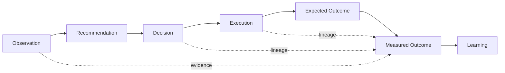
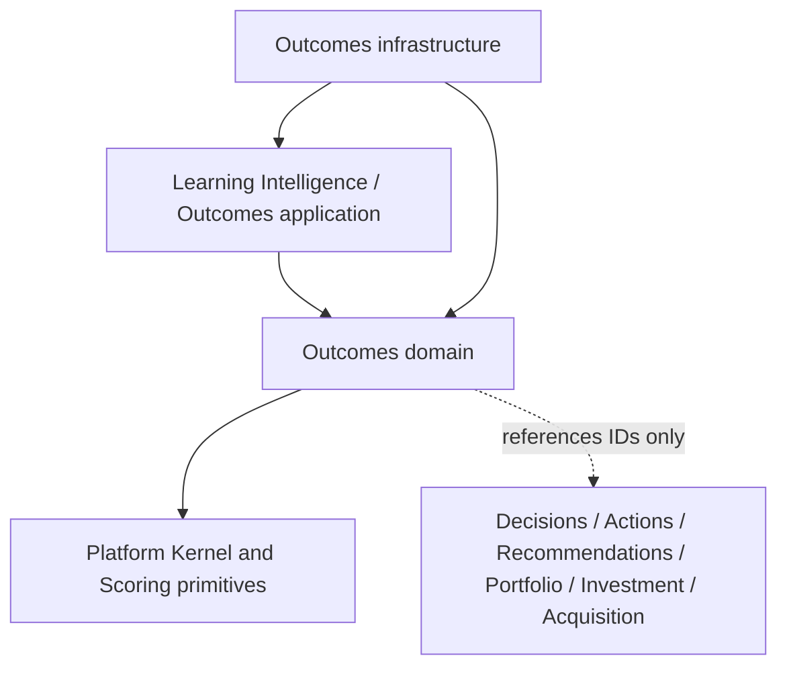
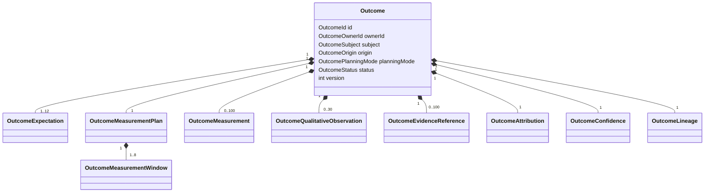
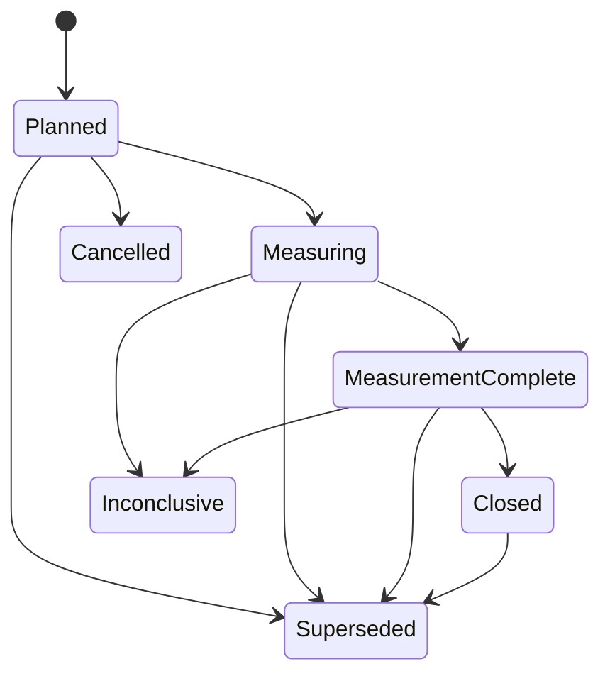

# LI-001 — Outcomes Domain Foundation

## Mission

LI-001 establishes Outcomes as an isolated bounded context within Learning Intelligence. Its canonical question is:

> What result did this decision produce, relative to what was expected?

The context records trusted planning and measurement facts. It does not decide whether a result was successful, calculate variance, infer causality, generate a recommendation, or generate a learning.



## Bounded-context decision

The implementation uses capability-first feature organization:

```text
src/features/learning-intelligence/
└── outcomes/
    ├── domain/
    ├── application/
    ├── infrastructure/
    └── index.ts
```

This location is intentional. `src/platform/outcomes` remains the existing generic policy/execution-result contract, which includes an evaluated `successful` fact. `PlatformActionOutcomeReference` remains an Action-owned link to a downstream outcome; it does not own measured business results. LI-001 neither replaces nor mutates either model.

The dependency direction is:



The domain reuses Platform `Identifier`, `Money`, `Percentage`, `Score`, `ConfidenceScore`, and `ConfidenceAssessment`. The repository has no canonical cross-platform `AggregateRoot` or `DomainEvent` base, so Outcome follows the established feature aggregate convention: private state, cloned rehydration, explicit aggregate version, and immutable event records. No outcome-specific concept was added to the Platform Kernel.

## Five distinct concepts

- A **Decision** is the selected course of action.
- An **Execution** is work performed to implement the decision.
- An **Expectation** is the result believed before realized evidence was known.
- An **Observation** is a measured fact.
- An **Outcome** connects those facts through explicit lineage and a controlled lifecycle.

Analytics without decision lineage remains an observation. An Outcome does not infer a causal link merely because an observation followed an execution.

## Ownership and aggregate



Every Outcome has exactly one immutable owner. Repository reads include owner scope and return `null` for cross-owner access. Server boundaries must construct `OutcomeOwnerId` from authenticated context; a client owner value is not authoritative.

Subject supports only public reference shapes: portfolio, property, investment opportunity, acquisition, recommendation, action, and business. Source aggregates, persistence rows, provider DTOs, and evidence payloads never enter the aggregate.

Origin is immutable and supports decision, recommendation-decision, executed action, investment decision, acquisition decision, and policy-approved manual measurement. Manual origin requires an explicit bounded reason and never implies decision causality.

## Lifecycle



`inconclusive` is terminal in v1; it does not transition to `closed`. Closed, inconclusive, cancelled, and superseded records reject ordinary mutation. A closed record is corrected by creating a replacement Outcome and explicitly superseding the original.

Starting measurement requires execution eligibility. A `not-started` execution cannot produce an operating measurement. Partial execution is retained as lineage and may be measured when the approved plan permits it; it is never rewritten as complete.

## Expectations, metrics, baselines, and targets

An Outcome has one to twelve expectations and at least one primary expectation. Secondary and guardrail expectations are retained without evaluation. Each expectation has:

- stable metric key and typed metric definition;
- direction independent of target;
- optional explicit baseline and methodology;
- typed target and optional tolerance;
- primary, secondary, or guardrail importance;
- a measurement window;
- source, confidence, and establishment time;
- a `reconstructed` flag.

Metric values are a closed union: money, percentage, ratio, count, duration, score, boolean, or bounded qualitative code. Metric kind must match baseline, target, tolerance, and measurement values. Counts are non-negative integers; ratios are finite; durations are non-negative. Platform value objects enforce Percentage and Score bounds.

Money retains currency on every value. The current Platform Money primitive supports USD; the Outcome rules still compare currency identity and perform no live foreign-exchange conversion.

Prospective expectations must be contemporaneous. Retrospective Outcomes preserve `planningMode: "retrospective"` and reconstructed manual expectations must explicitly identify themselves as retrospective. They are never presented as pre-decision facts.

## Measurement plan and windows

The approved plan contains version, approver, windows, required expectations, evidence requirements, completion policy, and attribution plan. Once measurement begins, it is frozen.

Windows are explicit UTC `Date` ranges with baseline, implementation, initial, stabilization, primary, or follow-up purpose. IDs are unique, start precedes end, comparison references must exist, self-comparison is forbidden, and a primary window is required. The aggregate never reads the system clock; all time arrives in commands.

Completion requires:

- every required window to be closed;
- the minimum authoritative measurement count;
- an authoritative measurement for every primary expectation when configured;
- required evidence roles and confidence;
- no unresolved authoritative/disputed conflict.

These are record-completeness rules, not success rules.

## Measurements, evidence, and data quality

Measurements are append-only observations. Each retains metric, value, expectation link, window, observed and recorded times, source, methodology, confidence, data quality, status, and observation reference. Authoritative, supplemental, disputed, and superseded records remain representable.

Late evidence follows the plan: reject, accept with a warning/late marker, or force supplemental status. A correction references `supersedesMeasurementId`; the original measurement remains unchanged.

Qualitative observations use bounded values including unexpected-positive, unexpected-negative, and unexpected-neutral. Canonical values contain no unrestricted narrative payload.

Evidence is referenced, not copied. A reference retains type, source identity/version, capture time, role, and confidence. Evidence requirements may bind a metric or expectation to required roles and minimum confidence. Missing evidence blocks completion or supports an inconclusive record; it never becomes a zero measurement.

Data quality records completeness, freshness, provenance, compatibility, and bounded issue codes. Data quality, Outcome confidence, attribution confidence, and eventual success are four separate concepts.

## Attribution and concurrent interventions

Attribution defaults to `not-assessed`. Other states are established, supported, plausible, weak, unknown, or contested. An assessed state requires an explicit basis and evidence. `established` additionally requires a controlled comparison or mechanism-supported basis.

Competing factors retain code, category, direction, evidence, and confidence. Simultaneous actions, seasonality, market events, pricing changes, and measurement changes therefore remain visible. The aggregate records an assessor's supplied attribution state but never derives causal strength from temporal correlation.

## Lineage and granularity

Lineage contains bounded, deduplicated Decision, Recommendation, Execution, Observation, and Analysis references plus predecessor/successor correction links. One decision can have multiple Outcomes. One Outcome can contain multiple expectations when subject, windows, evidence, attribution, and lifecycle are coherent. Materially different horizons or subjects require separate Outcomes.

An Outcome is a meaningful decision-result relationship, not a daily revenue row, booking, provider response, metric refresh, or chart point.

## Repository, reads, and application services

`OutcomeRepository` exposes owner-scoped `findById`, optimistic `save`, and owner-scoped `existsByOrigin`. New records use expected version `null`; updates require the stored version. Failed writes do not mutate stored state.

The deterministic in-memory adapter clones on save and rehydration, conceals cross-owner records, enforces versions, supports origin lookup, and implements bounded readers. Decision and subject lists require limits from 1 to 100, use a stable created-time/ID sort, and expose opaque offset cursors. There is no unbounded list contract.

Write services authorize before a sensitive read, invoke one aggregate behavior, save once, and map failures to presentation-neutral typed errors. Accepted idempotency keys live in aggregate history. Repeating an accepted command returns the authoritative state without a duplicate state change or event, even if the original expected version is now stale.

Optimistic conflicts require callers to reload authoritative state before issuing a genuinely new command.

## Events and correction history

Meaningful transitions and additions emit immutable events with event ID, aggregate ID/version, owner, occurrence time, stable event type, bounded references, and idempotency key. Events contain neither aggregate snapshots nor provider secrets.

Supersession records successor ID and correction reason on the original. Replacement creation and two-record atomic coordination are deferred to a future production unit of work; LI-001 supplies the domain and repository contracts without a database migration.

## Architecture protections and deferred work

Tests assert that the domain imports no React, Next.js, Supabase, infrastructure, repositories, providers, environment, or system clock. It does not mutate Decisions, Actions, Portfolios, Investment Opportunities, or Acquisition Pipelines.

Deferred to LI-002 or later:

- outcome success, partial success, harm, and failure evaluation;
- expectation variance;
- statistical significance and causal inference;
- counterfactuals and forecasting;
- recommendation effectiveness and portfolio learning;
- generated learning or narrative;
- UI, provider adapters, production persistence, and database migrations.

LI-001 can answer which decision and execution are measured, what was expected, which baseline and window apply, what was observed, which evidence supports it, which competing factors exist, and how complete/confident the record is. It intentionally cannot yet answer whether the decision succeeded or what the platform should learn.
