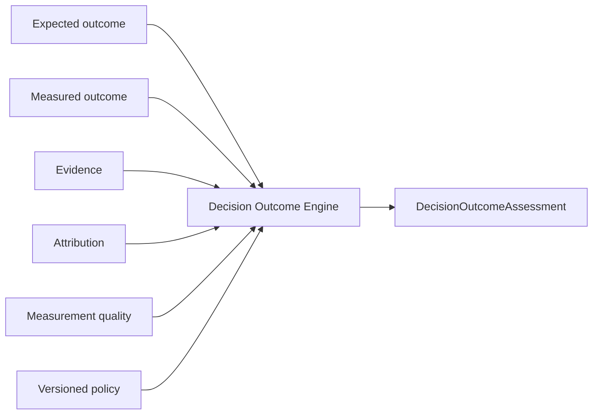
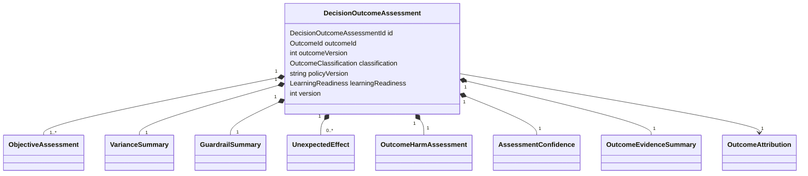
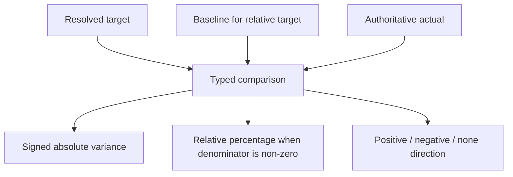
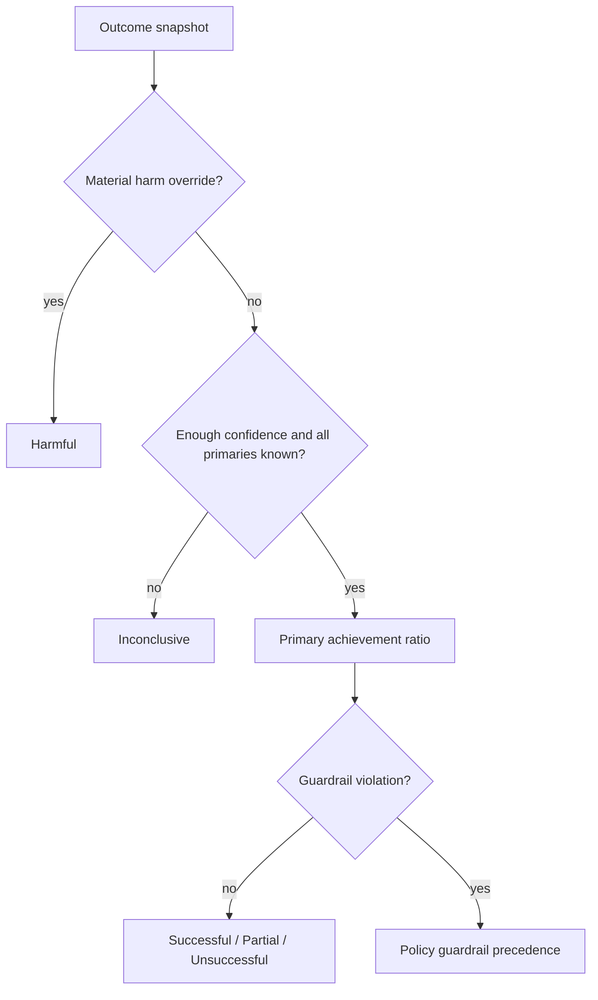

# LI-002 — Decision Outcome Engine

## Mission

LI-002 implements the deterministic engine that evaluates an LI-001 Outcome and answers:

> How successful was this decision, why, and how confident are we in that assessment?

It introduces evaluation without changing the evidence record:



The engine does not generate recommendations, learnings, forecasts, causal claims, actions, UI content, or narratives.

## Bounded context and ownership

The implementation is a sibling of Outcomes inside Learning Intelligence:

```text
src/features/learning-intelligence/
├── outcomes/                  # LI-001 evidence and lifecycle record
└── decision-outcomes/         # LI-002 evaluation
    ├── domain/
    ├── application/
    └── infrastructure/
```

LI-002 reads an immutable `OutcomeState` snapshot through the public LI-001 contract. It neither calls Outcome behaviors nor changes Decisions, Actions, Recommendations, Portfolios, Investment Opportunities, or Acquisition Pipelines.

The existing generic Platform Evaluations capability remains claim-oriented. `DecisionOutcomeAssessment` is a distinct Learning Intelligence artifact because it evaluates objective achievement, guardrails, harm, and learning readiness rather than an arbitrary claim.

## Assessment model



Every assessment preserves:

- owner, Outcome identity, and evaluated Outcome version;
- decision lineage;
- objective-level expected, baseline, target, actual, variance, tolerance, status, confidence, and evidence;
- primary, secondary, and guardrail importance;
- guardrail and variance summaries;
- unexpected effects and material harm;
- attribution as recorded by LI-001;
- composed confidence and evidence sufficiency;
- success classification and independent learning readiness;
- policy version, evaluation time, assessment history, and events.

## Deterministic inputs

The pure engine accepts:

- assessment and event IDs;
- immutable Outcome state;
- complete policy;
- evaluation time;
- optional previous assessment.

It performs no clock access, random ID generation, environment access, repository access, provider access, or locale formatting. Identical inputs produce structurally identical results.

## Objective evaluation

Each LI-001 expectation is evaluated independently. The latest authoritative measurement is selected deterministically by observation time and measurement ID. Supplemental, disputed, and superseded measurements do not become the authoritative actual.

Objective status is:

- `achieved`;
- `exceeded`;
- `missed`;
- `unknown`;
- `not-measured`.

Missing measurements produce `not-measured`. A relative target without a baseline produces `unknown`. Neither path fills, estimates, or invents a value.

Targets support absolute, relative change, minimum, maximum, range, state, and completion forms. Direction remains independent from target. Absolute and percentage tolerance are applied by policy-neutral comparison logic.

## Variance



The engine calculates:

- Money variance with Platform `Money`, preserving currency;
- Percentage variance as signed percentage points;
- Ratio, count, and duration variance as signed values;
- Score variance while preserving and validating Platform score scale;
- Boolean and qualitative change.

Relative variance is `null` when the expected value is zero. Incompatible kinds, currencies, or score scales are rejected; no conversion is attempted.

Variance direction is a mathematical sign, not automatically business favorability. Favorability is interpreted through the expectation direction and target.

## Classification

Canonical classifications are:

- `successful`;
- `partially-successful`;
- `unsuccessful`;
- `harmful`;
- `inconclusive`.

The default v1 policy requires all known primary objectives for `successful`, at least half for `partially-successful`, and otherwise yields `unsuccessful`. Missing primary evaluations or confidence below the conclusion threshold yields `inconclusive`.



Classification is policy-versioned. Success is not embedded in LI-001 and no Outcome field is changed.

## Guardrails, unexpected effects, and harm

Guardrails are ordinary expectation assessments with `importance: "guardrail"` plus a separate summary. A successful primary objective and a missed guardrail remain simultaneously visible. The default policy caps an otherwise successful assessment at `partially-successful`; policy may instead choose unsuccessful or harmful precedence.

Bounded LI-001 qualitative observations marked as unexpected are projected as explicit positive, neutral, or negative effects. The harm policy declares which observation categories and count constitute material harm. When enabled, a material-harm override classifies the result as harmful even when financial or operational objectives were achieved.

The engine applies supplied policy; it does not independently judge strategy or infer a causal relationship.

## Evidence, attribution, and confidence

Evidence sufficiency is `sufficient`, `limited`, or `insufficient` based on the LI-001 required roles and available references. It is reported separately and influences confidence. It never fabricates a conclusion.

Assessment confidence composes:

- authoritative measurement confidence;
- evidence confidence and sufficiency;
- recorded attribution confidence;
- LI-001 evidence coverage;
- measurement freshness.

Default weights total one and are policy data. Explicit penalties apply for late evidence, reconstructed expectations, incompatible data, and contested attribution. The result uses Platform `ConfidenceAssessment`, `ConfidenceScore`, and `Percentage`.

A high-confidence failure and low-confidence success remain representable. Confidence below the policy's minimum conclusion threshold produces inconclusive because the record cannot support a classification; it does not turn a missed target into success.

## Learning readiness

Learning readiness is evaluated independently:

- `ready`;
- `incomplete`;
- `insufficient-evidence`;
- `blocked`;
- `superseded`.

Only closed, conclusive, sufficiently evidenced assessments meeting confidence and attribution policy become ready. A successful assessment may remain blocked because attribution is unknown. An unsuccessful or harmful assessment may be ready when its evidence is strong—learning readiness is not a reward for success.

LI-002 emits readiness as a fact for LI-004. It creates no Learning artifact.

## Reevaluation and history

Late evidence, a corrected Outcome, or policy-driven reevaluation creates a new assessment record with:

- a new assessment ID;
- incremented assessment version;
- `previousAssessmentId`;
- the authoritative Outcome version and policy version;
- a reclassification event when classification changed.

`compareDecisionOutcomeAssessments` reports classification, confidence, readiness, and per-objective status changes. Historical assessments are never rewritten.

Events are immutable and bounded: `DecisionOutcomeEvaluated`, `DecisionOutcomeReclassified`, `DecisionOutcomeReadyForLearning`, and the reserved `DecisionOutcomeSuperseded`.

## Application and persistence contracts

`evaluateDecisionOutcomeService`:

1. authorizes before reading Outcome state;
2. loads the owner-scoped LI-001 snapshot;
3. loads the latest assessment;
4. verifies optimistic assessment version;
5. invokes the pure engine once;
6. saves the immutable assessment;
7. maps domain and repository failures to presentation-neutral errors.

The Outcome reader is a narrow adapter over `OutcomeRepository`. Cross-owner Outcome access remains concealed as not found.

The assessment repository supports owner-scoped identity reads, latest-by-Outcome reads, and optimistic append-only saves. Reassessment uses a new ID and expected latest version. The in-memory implementation validates this contract; production persistence and migrations remain deferred.

## Architecture protections and deferred work

Architecture tests prohibit React, Next.js, Supabase, infrastructure, repositories, providers, system clocks, randomness, and environment access in the domain. Assessment concepts do not leak into Platform Kernel or LI-001.

Deferred:

- recommendation effectiveness;
- cross-decision pattern discovery;
- portfolio learning;
- AI explanations and narratives;
- causal inference and statistical significance;
- forecasts and counterfactuals;
- dashboards, workspaces, notifications, and automated actions;
- production database persistence.
