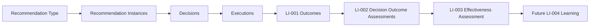
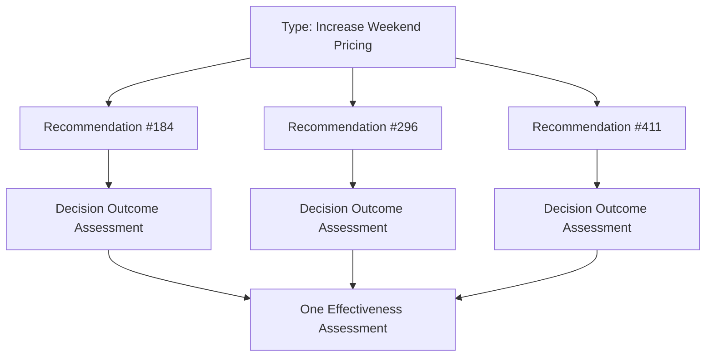
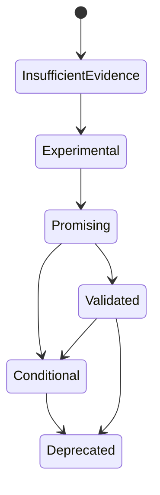

# LI-003 — Recommendation Effectiveness Engine

## Mission

LI-003 evaluates whether a recommendation type has consistently produced beneficial outcomes after its instances were accepted, executed, measured, and evaluated.



It answers:

> Did this recommendation improve the business as intended, and how much confidence should future recommendations of this type receive?

It does not generate recommendations, change rankings or policies, mutate recommendations or Outcome classifications, generate learning, create Actions, forecast, or modify Portfolio Health.

## Bounded context

The capability is isolated at:

```text
src/features/learning-intelligence/
├── outcomes/                       # LI-001 evidence record
├── decision-outcomes/              # LI-002 single-Outcome evaluation
└── recommendation-effectiveness/   # LI-003 recommendation-type aggregation
```

LI-003 depends only on public LI-002 assessment contracts and Platform primitives. It does not import recommendation aggregates. Platform Recommendation instances and Portfolio Recommendation histories retain ownership of their own data.

## Type versus instance



`RecommendationTypeId` is an opaque stable Identifier. `RecommendationInstance` preserves:

- recommendation instance ID;
- recommendation type;
- decision and execution references;
- Outcome and LI-002 assessment IDs;
- completed Outcome status;
- bounded applicability conditions;
- assessment time;
- the authoritative immutable LI-002 assessment.

Only instances backed by closed or terminal inconclusive Outcomes are eligible. Mismatched type, owner, Outcome, or assessment lineage is rejected. Duplicate instance IDs are rejected.

## Canonical assessment

`RecommendationEffectivenessAssessment` is an immutable, owner-scoped, policy-versioned read model containing:

- overall effectiveness and recommendation quality;
- sample sufficiency;
- raw Outcome distribution;
- explicit success, partial-success, failure, harm, and inconclusive rates;
- repeatability;
- composed confidence;
- evidence summary;
- harm summary;
- applicability-condition performance;
- trend;
- learning readiness;
- complete recommendation, decision, Outcome, and LI-002 lineage;
- prior assessment identity and optimistic history version.

It contains no copied measurement payloads and performs no LI-002 objective or variance calculation.

## Aggregation rules

LI-003 counts LI-002 classifications exactly as supplied:

```text
successful
partially-successful
unsuccessful
harmful
inconclusive
```

Inconclusive assessments are counted and affect confidence, but are excluded from the conclusive denominator used for success, partial-success, failure, and harm rates. Their own rate uses total evaluated instances.

Rates remain `null` until the policy's minimum conclusive sample is met. Counts are always retained. This prevents two successful observations from appearing statistically mature.

The default policy uses five conclusive Outcomes as the minimum sample.

## Effectiveness and quality

The default policy computes a beneficial rate:

```text
successful rate + 0.5 × partially-successful rate
```

It classifies:

- at least 80% as `highly-effective`;
- at least 65% as `effective`;
- at least 40% as `mixed`;
- below 40% as `ineffective`;
- material harm as `harmful`;
- insufficient sample as `insufficient-evidence`.

These thresholds are immutable versioned policy, not hard-coded governance actions.

Recommendation quality is:



The diagram describes possible maturity, not automatic lifecycle mutation. The engine returns `validated`, `promising`, `conditional`, `experimental`, `deprecated`, or `insufficient-evidence`; it never disables or edits a recommendation policy.

## Sample sufficiency

`RecommendationSampleAssessment` reports:

- total observed count;
- conclusive count;
- minimum required count;
- explicit sufficient flag;
- Percentage confidence penalty.

Sample quality increases toward 100 as the conclusive count reaches the policy minimum. Extra Outcomes continue to influence aggregate confidence through Outcome and evidence quality without removing historical observations.

## Repeatability

Repeatability asks whether comparable uses have consistently produced beneficial outcomes. It reports high, moderate, low, or unknown; the comparable count; Platform Score; confidence; and limitations.

Limitations include:

- small sample;
- excessive inconclusive rate;
- mixed results;
- weak attribution;
- incomparable applicability conditions.

A single success never produces high repeatability. The default high/moderate thresholds are 80% and 60% beneficial outcomes.

Applicability conditions are explicit bounded dimensions: property type, market, portfolio stage, seasonality, and operating model. The assessment reports outcome, beneficial, and harmful counts per condition. It does not discover new segments; LI-004 may later find broader patterns.

## Harm

The harm summary preserves:

- harmful LI-002 assessment count;
- guardrail-violation frequency;
- unexpected-negative frequency;
- whether severe material harm was observed.

The default policy classifies the recommendation type as harmful when harm reaches 20% of conclusive Outcomes or any severe material harm is present. This affects quality but never rewrites the underlying assessment.

## Evidence and confidence

Evidence is summarized from LI-002:

- evaluated Outcome count;
- average evidence coverage;
- average attribution quality;
- average Outcome confidence;
- missing-evidence count.

Recommendation effectiveness confidence independently composes sample, evidence, Outcome, attribution, and consistency quality. The default weights total one. Small sample, missing evidence, and incomparable conditions create explicit penalties.

High effectiveness and high confidence are different facts. An effective-looking recommendation with a small sample remains insufficient evidence. An ineffective recommendation with extensive high-quality evidence can have high confidence.

## Learning readiness

Readiness is:

- `ready`;
- `limited`;
- `insufficient-evidence`;
- `blocked`.

Insufficient sample is insufficient evidence. Excessive inconclusive Outcomes or confidence below the policy threshold is blocked. Incomparable conditions make the assessment limited. Otherwise the assessment is ready for LI-004.

Ready does not mean successful. Harmful or ineffective patterns may be valuable learning inputs when adequately supported.

## Trends and comparison

Trend compares only assessments for the same recommendation type under the same policy version and with non-null comparable rates.

Direction is improving, stable, declining, or unknown. The default stable band is ±5 percentage points. Changes preserve effectiveness, success rate, harm rate, confidence, and sample size.

`compareRecommendationEffectiveness` returns improved, declined, stable, or not comparable plus new evidence count and signed rate/confidence changes. A changed policy version is never presented as a performance trend.

Historical assessments are append-only. A new assessment has a new ID, incremented version, and previous assessment lineage.

## Application layer and events

`evaluateRecommendationEffectivenessService`:

1. authorizes before history reads;
2. validates a bounded instance limit of 1–1000;
3. loads completed recommendation instance lineage;
4. batch-loads authoritative LI-002 assessments;
5. rejects missing or mismatched lineage;
6. loads the previous assessment;
7. enforces optimistic versioning;
8. invokes the pure deterministic engine;
9. saves the immutable assessment;
10. optionally publishes a bounded domain event.

Application orchestration emits:

- `RecommendationEffectivenessEvaluated`;
- `RecommendationEffectivenessImproved`;
- `RecommendationEffectivenessDeclined`;
- `RecommendationReadyForLearning`.

The pure engine emits nothing and performs no I/O.

## Repository

The owner-scoped repository supports immutable save, find latest by recommendation type, and find by assessment ID. Saves are append-only and optimistic:

- first assessment expects `null` and has version 1;
- reevaluation expects the latest version;
- stale writes fail without changing stored history;
- IDs cannot be reused;
- cross-owner reads are concealed.

The in-memory repository validates the contract. Production persistence and database migrations remain deferred.

## Determinism and architecture

The pure engine receives IDs, policy, instances, evaluation time, and optional prior assessment. It has no clock, randomness, environment, provider, repository, infrastructure, UI, or Supabase access.

Architecture tests also ensure LI-003 does not:

- calculate LI-002 variance or objective status;
- generate or mutate recommendations;
- adjust policy;
- create actions;
- generate learning;
- mutate Outcomes, Decisions, Portfolios, or Actions;
- leak LI-003 concepts into Platform Kernel, LI-001, or LI-002.

## Deferred optimization

LI-004 may consume assessments marked ready to discover patterns. Any automatic policy adjustment, ranking change, recommendation suppression, deprecation enforcement, or new recommendation generation requires separate governance and is explicitly outside LI-003.
