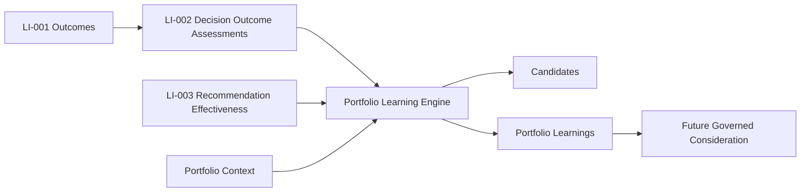
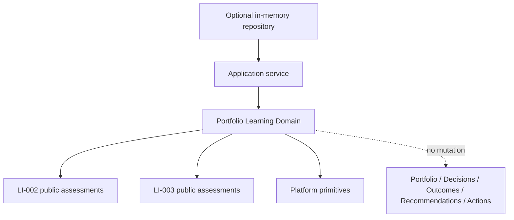
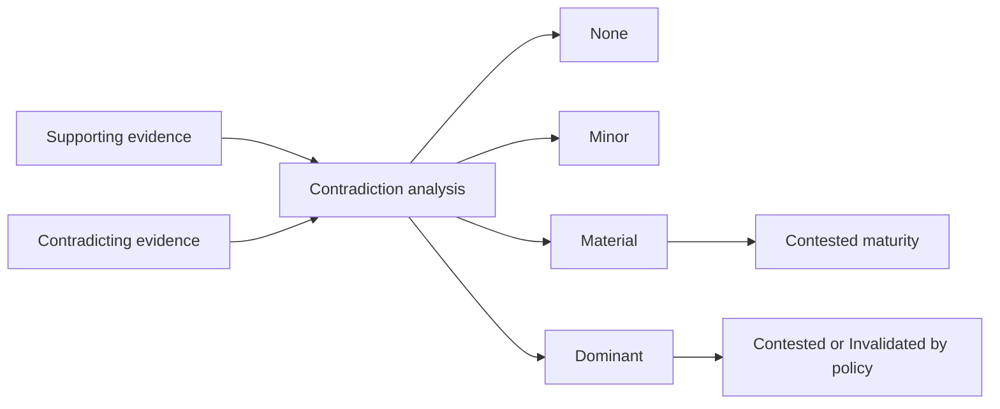
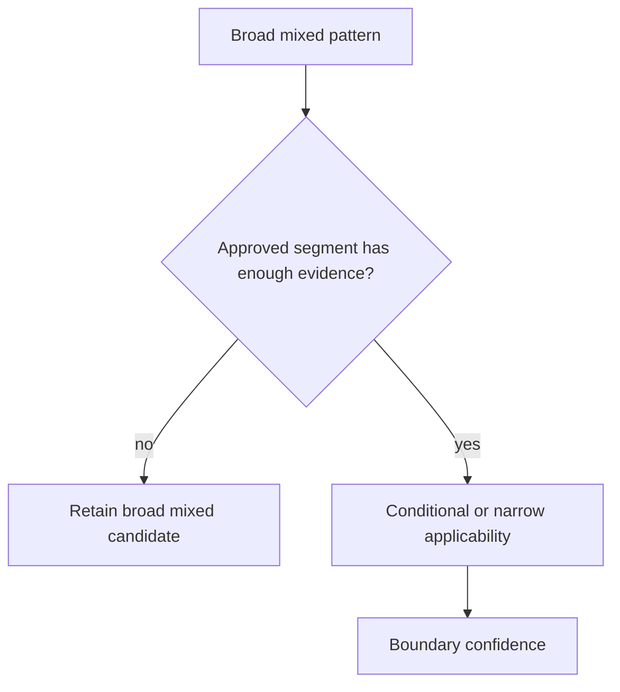
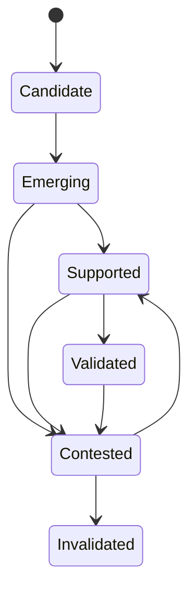

# LI-004 — Portfolio Learning Engine

## Mission

LI-004 identifies evidence-backed, repeatable patterns across authoritative LI-002 Decision Outcome Assessments and LI-003 Recommendation Effectiveness Assessments within one portfolio.

The engine answers what this portfolio's evidence repeatedly supports. It does not claim universal truth, infer causality, generate recommendations, modify policy, create Actions, retrain models, or mutate any upstream aggregate.

## Boundaries

Portfolio Learning is isolated at `src/features/learning-intelligence/portfolio-learning`. It consumes LI-002 and LI-003 public contracts. It never loads raw Outcome measurements as a substitute for LI-002, recalculates individual success, or recalculates recommendation effectiveness.

Portfolio context is explicit and minimal: owner, portfolio ID/version and lifecycle stage, property references, strategy references, and assessment-to-context mappings. Context mappings provide only supported decision type, subject, period, market, property type, operating model, seasonality, capital posture, health band, execution speed, partial execution, and concurrent-intervention facts.

## What qualifies as learning

One successful Outcome creates evidence and a pattern candidate. It does not create an established learning.

The default versioned policy uses:

- candidate: one eligible assessment;
- emerging: three;
- supported: five, with at least two subjects;
- validated: ten, with at least three subjects, two periods, high confidence, and current evidence.

Candidates and established learnings are separate output collections. A high-severity material harmful event may create an exceptional learning at any sample size, but is explicitly marked `recurrenceRequired: false` and `SINGLE_EVENT`; it is never labeled repeatable.

## Canonical artifacts

`PortfolioLearningAssessment` contains immutable candidates, learnings, exceptional learnings, changes, summary, confidence, limitations, policy version, observation window, portfolio version, and deterministic snapshot fingerprint.

Each `PortfolioLearning` contains:

- opaque identity and stable logical key;
- owner and portfolio scope;
- canonical category, type, and statement code;
- status, maturity, priority, and readiness;
- structured pattern and observed effect;
- recurrence and consistency;
- supporting and contradictory references;
- applicability boundaries;
- materiality and confidence;
- recency and persistence;
- limitations;
- complete assessment and predecessor lineage.

No polished narrative is stored. Statement codes such as `DECISION_TYPE_SUCCESS_REPEATABLE`, `ASSUMPTIONS_SYSTEMATICALLY_OPTIMISTIC`, and `MISSING_BASELINES_LIMIT_LEARNING` are stable semantics for later presentation mapping.

## Eligibility and normalization

Decision assessments must:

- belong to the portfolio owner;
- use a policy version allowed by the Learning policy;
- not be incomplete or superseded;
- be ready, except policy-approved limited inputs;
- meet minimum confidence;
- have explicit portfolio assessment context.

Recommendation Effectiveness assessments follow equivalent owner, policy, readiness, and canonical-type rules.

Inputs are bounded to 500 Decision assessments and 100 Effectiveness assessments by default. Duplicate assessment IDs normalize to the highest version. Every collection is deterministically sorted. Cross-owner input and corrupt lineage are fatal; optional Recommendation Effectiveness unavailability degrades visibly through `LEARNING_SOURCE_UNAVAILABLE`.

## Pure deterministic detectors

V1 uses bounded rule-based detection only:

- repeated decision success and failure by decision type;
- systematic assumption bias from authoritative LI-002 variance;
- recurring guardrail violations;
- recurring unexpected positive and negative effects;
- partial and delayed execution patterns;
- missing-baseline, low-attribution, and inconclusive measurement patterns;
- effective, ineffective, harmful, and conditional recommendation-type patterns.

There is no clustering, statistical mining over arbitrary fields, LLM extraction, or machine-learning dependency.

Detectors emit candidates with a stable logical key. Normalization merges identical keys, deduplicates references, retains contradictions, recomputes recurrence, and orders output deterministically.

## Assumption bias and precision

Assumption-bias detection groups only matching metric keys and uses signed variance already calculated by LI-002:

- negative actual-minus-expected variance supports optimistic bias;
- positive variance supports conservative bias;
- conflicting signs remain contradictory evidence.

The central estimate is the median, making extreme outliers less dominant. Money uses Platform `Money` and requires one compatible currency. Incompatible metric kinds or currencies produce no fabricated aggregate or financial impact. Missing magnitude remains `null`/unknown.

## Recurrence, sample, and consistency

Recurrence records eligible, supporting, contradicting, and inconclusive counts; support and contradiction rates; distinct subjects; and distinct periods.

Consistency is high, moderate, low, contradictory, or unknown. It carries a Platform Score and explicit limitations for small sample, low subject/period diversity, contradictory evidence, context differences, or incompatible variance.

Three periods at one property therefore remain different from evidence across three properties.

## Contradictions

Contradictory references are never dropped. Default thresholds classify contradiction as minor below 25%, material from 25%, dominant from 50%, and invalidating from 70%. Material contradiction produces contested maturity. New contradictory evidence is separately reported during comparison.

Contradiction may indicate conditional applicability rather than falsity. Contextual explanations are structured; V1 does not invent an explanation when the supplied context does not establish one.

## Context and overfitting protection

Approved segment dimensions are market, property type, operating model, seasonality, portfolio stage, capital posture, health band, execution speed, recommendation type, and decision type.

Every segment requires at least two records by default. Segment output is capped at ten, uses stable ordering, and one-record segments are rejected. Conditions are bounded predicates—never executable code.

A one-market pattern is narrow/conditional, not silently promoted to universal portfolio truth.

## Materiality, confidence, and importance

Materiality is transformational, material, moderate, minor, or unknown. It is based only on authoritative effect values and severity hints. Money impact uses median LI-002 Money variance and records its methodology. No dollar amount is fabricated.

Confidence independently composes sample quality, consistency, evidence coverage, attribution, context, and recency. Explicit penalties cover contradiction, low subject diversity, and incomplete context.

Materiality, confidence, recurrence, maturity, and priority remain separate. A critical possible pattern may have weak confidence. A highly confident measurement limitation may have unknown financial materiality.

## Recency and persistence

Freshness is current, aging, stale, historical, or unknown based on the newest eligible period and versioned recency policy. Persistence is persistent across two or more periods, recurring within one period, one-time, or unknown.

Stale evidence reduces confidence and caps validated maturity. Seasonal recurrence can remain recurring without implying continuous presence.

## Maturity, lifecycle, and readiness

Maturity is evidence state. Lifecycle status is separate: active, under review, superseded, or retired. Contested learnings are under review; invalidated learnings are retired. A future governed workflow may approve lifecycle changes.

Readiness is ready, emerging, limited, or blocked. Ready means suitable for downstream governed consideration—not authorization to change behavior.

## Comparison and immutable history

Learnings compare only when portfolio, logical key, and policy are compatible. Comparison reports strengthened, weakened, unchanged, narrowed, broadened, contradicted, or invalidated plus maturity/confidence change, new evidence, and applicability changes.

Every reevaluation creates a new assessment ID/version and new immutable Learning IDs derived from the full snapshot. Logical keys remain stable for comparison. Predecessor identity and snapshot fingerprint preserve history; previous records are never rewritten.

The deterministic fingerprint includes portfolio version, canonical eligible assessment IDs/versions, policy version, observation window, and sorted segmentation context. It excludes insertion order and presentation data.

## Application service and repository

The application service:

1. authorizes before sensitive reads;
2. selects a versioned policy;
3. reads owner-scoped portfolio context;
4. reads Decision assessments with the policy bound;
5. reads Recommendation Effectiveness assessments with the policy bound;
6. loads the prior assessment;
7. enforces optimistic versioning;
8. invokes the pure engine once;
9. makes optional-source degradation visible;
10. saves the immutable assessment.

The optional in-memory repository provides owner-scoped latest/by-ID reads and optimistic append-only saves. It validates the contract without adding a database migration.

## Determinism and prohibited behavior

Given identical portfolio context, assessments, policy, IDs, observation window, and evaluation time, output is equivalent regardless of input order.

The domain has no repository, provider, clock, environment, random ID, React, Next.js, Supabase, LLM, or ML access. It does not:

- recalculate individual success or recommendation effectiveness;
- claim causality;
- generate recommendations or narratives;
- change assumptions, rules, scores, strategy, or policy;
- create Actions;
- mutate Decisions, Outcomes, Recommendations, Portfolios, Investment Opportunities, or Acquisition Pipelines;
- forecast or simulate scenarios.

Those behaviors remain subject to explicit downstream governance.
