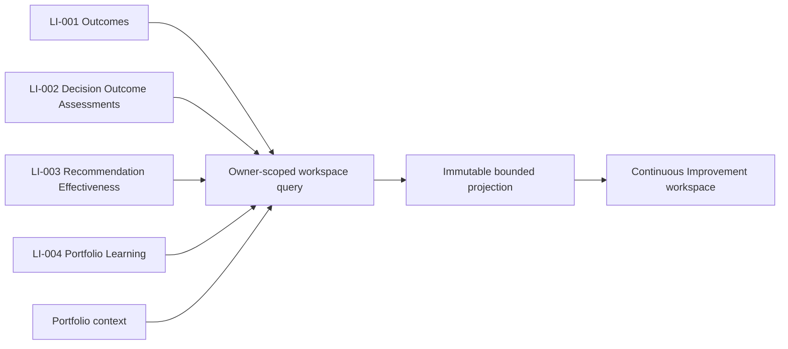
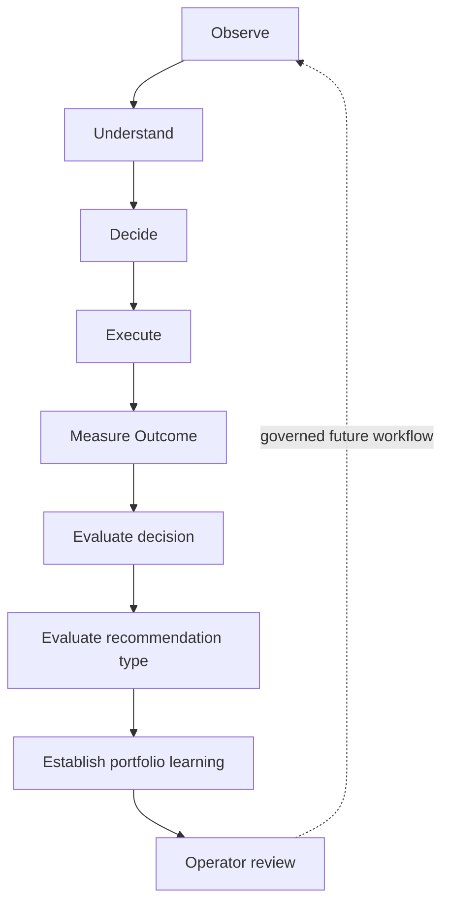
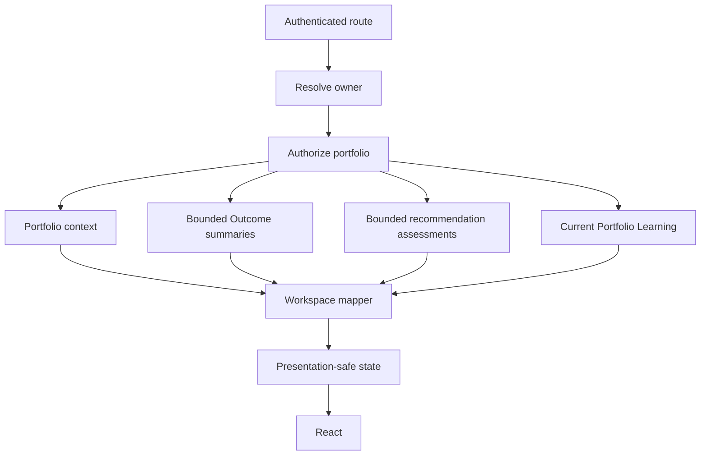
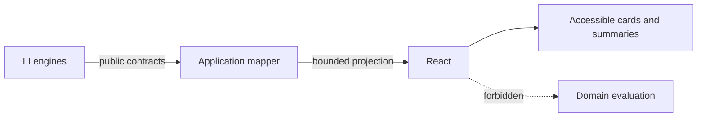
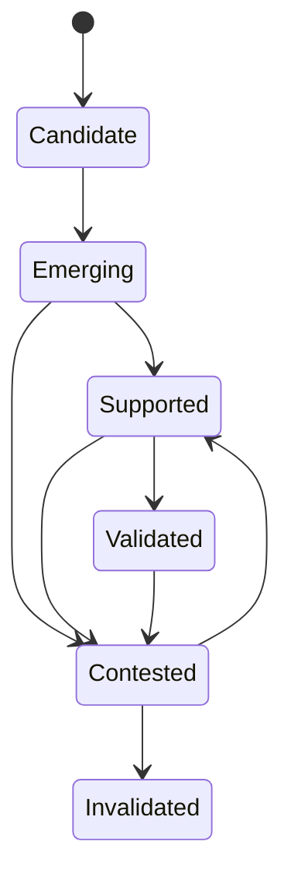

# LI-005 — Continuous Improvement Workspace

## Mission and lifecycle role

Continuous Improvement is the canonical operator workspace for Learning Intelligence. It explains what was measured, whether decisions worked, whether recommendation types have worked repeatedly, and which portfolio patterns are supported. It does not evaluate or mutate those records.

The canonical route is `/dashboard/learning`. The HPM `Learn` lifecycle stage owns the **Continuous Improvement** navigation entry. Outcomes, Decision Outcome Assessments, Recommendation Effectiveness, and Portfolio Learning remain local sections rather than separate global destinations.

The workspace creates no Action and changes no Decision, Outcome, Recommendation, Portfolio, policy, score, or assumption.

## Information architecture

The integrated v1 route contains the workspace header and observation window, executive summary, Attention Required, What Changed, Decision Outcomes, Recommendation Effectiveness, Portfolio Learnings, Assumption Accuracy, Execution Patterns, Measurement Quality, and a secondary confidence/limitations/lineage panel.

This order puts harm, material changes, and evidence limitations before deeper analysis.

## Query and projection

`GetContinuousImprovementWorkspaceQuery` requires owner, portfolio, and observation-window scope. The authenticated server boundary supplies owner identity. Optional limits are capped in application mapping.

The service authorizes the portfolio before sensitive fan-out. Once authorized, independent Outcome, Recommendation Effectiveness, and Portfolio Learning reads run concurrently. Optional failures produce a `degraded` state and typed limitations. Mandatory portfolio failure remains a route error.

The state union represents `ready`, `no-outcomes`, `measurement-in-progress`, `insufficient-evidence`, and `degraded`. Its deeply readonly projection excludes source aggregates, persistence rows, provider DTOs, full evidence payloads, unrestricted notes, and assessment fingerprints.

The production composition exposes canonical reader ports. LI-005 adds no migration. Until production adapters for LI-001 through LI-004 are configured, the route fails safely instead of inventing portfolio context or sample intelligence.

## Presentation boundary

React renders canonical projection fields. It does not calculate variance, classify an Outcome, aggregate recommendation effectiveness, detect a learning pattern, calculate maturity/materiality/confidence/applicability/priority, or infer causality.

Display-only code maps stable codes, dates, and confidence labels.

## Outcome and recommendation presentation

The decision distribution preserves successful, partially successful, unsuccessful, harmful, and inconclusive counts separately. Inconclusive is never added to failure. Outcome cards show subject and decision lineage, primary objective status, distinct guardrails, unexpected negative effects, attribution, evidence sufficiency, confidence, and evaluation time. Harm has textual and visual priority without blame language. Inconclusive explains that evidence did not support a conclusion.

Recommendation cards consume LI-003 recommendation-type assessments. They show effectiveness, quality, sample, success and harm rates, repeatability, confidence, readiness, conditional applicability, and trend only when comparable. Severe harm stays visible independently of success. Deprecated is descriptive and does not disable a recommendation.

## Portfolio Learning

Learning cards show stable statement mappings, category, type, maturity, materiality, confidence, evidence counts, consistency, applicability, contradiction, freshness, and scope. Every claim states that it is supported within this portfolio.

Maturity is textual, not color-only. Contradictory evidence uses an accessible disclosure and keeps supporting and contradicting counts. Invalidated records remain historical when supplied by LI-004.

Assumption Accuracy selects only canonical assumption-bias learnings and shows magnitude only when authoritative. Execution Patterns preserve non-causal relationship language. Measurement Quality isolates missing baselines, weak attribution, incompatible windows, and inconclusive recurrence from business failure.

## Changes, attention, freshness, and lineage

What Changed consumes compatible LI-004 comparison records. Without a comparable prior assessment, it explicitly says so rather than showing “no change.”

Attention is bounded and preserves upstream severity for harmful Outcomes, severe recommendation harm, declining comparable recommendation assessments, critical or contested learnings, and stale intelligence. It creates no Action.

Freshness detects an Outcome assessment newer than Portfolio Learning and changed portfolio versions. Policy versions remain in the secondary lineage panel; internal fingerprints do not reach presentation.

## Early and degraded states

With no completed Outcomes, the workspace shows planned/measuring counts but no success rate. Measuring Outcomes produce a progress state. Completed assessments without enough diverse portfolio evidence produce an insufficient-evidence state. One Outcome can support one decision assessment but never a validated portfolio learning.

Optional source failures degrade visibly. Missing data is never represented as zero.

## Accessibility and responsive behavior

The route uses the shell main landmark and one page heading. Sections have explicit heading relationships. Harmful, inconclusive, maturity, contradiction, confidence, and readiness have textual names. Evidence uses native `details`/`summary`; navigation and retry controls have visible focus; loading and errors use live-region semantics; loading motion respects reduced motion.

Cards stack in mobile reading order and expand at tablet and desktop widths. No primary content requires a horizontal table or tooltip.

## Security, performance, caching, and telemetry

- Authentication and owner resolution occur server-side.
- Authorization precedes fan-out and cross-owner access is concealed.
- Initial render uses one composed query.
- Collections have application-enforced caps.
- Reads run in parallel after authorization.
- No component loads data; no N+1 reference lookup exists.
- No aggregate or full evidence graph is serialized.

Future adapters should use portfolio-scoped cache tags: `learning-outcomes:{portfolioId}`, `learning-decisions:{portfolioId}`, `learning-recommendations:{portfolioId}`, `portfolio-learning:{portfolioId}`, and `learning-workspace:{portfolioId}`.

Telemetry may record workspace/section interaction names, but must exclude financial variance, names, recommendation text, learning statements, evidence, owner/portfolio identifiers, and fingerprints.

## Deferred governance

Refresh orchestration, Outcome creation, measurement recording, learning review, policy application, and Action creation remain unavailable or deferred capabilities. A future governed workflow may enable them. LI-005 is read-only.
