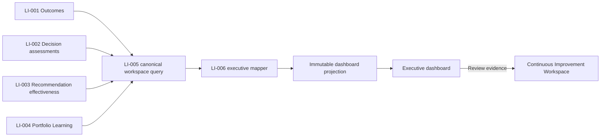
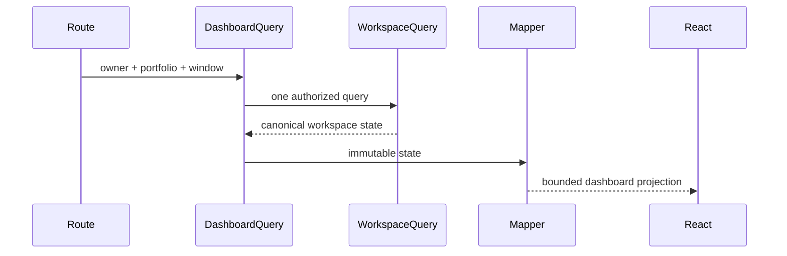
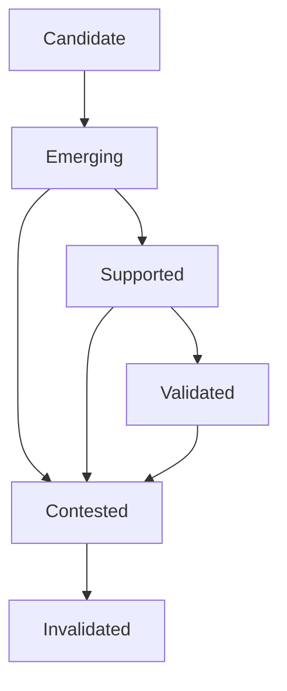
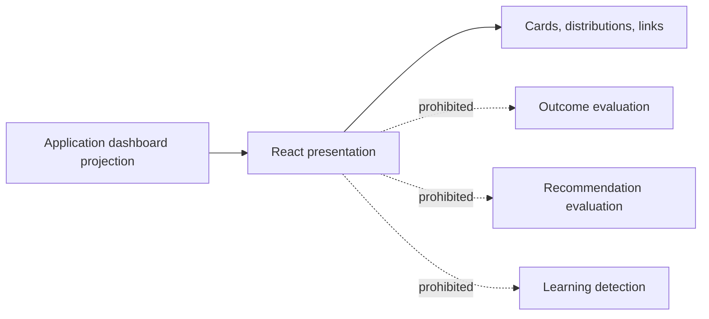

# LI-006 — Learning Intelligence Dashboard

## Mission

The Learning Intelligence Dashboard gives leadership a trustworthy portfolio learning orientation in under one minute. It summarizes Learning Health, decision quality, recommendation reliability, strongest learnings, recurring misses, assumption accuracy, measurement readiness, change, attention, and freshness.

It is the Learn-stage landing page at `/dashboard/learning`. The detailed LI-005 Continuous Improvement Workspace remains at `/dashboard/learning/workspace`.

## Dashboard versus workspace

The dashboard provides rapid executive orientation. It deliberately omits individual Outcome detail, rich evidence, and deep contradiction analysis. The workspace provides those investigative experiences. Every executive conclusion links to the portfolio-scoped workspace.

Navigation remains one flat HPM lifecycle entry—**Learn / Learning Intelligence**—consistent with the platform shell. Dashboard and workspace ownership are expressed through canonical routes, breadcrumbs, and in-page navigation rather than nested global navigation.

## Projection and query

`GetLearningDashboardQuery` requires authenticated owner identity, portfolio identity, and an explicit observation window. `createGetLearningDashboard` invokes the owner-scoped LI-005 workspace query exactly once and maps that immutable result into an executive projection.

The dashboard mapper—not React—derives:

- Learning Health;
- decision-quality status and compatible trend;
- recommendation quality distribution and reliability label;
- learning maturity distribution;
- strongest policy-approved learnings;
- recurring misses;
- bounded executive changes and attention;
- measurement readiness summary.

The projection is readonly and presentation safe. It contains no source aggregates, provider DTOs, persistence rows, raw evidence payloads, or internal fingerprints.

## Learning Health

Learning Health is an executive assessment distinct from any individual Portfolio Learning:

- **Strong**: multiple validated learnings, high confidence, and strong measurement readiness;
- **Healthy**: supported or validated evidence with acceptable confidence;
- **Developing**: candidate or emerging patterns are accumulating;
- **Limited**: measurement or compatibility limitations materially constrain learning;
- **Insufficient evidence**: there is no evidence-backed learning base yet.

Unknown or missing evidence never becomes low health by arithmetic accident. Early states omit Learning Health entirely.

## Decision quality and recommendation reliability

Decision Quality summarizes the authoritative LI-002 classification distribution. Successful, partially successful, unsuccessful, harmful, and inconclusive remain distinct. The mapper never reclassifies an Outcome and the UI never adds inconclusive to failure.

Recommendation Reliability summarizes LI-003 quality classifications—validated, conditional, experimental/promising, deprecated, and insufficient evidence. A trend appears only when canonical recommendation assessments are comparable. Deprecated remains descriptive and never disables a recommendation.

## Learnings and recurring misses

Strongest Learnings include only validated or supported LI-004 learnings. Cards preserve portfolio scope, confidence, materiality, applicability, evidence counts, and contradiction.

Recurring misses are bounded, evidence-backed LI-004 failure, assumption-bias, measurement, guardrail, or harmful patterns. The dashboard does not discover patterns. Emerging and contested learnings remain visibly less mature.

## Assumption accuracy and measurement readiness

Assumption Accuracy uses authoritative LI-004 effect values. It maps optimistic and conservative bias codes but never recalculates variance. Missing effect magnitude is shown as unavailable.

Measurement Readiness summarizes the canonical readiness state alongside completed, incomplete, and inconclusive Outcome counts and missing-baseline learning patterns. Measurement weakness remains separate from business failure.

## Changes, attention, freshness, and lineage

What Changed displays only comparison records supplied as compatible by Learning Intelligence. Without a compatible prior assessment, the dashboard says so rather than fabricating a stable trend.

Attention preserves the upstream rank and severity from LI-005 composition. It highlights harmful Outcomes, recommendation degradation, major bias, measurement weakness, and contested critical learnings without creating an Action.

Freshness and policy lineage are explicit. Stale intelligence displays reevaluation guidance. Internal snapshot fingerprints are excluded.

## Empty and degraded states

No-Outcomes and measurement-in-progress states show portfolio measurement status and a workspace link, but no Learning Health, decision quality, recommendation reliability, or trend.

Optional source failure produces a degraded dashboard with visible limitations. Missing sections are not represented as zero. Mandatory portfolio and authorization failures remain safe route-level errors.

## Presentation boundary

Dashboard components load no data, invoke no engine, mutate no domain record, modify no policy, and create no Action. Presentation performs display-only date, percentage, title, and confidence-label formatting.

## Accessibility and responsive behavior

The page has one heading, semantic labeled sections, textual health/classification/maturity states, accessible distribution group labels, live degraded/stale notices, visible focus, reduced-motion loading, and mobile-first card ordering. No conclusion relies on color, tooltip, or chart alone.

## Security, performance, and telemetry

- The authenticated server resolves owner identity.
- The underlying workspace query authorizes before fan-out and conceals cross-owner scope.
- Initial render uses one dashboard query and one underlying workspace composition.
- Dashboard collections are capped in the application mapper.
- No N+1 reads or full evidence serialization occurs.
- Production readers remain ports; LI-006 adds no migration.

Telemetry may record dashboard opened, workspace link selected, and executive section selected. It must exclude owner/portfolio identifiers, financial values, recommendation text, learning statements, evidence, and fingerprints.

## Deferred behavior

Refresh Learning remains a server-only deferred capability until orchestration is approved. Editing Outcomes or learnings, policy changes, recommendation generation, Action creation, AI summaries, governance automation, and scenario modeling remain out of scope.
