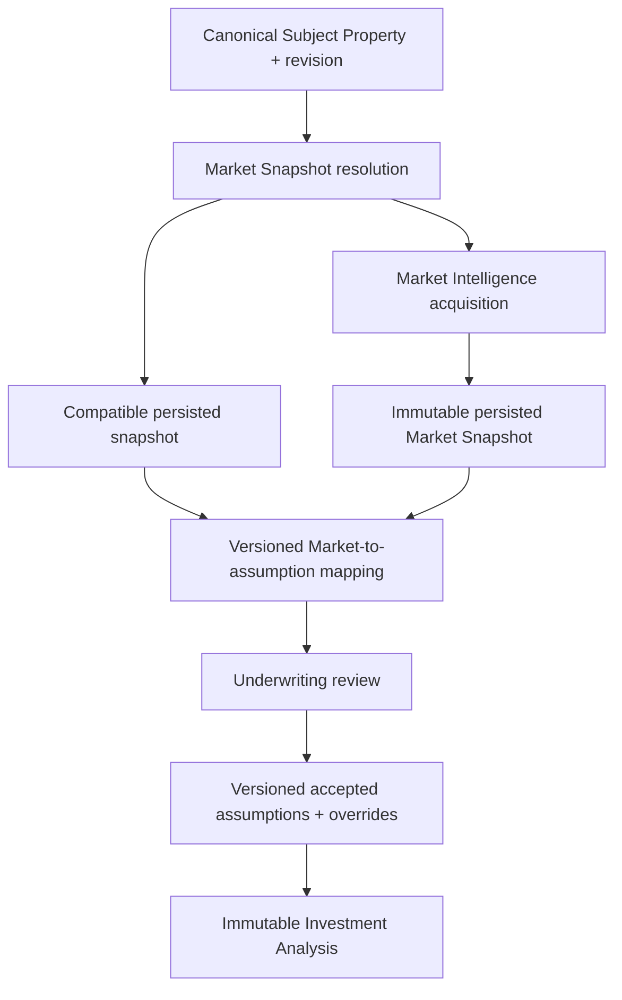

# MA-001 — Live Market Snapshot Integration

## Status

**Status:** Planned  
**Owners:** Investment Intelligence and Market Intelligence  
**Phase:** Market Intelligence Activation  
**Depends on:** MI-002 Market Data Strategy, IW-001 Canonical Subject Property, IW-002 Investment Underwriting Workspace, existing Market Intelligence provider boundary, canonical Observations/evidence, and immutable Investment analyses  
**Primary product outcome:** A user can load current market evidence into an underwriting draft without manually re-entering supported ADR, occupancy, revenue, or comparable assumptions.

## Purpose

Connect Market Intelligence to the Investment Underwriting Workspace so an investor
can resolve, acquire, review, accept, and selectively override an immutable Market
Snapshot for a Canonical Subject Property.

MA-001 is an integration and orchestration milestone. It does not create a new
provider model, comparable engine, confidence model, recommendation policy, or
underwriting calculator.

It answers:

> What market evidence is currently available for this property, and how should it
> propose—not silently determine—the underwriting assumptions?

## Current-state baseline

The repository already contains part of this path:

- the authenticated Investment workspace server action constructs Market providers
  server-side;
- `runInvestmentWorkspaceAnalysis` resolves a property, runs Market analysis,
  builds Investment Market context, composes assumptions, and runs Investment
  analysis;
- `buildInvestmentMarketContext` is the sole Investment-owned adapter from the
  canonical Market report;
- current Market analysis supports sale valuation and long-term rent evidence;
- current ADR and occupancy remain explicit operator inputs because the active
  RentCast path is not authoritative STR evidence;
- provider failures can fall back to supplied assumptions without exposing
  credentials or raw errors;
- the workspace run retains in-memory Market report and lineage and can issue a
  temporary save token.

MA-001 must extend, not duplicate, this implementation. The missing product and
architecture capabilities are:

- persisted reusable Market Snapshot resolution;
- explicit snapshot selection for a draft;
- observation-level freshness and suitability;
- reviewable market-to-assumption proposals;
- accept/override/restore per assumption;
- durable assumption versions and override audit;
- exact snapshot/version lineage in saved analyses;
- asynchronous acquisition recovery where used;
- support for MI-002-qualified STR observations when available.

No compatibility path may be removed until characterization and migration tests
prove equivalent behavior.

## Product outcome

### Before MA-001

```text
Subject Property / address input
  → live Market request during analysis
  → sale/LTR Market context where supported
  → operator supplies ADR and occupancy
  → generate analysis
```

### After MA-001

```text
Canonical Subject Property revision
  → resolve compatible persisted Market Snapshot
  → reuse or request live acquisition
  → review evidence-backed proposed assumptions
  → accept, override, restore, or manually complete gaps
  → create Assumption Version
  → generate immutable Investment Analysis
```

The investor remains responsible for the final underwriting assumptions. Market
Intelligence supplies attributable proposals, not invisible conclusions.

## Ownership boundary



Market Intelligence owns:

- provider selection and adapters;
- acquisition and provider errors;
- Market Observations, evidence, reconciliation, gaps, and confidence;
- Market Snapshot validity and persistence;
- metric semantics and effective periods.

Investment Intelligence owns:

- the narrow provider-neutral Market context projection;
- mapping Market evidence to proposed underwriting assumptions;
- operator acceptance/override/restore workflow;
- final assumption version and source precedence;
- analysis generation and analysis lineage.

The Underwriting Workspace owns orchestration and presentation only.

## Market Snapshot naming and compatibility

The repository currently has two related contracts:

- Market Intelligence’s canonical `MarketAnalysisReport`, containing subject,
  valuation/rent sections, observations, evidence, confidence, risks, gaps, lineage,
  and analysis time;
- Investment Intelligence’s narrow `MarketSnapshot` analysis input, containing
  market name, ADR, occupancy, trend, growth, and seasonality.

MA-001 must not treat these as two authorities.

For this requirement, **Market Snapshot** means the immutable, persisted
Market-owned evidence envelope for a Subject Property and effective context. Its
content is the canonical Market report/Observation evidence captured with durable
snapshot identity, schema version, and source lineage. The Investment
`MarketSnapshot` remains a compatibility/engine projection produced through the
Investment-owned adapter until migrated.

MA-001 may add persistence and resolution around the canonical Market report; it
must not redesign Market calculations or permit Investment to persist its narrow
projection as the Market authority.

## Goals

MA-001 must:

- resolve the most suitable current Market Snapshot for a Subject Property;
- acquire and persist a new snapshot when no suitable snapshot exists;
- map supported Market observations into proposed underwriting assumptions;
- distinguish Market, user, override, Learning, and default origins;
- preserve provenance, confidence, freshness, methodology, and effective period;
- let users accept, override, restore, or manually supply individual values;
- preserve original Market evidence after override;
- bind analysis to exact property, snapshot, mapping, and assumption versions;
- support partial evidence without fabricating values;
- avoid unnecessary provider calls, latency, and cost;
- keep Investment code independent of providers and provider-selection rules;
- preserve manual underwriting during outages and unsupported coverage.

## Non-goals

MA-001 does not:

- decide the long-term provider strategy owned by MI-002;
- expose provider clients, credentials, DTOs, or raw errors to the browser;
- redesign Market Snapshot calculations, comparable weighting, or confidence;
- implement the full Comparable Explorer;
- allow editing of an immutable Market Snapshot;
- silently replace accepted draft assumptions after refresh;
- automatically rerun or overwrite an Investment analysis;
- infer unsupported values to satisfy readiness;
- make a provider authoritative because it returned a value;
- implement full refresh-to-prior-analysis comparison owned by MA-003;
- change Investment formulas or recommendation policy.

## Primary user stories

### Load market intelligence

As an investor, I can reuse or retrieve Market evidence for the property so I do
not research and enter every supported assumption manually.

### Review before use

As an investor, I can inspect source, method, confidence, freshness, effective
period, and gaps before adopting a proposed value.

### Override a Market proposal

As an investor, I can replace an editable Market proposal with my own value while
retaining the Market evidence.

### Preserve evidence and judgment

As an investor, I can distinguish what the Market supported from what I chose to
underwrite.

### Continue with incomplete evidence

As an investor, I can manually resolve permitted gaps and proceed when policy
allows, with confidence and provenance impacts visible.

### Reuse evidence

As an investor, I can select a sufficiently current persisted snapshot rather than
incurring unnecessary provider cost and latency.

## Core workflow

```text
Open Underwriting Workspace
  → load authorized Canonical Subject Property revision
  → resolve compatible Market Snapshot
      ├── suitable snapshot: load it
      ├── no suitable snapshot: offer acquisition
      ├── incompatible snapshot: explain why
      └── Market unavailable: preserve draft/manual path
  → persist newly acquired snapshot before selection
  → map observations to proposed assumptions
  → review proposals, evidence, freshness, and gaps
  → accept, override, restore, or supply missing values
  → commit Assumption Version
  → generate immutable Investment Analysis
  → persist property/snapshot/mapping/assumption lineage
```

## Preconditions

The user must have:

- authenticated workspace access;
- permission to evaluate the Subject Property;
- a valid Canonical Subject Property ID;
- access to the selected Subject Property revision;
- sufficient provider-neutral location and property identity for the requested
  Market analysis.

Lookup inputs may include:

- canonical coordinates;
- normalized address;
- postal code;
- canonical market/geographic identity;
- property type;
- bedrooms, bathrooms, sleeps, and other characteristics required by the Market
  request.

The application builds a provider-neutral command from the Canonical Subject
Property contract. It never passes raw UI form state to provider adapters.

## Snapshot resolution

The application resolves the best compatible persisted snapshot before considering
live acquisition.

Compatibility includes:

- authorized workspace/tenant scope;
- Canonical Subject Property ID and revision compatibility;
- geography and coordinate/address identity;
- property type;
- bedrooms, bathrooms, and sleeps when material;
- operating strategy/evidence family;
- effective period and time horizon;
- observation freshness by metric;
- snapshot schema and mapping versions;
- snapshot status;
- required observation coverage;
- reconciliation and policy versions;
- permitted retention/use status.

Equivalent product states:

```ts
type MarketSnapshotResolution =
  | Readonly<{
      status: "available";
      snapshotId: string;
      snapshotVersion: number;
      suitability: "current" | "aging";
    }>
  | Readonly<{
      status: "missing";
      reasonCode: string;
      message: string;
    }>
  | Readonly<{
      status: "incompatible";
      snapshotId: string;
      snapshotVersion: number;
      reasonCode: string;
      message: string;
    }>
  | Readonly<{
      status: "unavailable";
      reasonCode: string;
      message: string;
      retryable: boolean;
    }>;
```

Names may change, but `missing`, `incompatible`, and operationally `unavailable`
must remain distinguishable. A provider failure is not a missing snapshot.

### Selection policy

The resolution policy must be deterministic and versioned. It ranks only eligible
snapshots and records:

- candidates evaluated;
- exclusions and reasons;
- selected snapshot;
- suitability;
- policy version;
- evaluated timestamp.

Recency alone cannot select a semantically incompatible snapshot. Provider identity
cannot be an implicit tie-breaker.

## Freshness and time-horizon fitness

A snapshot is not “live” merely because Luxe Haven retrieved it recently.

Every relevant observation preserves:

- `retrievedAt`: when Luxe Haven acquired it;
- effective time/range: the period represented;
- origin-provider update time when available;
- freshness status under a metric-specific policy;
- intended decision horizon;
- freshness-policy version.

Presentation states:

- current;
- aging;
- stale;
- unknown.

Thresholds may differ for:

- listing status and availability;
- near-term rates;
- ADR and occupancy expectations;
- annual revenue;
- historical trends;
- regulatory evidence;
- property characteristics;
- comparable sets.

Snapshot-level freshness is a conservative projection of its required observation
states. It never implies that every observation shares one date or status.

## Snapshot acquisition

When no suitable snapshot exists, an authorized user may request Market
Intelligence.

The server-side workflow:

1. authenticates and authorizes workspace/property access;
2. loads the selected Subject Property revision;
3. validates the provider-neutral Market request;
4. resolves or coalesces an equivalent in-flight acquisition;
5. invokes the Market Intelligence application boundary;
6. allows Market Intelligence to select providers under configured policy;
7. collects attributable Observations and evidence;
8. preserves gaps, conflicts, reconciliation, and provider failures;
9. validates the canonical Market result;
10. persists the immutable snapshot transactionally;
11. returns a normalized provider-neutral integration result;
12. records operational diagnostics and cost.

Investment Intelligence must never:

- call RentCast, AirROI, AirDNA, RealtyAPI, Mashvisor, BNBCalc, or another provider;
- import provider Infrastructure;
- contain provider credentials;
- select a provider or fallback;
- parse provider DTOs or error envelopes.

The current composition root directly constructs RentCast adapters. MI-002
implementation may change composition/provider policy without changing this
contract.

## Snapshot status

Equivalent workspace states:

```ts
type MarketIntegrationStatus =
  | "not-requested"
  | "loading-existing"
  | "ready"
  | "refresh-available"
  | "acquiring"
  | "partial"
  | "unavailable"
  | "failed";
```

State semantics:

- `ready`: a compatible selected snapshot and proposals are available;
- `refresh-available`: selected snapshot remains usable and a newer candidate may
  be acquired or reviewed;
- `partial`: valid evidence exists but material observations are missing;
- `unavailable`: no qualified evidence is available; manual path may remain;
- `failed`: acquisition/resolution failed operationally and existing draft values
  were not changed.

Blank state is not an error or readiness state.

## Market-to-underwriting mapping

MA-001 defines a versioned mapping from Market observations to proposed Investment
assumptions. It extends the existing `buildInvestmentMarketContext` boundary rather
than bypassing it.

At minimum, evaluate:

| Market output | Proposed Investment use |
|---|---|
| Projected ADR | ADR assumption candidate |
| Projected occupancy | Occupancy assumption candidate |
| Projected RevPAR | Supporting consistency evidence; not an editable duplicate unless policy requires |
| Projected annual revenue | Reference/validation value; not silently authoritative |
| Seasonality profile | Monthly distribution candidate |
| Average length of stay | Operating assumption candidate |
| Qualified comparable summary | Supporting evidence |
| Market confidence | Source confidence context; not Investment decision confidence |
| Historical trend | Risk and confidence context |
| Observation freshness | Readiness/warning state |
| Sale valuation | Market-value evidence; never purchase price |
| Long-term monthly rent | Lease/rent evidence; never ADR |

The mapping records:

```ts
type MarketAssumptionProposal = Readonly<{
  proposalId: string;
  mappingVersion: string;
  snapshotId: string;
  snapshotVersion: number;
  assumptionKey: string;
  proposedValue: unknown;
  unit: string;
  sourceObservationIds: readonly string[];
  sourceEvidenceIds: readonly string[];
  confidence?: unknown;
  freshness: "current" | "aging" | "stale" | "unknown";
  effectivePeriod?: Readonly<{ from: string; to: string }>;
  method: "reported" | "modeled" | "derived";
  status: "proposed" | "missing" | "blocked" | "reference-only";
}>;
```

Exact types may differ. Identity, version, units, source observations/evidence,
method, freshness, and effective period are mandatory equivalents.

The Market Snapshot remains immutable. Mapping creates a proposal projection.

## Assumption origin and precedence

Every committed underwriting assumption records one origin:

```ts
type AssumptionOrigin =
  | Readonly<{
      type: "market-derived";
      snapshotId: string;
      snapshotVersion: number;
      observationIds: readonly string[];
      evidenceIds: readonly string[];
      mappingVersion: string;
    }>
  | Readonly<{
      type: "user-entered";
      actorId: string;
    }>
  | Readonly<{
      type: "user-override";
      actorId: string;
      proposalId: string;
      snapshotId: string;
      snapshotVersion: number;
      observationIds: readonly string[];
      mappingVersion: string;
      reason?: string;
    }>
  | Readonly<{
      type: "approved-learning";
      learningReferenceIds: readonly string[];
      policyVersion: string;
    }>
  | Readonly<{
      type: "system-default";
      policyVersion: string;
    }>;
```

The existing source-precedence policy remains:

```text
Explicit operator value
  > approved applied Learning
  > usable canonical Market evidence
  > Investment system default
```

MA-001 does not change precedence. It makes resolution visible and durable.

## Review and acceptance

Before analysis generation, the user sees every relevant proposal:

| Assumption | Proposed value | Confidence | Freshness | Origin | Draft status |
|---|---:|---|---|---|---|
| ADR | $248 | High | Current | Market Snapshot | Accepted |
| Occupancy | 68% | Moderate | Current | Market Snapshot | Accepted |
| Annual revenue | $61,547 | Moderate | Current | Derived reference | Reference |
| Cleaning cost | Unavailable | Unavailable | Unknown | Missing | Required |

Each editable proposal supports:

- accept;
- override;
- restore exact proposal;
- inspect evidence;
- see requirement/gap classification;
- see whether analysis can proceed.

Default acceptance is permitted only when:

- proposed values are visibly rendered before generation;
- origin labels are present without relying on color;
- the user explicitly generates the analysis from the displayed draft;
- policy permits that assumption;
- stale/unknown/limited warnings are not hidden.

No value is applied invisibly.

## Manual overrides

An override records:

- proposal ID and original value;
- snapshot ID/version;
- observation/evidence IDs;
- mapping version;
- user value and unit;
- actor and timestamp;
- optional/required rationale under policy;
- resulting assumption version.

Example:

```text
Projected occupancy
Market proposal: 68%
Operator override: 62%
Reason: Conservative underwriting
```

The override changes only the draft/final assumption. It does not change:

- Market Snapshot;
- provider Observation or confidence;
- reconciliation result;
- prior assumption versions;
- prior analyses.

Provider disagreement is not resolved by an Investment override. The user is
choosing an underwriting assumption, not rewriting Market truth.

## Restore proposal

Before analysis generation, restore:

- removes the active override from the current draft;
- reapplies the exact proposal ID/value from the selected snapshot/mapping;
- preserves persisted draft audit history;
- creates a new committed draft revision where persistence has occurred;
- performs no provider call and no remapping.

If the selected snapshot or mapping changes, “restore” must specify which proposal
version is being restored.

## Missing observations and readiness

Missing evidence is never fabricated.

Every gap is classified as:

- blocking;
- user-resolvable;
- optional;
- informational.

For each missing assumption, display:

- key and description;
- whether it is required for the selected route;
- known reason;
- whether manual entry is permitted;
- confidence/readiness impact;
- recovery action.

Example:

> Occupancy evidence is unavailable for this geography. Enter an explicit
> occupancy assumption to continue. The analysis will record it as user-sourced
> and retain the Market evidence gap.

Underwriting readiness is owned by a route-specific Investment policy. Market
Snapshot completeness alone does not decide readiness.

## Partial acquisition

A valid snapshot may contain:

```text
Property details: available
Comparable set: available
ADR: available
Occupancy: unavailable
Historical trends: unavailable
```

If Market validity policy permits persistence, MA-001:

- persists and selects the partial snapshot explicitly;
- maps supported proposals;
- leaves unsupported assumptions unresolved;
- preserves gaps and confidence effects;
- allows manual resolution where route policy permits;
- distinguishes partial success from operational failure.

## Provider disagreements

MA-001 does not independently reconcile providers. It consumes the adopted Market
value and reconciliation metadata.

The summary may display:

```text
ADR proposal: $248
Two origin sources contributed.
The source estimates differed materially.
Market reconciliation policy: market-reconciliation.v2
Confidence impact: moderate
```

Detailed provider evidence remains behind authorized Market/evidence views.
Investment code never imports provider-specific reconciliation logic.

## Revenue semantic consistency

Before proposing related ADR, occupancy, RevPAR, and revenue, the mapping validates:

- property versus market scope;
- strategy;
- effective period and time grain;
- currency;
- available-night denominator;
- fees and taxes;
- gross/net boundary;
- modeled versus observed status;
- seasonality;
- derivation and uncertainty.

Related metrics need not reconcile arithmetically when their semantics differ. The
UI must explain incompatibility rather than imply an equation.

Any Luxe Haven derivation records:

- input Observation IDs;
- formula/policy version;
- output metric/unit;
- time grain and effective period;
- uncertainty/confidence method;
- derivation owner.

RevPAR and annual revenue remain reference evidence unless the route mapping
explicitly owns them as assumptions. Duplicate editable assumptions must not create
an internally inconsistent underwriting model.

## Analysis generation and lineage

Generated immutable Investment analysis records:

- workspace-run and analysis IDs;
- Canonical Subject Property ID/revision;
- selected Market Snapshot ID/version;
- Market analysis/report identity;
- assumption version;
- mapping version;
- accepted proposal IDs and values;
- active override IDs and user values;
- user-entered gap resolutions;
- unresolved Market gaps;
- Market and Investment confidence inputs separately;
- Observation/evidence IDs;
- source-precedence and calculation policy versions;
- generated/analyzed timestamp.

The analysis remains reproducible after:

- Market refresh;
- mapping or provider change;
- later draft/scenario edits;
- provider removal;
- reconciliation-policy change.

Historical analysis reads use stored snapshots/lineage and never resolve “current”
Market evidence.

## Reanalysis

Reanalysis creates a new run:

```text
Immutable Analysis V1 + Snapshot A
  → restore user-authored assumptions only
  → select Snapshot A or explicit newer Snapshot B
  → review proposals and overrides
  → commit Assumption Version 2
  → generate immutable Analysis V2
```

V1 remains unchanged. Existing reanalysis policy must not hydrate prior Market,
Learning, default, derived, score, confidence, recommendation, or evidence outputs
as user input.

## Existing opportunities

For an existing Investment Opportunity, show separately:

- snapshot used by the current analysis;
- snapshot selected by the current draft, if any;
- newer compatible snapshot available;
- acquisition in progress;
- no compatible newer evidence.

`Used by current analysis` and `Newer evidence available` are distinct states.
MA-003 owns the full old/new refresh comparison, but MA-001 must preserve the
identities required for it.

## User interface

### Market Intelligence card

Displays:

- resolution/integration status;
- snapshot ID/version;
- retrieved time;
- effective period;
- metric-level and snapshot-level freshness;
- Market confidence;
- comparable count by applicable family;
- key proposed assumptions;
- gaps and conflicts;
- selected/used/newer distinction;
- primary safe action.

Actions, depending on state:

- load existing evidence;
- request Market acquisition;
- use this snapshot;
- review proposals;
- retry acquisition;
- view evidence;
- acknowledge/choose newer snapshot.

### Origin indicators

Use text/icon labels:

- Market-derived;
- user override;
- manual;
- approved Learning;
- system default;
- missing.

Color alone cannot convey origin, freshness, confidence, or status.

### Loading and recovery

Acquisition:

- shows truthful stage/status without fictional percentages;
- prevents duplicate submission;
- preserves draft work;
- survives page reload through durable job/result identity when asynchronous;
- communicates in-progress state;
- restores completed results;
- permits safe navigation only when no draft work is lost.

### Actionable errors

Examples:

- configuration: “Market Intelligence is not configured for this environment.”
- rate limit: “Market data is temporarily rate-limited. Your assumptions were not
  changed.”
- coverage: “No qualified STR Market evidence is available for this location.”
- timeout: “Market acquisition timed out. Retry or continue with manual
  assumptions.”
- authorization: “You do not have permission to retrieve Market evidence for this
  property.”

Raw provider errors, payloads, endpoints, keys, and stack traces are not exposed.

## Persistence

Persist:

- immutable successful/valid partial Market Snapshots;
- snapshot resolution/selection decision and policy version;
- selected draft snapshot ID/version;
- Market-to-assumption proposal set and mapping version;
- draft assumption versions;
- accept/override/restore history;
- acquisition job/status when asynchronous;
- analysis-to-property/snapshot/proposal/assumption/evidence lineage;
- idempotency and concurrency metadata;
- retention/disclosure metadata required by provider terms.

Do not persist:

- secrets or browser-visible provider credentials;
- prohibited raw provider payloads;
- temporary raw responses beyond permitted retention;
- raw errors containing sensitive data;
- provider or benchmark conclusions as Luxe Haven Decisions.

## Security and tenancy

Every operation:

- authenticates before lookup/acquisition;
- resolves workspace membership and property scope;
- enforces Subject Property, snapshot, opportunity, and analysis authorization;
- isolates snapshots, Observations, proposals, assumptions, jobs, and diagnostics by
  tenant;
- keeps provider clients/credentials server-side;
- sanitizes logs and client errors;
- follows provider retention and disclosure terms;
- prevents cross-workspace existence disclosure.

## Observability

Each acquisition/resolution attempt records safe operational metadata:

- correlation/run ID;
- workspace ID;
- Subject Property ID/revision;
- provider-strategy policy ID/version;
- operation and request fingerprint/deduplication key;
- start/completion time and duration;
- result and retryability;
- observation/evidence counts;
- gaps/conflicts;
- normalized provider-failure categories;
- estimated/actual credit or cost where available;
- snapshot ID/version;
- reuse, coalescing, fallback, or manual-path state.

Provider-specific diagnostic details remain Market Infrastructure data. Investment
observability references the Market run and normalized outcome.

## Performance

- persisted snapshot resolution should avoid provider calls and feel immediate;
- compatibility/freshness evaluation is local to persisted metadata;
- live acquisition may be asynchronous;
- equivalent in-flight requests are deduplicated/coalesced safely;
- retries do not create uncontrolled duplicate snapshots;
- a browser reload restores selection and completed acquisition;
- provider latency does not block access to existing drafts/history;
- explicit latency objectives are set after MI-002 proof-of-concept measurement.

## Idempotency and concurrency

Handle:

- repeated acquisition clicks;
- multiple browser tabs;
- timeout retries;
- simultaneous equivalent acquisitions;
- snapshot selection changes;
- assumption edits during acquisition;
- analysis generation while newer evidence arrives.

Required behavior:

- acquisition commands use idempotency/fingerprint identity;
- equivalent work is reused or coalesced under policy;
- selected snapshot ID/version is explicit;
- later snapshots never replace the selected draft silently;
- generation binds to the displayed accepted snapshot/proposal/assumption version;
- optimistic/transactional concurrency prevents lost draft changes;
- stale expected versions produce a resolvable conflict;
- analysis may complete against the explicitly selected older snapshot while a
  newer acquisition finishes.

## Manual underwriting compatibility

Provider access is optional for product continuity.

The user can:

- choose the manual path;
- enter route-required ADR/occupancy or other assumptions;
- proceed during provider outage or unsupported geography when readiness permits;
- see that assumptions lack Market backing;
- retain Market gaps and reduced evidence confidence.

Equivalent analysis lineage:

```ts
type MarketEvidenceSelection =
  | Readonly<{
      type: "snapshot";
      snapshotId: string;
      snapshotVersion: number;
      mappingVersion: string;
    }>
  | Readonly<{
      type: "manual";
      reasonCode?: string;
    }>;
```

Historical analyses without a Market Snapshot remain readable and valid under
their original schema.

## Application boundary

Names are illustrative, but the public contract is narrow and provider-neutral:

```ts
interface LoadInvestmentMarketContext {
  execute(input: Readonly<{
    workspaceId: string;
    subjectPropertyId: string;
    subjectPropertyRevision: number;
    strategy?: string;
    requestedDecisionHorizon?: string;
  }>): Promise<InvestmentMarketIntegrationContext>;
}

type InvestmentMarketIntegrationContext = Readonly<{
  resolution:
    | "existing-current"
    | "existing-aging"
    | "newly-acquired"
    | "partial"
    | "unavailable";
  snapshot?: Readonly<{
    id: string;
    version: number;
    retrievedAt: string;
    effectivePeriod?: Readonly<{ from: string; to: string }>;
    freshness: "current" | "aging" | "stale" | "unknown";
    confidence: unknown;
  }>;
  proposals: readonly MarketAssumptionProposal[];
  gaps: readonly Readonly<{
    code: string;
    severity: "blocking" | "user-resolvable" | "optional" | "informational";
    message: string;
  }>[];
}>;
```

Investment receives this application contract, never provider DTOs.

## Integration boundaries

### Consumes

- IW-001 Canonical Subject Property/revision;
- Market Intelligence application service and canonical Market report;
- persisted Market Snapshots;
- canonical Observations, evidence, confidence, comparables, risks, and gaps;
- IW-002 draft/assumption model;
- immutable Investment analysis versioning;
- workspace authorization and persistence.

### Produces

- selected Market Snapshot reference;
- versioned proposed assumptions;
- assumption origin/override/restore records;
- committed assumption version;
- analysis-to-snapshot/observation/mapping lineage;
- visible Market readiness, freshness, and gap state;
- safe acquisition diagnostics.

### Does not produce

- provider-specific records;
- new Market scoring or comparable algorithms;
- new recommendation logic;
- Investment conclusions or Decisions;
- automatic refresh comparisons.

## Testing requirements

### Unit

- snapshot compatibility and selection;
- metric-specific freshness/suitability;
- Market-to-assumption mapping;
- semantic consistency;
- assumption origin and precedence;
- accept/override/restore;
- gap/readiness classification;
- partial snapshot;
- manual fallback;
- analysis lineage.

### Contract and architecture

- Investment consumes only the Market application contract;
- provider DTOs/Infrastructure do not enter Investment;
- mapping and policy versions remain explicit;
- snapshot, Observation, and evidence IDs are retained;
- provider failures normalize without becoming `not found`;
- current `buildInvestmentMarketContext` behavior remains characterized.

### Integration and persistence

- Subject Property to snapshot resolution;
- existing snapshot reuse;
- live acquisition and persistence;
- valid partial acquisition;
- unsupported geography;
- timeout/failure/retry;
- duplicate/coalesced requests;
- selection persistence and page reload;
- proposal/override persistence;
- generation from accepted assumptions;
- reanalysis without mutation;
- concurrent selection/edit/generation conflicts.

### Authorization and RLS

- authorized owner/admin access;
- unauthorized role denial;
- other-owner/cross-workspace denial;
- anonymous denial;
- snapshot/Observation/proposal/job isolation;
- opportunity and analysis ownership;
- server-only provider access.

### UI and accessibility

- not-requested/loading/ready/refresh/partial/unavailable/failed states;
- current/aging/stale/unknown freshness;
- missing required assumptions;
- origin labels independent of color;
- evidence inspection;
- override and restore;
- acquisition failure and retry;
- reload recovery;
- generation binds visible selected snapshot.

### Regression

- manual analyses still work;
- current RentCast-backed live flow remains compatible before MI-002 selection;
- saved opportunities and historical analyses remain readable;
- analyses without snapshots retain their original semantics;
- existing provider fallback/error safety remains;
- reports retain prior values;
- no immutable history changes.

## Acceptance criteria

MA-001 is complete when an authorized user can:

- open IW-002 for a Canonical Subject Property revision;
- see whether a compatible persisted Market Snapshot exists;
- reuse a current/aging compatible snapshot;
- request Market acquisition when no suitable snapshot exists;
- review supported ADR, occupancy, revenue, seasonality, comparable, sale, and LTR
  proposals or explicit unavailable states;
- inspect confidence, method, freshness, effective period, provenance summary, and
  gaps;
- accept Market proposals individually;
- override editable proposals without altering Market evidence;
- restore an override to the exact original proposal;
- manually resolve permitted missing assumptions;
- generate an immutable Investment analysis from the displayed selected snapshot
  and assumption version;
- see which values were Market-derived, approved Learning, manual, overridden, or
  defaulted;
- reload without losing acquisition result, selection, or persisted draft;
- continue manual underwriting when providers are unavailable;
- preserve prior analyses and their original Market lineage;
- distinguish snapshot used by current analysis from newer available evidence;
- complete the workflow without Investment selecting/importing providers.

## Definition of Done

The milestone is done only when:

- integration uses the real Market Intelligence application boundary;
- persisted snapshot resolution and acquisition work end to end;
- provider credentials remain server-side;
- every Market-derived proposal preserves source lineage;
- partial, missing, stale, incompatible, and failed states are productive;
- manual underwriting remains available;
- no historical analysis or snapshot is mutated;
- unit, contract, architecture, integration, persistence, UI, authorization, RLS,
  concurrency, idempotency, accessibility, and regression tests pass;
- lint and typecheck pass;
- relevant test suites and production build pass;
- migration lint/RLS validation pass for persistence changes;
- `git diff --check` passes;
- the workflow is verified against at least one authorized real property and one
  failure, partial, or unsupported-data case;
- credentials, raw prohibited payloads, and sensitive logs are absent from
  committed evidence.

## Required implementation sequence

1. Complete/approve IW-001 Subject Property identity and revision contract needed
   for durable snapshot scope.
2. Characterize the current RMI-006/RMI-007 live workspace and manual fallback.
3. Define the persisted Market Snapshot envelope/repository around the canonical
   Market report without changing Market calculations.
4. Define compatibility, metric freshness, suitability, and resolution policy.
5. Implement authorized persisted-snapshot reuse and explicit draft selection.
6. Implement idempotent/coalesced acquisition and transactional snapshot
   persistence.
7. Version and extend the Investment Market mapping for reviewable proposals.
8. Implement assumption version, accept/override/restore, manual gaps, and draft
   concurrency.
9. Bind immutable analysis persistence to property/snapshot/mapping/assumption
   lineage.
10. Implement UI states, recovery, observability, cost metadata, and regression
    compatibility.
11. Validate selected MI-002 provider adapters and STR mappings only when their
    authoritative-source/evidence gates pass.

MA-002 owns full comparable exploration. MA-003 owns refresh comparison and
change-impact workflow. Provider strategy, new Market formulas, and new Investment
formulas remain outside MA-001.

## Architectural outcome

MA-001 does not make Investment Intelligence “smart” by adding another engine.

It makes existing intelligence operational:

```text
Market Intelligence
  → attributable evidence-backed proposals
  → explicit human review and judgment
  → versioned underwriting assumptions
  → immutable Investment analysis
```

The critical boundary is:

> Market Intelligence records what the evidence supports. Investment Intelligence
> records what the investor chose to underwrite.

