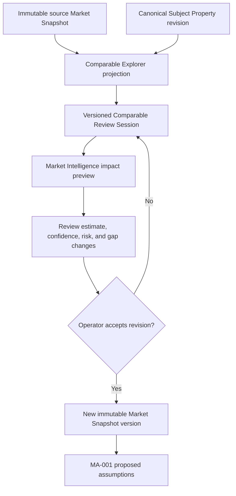

# MA-002 — Comparable Explorer

## Status

**Status:** Planned  
**Owner:** Market Intelligence  
**Phase:** Market Intelligence Activation  
**Depends on:** MA-001 Live Market Snapshot Integration, IW-001 Canonical Subject Property, Comparable Intelligence, canonical Observations/evidence, and immutable persisted Market Snapshots  
**Primary product outcome:** An investor can inspect, understand, challenge, and review the comparable evidence behind Market-derived underwriting proposals without mutating historical Market Snapshots.

## Purpose

Provide an evidence review workspace for comparable properties supporting a Market
Snapshot.

Comparable Explorer shows how candidates were acquired and qualified, why each was
included, excluded, or unresolved, how similar it is to the Canonical Subject
Property, how it influences Market estimates, and how a reviewed selection would
change proposed underwriting assumptions and confidence.

It supports professional judgment through a preview-and-commit workflow. It does
not edit provider observations or immutable Market Snapshots.

## Current-state baseline

Market Intelligence already provides:

- provider-neutral comparable acquisition;
- explicit sale-valuation, long-term-rent, and short-term-rental-performance
  purposes;
- subject-property exclusion;
- included, excluded, and unresolved candidate sets;
- deterministic eligibility and outlier reasons;
- per-dimension similarity components, weights, missing dimensions, and rationale;
- raw and normalized analytical weights;
- sufficiency, average similarity, median distance, evidence age, and gap summaries;
- weighted Market estimates with candidate IDs, values, and normalized weights;
- confidence, risk, evidence, and acquisition/qualification lineage.

Current constraints:

- the active canonical acquisition path supports sale valuation and long-term rent;
- `short-term-rental-performance` acquisition returns `unsupported`;
- current candidates do not yet contain canonical STR ADR, occupancy, RevPAR,
  revenue, sleeps, amenities, or strategy-specific similarity fields;
- current comparable UI does not provide a review-session or candidate-snapshot
  workflow;
- the existing Market report is not yet the reusable persisted snapshot contract
  introduced by MA-001.

MA-002 extends these contracts. It must not recreate similarity, weighting,
estimate, confidence, or qualification logic in React.

## Architecture boundary



The explorer never queries a provider. It operates on the complete permitted
candidate/evidence set already captured by the source snapshot.

## Ownership

Market Intelligence owns:

- comparable identity within the acquisition;
- eligibility, similarity, outlier, weighting, estimate, risk, and confidence
  policies;
- impact recalculation/preview;
- candidate snapshot creation;
- Market Snapshot versioning and lineage;
- provider/evidence disclosure rules.

Comparable Explorer presentation owns:

- filtering, sorting, search, selection display, and panel state;
- invoking Market review commands;
- presenting returned explanations and impacts.

Investment Underwriting Workspace owns:

- choosing whether to use a newly accepted snapshot;
- mapping it to underwriting proposals through MA-001;
- operator assumptions and overrides;
- generation of a new immutable Investment analysis.

## Goals

MA-002 must:

- display every permitted comparable candidate captured by a Market Snapshot;
- distinguish included, policy-excluded, unresolved, and subject-match candidates;
- explain eligibility, similarity, outlier, weight, confidence, and data gaps;
- distinguish observed facts from provider-modeled and Luxe Haven-derived metrics;
- compare a candidate directly with the Subject Property;
- allow a versioned review session with exclude, restore, and eligible include
  proposals;
- preview the Market impact through canonical Market application services;
- show numerical and explanatory changes;
- preserve the source snapshot and all historical analyses;
- create a new immutable snapshot only after explicit acceptance;
- preserve complete source/review/policy lineage;
- support limited evidence without fabricating candidates.

## Non-goals

MA-002 does not:

- edit provider Observations or provider-returned facts;
- expose raw provider payloads, credentials, or provider-specific DTOs;
- overwrite a Market Snapshot or Investment analysis;
- let users type replacement comparable metrics;
- call providers or expand the acquired candidate universe;
- implement provider selection;
- calculate underwriting financial projections;
- modify Investment assumptions or analyses directly;
- allow operator preference to bypass hard identity, eligibility, evidence, or
  semantic validity rules;
- implement general comparable acquisition/search beyond the captured snapshot;
- make a user-reviewed snapshot automatically selected in IW-002.

## Core invariants

1. Every explorer session pins one source Market Snapshot ID/version and one Subject
   Property ID/revision.
2. The source candidate set and provider Observations remain immutable.
3. Filters, search, pagination, expansion, and sort never change analytical
   inclusion.
4. Review directives are separate records; they do not change candidate facts.
5. Impact preview runs through Market Intelligence with pinned policy versions.
6. No provider call occurs during review, restore, preview, or commit.
7. Accepting a review creates a new immutable Market Snapshot version with parent
   lineage.
8. Historical snapshots, proposals, reports, and Investment analyses retain their
   original references.
9. Hard-invalid, subject-match, unresolved-critical, or prohibited candidates
   cannot be forced into an analytical set.
10. Similarity, weight, influence, confidence, and estimate changes are never
    calculated in presentation.

## Comparable collection

Each explorer is based on the complete comparable material retained by a source
snapshot:

```text
Source Market Snapshot
├── Sale valuation acquisition/qualification
│   ├── included
│   ├── excluded
│   └── unresolved
├── Long-term rent acquisition/qualification
│   ├── included
│   ├── excluded
│   └── unresolved
└── STR performance acquisition/qualification
    └── unsupported until qualified provider/policy activation
```

Subject-match candidates excluded during acquisition are represented in an audit
summary but cannot be used as their own comparable.

The explorer does not fetch “more results.” A new provider acquisition is a
separate Market operation that produces a new source snapshot.

## Comparable identity and deduplication

The same physical listing/property may appear through multiple providers.
Comparable identity must preserve:

- canonical candidate ID within the Market acquisition;
- typed property/listing identity when resolved;
- origin provider and delivery intermediary;
- all external references;
- deduplication/reconciliation status;
- conflicting source records;
- acquisition and mapping versions.

Provider disagreement does not create duplicate analytical weight unless Market
reconciliation explicitly determines that the records are distinct comparables.

## Comparable summary

Display only canonically available fields.

### Property

- address or policy-permitted location;
- distance;
- property/listing type;
- bedrooms;
- bathrooms;
- sleeps/capacity when supported;
- square footage;
- year built;
- amenities when supported;
- listing status.

### Performance/value

Depending on purpose:

- sale/listing value;
- price per square foot;
- monthly long-term rent;
- ADR;
- occupancy;
- RevPAR;
- annual revenue;
- average length of stay;
- transaction/listing/effective date.

STR fields remain unavailable until an approved STR comparable contract supplies
them. The explorer must not derive STR performance from sale or LTR fields.

### Evidence

- origin provider(s) and intermediary;
- observed/reported/modeled/derived qualification;
- retrieved and effective time;
- freshness;
- confidence when available at comparable grain;
- data gaps;
- mapping/transformation version;
- permitted evidence references.

Provider terms may require location redaction, image omission, limited attribution,
or restricted external display. The explorer follows the snapshot’s disclosure
metadata.

## Observed versus derived values

Every displayed value carries a qualification:

- provider-observed/reported;
- provider-modeled;
- Luxe Haven-normalized;
- Luxe Haven-derived;
- operator review directive;
- unavailable.

Derived values link to input Observation IDs and formula/policy version. Similarity,
normalized weight, marginal impact, and reconciled estimates are Luxe
Haven-derived unless explicitly documented otherwise.

## Similarity assessment

Every analytically evaluated comparable displays:

- overall similarity score when returned;
- dimension components;
- policy weight and effective weight;
- missing dimensions;
- explanatory rationale;
- policy version.

Current canonical dimensions:

- distance;
- square feet;
- bedrooms;
- bathrooms;
- year built;
- property type;
- recency.

Future qualified STR/MTR/LTR policies may add:

- sleeps/capacity;
- amenities;
- rate/performance band;
- occupancy/vacancy profile;
- operating strategy;
- stay length;
- neighborhood/market identity.

New dimensions require versioned Market policy and tests. The UI cannot add points
for amenities or “same neighborhood” unless the source assessment contains them.

Example presentation:

```text
Overall similarity: 92 / 100

Supporting:
✓ same property type
✓ bedroom count matches
✓ within the preferred distance

Limitations:
⚠ square footage unavailable
⚠ evidence is aging
```

The score never appears without rationale and missing-dimension disclosure.

## Eligibility and selection explanation

Each candidate displays:

- acquisition status;
- eligibility status;
- inclusion/exclusion stage;
- reason codes and plain-language descriptions;
- outlier status and rationale;
- data gaps;
- source snapshot and policy versions.

Current reason families include subject match, unsupported property type, distance,
age, missing value/rent, bedroom/bathroom/square-footage variance, unresolved
property type/coordinates/date, and hard outlier.

Provider rank/order is not an inclusion or influence reason.

## Analytical weight and influence

The explorer distinguishes:

- similarity score;
- raw weight;
- normalized analytical weight;
- estimate input value;
- marginal/counterfactual impact;
- confidence/risk impact.

Normalized weight may be displayed as:

> Represents 11% of the analytical weight in this estimate.

It must not be labeled “contributes 11% of ADR” unless the canonical calculation
contract defines that exact contribution semantics.

For explainable influence, Market Intelligence may return a leave-one-out or
selection-delta preview:

```text
If excluded:
Estimated monthly rent: $2,480 → $2,420
Confidence: high → moderate
Comparable sufficiency: sufficient → limited
Reason: the candidate had high similarity and 18% normalized weight.
```

The preview is canonical Market output. The browser does not subtract weights or
recalculate means.

## Confidence

Comparable-level and set-level confidence are distinct.

Display applicable inputs such as:

- source/provider agreement;
- observation completeness;
- freshness;
- similarity;
- outlier status;
- historical consistency/calibration;
- normalized-weight concentration;
- sample sufficiency.

An illustrative “95% completeness” appears only if a versioned completeness policy
returns it. Missing fields cannot be converted into a percentage ad hoc.

The explorer consumes confidence; it does not invent or recompute it.

## Evidence panel

Every comparable links to permitted canonical evidence:

- Observation/evidence IDs;
- origin source and delivery intermediary;
- provider/external reference where permitted;
- retrieved/effective time;
- method;
- confidence;
- candidate mapping version;
- qualification/similarity/weight/outlier policy versions;
- reconciliation/conflict metadata;
- data gaps.

Raw provider payloads are never exposed. Restricted evidence is represented by a
permitted summary and restricted-reference marker.

## Review actions

### Initial

- view;
- expand;
- compare with Subject Property;
- propose temporary exclusion;
- restore a review directive;
- propose inclusion of an eligible review candidate;
- view evidence;
- preview impact;
- discard review;
- accept review as a new snapshot version.

### Future

- bookmark;
- annotate;
- share an authorized evidence view;
- request new Market acquisition.

“Accept” means commit the reviewed candidate set through Market Intelligence. It
does not mean accept an Investment recommendation or Decision.

## Review directive model

Equivalent contract:

```ts
type ComparableReviewDirective =
  | Readonly<{
      type: "exclude";
      candidateId: string;
      reasonCode: string;
      rationale?: string;
    }>
  | Readonly<{
      type: "restore";
      candidateId: string;
    }>
  | Readonly<{
      type: "include";
      candidateId: string;
      reasonCode: string;
      rationale: string;
    }>;

type ComparableReviewSession = Readonly<{
  reviewId: string;
  revision: number;
  workspaceId: string;
  sourceSnapshotId: string;
  sourceSnapshotVersion: number;
  subjectPropertyId: string;
  subjectPropertyRevision: number;
  purpose: "sale-valuation" | "long-term-rent" | "short-term-rental-performance";
  directives: readonly ComparableReviewDirective[];
  status: "draft" | "previewed" | "accepted" | "discarded" | "superseded";
  createdBy: string;
  createdAt: string;
  updatedAt: string;
}>;
```

Names may change, but source identity, revision, actor, directives, reason, and
lifecycle are required equivalents.

## Inclusion safeguards

User judgment may challenge a soft policy result, but it cannot make invalid data
valid.

Market Intelligence classifies excluded/unresolved candidates as:

- `review-eligible`: may be proposed for inclusion and revalidated;
- `hard-excluded`: cannot be included under the current policy;
- `unresolved`: cannot be included until required evidence is resolved;
- `prohibited`: cannot be displayed/used under contract or authorization.

Examples of hard exclusions include:

- the Subject Property itself;
- identity mismatch;
- incompatible comparable purpose/strategy;
- missing required value;
- prohibited/unauthorized evidence;
- hard outlier when policy disallows override.

Accepting an include directive reruns validation. It never bypasses Market
eligibility in the UI.

## Temporary exclusion

Exclusion:

- affects only the current versioned review session;
- records candidate ID and rationale;
- creates a revised candidate selection;
- triggers no provider call;
- mutates no Observation or source snapshot;
- has no effect on IW-002 until a new snapshot is accepted and explicitly selected.

Reasons use a stable catalog, such as:

- not representative;
- identity concern;
- condition/quality mismatch;
- location mismatch;
- strategy mismatch;
- evidence concern;
- duplicate;
- other with required rationale.

An operator exclusion is a review directive, not a claim that the provider record
is false.

## Restore

Restore:

- removes the active directive for that candidate in the current review revision;
- returns the candidate to the source snapshot’s analytical state;
- preserves prior persisted review history;
- performs no provider call;
- recalculates nothing in presentation.

Restoring the full review returns the candidate selection to the source snapshot
baseline.

## Subject Property comparison

The comparison panel displays returned canonical values:

| Attribute | Subject | Comparable | Explanation |
|---|---|---|---|
| Bedrooms | Canonical value | Candidate value | Similarity component/rationale |
| Bathrooms | Canonical value | Candidate value | Similarity component/rationale |
| Sleeps | Canonical/unavailable | Candidate/unavailable | Policy-supported only |
| Property type | Canonical value | Candidate value | Eligibility/similarity reason |
| Square feet | Canonical value | Candidate value | Difference and policy threshold |
| Distance | Subject | Candidate distance | Distance policy |
| ADR | Strategy evidence | Candidate value | STR only when supported |
| Occupancy | Strategy evidence | Candidate value | STR only when supported |
| RevPAR | Strategy evidence | Candidate value | STR only when supported |

Differences are explanatory, unit-aware, and policy-backed. Missing/unavailable is
not zero.

## Impact preview

When directives change:

```text
Source Snapshot
  → source acquisition and candidate evidence
  → apply review directives
  → revalidate eligibility
  → recalculate qualification, similarity/weights, estimate, confidence, risks,
    gaps, and proposed-assumption mapping through Market application services
  → immutable preview result
```

The preview records:

- review ID/revision;
- source snapshot ID/version;
- resulting included/excluded/unresolved IDs;
- applied/rejected directives and reasons;
- Market policy versions;
- before/after estimate metrics;
- before/after confidence, sufficiency, risks, and gaps;
- MA-001 proposal impacts;
- previewed timestamp;
- deterministic input fingerprint.

No existing snapshot or Investment analysis changes.

### Impact summary

Display, when returned:

```text
Projected ADR: $248 → $236
Projected occupancy: 68% → 64%
Confidence: high → moderate
Comparable sufficiency: sufficient → limited

Why:
- one high-weight comparable was excluded;
- the revised set has lower average similarity;
- historical coverage became incomplete.
```

Numerical deltas and explanations must share the same preview ID/version.

## Candidate snapshot acceptance

Accepting a preview:

1. authenticates and authorizes the user;
2. verifies review expected revision and preview fingerprint;
3. verifies the source snapshot still exists and is authorized;
4. validates directives and policy versions;
5. creates a new immutable Market Snapshot version;
6. preserves parent/source snapshot lineage;
7. preserves the original acquisition and Observations;
8. records operator review directives and rationale;
9. persists recalculated Market results, evidence, confidence, risks, gaps, and
   policy versions;
10. marks the review accepted;
11. returns the new snapshot ID/version and new MA-001 proposals.

The new snapshot is `user-reviewed`, not provider-observed. Provenance preserves
both the acquired evidence and operator selection.

IW-002 does not switch automatically. The user explicitly selects the accepted
snapshot/proposals before generating a new analysis.

## Snapshot versioning

```text
Market Snapshot V4
  → Comparable Review R1
  → Impact Preview P1
  → Accept
  → Market Snapshot V5
      parent: V4
      selection method: operator-reviewed
      review: R1
      policies: pinned
```

V4 remains unchanged. Investment analyses referencing V4 remain unchanged.
Discarded previews do not create Market Snapshots.

## Provider disagreement

The explorer presents reconciliation returned by Market Intelligence:

```text
Origin Source A: candidate record included
Origin Source B: related record excluded or conflicting
Adopted candidate state: included
Resolution policy: comparable-reconciliation.v2
Confidence impact: moderate
```

The UI does not label providers generically as “correct” or “incorrect.” It shows
record-level conflict, adopted state, policy, and confidence impact.

## Filters and search

Filters may include:

- analytical status;
- purpose;
- distance;
- bedrooms;
- bathrooms;
- property type;
- square feet;
- value/rent;
- ADR/occupancy when supported;
- similarity;
- confidence;
- origin/intermediary;
- freshness;
- outlier state;
- data-gap state.

Search may use:

- permitted address text;
- city/locality;
- property/listing type;
- candidate/reference ID where appropriate.

Filtering/search:

- operates only on the captured permitted candidate collection;
- triggers no provider request;
- changes no review directive or impact result;
- may be client-side only when the entire authorized collection is safely loaded;
- otherwise uses an authorized server query over persisted snapshot data.

Temporary filters, sort, panel expansion, and search text are not durable business
state.

## Explorer layout

```text
Comparable Explorer
├── Source Snapshot and Subject Summary
├── Before/After Impact Summary
├── Filters, Search, and Status Tabs
├── Comparable List
├── Subject Comparison Panel
├── Evidence and Explanation Panel
├── Review Selection Summary
└── Preview / Accept / Discard Actions
```

The layout supports keyboard navigation, screen readers, responsive panels, textual
status, and non-color-only explanations.

## Explorer states

Required states:

- loading;
- ready;
- empty;
- partial;
- no comparable coverage;
- unsupported purpose;
- stale source snapshot;
- review changed;
- previewing;
- preview ready;
- preview invalidated;
- accepting;
- accepted;
- authorization denied;
- error.

Limited evidence example:

> Only four qualified comparables were identified. Confidence is limited and manual
> evidence review is recommended.

The platform never fabricates candidates to fill a minimum.

## Application boundaries

Names are illustrative:

```ts
interface GetComparableExplorer {
  execute(input: Readonly<{
    workspaceId: string;
    snapshotId: string;
    snapshotVersion: number;
    purpose: string;
  }>): Promise<ComparableExplorerProjection>;
}

interface PreviewComparableReview {
  execute(input: Readonly<{
    workspaceId: string;
    reviewId: string;
    expectedRevision: number;
    commandId: string;
  }>): Promise<ComparableReviewPreview>;
}

interface AcceptComparableReview {
  execute(input: Readonly<{
    workspaceId: string;
    reviewId: string;
    previewId: string;
    expectedRevision: number;
    commandId: string;
  }>): Promise<Readonly<{
    snapshotId: string;
    snapshotVersion: number;
  }>>;
}
```

Presentation receives canonical explorer/preview projections. It never receives a
provider DTO or a callable weighting formula.

## Persistence

Persist:

- review session identity/revision/status;
- source snapshot and Subject Property references;
- purpose;
- directives and reason codes/rationale;
- actor and timestamps;
- impact preview identity/fingerprint and canonical result snapshot;
- accepted snapshot parent/child lineage;
- recalculation and policy versions;
- idempotency/expected-version metadata;
- safe activity events.

Do not persist as business state:

- temporary filters/search/sort;
- panel expansion;
- hover/focus state;
- raw provider payloads prohibited by terms;
- client-calculated similarity, weight, confidence, or estimates.

Draft review retention and cleanup require an explicit policy. Accepted review
lineage is retained with commercial decision history.

## Security and disclosure

Users may access only:

- snapshots within authorized workspace/property scope;
- candidates/evidence permitted for their role and provider terms;
- reviews they are authorized to view or modify.

The system:

- authorizes before loading candidates/evidence;
- prevents cross-workspace existence disclosure;
- keeps provider credentials/server clients outside the explorer;
- redacts restricted address, image, owner, and provider fields;
- prevents restricted evidence from entering browser state;
- sanitizes logs and errors;
- records actor and scope for review/acceptance.

## Observability

Record:

- correlation ID;
- workspace, Subject Property, and source snapshot IDs;
- review/preview/accepted snapshot IDs;
- candidate counts by status;
- directive counts by type/reason;
- preview/accept duration;
- policy versions;
- estimate/confidence/sufficiency change categories;
- failure/retryability;
- no provider call assertion/diagnostic;
- command/idempotency identity.

Do not log sensitive addresses, raw payloads, prohibited evidence, or credentials.

## Idempotency and concurrency

Handle:

- repeated exclusion/restore clicks;
- multiple tabs editing one review;
- repeated preview/accept;
- source snapshot archive/retention change;
- policy change after preview;
- simultaneous review acceptance;
- IW-002 selection while acceptance completes.

Required behavior:

- review mutations require expected revision;
- preview is bound to an input fingerprint and policy versions;
- accept rejects stale/changed previews;
- command IDs make preview/accept idempotent;
- only one accepted result exists per successful command;
- a newer accepted snapshot never silently replaces IW-002 selection;
- conflicts preserve both users’ work and return a resolvable state.

## Integration boundaries

### Consumes

- IW-001 Subject Property/revision;
- MA-001 persisted Market Snapshot/repository;
- comparable acquisition and qualification results;
- canonical Observations/evidence;
- Market estimate, confidence, risk, and gap policies;
- MA-001 Market-to-assumption mapping;
- workspace authorization.

### Produces

- versioned comparable review session;
- canonical impact preview;
- reviewed comparable selection;
- new immutable user-reviewed Market Snapshot version;
- updated MA-001 proposal projection;
- complete review and snapshot lineage.

### Does not produce

- provider records or new acquisition results;
- edited Observations;
- Investment assumptions, analyses, recommendations, or Decisions;
- automatic snapshot selection;
- financial underwriting projections.

## Testing requirements

### Unit

- review-directive validation;
- exclude/restore/include transitions;
- hard-exclusion safeguards;
- source-state restoration;
- similarity/explanation projection;
- weight versus influence labeling;
- candidate status/grouping;
- filter/search isolation;
- impact-delta projection;
- snapshot/review lineage.

### Market policy/contract

- preview delegates to canonical Market services;
- identical source/directives/policies produce deterministic preview;
- exclusion renormalizes weights through Market policy;
- confidence, sufficiency, risks, and gaps recompute through owners;
- hard-invalid candidates cannot be included;
- source acquisition/Observations remain unchanged;
- STR remains unsupported until a qualified contract is enabled.

### Integration/persistence

- load source snapshot candidate sets;
- create/update/discard review;
- preview reviewed selection;
- accept new snapshot version;
- parent/child lineage;
- new MA-001 proposals;
- stale preview rejection;
- idempotent repeated accept;
- no provider invocation.

### UI/accessibility

- loading, empty, partial, unsupported, limited, error, and accepted states;
- filters/search/status tabs;
- comparable list and keyboard navigation;
- Subject Property comparison;
- evidence panel;
- exclusion reason;
- restore;
- include rejection/revalidation;
- impact summary/explanation;
- preview/accept/discard;
- non-color-only origin/status.

### Authorization/RLS

- authorized role access;
- other-owner/cross-workspace denial;
- anonymous denial;
- snapshot/review/evidence isolation;
- restricted-field disclosure;
- server-only provider access.

### Regression

- source/historical Market Snapshots remain immutable;
- prior Investment analyses/reports remain unchanged;
- MA-001 snapshot selection/proposals continue working;
- existing sale/LTR comparable analysis remains equivalent without review;
- manual underwriting remains available;
- current provider behavior is unchanged;
- no provider call occurs from explorer interactions.

## Acceptance criteria

MA-002 is complete when an authorized user can:

- open the explorer for a permitted persisted Market Snapshot;
- review included, excluded, and unresolved comparable candidates;
- understand eligibility, similarity, outlier, weight, confidence, freshness, and
  data gaps;
- inspect permitted provenance and canonical evidence;
- compare a candidate with the exact Subject Property revision;
- temporarily exclude and restore an included comparable with rationale;
- propose inclusion only for Market-classified review-eligible candidates;
- preview the canonical impact on Market estimates, confidence, sufficiency, risks,
  gaps, and MA-001 proposals;
- understand both numerical deltas and explanatory causes;
- discard a review without creating a snapshot;
- accept a reviewed set as a new immutable, parent-linked Market Snapshot;
- explicitly choose whether to use that snapshot in IW-002/MA-001;
- preserve every historical snapshot, Investment analysis, and report;
- complete the workflow without provider requests or provider DTOs in the UI.

## Definition of Done

The milestone is done only when:

- Comparable Explorer consumes only canonical Market contracts;
- no provider DTO, credential, raw prohibited payload, or callable formula enters
  the browser/Investment UI;
- all similarity, weight, influence, confidence, estimate, risk, and gap outputs are
  explainable and Market-owned;
- review directives never mutate source evidence;
- accepted reviews create new immutable snapshot versions;
- lineage connects source snapshot, review, preview, accepted snapshot, and
  subsequent MA-001 proposals;
- limited/empty/unsupported coverage is handled without fabrication;
- unit, policy, contract, integration, persistence, UI, accessibility,
  authorization, RLS, concurrency, idempotency, and regression tests pass;
- lint, typecheck, relevant tests, production build, migration lint/RLS validation,
  and `git diff --check` pass;
- verified against at least one authorized real snapshot and one limited/empty or
  unsupported comparable set;
- verification proves explorer actions issued no provider request.

## Required implementation sequence

1. Complete MA-001 persisted Market Snapshot and Subject Property lineage.
2. Define a durable snapshot projection containing permitted included, excluded,
   unresolved, and subject-match comparable evidence.
3. Define review session, directive, reason, eligibility-for-review, and lifecycle
   contracts.
4. Define Market-owned deterministic preview/recalculation application service.
5. Define weight/influence and before/after explanation contracts.
6. Implement review persistence, optimistic concurrency, and idempotency.
7. Implement immutable accepted snapshot versioning and parent lineage.
8. Connect accepted snapshots to MA-001 proposals without auto-selection.
9. Build the accessible evidence-review workspace and full state model.
10. Add policy, contract, integration, persistence, UI, authorization, RLS,
    concurrency, idempotency, regression, and real-snapshot verification.
11. Enable STR performance fields only after MI-002/MA-001 provides a qualified
    canonical STR comparable contract.

New provider acquisition, provider strategy, comparable formulas, and Investment
calculations remain outside MA-002.

## Architectural outcome

MA-002 is an evidence review capability, not a data editor.

```text
Immutable Market Snapshot
  → explainable comparable evidence
  → versioned operator review
  → Market-owned impact preview
  → optional new immutable Market Snapshot
  → explicit MA-001 proposal/snapshot selection
  → new immutable Investment analysis
```

The explorer makes professional judgment visible without weakening reproducibility:
provider facts remain intact, Market policy remains authoritative for analytical
validity, and every accepted change produces a new attributable snapshot rather
than rewriting history.

