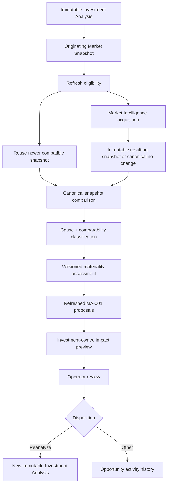

# MA-003 — Market Refresh

## Status

**Status:** Planned  
**Owners:** Market Intelligence and Investment Intelligence  
**Phase:** Market Intelligence Activation  
**Depends on:** MA-001 Live Market Snapshot Integration, MA-002 Comparable Explorer, IW-001 Canonical Subject Property, immutable persisted Market Snapshots, immutable Investment analyses, analysis versioning, and opportunity history  
**Primary product outcome:** A user can determine whether Market evidence materially changed, understand why it changed, review its potential underwriting effect, and explicitly create a new immutable analysis without altering the prior Decision.

## Purpose

Provide a controlled workflow for resolving or acquiring updated Market evidence,
comparing it with the exact evidence used by an existing Investment analysis, and
deciding whether a new analysis is warranted.

MA-003 answers:

> Has the Market changed enough to reconsider this Investment Decision?

The workflow distinguishes:

- newly retrieved evidence;
- an underlying Market-value change;
- comparable-set change;
- provider composition or source change;
- methodology, mapping, reconciliation, confidence, or derivation-policy change;
- Canonical Subject Property context change;
- evidence regression or improved coverage;
- a change material to the selected strategy and Decision.

A refresh never silently replaces the Market Snapshot, assumption version, or
recommendation attached to an existing analysis.

## Current-state baseline

The repository currently has:

- a canonical Market analysis report with observations, evidence, qualification,
  confidence, risk, gaps, and lineage;
- a narrow Investment-owned `MarketSnapshot` engine projection;
- an Investment workspace that can run Market analysis and compose assumptions;
- immutable Decision-oriented domain patterns and saved report history;
- provider-neutral Market acquisition boundaries.

MA-001 is responsible for turning the canonical Market report into a durable,
reusable, immutable Market Snapshot and binding it to accepted assumptions and an
Investment analysis. MA-002 adds reviewed comparable-set snapshot lineage.

MA-003 builds on those contracts. It must not compare the narrow Investment engine
projection as though it were the Market authority, and it must not introduce a
second provider acquisition, snapshot, assumption, or analysis-history model.

## Product outcome

### Before MA-003

```text
Investment Analysis V1
  → Market Snapshot V4

New Market evidence becomes available
  → no controlled old/new review workflow
```

### After MA-003

```text
Investment Analysis V1
  → Market Snapshot V4
  → request or resolve refresh
  → Market Snapshot V5, or canonical no-change result
  → compare evidence and semantics
  → classify cause, comparability, materiality, and potential Decision impact
  → review assumption choices
  → reanalyze, accept without reanalysis, defer, or dismiss
  → optional Investment Analysis V2
```

Analysis V1 and Snapshot V4 remain unchanged and reproducible.

## Ownership boundary



Market Intelligence owns:

- freshness and refresh-eligibility policy;
- provider selection, acquisition, cost controls, and normalized failures;
- canonical Observation and Market Snapshot persistence;
- semantic snapshot comparison;
- evidence, comparable, provider, methodology, mapping, confidence, and
  property-context change facts;
- Market metric materiality inputs and Market explanations.

Investment Intelligence owns:

- the impact of candidate assumptions on underwriting outputs;
- preservation and reconciliation of user assumptions and overrides;
- Decision-threshold context;
- non-authoritative underwriting preview;
- new assumption version and immutable reanalysis;
- old/new Investment analysis comparison.

The workspace owns orchestration and presentation. It does not calculate Market
differences, materiality, financial outputs, or recommendations in the browser.

## Goals

MA-003 must:

- let an authorized user request updated Market evidence;
- reuse an existing compatible newer snapshot when acquisition is unnecessary;
- create immutable Market evidence when acquisition or policy produces a distinct
  canonical result;
- compare the result with the exact snapshot used by an existing analysis;
- distinguish Market movement from evidence, provider, policy, mapping,
  methodology, and property-context changes;
- identify material changes using explicit versioned policy;
- explain potential effects on assumptions, returns, confidence, risks, and
  Decision thresholds;
- preserve active user overrides unless explicitly changed;
- require explicit review before generating a new assumption version or analysis;
- preserve every previous snapshot, assumption version, analysis,
  recommendation, memorandum, and opportunity event;
- handle partial, failed, identical, and semantically incomparable refreshes;
- record a disposition for every completed review.

## Non-goals

MA-003 does not:

- mutate a Market Snapshot or Investment analysis;
- automatically accept refreshed assumptions or change a recommendation;
- rebuild MA-002 comparable review;
- select or implement providers;
- introduce continuous monitoring or bulk portfolio refresh;
- copy missing old evidence into a new snapshot;
- treat retrieval time as proof of underlying Market movement;
- treat every numerical difference as material;
- label provider or methodology changes as organic Market movement;
- expose credentials, raw provider payloads, errors, or DTOs;
- create an authoritative new recommendation from a preview;
- modify an archived opportunity without an explicitly permitted follow-up
  workflow.

Recurring monitoring, scheduled alerts, portfolio-wide refresh, and automated
re-underwriting are future capabilities.

## Core invariants

1. Every refresh pins an originating snapshot ID/version and Subject Property
   ID/revision.
2. When initiated from an analysis, it also pins the originating analysis and
   assumption versions.
3. A newer snapshot never silently replaces the snapshot under review.
4. Acquisition runs through Market Intelligence only.
5. An acquisition attempt and a Market Snapshot are different records.
6. Canonically identical results follow a versioned snapshot identity policy; an
   unnecessary duplicate snapshot is not required.
7. Any newly retained evidence, effective-period change, freshness meaning, or
   policy change that affects reproducibility must remain durably attributable.
8. Snapshot comparison is semantic, unit-aware, currency-aware, horizon-aware,
   scope-aware, and policy-versioned.
9. Causal classification precedes materiality assessment.
10. Materiality and severity are related but distinct outputs.
11. A preview is not an Investment analysis or authoritative recommendation.
12. User overrides remain active until the user explicitly replaces or removes
    them.
13. Refresh failure never invalidates the prior analysis.
14. Reanalysis always creates new assumption and analysis versions.
15. Dismissing a refresh does not delete or discredit its canonical evidence.

## Primary user stories

### Check for updated Market evidence

As an investor, I can refresh evidence for an existing analysis so I can determine
whether the Investment thesis remains supported.

### Understand what changed

As an investor, I can compare snapshots and distinguish Market movement from
provider, evidence, methodology, mapping, policy, and property changes.

### Assess Decision impact

As an investor, I can preview the effect of refreshed proposals on underwriting
outputs and thresholds without modifying the current analysis.

### Preserve the prior Decision

As an investor, the original snapshot, assumptions, analysis, recommendation, and
memorandum remain unchanged.

### Defer evidence

As an investor, I can acknowledge new evidence without immediately
re-underwriting.

### Continue through failure

As an investor, a failed or partial refresh leaves the existing analysis usable
and fully reproducible.

## Core workflow

```text
Open existing Analysis or Opportunity
  → show current snapshot and latest compatible evidence
  → resolve refresh eligibility
  → reuse newer snapshot or request Market acquisition
  → persist acquisition outcome and immutable evidence
  → compare originating and resulting snapshots
  → classify causes and semantic comparability
  → assess Market and Decision materiality
  → map refreshed observations to proposed assumptions
  → optionally preview underwriting impact
  → user reviews evidence and assumption choices
  → reanalyze / accept without reanalysis / defer / dismiss
  → persist disposition and lineage
```

## Refresh initiation

A refresh may begin from:

- IW-002 Underwriting Workspace;
- a saved Investment Opportunity;
- an existing Investment analysis;
- the MA-001 Market Intelligence card;
- MA-002 after accepting a reviewed comparable snapshot.

Before confirmation, display:

- snapshot used by the current analysis;
- retrieval time and effective period;
- observation-level freshness summary;
- latest compatible snapshot, when one exists;
- requested strategy and scope;
- whether provider acquisition is likely;
- cost category or estimate when available;
- applicable cooldown, quota, or rate-limit guidance.

“Refresh” must not imply that a paid provider request is always required.

## Refresh eligibility

Eligibility considers:

- a newer compatible persisted snapshot;
- current snapshot suitability by metric and Decision horizon;
- explicit forced-refresh permission;
- provider-strategy availability;
- sufficient Subject Property lookup identity;
- equivalent in-progress requests;
- cooldown, quota, tenant budget, and rate limits;
- opportunity and analysis status;
- workspace authorization.

```ts
type MarketRefreshEligibility =
  | Readonly<{
      status: "newer-snapshot-available";
      snapshotId: string;
      snapshotVersion: number;
    }>
  | Readonly<{
      status: "refresh-allowed";
      reason: "stale" | "user-requested" | "policy-triggered";
      acquisitionLikely: boolean;
    }>
  | Readonly<{
      status: "current";
      nextEligibleAt?: string;
    }>
  | Readonly<{
      status: "in-progress";
      refreshId: string;
    }>
  | Readonly<{
      status: "blocked";
      reasonCode: string;
      retryable: boolean;
    }>;
```

A forced refresh bypasses freshness reuse only where policy and authorization
permit. It does not bypass cost, tenancy, provider terms, or concurrency controls.

## Refresh record

Every accepted request resolves or creates a durable refresh record containing:

- refresh ID and schema version;
- workspace and Subject Property ID/revision;
- originating snapshot ID/version;
- originating analysis, assumption version, and opportunity when applicable;
- requested strategy, purpose, scope, and force flag;
- requester and request time;
- provider-selection and acquisition-policy versions;
- lifecycle status;
- acquisition attempt IDs;
- resulting snapshot ID/version, if distinct;
- canonical no-change identity, when applicable;
- partial/failure details;
- safe latency and cost metadata;
- comparison and materiality IDs;
- review disposition and resulting analysis ID.

```ts
type MarketRefreshStatus =
  | "requested"
  | "resolving"
  | "acquiring"
  | "completed"
  | "partial"
  | "failed"
  | "cancelled"
  | "awaiting-review"
  | "reviewed";
```

Acquisition status and review disposition are separate fields. A technically
completed refresh may remain `awaiting-review`.

## Snapshot acquisition and reuse

The server-side refresh workflow:

1. authenticates and authorizes the request;
2. loads the pinned Subject Property and originating snapshot;
3. resolves equivalent work and compatible newer snapshots;
4. invokes the existing Market Intelligence acquisition boundary only if needed;
5. retains attributable observations under provider agreements;
6. records partial contributions and normalized failures;
7. applies canonical reconciliation and snapshot identity policy;
8. persists any distinct immutable snapshot before comparison;
9. links acquisition, origin, and result through the refresh record.

The workflow never:

- invokes providers from Investment Intelligence or the browser;
- uses browser-cached values as canonical evidence;
- modifies the origin snapshot;
- overwrites provider observations;
- hides failed provider contributions;
- copies an earlier observation into a refreshed snapshot as though newly observed.

### Canonical no-change

If acquisition returns evidence canonically identical under the pinned identity
policy, the refresh record still preserves the acquisition attempt, time, provider
results, and policy version.

Whether a new snapshot is necessary depends on reproducibility:

- if retained evidence, effective periods, freshness meaning, provider composition,
  or policy outputs differ, create a new snapshot;
- if none differ under the versioned identity policy, link the refresh to the
  canonically equivalent snapshot and record `no-canonical-change`.

This prevents duplicate snapshots without losing proof that a refresh occurred.

## Comparison identity

Every comparison pins:

- previous and refreshed snapshot IDs/versions;
- Subject Property ID/revisions used by each;
- Market purpose and strategy;
- comparison schema and policy version;
- currency and conversion policy;
- observation units, time grains, scopes, and effective periods;
- provider, mapping, reconciliation, confidence, derivation, and comparable-policy
  versions;
- comparison time.

The comparison result is immutable. Re-running under a new comparison policy
creates a new comparison result rather than rewriting the old explanation.

## Semantic comparability

Before calculating a delta, each metric receives:

```ts
type MetricComparability =
  | "directly-comparable"
  | "comparable-after-canonical-conversion"
  | "context-changed"
  | "methodology-break"
  | "insufficient-metadata"
  | "not-comparable";
```

Direct comparison requires compatible:

- metric definition;
- property versus Market scope;
- modeled versus observed status;
- strategy;
- currency;
- unit;
- available-night basis;
- fees and taxes;
- time grain and horizon;
- seasonal aggregation;
- effective period or an explicitly valid period comparison.

An unavailable comparison displays the reason. The UI never shows a percentage
delta between semantically incompatible values.

## Snapshot comparison dimensions

### Market metrics

- ADR;
- occupancy;
- RevPAR;
- annual revenue;
- average length of stay;
- supply and demand;
- seasonality;
- Market growth and volatility;
- metric-level uncertainty.

Only metrics present in the canonical snapshots are compared. MA-003 does not
invent unsupported STR fields.

### Comparable evidence

- total, included, excluded, and unresolved counts;
- added and removed comparable identities;
- changed canonical facts;
- qualification and outlier changes;
- similarity and weight distribution;
- concentration and sufficiency;
- comparable-set quality;
- MA-002 operator-reviewed lineage.

### Confidence and evidence

- overall and metric-level confidence;
- evidence density and completeness;
- provider agreement/disagreement;
- freshness and effective periods;
- unresolved conflicts;
- gaps and unsupported observations;
- calibration/historical consistency when available.

### Context and policy

- provider strategy and composition;
- origin-source composition behind an aggregator;
- provider methodology;
- observation mapping;
- reconciliation;
- comparable qualification/weighting;
- confidence;
- calculation and derivation;
- materiality;
- Subject Property facts and revision.

## Change classification

A difference may have one primary cause and multiple contributing causes:

```ts
type MarketChangeCategory =
  | "market-value"
  | "comparable-set"
  | "freshness"
  | "confidence"
  | "coverage"
  | "provider"
  | "methodology"
  | "mapping"
  | "reconciliation-policy"
  | "confidence-policy"
  | "derivation-policy"
  | "property-context"
  | "no-canonical-change";

type ClassifiedMarketChange = Readonly<{
  primaryCategory: MarketChangeCategory;
  contributingCategories: readonly MarketChangeCategory[];
  explanation: string;
  evidenceIds: readonly string[];
}>;
```

This avoids forcing a mixed change into one misleading label.

Examples:

- **Market value:** ADR decreased for the same definition and annual horizon.
- **Comparable set:** six candidates were added and two high-weight candidates are
  no longer active.
- **Provider:** STR evidence now comes from a different configured provider.
- **Methodology:** a provider changed occupancy estimation methodology.
- **Mapping:** Luxe Haven mapping changed from v2 to v3.
- **Property context:** the Subject Property bedroom count was reconciled from
  three to four.

Provider, policy, or property-context changes are never presented as pure organic
Market movement.

## Materiality policy

Not every difference warrants reanalysis. Materiality is explicit, contextual,
configurable, and versioned.

Inputs may include:

- absolute and percentage change;
- confidence and uncertainty movement;
- semantic comparability;
- evidence regression;
- comparable sufficiency and concentration;
- Decision threshold distance and crossing;
- risk threshold crossing;
- direction and compounding of changes;
- operating strategy and acquisition type;
- Decision and time horizon;
- current recommendation;
- policy/methodology break.

```ts
type MarketMateriality =
  | "no-material-change"
  | "minor"
  | "material"
  | "decision-critical"
  | "indeterminate";

type MarketMaterialityAssessment = Readonly<{
  classification: MarketMateriality;
  policyVersion: string;
  reasons: readonly string[];
  affectedMetricKeys: readonly string[];
  thresholdReferences: readonly string[];
}>;
```

Thresholds never live in UI components.

`indeterminate` is required when evidence or semantic compatibility is
insufficient to assess impact safely. It is not silently downgraded to minor.

## Severity and action guidance

Severity communicates attention, while materiality describes significance under a
versioned policy.

| Severity | Meaning |
| --- | --- |
| Informational | New evidence without meaningful underwriting impact |
| Minor | Values changed but the assessed Decision remains stable |
| Material | Financial, confidence, or risk outcomes warrant review |
| Critical | A Decision or risk threshold may be crossed |
| Unknown | Impact cannot be assessed safely |

Every severity includes:

- reason;
- applicable Decision/strategy context;
- supporting change IDs;
- uncertainty or limitation;
- recommended next action.

Guidance is advisory and does not change the existing recommendation.

## Market change summary

The initial summary leads with:

- overall materiality and severity;
- semantic comparison limitations;
- primary and contributing change causes;
- largest compatible metric changes;
- confidence and comparable-quality changes;
- potential Decision-threshold effect;
- recommended review action.

Example:

```text
Market refresh completed

Material change

Primary changes
• Projected ADR decreased 6.9%.
• Occupancy increased 2 percentage points.
• Two high-weight comparables were removed.
• Confidence decreased from 86% to 79%.

Potential Decision effect
Cash-on-cash return may fall below the selected 10% threshold.

Recommended action
Review refreshed assumptions before generating a new analysis.
```

The summary never mutates or replaces the current recommendation.

## Metric comparison

Display compatible values side by side with unit, horizon, effective period,
confidence, cause, and materiality:

| Metric | Previous | Refreshed | Change | Cause | Materiality |
| --- | ---: | ---: | ---: | --- | --- |
| ADR | $248 | $231 | -6.9% | Market/comparables | Material |
| Occupancy | 68% | 70% | +2 pts | Market | Minor |
| RevPAR | $169 | $162 | -4.1% | Derived | Material |
| Annual revenue | $61,547 | $58,601 | -4.8% | Market/mapping | Material |
| Confidence | 86% | 79% | -7 pts | Coverage | Material |

Percentage changes and percentage-point changes are distinct. Missing is not zero.
Ranges and probability distributions are not collapsed into point values unless a
versioned canonical policy does so.

## Underwriting impact preview

After Market comparison, the user may request a non-authoritative impact preview.
It:

- maps the refreshed snapshot through the pinned or explicitly selected MA-001
  mapping policy;
- applies the user's draft assumption selections;
- invokes the existing Investment calculation and recommendation boundaries;
- returns candidate financial, risk, confidence, and threshold effects;
- remains linked to the origin analysis, refresh, comparison, snapshot, mapping,
  assumptions, and calculation/recommendation policy versions;
- persists or caches enough state for reload and audit according to policy.

```text
If selected refreshed assumptions are used:

Annual revenue  $61,547 → $58,601
NOI             $27,200 → $24,430
Cash-on-cash    10.8%   → 9.6%

Decision sensitivity
The current Proceed recommendation may cross into Proceed with Conditions.
```

The preview must say “potential,” “candidate,” or equivalent. It is not a completed
Investment analysis, recommendation, memorandum, or Decision record.

## Assumption reconciliation

For each refreshed Market proposal, the user chooses:

- keep the value accepted by the existing analysis;
- accept the refreshed proposal;
- retain an active manual override;
- enter a new override;
- restore a draft override to refreshed evidence;
- leave an optional gap unresolved;
- manually resolve a permitted required gap.

| Assumption | Current analysis | Refreshed proposal | Next draft |
| --- | --- | --- | --- |
| ADR | $248 Market-derived | $231 | Use refreshed |
| Occupancy | 62% override | 70% | Keep override |
| Seasonality | Snapshot V4 | Snapshot V5 | Use refreshed |
| Cleaning | $165 manual | Not Market-derived | Keep manual |

Each selection records origin, actor, timestamp, reason where applicable, and
source observation IDs.

## Override preservation

When the current assumption is an override, display:

```text
Previous Market proposal: 68%
Existing user override: 62%
Refreshed Market proposal: 70%

Your existing override remains active.
```

Refresh never changes the override automatically. If the user replaces it, the new
assumption version preserves the prior Market proposal, prior override, refreshed
proposal, new choice, actor, and rationale.

## Missing and regressed evidence

A refreshed snapshot may contain less evidence because:

- geography or provider coverage changed;
- a comparable disappeared;
- historical metrics are unavailable;
- a provider failed;
- confidence metadata is absent;
- provider terms no longer permit retention or display.

The workflow:

- preserves the old snapshot;
- records the regression explicitly;
- never copies an old Observation into the new snapshot as current evidence;
- may let the user retain the prior underwriting value with lineage to its old
  snapshot;
- labels that retained value as prior evidence, not refreshed evidence;
- explains staleness and confidence effects;
- uses partial or indeterminate status where appropriate.

Retaining a prior assumption does not make its supporting evidence fresh.

## No-change behavior

When no material difference is found:

> Market evidence was refreshed. No material changes were identified relative to
> the snapshot used by Analysis V3.

The user may:

- accept the refresh without reanalysis;
- dismiss it as no material change;
- defer review;
- explicitly create a new analysis anyway where policy permits.

The product does not pressure users to create meaningless analysis versions.

## Refresh disposition

Every completed review records one disposition:

```ts
type MarketRefreshDisposition =
  | "reanalyzed"
  | "accepted-no-reanalysis"
  | "deferred"
  | "dismissed-no-material-change"
  | "dismissed-not-representative"
  | "failed"
  | "superseded";
```

The disposition includes:

- actor and timestamp;
- rationale when required;
- comparison and materiality IDs;
- selected snapshot and assumption version;
- resulting analysis ID when reanalyzed;
- superseding refresh ID when applicable.

`dismissed-not-representative` records professional judgment; it does not mutate or
delete the refreshed snapshot. Disposition appears in opportunity activity
history.

## Reanalysis

```text
Analysis V1 + Snapshot V4 + Assumptions V1
  → Refresh R1
  → Snapshot V5
  → Comparison C1
  → reviewed assumption selections
  → Assumptions V2
  → Analysis V2
```

Analysis V2 references:

- preceding analysis ID;
- Subject Property ID/revision;
- resulting snapshot ID/version;
- refresh and comparison IDs;
- materiality policy/result;
- MA-001 mapping version;
- new assumption version;
- retained prior values and their original lineage;
- accepted refreshed values;
- active/new overrides;
- unresolved evidence gaps;
- calculation and recommendation policy versions.

Analysis V1 remains unchanged.

## Analysis comparison

After reanalysis, show:

- prior and new recommendations;
- confidence change;
- key financial changes;
- changed risks and mitigations;
- changed supporting evidence;
- assumption differences;
- Market Snapshot differences;
- reason and actor for reanalysis.

Existing immutable analysis-version comparison should be reused where sufficient.
MA-003 does not create a competing Decision-history aggregate.

## Refresh states

The UI supports:

- not available;
- eligible;
- current;
- newer snapshot available;
- requested;
- resolving;
- acquiring;
- completed with no canonical change;
- completed with no material change;
- completed with material change;
- decision-critical;
- indeterminate;
- partial;
- failed;
- deferred;
- superseded;
- reanalysis completed.

Blank or ambiguous loading states are not acceptable.

## User experience

### Refresh banner

When newer evidence exists:

> New Market evidence is available. This analysis uses Market Snapshot V4 from
> June 12, 2026.

Actions:

- Review changes;
- Dismiss for now.

### Market refresh card

Display:

- analysis snapshot and latest compatible snapshot;
- retrieval and effective dates;
- freshness by relevant metric class;
- confidence;
- refresh/acquisition state;
- materiality and semantic-comparability summary;
- estimated acquisition cost category;
- primary action.

### Change review workspace

Sections:

- Summary;
- Metrics;
- Comparables;
- Confidence;
- Evidence and gaps;
- Providers and policies;
- Subject Property context;
- Assumptions;
- Impact preview;
- Disposition.

Actions:

- request refresh;
- use existing newer snapshot;
- review changes;
- open MA-002 for comparable evidence;
- select refreshed values individually;
- preserve existing overrides;
- keep prior assumptions;
- defer;
- dismiss;
- retry;
- generate new analysis.

Color alone never conveys direction, origin, materiality, or status.

## Notifications

MA-003 may create in-product notifications when:

- a requested refresh completes;
- a material or indeterminate change is detected;
- a refresh fails;
- newer compatible evidence appears during an open workflow.

Each notification links to the workspace, property, opportunity, originating
analysis, and refresh comparison. Notifications do not imply continuous monitoring.

## Persistence

Persist:

- refresh request, lifecycle, scope, actor, and policy versions;
- acquisition-attempt references and safe operational metadata;
- origin and result snapshot references;
- immutable comparison and metric comparability;
- causal classifications;
- materiality and severity;
- refreshed MA-001 proposals;
- assumption reconciliation selections;
- impact preview identity and pinned inputs where retained;
- disposition;
- resulting assumption and analysis lineage;
- opportunity activity events;
- idempotency and concurrency metadata.

Do not persist:

- credentials;
- prohibited raw provider payloads;
- transient filters or panel state;
- client-calculated deltas, materiality, financial outputs, or recommendations;
- overwritten prior values;
- a provider conclusion represented as Luxe Haven's Decision.

## Idempotency and concurrency

Handle:

- duplicate refresh clicks;
- page reload during acquisition;
- equivalent requests from multiple tabs;
- a newer snapshot arriving during review;
- policy change after comparison;
- repeated preview/reanalysis commands;
- refresh completion after opportunity archival;
- future collaborative reviewers.

Required behavior:

- equivalent requests are coalesced where policy permits;
- refresh state survives reload;
- every review pins an explicit snapshot pair;
- a later refresh never replaces the pair under review;
- comparison/preview uses deterministic fingerprints and pinned policies;
- stale submissions return an actionable conflict;
- reanalysis is protected by command/idempotency identity;
- one successful command produces one analysis version;
- archived opportunities remain unchanged unless a separately authorized workflow
  permits a follow-up record.

## Security and tenancy

All operations enforce:

- workspace ownership/membership;
- Subject Property access;
- Market Snapshot and Observation tenant isolation;
- opportunity and analysis access;
- refresh-record and comparison isolation;
- evidence disclosure restrictions;
- server-side provider credentials;
- provider retention and permitted-use terms;
- sanitized logs and normalized errors.

Errors must not reveal another tenant's provider coverage, cost, refresh activity,
evidence, or resource existence.

## Observability

Record safe metadata:

- correlation and refresh IDs;
- workspace, property, opportunity, analysis, and snapshot IDs;
- provider-strategy and acquisition-policy versions;
- acquisition start/end, latency, retryability, and status;
- provider success/failure categories;
- Observation/comparable counts and gaps;
- estimated/actual cost when available;
- comparison, causal-classification, comparability, and materiality results;
- assumption-selection summary;
- disposition and resulting analysis ID;
- coalescing/idempotency outcome.

Do not log credentials, sensitive addresses, raw prohibited payloads, or restricted
evidence.

## Performance

- Existing newer snapshots load without provider calls.
- Eligibility and persisted comparison results should feel immediate.
- Long-running acquisition is asynchronous.
- Progress and completed results survive browser reload.
- Comparison and previews are persisted or safely cached by deterministic input
  identity.
- Duplicate equivalent requests do not multiply cost.
- UI progress never invents provider completion percentages.

Specific latency and cost thresholds follow MI-002 provider measurements.

## Application boundaries

Names are illustrative:

```ts
interface ResolveMarketRefreshEligibility {
  execute(input: Readonly<{
    workspaceId: string;
    subjectPropertyId: string;
    originatingSnapshotId: string;
    analysisId?: string;
    opportunityId?: string;
    strategy?: string;
  }>): Promise<MarketRefreshEligibility>;
}

interface RequestMarketRefresh {
  execute(input: Readonly<{
    workspaceId: string;
    subjectPropertyId: string;
    originatingSnapshotId: string;
    analysisId?: string;
    opportunityId?: string;
    strategy?: string;
    force?: boolean;
    commandId: string;
  }>): Promise<Readonly<{
    refreshId: string;
    status: MarketRefreshStatus;
  }>>;
}

interface CompareMarketSnapshots {
  execute(input: Readonly<{
    workspaceId: string;
    refreshId: string;
    previousSnapshotId: string;
    refreshedSnapshotId: string;
    strategy?: string;
    commandId: string;
  }>): Promise<MarketSnapshotComparison>;
}

interface PreviewRefreshedUnderwriting {
  execute(input: Readonly<{
    workspaceId: string;
    analysisId: string;
    refreshId: string;
    comparisonId: string;
    assumptionSelections: readonly RefreshedAssumptionSelection[];
    commandId: string;
  }>): Promise<RefreshedUnderwritingPreview>;
}

interface GenerateRefreshedAnalysis {
  execute(input: Readonly<{
    workspaceId: string;
    analysisId: string;
    refreshId: string;
    comparisonId: string;
    previewId: string;
    expectedReviewRevision: number;
    commandId: string;
  }>): Promise<Readonly<{
    assumptionVersionId: string;
    analysisId: string;
    analysisVersion: number;
  }>>;
}
```

Investment Intelligence receives canonical comparison and proposal contracts, not
provider payloads or provider-selection logic.

## Integration boundaries

### Consumes

- Canonical Subject Property and revision;
- MA-001 persisted Market Snapshots and mapping;
- MA-002 reviewed comparable snapshot lineage;
- Market acquisition, Observation, confidence, risk, and gap boundaries;
- snapshot identity/comparison policy;
- underwriting calculation and recommendation boundaries;
- immutable assumption and analysis versioning;
- opportunity activity history;
- authorization.

### Produces

- Market Refresh record;
- acquisition result and new immutable snapshot when required;
- immutable semantic snapshot comparison;
- causal change classifications;
- versioned materiality and severity;
- refreshed proposed assumptions;
- assumption reconciliation and preview;
- disposition;
- analysis-to-refresh lineage;
- optional new immutable Investment analysis.

### Does not produce

- provider selection or adapters;
- mutated snapshots or analyses;
- automatically accepted assumptions;
- autonomous Investment Decisions;
- continuous monitoring schedules;
- a second comparable explorer or history model.

## Testing requirements

### Unit

Cover:

- eligibility and cooldown;
- canonical snapshot identity/no-change;
- metric semantic compatibility;
- delta calculation and percentage-point handling;
- multi-cause classification;
- materiality and severity;
- indeterminate behavior;
- evidence regression;
- override preservation;
- assumption reconciliation;
- disposition transitions;
- analysis lineage.

### Market contract/policy

Verify:

- refresh invokes only Market application boundaries;
- provider DTOs do not enter Investment;
- comparison, identity, and materiality versions are retained;
- provider/methodology/mapping/property changes remain distinguishable;
- incompatible metrics do not receive misleading deltas;
- partial provider outcomes remain attributable;
- canonical errors remain normalized.

### Integration and persistence

Cover:

- newer persisted snapshot reuse without provider calls;
- live acquisition;
- canonical identical result;
- material Market change;
- provider composition and methodology change;
- mapping/policy change;
- Subject Property revision change;
- partial success and evidence regression;
- failed acquisition, timeout, and retry;
- duplicate request coalescing;
- reload recovery;
- comparison persistence;
- assumption selection and preview;
- idempotent reanalysis;
- origin immutability.

### Authorization and RLS

Verify:

- permitted owner/member access;
- other-owner and anonymous denial;
- cross-workspace isolation;
- snapshot, Observation, refresh, comparison, opportunity, and analysis isolation;
- server-only provider access;
- restricted evidence redaction;
- non-disclosing errors.

### UI and accessibility

Cover:

- every eligibility and lifecycle state;
- no-change, material, critical, indeterminate, partial, and failed results;
- reload recovery;
- metric semantic incompatibility;
- multi-cause and methodology warnings;
- comparable summary and MA-002 navigation;
- override preservation;
- individual reconciliation;
- defer/dismiss;
- preview versus completed-analysis labeling;
- reanalysis and old/new comparison;
- keyboard, focus, screen-reader, and non-color status behavior.

### Regression

Confirm:

- MA-001 snapshot loading and manual underwriting still work;
- MA-002 review and accepted snapshot lineage remain intact;
- analyses without Market Snapshots still render;
- current analysis values never change after refresh;
- memoranda remain attached to originating analyses;
- archived opportunities are not mutated;
- existing immutable history remains valid;
- no provider call occurs when reusing a compatible snapshot.

## Acceptance criteria

MA-003 is complete when an authorized user can:

- request updated Market evidence from an analysis or opportunity;
- see and use a newer compatible snapshot without unnecessary acquisition;
- refresh without mutating the current analysis snapshot;
- compare compatible old/new Market metrics;
- understand comparable, confidence, freshness, evidence, provider, methodology,
  mapping, policy, and Subject Property changes;
- distinguish Market movement from non-Market causes;
- see informational, minor, material, critical, or indeterminate impact with
  explanations;
- preview potential underwriting effects without creating an authoritative
  analysis or recommendation;
- retain prior assumptions, accept refreshed proposals, or enter overrides
  individually;
- preserve active user overrides unless explicitly changed;
- retain an old value with honest old-snapshot lineage when refreshed evidence
  regresses;
- defer, dismiss, accept without reanalysis, or reanalyze with recorded
  disposition;
- generate a new immutable analysis and compare it with the prior analysis;
- reload without losing acquisition or review state;
- continue using the prior analysis after partial or failed refresh;
- complete the workflow without provider DTOs or provider-selection logic entering
  Investment Intelligence.

## Definition of Done

The milestone is done only when:

- refresh runs through the real Market Intelligence boundary;
- acquisition and snapshot identity are separate, durable concepts;
- distinct evidence creates immutable snapshots rather than changing history;
- semantic comparison distinguishes value, comparable, evidence, provider,
  methodology, mapping, policy, and property-context changes;
- materiality and severity are explicit, contextual, and versioned;
- incompatible comparisons and indeterminate impact are handled honestly;
- user overrides are never silently replaced;
- impact preview remains distinct from completed analysis;
- reanalysis creates new immutable assumption and analysis versions;
- failure and partial results preserve the prior Decision state;
- disposition appears in opportunity activity history;
- unit, policy, contract, integration, persistence, UI, accessibility,
  authorization, RLS, concurrency, idempotency, and regression tests pass;
- lint, typecheck, relevant tests, production build, migration/RLS validation, and
  `git diff --check` pass;
- end-to-end verification covers:
  - one refresh with no canonical or material change;
  - one material Market change;
  - one provider/methodology or property-context change;
  - one partial or failed refresh;
  - one reanalysis preserving the original analysis.

## Required implementation sequence

1. Complete MA-001 durable snapshot, assumption, and analysis lineage.
2. Complete MA-002 reviewed comparable snapshot lineage.
3. Define acquisition-attempt, refresh, snapshot-identity, and lifecycle contracts.
4. Define semantic metric comparison and causal classification.
5. Define versioned materiality/severity policy with Decision-threshold inputs.
6. Implement persisted comparison, refresh state, concurrency, and idempotency.
7. Implement refreshed MA-001 proposal and assumption-reconciliation contracts.
8. Implement Investment-owned impact preview with non-authoritative labeling.
9. Implement immutable reanalysis and old/new analysis comparison.
10. Add opportunity dispositions, activity events, and notifications.
11. Build the accessible refresh review workspace.
12. Complete policy, integration, persistence, authorization/RLS, UI, regression,
    and real-evidence verification.

Continuous monitoring and portfolio-wide refresh remain separate future
capabilities.

## Architectural outcome

MA-003 establishes that Market Intelligence is time-bound evidence, not mutable
global truth.

```text
What the Market supported then
  → Market Snapshot V4
  → Assumptions V1
  → Investment Analysis V1

What the Market supports now
  → Market Snapshot V5
  → explained and reviewed change
  → Assumptions V2
  → Investment Analysis V2
```

The platform preserves both contexts and the complete causal path between them.
Luxe Haven can therefore explain not only what it recommends now, but whether and
why that recommendation differs from the Decision made using earlier evidence.
