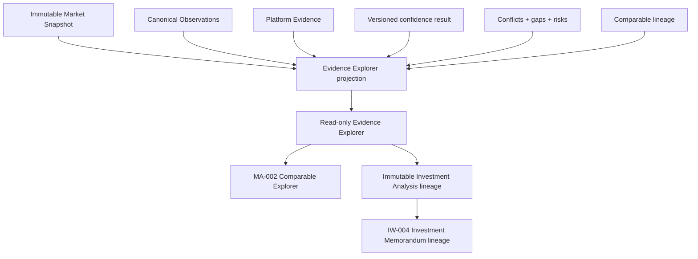

# MA-004 — Evidence Explorer

## Status

**Status:** Planned  
**Owner:** Market Intelligence  
**Phase:** Market Intelligence Activation  
**Depends on:** MA-001 Live Market Snapshot Integration, MA-002 Comparable Explorer, Canonical Observations, platform Evidence, immutable persisted Market Snapshots, confidence policies, and immutable Investment analyses  
**Primary product outcome:** An investor can trace every significant Market-derived assumption and conclusion to permitted canonical evidence, understand its quality and limitations, and follow its immutable lineage into Investment artifacts.

## Purpose

Provide a transparent, read-only workspace for inspecting the Observations,
evidence, provenance, transformations, confidence assessments, conflicts, and gaps
supporting a Market Snapshot and the Market-derived inputs consumed by Investment
Intelligence.

Evidence Explorer presents canonical platform concepts. It does not expose raw
provider responses, reconstruct internal calculations in the browser, or operate
as provider diagnostics.

It answers:

> What evidence supports this conclusion, how did that evidence become this value,
> and how much trust should I place in it?

## Current-state baseline

The repository already has:

- platform Observation and Evidence primitives;
- a canonical Market analysis report containing observation, evidence, risk, gap,
  confidence, comparable, and lineage identifiers;
- Market confidence with reasons and the currently calculated coverage,
  similarity, and dispersion dimensions;
- comparable acquisition and qualification lineage;
- an Investment-owned adapter that validates and preserves Market observation and
  evidence IDs;
- Investment platform analysis lineage connecting Market observations, evidence,
  recommendations, and Intelligence reports.

The current Market report projection remains intentionally shallow:

- `MarketAnalysisObservation.sourceIds` is generic and may reference candidates or
  external source identifiers rather than typed canonical lineage edges;
- the report does not yet expose a durable graph from origin provider through
  delivery intermediary, transformation, adopted Observation, snapshot proposal,
  assumption version, analysis, and memorandum;
- current canonical report confidence decomposition is limited to the dimensions
  actually calculated;
- freshness, effective period, observation method, and transformation version are
  not uniformly available for every report Observation;
- MA-001 has not yet introduced the durable persisted snapshot projection required
  for historical exploration.

MA-004 closes these projection and lineage gaps. It must not ask presentation code
to infer missing provenance, confidence factors, or source identity.

## Architecture boundary



Market Intelligence owns:

- Observation meaning, units, effective periods, and source lineage;
- Market evidence relationships;
- provider-origin and delivery-intermediary provenance;
- transformation, reconciliation, derivation, and methodology metadata;
- confidence outputs and their actual contributors;
- conflicts, adopted values, gaps, risks, and disclosure policy;
- the canonical read projection consumed by the explorer.

Investment Intelligence owns:

- assumption origin and override lineage;
- use of Market evidence in an immutable analysis;
- claims, evaluations, recommendations, Decisions, and memorandum references.

The explorer owns navigation and presentation only. It does not calculate,
reconcile, transform, score, or mutate evidence.

## Goals

MA-004 must:

- expose evidence behind every significant Market-derived proposal used by
  Investment Intelligence;
- distinguish observed, provider-modeled, reconciled, Luxe Haven-derived,
  user-sourced, and adopted values;
- preserve provider neutrality while retaining truthful source identities;
- display confidence, freshness, provenance, methodology, units, and effective
  periods when canonically available;
- trace conclusions back to supporting Observations and forward into immutable
  assumptions, analyses, recommendations, and memoranda;
- explain actual confidence contributors without inventing decomposition;
- surface gaps, conflicts, limitations, and unsupported evidence;
- link comparable-supported evidence to MA-002;
- honor licensing, retention, disclosure, tenancy, and historical access rules;
- remain useful for complete, partial, conflicting, and historical snapshots.

## Non-goals

MA-004 does not:

- expose raw provider payloads, DTOs, credentials, request headers, or debug logs;
- edit or delete Observations, evidence, snapshots, assumptions, or analyses;
- resolve conflicts or select an adopted value;
- recalculate confidence, estimates, or underwriting outputs;
- acquire providers or refresh snapshots;
- replace MA-002 comparable review;
- replace MA-003 old/new Market comparison;
- reveal restricted data merely because it contributed to a result;
- imply unavailable metadata or confidence factors;
- function as a provider operations console.

## Core invariants

1. Every explorer view pins one immutable Market Snapshot ID/version.
2. When opened from an analysis, it also pins the exact analysis, assumption, and
   snapshot versions used by that analysis.
3. Every displayed lineage edge comes from a canonical persisted reference.
4. Generic external IDs are never presented as canonical Observation or Evidence
   identities.
5. The explorer never reconstructs lineage from matching labels, values, dates, or
   provider names.
6. Observed, provider-modeled, reconciled, derived, and user-entered values remain
   semantically distinct.
7. Origin platform and delivery intermediary are separate provenance roles.
8. Retrieved time, source-updated time, observed/effective time, and snapshot time
   remain separate.
9. Confidence displays only contributors returned by a pinned versioned policy.
10. Missing confidence decomposition is shown as unavailable, not inferred.
11. A conflict remains visible even after reconciliation adopts a value.
12. Redaction preserves lineage continuity without disclosing prohibited content.
13. Search and filters change presentation only.
14. Historical evidence renders under its recorded schema/policy or a versioned
    compatibility projection; it is never silently upgraded.
15. Evidence Explorer is read-only.

## Primary user stories

### Understand a recommendation

As an investor, I can inspect evidence supporting Market-derived assumptions so I
understand why the platform reached a conclusion.

### Verify evidence quality

As an investor, I can review confidence, freshness, provenance, and methodology so
I know how much trust to place in a value.

### Investigate differences

As an investor, I can trace two analyses to their pinned Market evidence and open
MA-003 when I need a semantic comparison.

### Review gaps and conflicts

As an investor, I can see missing, stale, conflicting, or unsupported evidence so I
know where human judgment remains necessary.

### Follow immutable lineage

As an investor, I can follow a source Observation through the Market Snapshot,
assumption version, analysis, recommendation, and memorandum without losing
historical context.

## Primary workflow

```text
Open Investment Analysis, assumption, Market card, comparable, or memorandum
  → resolve authorized pinned Market Snapshot
  → load canonical evidence projection
  → review evidence-strength summary
  → inspect Observation or conclusion
  → inspect confidence, provenance, methodology, conflicts, and gaps
  → follow supporting/derived lineage
  → open related MA-002 comparable evidence when applicable
  → return to the exact originating artifact
```

No provider call or analytical recalculation occurs.

## Explorer scope

The user must always know what is being explained:

- workspace;
- Canonical Subject Property ID/revision;
- Market Snapshot ID/version;
- Market purpose and strategy;
- effective context;
- optional MA-001 proposal/assumption ID;
- optional Investment analysis/version;
- optional recommendation, Decision, or memorandum/version.

Changing scope is explicit. Opening a “latest” snapshot must not silently replace
the historical snapshot used by the analysis being reviewed.

## Explorer organization

```text
Evidence Explorer
├── Summary
├── Conclusions and assumptions
├── Observations
├── Confidence
├── Provenance and methodology
├── Conflicts
├── Evidence gaps and risks
├── Related comparables
└── Lineage
```

Users may enter through a Market assumption or browse the full snapshot. A
conclusion-first route should be preferred when the explorer is opened from an
underwriting field, recommendation, or memorandum statement.

## Evidence summary

Display:

- snapshot ID, version, status, and selection method;
- Subject Property ID/revision;
- effective period or periods;
- snapshot creation and retrieval summary;
- overall confidence and actual available dimensions;
- Observation and evidence counts;
- comparable counts by purpose and qualification state;
- freshness distribution, not one misleading global date;
- coverage and gap summary;
- supporting origin platforms;
- delivery intermediaries;
- methodology/transformation policy versions;
- operator-reviewed lineage when created through MA-002;
- historical/current context label.

The summary answers:

> How strong, complete, current, and traceable is the evidence supporting this
> snapshot?

Counts include only evidence visible under the current disclosure policy. If
restricted evidence contributed, the UI may show an authorized aggregate such as
“2 additional restricted sources” without disclosing identity.

## Conclusion-first evidence map

Every significant MA-001 Market-derived proposal exposes:

- conclusion or assumption key;
- proposed/adopted value and unit;
- source snapshot;
- supporting Observation IDs;
- supporting Evidence IDs;
- derivation/reconciliation record where applicable;
- confidence result;
- gaps and risks affecting it;
- downstream assumption, analysis, claim, evaluation, or recommendation references.

Example:

```text
Projected monthly rent
  → adopted Market estimate: $3,150
  → weighted-comparable derivation v1
  → 7 qualified comparable Observations
  → confidence: 78 / 100, medium
  → gap: limited evidence beyond five miles
  → MA-001 proposal: monthly-lease
  → Assumption Version V3: accepted
  → Investment Analysis V4
```

The view distinguishes “supports” from “caused.” An Observation supporting a
recommendation does not imply that it alone determined the Decision.

## Observation explorer

Every canonical Observation displays, where available:

- Observation ID;
- canonical type and human label;
- value or range;
- unit and currency;
- subject;
- observed/effective period;
- retrieved time;
- source-updated time;
- semantic method/classification;
- confidence reference;
- origin source;
- delivery intermediary;
- transformation version;
- status;
- supporting/parent Observation IDs;
- derived/dependent Observation IDs;
- snapshot and downstream references;
- disclosure or redaction notice.

Example:

```text
Observation
Projected ADR

Value
$248 USD / available night

Classification
Provider-modeled

Effective period
January–December 2027

Retrieved
July 30, 2026

Confidence
High

Supporting canonical Observations
14

Transformation
market-adr-mapping v3
```

If the repository cannot provide a field canonically, the explorer displays
“Unavailable” or omits the field according to accessibility policy. It never
derives it from a provider label or neighboring value.

## Evidence semantics

Values are classified explicitly:

```ts
type EvidenceValueMethod =
  | "directly-observed"
  | "provider-modeled"
  | "provider-aggregated"
  | "luxe-haven-normalized"
  | "luxe-haven-reconciled"
  | "luxe-haven-derived"
  | "user-entered"
  | "user-override"
  | "system-default"
  | "unknown";
```

These classifications are not quality rankings. A modeled estimate may be useful
and high-confidence; it must simply not be labeled observed.

## Observed versus modeled versus derived

The explorer must make transformations legible:

```text
Origin observation
  → delivered record
  → canonical normalization
  → reconciliation/adoption
  → derivation
  → Market Snapshot conclusion
```

Examples:

- a listing's advertised nightly price may be directly observed;
- a provider's estimated occupancy is provider-modeled;
- RealtyAPI delivering Airbnb-originated listing metadata is intermediary
  delivery;
- Luxe Haven's weighted comparable mean is derived;
- an accepted value after provider disagreement is reconciled/adopted;
- an investor's conservative occupancy is a user override and belongs to the
  assumption lineage, not the Market Snapshot.

## Observation lineage

Lineage is a directed, typed, immutable graph:

```ts
type EvidenceLineageEdgeType =
  | "delivered-by"
  | "normalized-from"
  | "supports"
  | "conflicts-with"
  | "reconciled-into"
  | "derived-from"
  | "included-in-snapshot"
  | "mapped-to-proposal"
  | "accepted-as-assumption"
  | "overridden-by"
  | "used-by-analysis"
  | "supports-claim"
  | "supports-evaluation"
  | "supports-recommendation"
  | "recorded-in-memorandum";
```

Every node and edge has:

- canonical ID;
- artifact type;
- version;
- role;
- effective/created time when applicable;
- policy or transformation version;
- disclosure status.

The graph need not be rendered visually at every viewport. An accessible ordered
trace is required.

## Lineage integrity

The read service validates:

- every referenced canonical artifact exists or has an explicit retention/redaction
  tombstone;
- snapshot Observation/Evidence references belong to the snapshot scope;
- assumption origins reference the correct snapshot and mapping;
- analyses reference exact assumption and snapshot versions;
- recommendations and memoranda reference the originating immutable analysis;
- no cross-tenant edge is traversable;
- cycles appear only where explicitly permitted by the lineage model.

Broken lineage is a product-visible integrity state and an operational alert. The
UI must not hide it by guessing the missing relationship.

## Confidence explorer

Confidence is explained at the scope where it was calculated:

- snapshot-level;
- Market section;
- metric/conclusion;
- comparable set;
- individual Observation, if available.

Display:

- score and level;
- policy/version;
- explanation;
- actual dimensions and their values;
- positive, limiting, and unavailable contributors;
- relevant gaps, conflicts, freshness, sufficiency, or dispersion;
- calibration status when available;
- scope and effective time.

Example:

```text
Estimated monthly rent

Confidence
78 / 100 — Medium

Calculated contributors
✓ Coverage: 82
✓ Comparable similarity: 88
⚠ Estimate dispersion: 61

Limitations
• Two qualified comparables are older than the preferred evidence window.
• Provider agreement is unavailable because one provider contributed.

Policy
market-estimate-confidence v2
```

Current canonical Market reports calculate coverage, similarity, and dispersion.
MA-004 may display broader factors such as provider agreement, freshness,
completeness, or historical calibration only after the confidence contract
actually returns them with pinned policy lineage.

Confidence never appears as an unexplained percentage.

## Confidence contributor contract

```ts
type ConfidenceContributor = Readonly<{
  code: string;
  label: string;
  direction: "supporting" | "limiting" | "neutral" | "unavailable";
  score?: number;
  explanation: string;
  evidenceIds: readonly string[];
  dataGapIds: readonly string[];
}>;

type ExplainableConfidence = Readonly<{
  resultId: string;
  scope: string;
  score?: number;
  level: string;
  policyVersion: string;
  contributors: readonly ConfidenceContributor[];
  explanation: string;
}>;
```

The explorer consumes this result. It does not rerun confidence formulas.

## Provenance explorer

For every attributable Observation, display permitted:

- origin platform/system;
- delivery intermediary;
- provider adapter/canonical source role;
- provider reference or masked reference;
- retrieval time;
- source-updated time when supplied;
- observed/effective period;
- collection method;
- license/disclosure status;
- normalization/transformation version;
- reconciliation/derivation policy;
- retention status.

### Origin versus delivery

Aggregation preserves both identities:

```text
Origin platform: Airbnb
Delivery intermediary: RealtyAPI
Canonical adapter: RealtyAPI Airbnb Listings v2
```

It must not collapse this to:

```text
Source: RealtyAPI
```

when the canonical provenance contract knows the underlying origin.

If origin is not supplied or cannot be disclosed, display “Origin unavailable” or
an approved restricted label. Do not infer origin from endpoint naming.

## Time semantics and freshness

The explorer distinguishes:

- **Observed at:** when the fact was observed;
- **Effective period:** the period represented;
- **Source updated at:** when the origin says it changed;
- **Retrieved at:** when Luxe Haven acquired it;
- **Transformed at:** when canonical mapping occurred;
- **Snapshot created at:** when the immutable envelope was built;
- **Freshness assessed at:** when suitability policy evaluated it.

Freshness is metric- and Decision-horizon-specific. One recent retrieval timestamp
must not make historical or stale underlying evidence appear current.

```ts
type EvidenceFreshness =
  | "current"
  | "aging"
  | "stale"
  | "unknown"
  | "not-applicable";
```

Display the policy/version and explanation behind the classification.

## Methodology and transformation

Users see decision-relevant methodology without provider implementation secrets:

- observed versus modeled status;
- aggregation or sampling basis when licensed;
- canonical mapping name/version;
- unit/currency/time-grain normalization;
- comparable qualification policy;
- weighting or reconciliation method;
- derivation formula/policy name and version;
- confidence policy;
- known methodological limitations.

The explorer does not expose source code, credentials, proprietary raw formulas,
or prohibited provider detail.

Methodology may be summarized at different disclosure levels:

- full canonical explanation;
- licensed summary;
- restricted with reason;
- unavailable from origin.

## Conflicting evidence

When conflicts are preserved, display:

- conflict ID and metric;
- each permitted conflicting Observation;
- comparable semantic basis;
- origin and intermediary;
- value, unit, horizon, effective period, and freshness;
- reconciliation policy/version;
- adopted Observation/value;
- rejected/deferred alternatives;
- confidence and gap implications;
- unresolved status.

Example:

```text
Projected ADR

Source A: $252
Source B: $241

Adopted Market value: $248
Method: weighted reconciliation
Policy: str-adr-reconciliation v2
Confidence effect: limiting
```

If values are semantically incompatible, label the issue a semantic conflict or
non-comparable signal rather than presenting a false numerical disagreement.

MA-004 explains the existing resolution. It cannot choose a different value.

## Evidence gaps

Every gap displays:

- canonical gap ID/code;
- description;
- severity;
- source stage and affected section;
- affected conclusions and assumptions;
- confidence/risk impact;
- whether it is blocking, user-resolvable, optional, or informational;
- suggested action;
- related evidence;
- status and resolution lineage when later resolved.

Examples:

- occupancy unavailable;
- limited comparable coverage;
- stale observations;
- unsupported geography;
- missing effective-period metadata;
- provider disagreement;
- incomplete Subject Property context;
- origin provenance unavailable.

Suggested actions are policy-backed and actionable:

> Historical occupancy is unavailable. Review the manual occupancy assumption.
> Market confidence remains limited.

The explorer never fabricates a value to close a gap.

## Risks and evidence

Market risks link to:

- supporting Evidence or comparable candidate IDs;
- related gap IDs;
- severity and explanation;
- affected Market conclusion;
- downstream Investment risk/evaluation when referenced.

The current canonical report permits candidate IDs in some risk evidence
references. MA-004 must normalize these into typed reference roles before
presentation so a comparable identity is not mislabeled as a platform Evidence ID.

## Related comparables

For comparable-supported evidence, display:

- purpose;
- included/excluded/unresolved status;
- comparable count;
- candidate IDs;
- similarity and normalized weight when available;
- influence only when canonically calculated;
- qualification, outlier, and freshness explanation;
- source snapshot and MA-002 review lineage.

Actions:

- open the comparable in MA-002;
- open the full source snapshot comparable set;
- return to the exact Observation/conclusion.

MA-004 does not exclude, restore, reweight, or preview comparables.

## Evidence categories

Canonical categories include:

- Subject Property;
- Market;
- revenue/performance;
- sale valuation;
- long-term rent;
- comparables;
- confidence;
- provider/source metadata;
- methodology;
- derived metrics;
- risks;
- gaps;
- downstream Investment use.

Categories are presentation taxonomy mapped from canonical types with a versioned
mapping. They do not replace Observation or Evidence types.

## Search, filters, and sorting

Search permitted canonical projection fields by:

- metric/label;
- Observation/Evidence ID;
- canonical type;
- origin platform or intermediary;
- comparable identity/address where disclosure permits;
- confidence/gap/risk code;
- methodology/transformation.

Filters:

- confidence;
- freshness;
- source role/provider;
- Observation type;
- evidence category;
- value method;
- effective period;
- has conflict;
- has gap;
- used by selected assumption/analysis.

Search/filter/sort:

- never invokes providers;
- never expands the authorized evidence universe;
- never changes confidence or analytical inclusion;
- is not persisted as business state;
- is accessible by keyboard and screen reader.

## Explorer states

Support:

- loading;
- ready;
- complete evidence;
- partial evidence;
- empty;
- unsupported Market section;
- historical;
- restricted/redacted evidence;
- broken lineage;
- incompatible historical schema;
- authorization denied;
- unavailable;
- error.

Empty, unavailable, restricted, and broken-lineage states are distinct.

Examples:

**Partial**

> Sale valuation evidence is available. STR ADR and occupancy evidence are not
> supported by this snapshot.

**Restricted**

> Additional evidence contributed to this result but cannot be displayed under the
> source agreement.

**Broken lineage**

> Part of this historical evidence trace is unavailable. The originating analysis
> remains unchanged. Reference: lineage integrity event E-123.

## Historical evidence

Historical analysis exploration uses the exact:

- Subject Property revision;
- Market Snapshot/version;
- Observation and Evidence versions;
- provider/source identities recorded then;
- mapping, reconciliation, transformation, confidence, and freshness policies;
- assumption and analysis versions;
- memorandum version.

A current snapshot may be offered as a separate navigation target but never
substituted into the historical view.

If an old schema requires translation, use a versioned compatibility projection
that preserves original semantics and identifies unavailable fields.

## Integration with MA-001

Every Market-derived proposed assumption in MA-001 links to a scoped Evidence
Explorer route containing:

- workspace;
- snapshot ID/version;
- assumption/proposal key;
- supporting Observation IDs;
- mapping version.

After acceptance or override:

- the accepted Market value retains its evidence link;
- an override displays both Market evidence and user-judgment lineage;
- restoring returns to the exact mapped proposal;
- missing assumptions link to the relevant gap.

## Integration with MA-002

Comparable-supported evidence links to the exact MA-002 source snapshot and
candidate. MA-002 may create a new reviewed snapshot, but the MA-004 view for the
old snapshot remains unchanged.

## Integration with MA-003

Evidence Explorer explains one pinned evidence context. MA-003 owns semantic
old/new comparison.

From MA-003, users may open MA-004 scoped to:

- the previous snapshot;
- the refreshed snapshot;
- a specific changed metric, conflict, gap, or provider/methodology cause.

MA-004 does not calculate the delta.

## Integration with Investment analysis

When opened from an immutable analysis, the explorer shows:

```text
Market Snapshot
  → mapped Market proposal
  → accepted / retained / overridden assumption
  → Investment Observation
  → Claim / Evaluation
  → Recommendation
  → Decision
```

Only relationships explicitly retained by the Investment platform lineage are
displayed. A Market Observation being present in an analysis does not prove it
supported every recommendation.

## Integration with Investment Memorandum

Evidence references in IW-004 resolve to pinned explorer routes. Exported formats
may use stable human-readable evidence reference codes and include:

- snapshot and analysis versions;
- Observation/Evidence reference;
- confidence/freshness summary;
- source disclosure permitted for the export audience.

Revoked or restricted later access follows provider and legal policy without
rewriting the immutable memorandum. The application may show a redacted tombstone
or access explanation.

## Application boundary

Names are illustrative:

```ts
interface GetEvidenceExplorer {
  execute(input: Readonly<{
    workspaceId: string;
    snapshotId: string;
    snapshotVersion: number;
    analysisId?: string;
    analysisVersion?: number;
    focus?: Readonly<{
      artifactType: string;
      artifactId: string;
    }>;
  }>): Promise<EvidenceExplorerProjection>;
}

interface GetEvidenceArtifact {
  execute(input: Readonly<{
    workspaceId: string;
    snapshotId: string;
    artifactType: string;
    artifactId: string;
  }>): Promise<EvidenceArtifactProjection>;
}

interface GetEvidenceLineage {
  execute(input: Readonly<{
    workspaceId: string;
    snapshotId: string;
    rootArtifactType: string;
    rootArtifactId: string;
    direction: "upstream" | "downstream" | "both";
    depth?: number;
  }>): Promise<EvidenceLineageProjection>;
}
```

The server returns:

- disclosure-safe canonical nodes and typed edges;
- precomputed confidence explanations;
- gap/conflict/risk projections;
- stable navigation references;
- explicit unavailable/restricted states.

It never returns:

- raw provider DTOs;
- credentials or request diagnostics;
- callable formulas;
- prohibited fields;
- unrestricted cross-tenant graph traversal.

## Projection contract

```ts
type EvidenceExplorerProjection = Readonly<{
  scope: EvidenceExplorerScope;
  summary: EvidenceSummaryProjection;
  conclusions: readonly EvidenceConclusionProjection[];
  observations: readonly EvidenceObservationProjection[];
  confidenceResults: readonly ExplainableConfidence[];
  conflicts: readonly EvidenceConflictProjection[];
  gaps: readonly EvidenceGapProjection[];
  risks: readonly EvidenceRiskProjection[];
  lineage: EvidenceLineageProjection;
  disclosure: EvidenceDisclosureSummary;
  schemaVersion: string;
}>;
```

This is a read projection, not a new source of truth. Canonical artifacts remain in
their owning aggregates.

## Persistence

MA-004 primarily reads persisted canonical state.

Persist or retain in owning models:

- canonical Observation and Evidence IDs/versions;
- typed lineage edges;
- snapshot relationships;
- origin and delivery provenance;
- transformation/reconciliation/derivation policy references;
- confidence results and contributors;
- conflict, gap, and risk relationships;
- downstream assumption/analysis/memorandum references;
- disclosure/redaction metadata;
- compatibility schema/version.

Optionally persist:

- safe audit of restricted evidence access;
- stable exported evidence-reference codes;
- cached projections keyed by immutable scope and disclosure policy version.

Do not persist as business state:

- filters, search, sort, expansion, tabs, or scroll position;
- raw provider payloads;
- credentials;
- client-inferred lineage or confidence;
- copied duplicate evidence solely for UI convenience.

## Security, licensing, and disclosure

Authorize every root and traversed artifact by:

- workspace/tenant;
- Subject Property;
- Market Snapshot;
- analysis/opportunity;
- user role;
- provider license and disclosure purpose;
- retention status;
- export audience.

The read service:

- prevents cross-workspace existence disclosure;
- projects only permitted fields before browser serialization;
- does not send restricted evidence then hide it with CSS;
- redacts addresses, images, owner data, external identifiers, and source identity
  as required;
- preserves a permitted tombstone/aggregate when lineage must remain explainable;
- sanitizes errors and logs;
- prevents arbitrary graph traversal by guessed IDs;
- keeps provider operations diagnostics separate from investor evidence.

Provider neutrality does not mean source anonymity. Display source roles whenever
permitted and relevant.

## Performance and pagination

- Summary and focused conclusion should load promptly from persisted state.
- Large Observation/evidence collections use deterministic server pagination.
- Filters/search execute against the authorized projection.
- Lineage expansion is bounded by depth, node count, and scope.
- Immutable projections may be cached by snapshot/version, focus, role, and
  disclosure-policy version.
- Pagination does not omit nodes required to explain the focused conclusion.
- No provider request occurs.

Specific thresholds follow real snapshot-size measurements.

## Observability

Record safe:

- correlation ID;
- workspace, snapshot, and optional analysis IDs;
- focus artifact type;
- projection schema/disclosure policy version;
- node/edge/result counts;
- restricted/redacted counts;
- lineage integrity status;
- query latency and pagination;
- authorization outcome;
- comparable navigation;
- export/reference resolution.

Do not log values, sensitive addresses, raw payloads, credentials, or restricted
source identity unless an approved security audit policy requires it.

## Idempotency and concurrency

The explorer is read-only, but it must handle:

- repeated requests;
- page reload;
- snapshot retention/redaction change during navigation;
- analysis or opportunity archival;
- provider license/disclosure policy change;
- historical compatibility migration.

Required behavior:

- a pinned snapshot never changes;
- projection responses identify schema/disclosure version;
- cached content is invalidated when disclosure authorization changes;
- a removed/restricted artifact becomes an explicit tombstone rather than a
  different artifact;
- navigation never jumps to a newer snapshot automatically;
- stale pagination tokens fail safely.

## Integration boundaries

### Consumes

- MA-001 persisted Market Snapshot and proposal lineage;
- Canonical Observations and platform Evidence;
- Market confidence, conflicts, risks, and gaps;
- comparable acquisition/qualification and MA-002 lineage;
- provider-origin/delivery provenance;
- transformation/reconciliation/derivation policies;
- Investment assumption, analysis, claim, evaluation, recommendation, Decision,
  and memorandum lineage;
- authorization and disclosure policy.

### Produces

- disclosure-safe explainable Evidence view;
- Observation/conclusion detail projection;
- confidence narrative based on actual contributors;
- typed upstream/downstream lineage;
- gap, conflict, and risk explanations;
- stable evidence navigation/reference targets.

### Does not produce

- new or edited Observations;
- new Market Snapshots;
- conflict resolutions;
- confidence calculations;
- comparable review decisions;
- underwriting calculations or recommendations;
- provider diagnostics.

## Testing requirements

### Unit

Cover:

- Observation/value-method rendering;
- time-semantic labels;
- origin versus intermediary provenance;
- typed lineage construction;
- confidence contributor rendering;
- unavailable decomposition;
- gap/risk/conflict summaries;
- restricted/redacted projection;
- category mapping;
- historical compatibility.

### Contract and policy

Verify:

- every displayed edge comes from canonical lineage;
- generic `sourceIds` are normalized into typed roles before presentation;
- provider DTOs never enter the explorer projection;
- confidence explanations use pinned returned contributors only;
- origin and delivery identities remain distinct;
- observed/modeled/derived methods remain distinct;
- restricted evidence is removed server-side;
- raw diagnostics remain outside the contract.

### Integration and persistence

Cover:

- complete and partial snapshot loading;
- conclusion-to-Observation navigation;
- Market proposal and assumption linkage;
- comparable linkage to MA-002;
- previous/refreshed scope navigation from MA-003;
- Investment analysis, recommendation, and memorandum lineage;
- conflict and reconciliation lineage;
- redacted/tombstoned evidence;
- historical schema compatibility;
- broken-lineage detection;
- deterministic pagination/cache.

### Authorization and RLS

Verify:

- permitted owner/member access;
- other-owner and anonymous denial;
- cross-workspace isolation;
- snapshot, Observation, Evidence, analysis, and memorandum isolation;
- restricted provider metadata;
- arbitrary-ID traversal denial;
- non-disclosing errors;
- disclosure-policy cache invalidation.

### UI and accessibility

Cover:

- loading, complete, partial, empty, unsupported, historical, restricted, broken,
  denied, unavailable, and error states;
- conclusion-first focus;
- search, filters, sort, and pagination;
- Observation details;
- confidence contributors and limitations;
- provenance/methodology panels;
- gap/conflict/risk panels;
- related comparable navigation;
- accessible ordered lineage;
- keyboard focus restoration when returning to the originating artifact;
- non-color method, confidence, freshness, and status labels.

### Regression

Confirm:

- MA-001 Market proposal/override workflow remains intact;
- MA-002 review links preserve exact snapshots;
- MA-003 comparison remains the owner of old/new deltas;
- historical analyses retain original evidence;
- Investment memoranda retain pinned references;
- manual analyses without Market evidence still render an honest empty state;
- current Market and Investment calculations are unchanged;
- no provider call occurs.

## Acceptance criteria

MA-004 is complete when an authorized user can:

- inspect evidence for every significant supported Market-derived assumption;
- distinguish observed, provider-modeled, normalized, reconciled, derived,
  user-entered, and overridden values;
- understand the confidence dimensions actually calculated and their limitations;
- inspect freshness, effective period, methodology, and transformation versions;
- distinguish origin platform from delivery intermediary;
- trace a canonical Observation into its snapshot and downstream assumption,
  analysis, recommendation, and memorandum references;
- identify gaps, risks, and conflicting Observations;
- see the adopted result and reconciliation explanation without changing it;
- navigate to the exact related comparable in MA-002;
- explore a historical analysis without substituting current evidence;
- understand unavailable, restricted, or broken lineage honestly;
- complete the workflow using canonical provider-neutral concepts without raw
  provider payloads or DTOs.

## Definition of Done

The milestone is done only when:

- every supported MA-001 Market-derived proposal links to a scoped evidence view;
- canonical typed lineage connects snapshots, Observations, Evidence, proposals,
  assumptions, analyses, and downstream Decision artifacts;
- confidence is explained using actual versioned contributors and unavailable
  factors are not fabricated;
- provenance distinguishes origin platform and delivery intermediary;
- time semantics, method, transformation, gaps, conflicts, and adopted values are
  explainable;
- restricted evidence is filtered server-side under provider terms;
- no raw payload, DTO, credential, or provider diagnostic enters the UI;
- complete, partial, conflict, restricted, broken-lineage, and historical states
  are productively handled;
- unit, contract, policy, integration, persistence, UI, accessibility,
  authorization, RLS, pagination/cache, and regression tests pass;
- lint, typecheck, relevant tests, production build, migration/RLS validation, and
  `git diff --check` pass;
- verified against:
  - one complete Market Snapshot;
  - one partial snapshot;
  - one snapshot with conflicting Observations;
  - one aggregator provenance chain with distinct origin and intermediary;
  - one restricted/redacted evidence case;
  - one historical analysis with immutable end-to-end lineage.

## Required implementation sequence

1. Complete MA-001 durable Market Snapshot and assumption lineage.
2. Define typed canonical evidence-reference roles to replace ambiguous report
   `sourceIds` at the explorer boundary.
3. Persist origin/delivery provenance, time semantics, method, and transformation
   metadata required for explanation.
4. Define versioned explainable-confidence contributor projections.
5. Define typed conflict, reconciliation, gap, risk, and adopted-value lineage.
6. Connect MA-002 comparable and MA-003 historical/refresh navigation.
7. Connect Investment assumption, claim, evaluation, recommendation, Decision, and
   IW-004 memorandum lineage.
8. Implement disclosure-safe server projections, RLS, redaction, and tombstones.
9. Implement historical schema compatibility and lineage-integrity validation.
10. Build the accessible conclusion-first Evidence Explorer.
11. Complete contract, integration, authorization/RLS, UI, accessibility,
    pagination/cache, regression, and real-snapshot verification.

## Architectural outcome

MA-004 completes Market Intelligence Activation by making canonical reasoning
inspectable without making it mutable.

```text
Origin source
  → delivery intermediary
  → canonical Observation
  → reconciliation / derivation
  → immutable Market Snapshot
  → MA-001 proposal
  → accepted or overridden assumption
  → immutable Investment Analysis
  → recommendation / Decision
  → Investment Memorandum
```

The explorer reveals this chain under the user's authorization and provider
disclosure constraints. It creates no new intelligence. It makes existing
intelligence understandable, attributable, and trustworthy while preserving
provider neutrality and immutable history.
