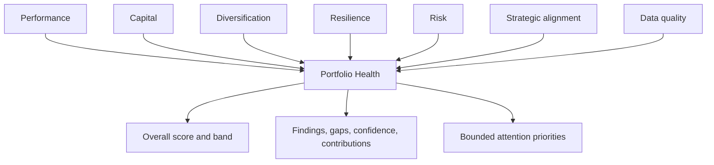
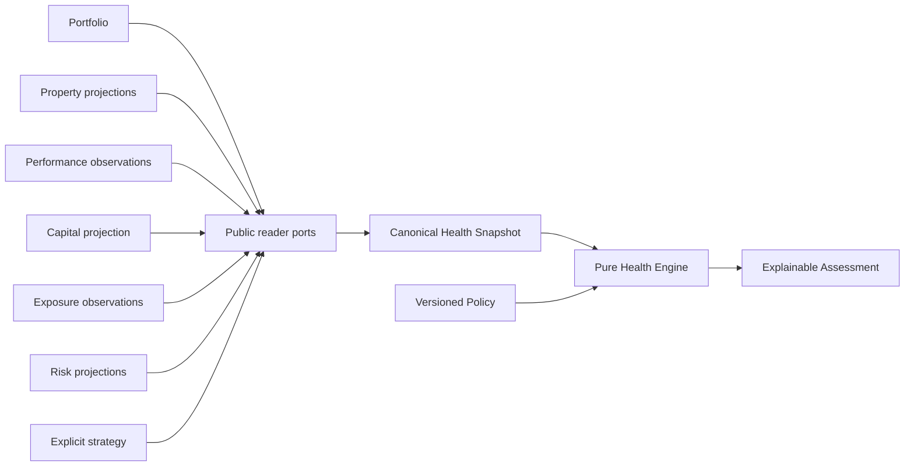
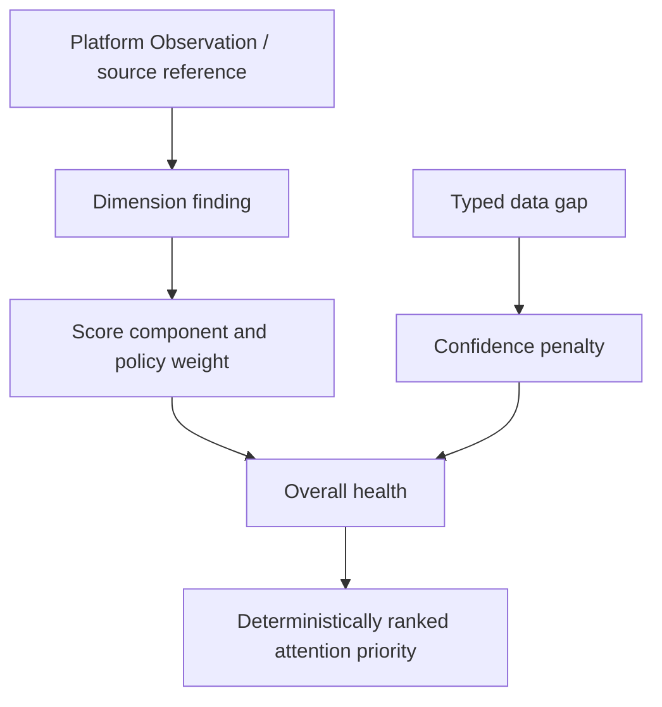

# PI-002 — Portfolio Health Engine

## Purpose

PI-002 establishes Portfolio Health as an immutable, explainable assessment of how well a hospitality business is positioned to sustain and improve performance.

Health is not property performance, portfolio valuation, a recommendation, or a dashboard score. Performance is one input. The assessment evaluates the business across operating performance, capital, diversification, resilience, risk, explicit strategy, and data quality.

The implementation lives in `src/features/portfolio-intelligence`. It consumes PI-001 identity and membership vocabulary but never mutates the `Portfolio` aggregate.

## Health composition



The v1 policy weights are:

| Dimension | Weight |
| --- | ---: |
| Performance | 25% |
| Capital | 20% |
| Diversification | 15% |
| Resilience | 15% |
| Risk | 10% |
| Strategic alignment | 10% |
| Data quality | 5% |

`ScoreComponent`, `ScoreBreakdown`, `Score`, and `Weight` come from Platform scoring. The breakdown requires normalized evaluated weights to total 100%. Each dimension retains its original policy weight and original weighted contribution; the breakdown description makes normalization across evaluated dimensions explicit.

## Source architecture



External capabilities enter through owner-scoped application reader ports. No property, opportunity, acquisition-pipeline, provider, persistence, React, Next.js, or Supabase object enters the domain.

The application service:

1. validates the owner-scoped query and observation window;
2. selects an explicit policy version;
3. loads the canonical portfolio, bounded property projections, performance observations, capital, exposures, risk, strategy, and observations;
4. degrades optional failures into source-coverage gaps;
5. fails for missing portfolio, membership, capital, or policy;
6. builds an immutable snapshot;
7. invokes the pure engine;
8. records an instrumentation outcome without changing assessment content.

Evaluation does not require persistence. A future immutable-assessment repository contract is defined, but no adapter or migration is introduced.

## Canonical snapshot

`PortfolioHealthSnapshot` records:

- portfolio ID, aggregate version, name, and USD reporting currency;
- active and historical property contribution sources;
- opportunity planning sources;
- available, reserved, committed, allocated, and optionally known future capital;
- explicit economic exposures;
- normalized active, mitigated, and resolved risks;
- explicit strategy objectives or `null`;
- Platform observation IDs, confidence, and provenance quality;
- expected versus available property and metric coverage;
- capture time.

Opportunities never enter operating performance. Only `approved` and `acquiring` opportunities can augment capital commitments. Rejected, exited, observed, and merely analyzing opportunities do not distort operating health.

## Observation windows and freshness

Every financial metric carries its observation window. Performance aggregation requires exact compatibility with the requested window. Mixed windows produce a blocking `PORTFOLIO_PERFORMANCE_PERIOD_INCOMPATIBLE` gap; the engine does not normalize periods implicitly.

V1 freshness classes use policy thresholds:

- current: at most 30 days;
- aging: over 30 and at most 90 days;
- stale: over 90 days;
- unknown: no dated observation.

Capital and strategy have separate policy threshold fields for future specialization. All freshness calculations use the supplied `evaluatedAt`; the engine never calls the system clock.

## Performance aggregation

Revenue and NOI are summed only when every active property supplies a compatible USD observation for the same window. Monetary sums are accumulated at USD minor-unit precision.

Operating margin is:

```text
aggregate NOI / aggregate revenue
```

It is never the average of property margins.

Occupancy and ADR require denominators:

- occupancy uses occupied nights divided by available nights;
- ADR uses room revenue divided by booked nights.

If denominators are absent, the reusable weighted-metric calculator returns unavailable rather than an unsafe arithmetic average. PI-002 does not fabricate a fallback value.

Property contribution is portfolio-relative. Revenue, positive-NOI, and capital shares are calculated against portfolio totals. Results are bounded to five top or negative/unknown contributors under v1 policy.

## Capital health

Capital buckets remain distinct:

- available is liquid capital;
- reserved is not added to available;
- committed represents obligations;
- allocated represents capital assigned to priorities;
- future requirements remain optional when unknown.

Capital health derives:

- utilization from committed plus allocated capital against represented capital;
- liquidity coverage from available capital divided by known commitments and future requirements;
- unfunded commitment as obligations above available capital.

Zero obligations produce `null` liquidity coverage rather than division by zero. Unknown future requirements produce a material gap and lower confidence. An unfunded commitment creates deterministic critical evidence and triggers the v1 capital-overcommitment cap.

## Concentration and diversification

Concentration uses:

- top-one share;
- top-three share;
- a Herfindahl-Hirschman-style index: `sum(share ratio²) × 10,000`;
- policy thresholds for attention, at-risk, and critical top exposure.

Economic revenue exposure is derived from property revenue when no explicit revenue exposure exists. Explicit market, geography, property-type, operating-model, NOI, or capital bases remain labeled. Property count is used only as a labeled fallback.

A single-property portfolio is valid. Its structural exposure receives the configured diversification score and informational evidence. It is not treated as corrupt or automatically critical, and PI-002 emits no diversification recommendation.

## Resilience

Resilience is separate from diversification. V1 considers:

- dependence on the top revenue property;
- liquid capital coverage;
- the share of active properties producing positive NOI.

Missing exposure or capital inputs reduce confidence. A severe top-property dependency constrains resilience even if current performance is strong.

## Risk

Risk aggregation is not a count. Active risks are weighted by:

- severity;
- economic exposure;
- blocking status.

Duplicate risk IDs are normalized deterministically to the latest observation. Resolved risks are excluded from active severity. A critical active risk produces evidence and activates the critical-risk band cap. Multiple low risks do not automatically become critical.

## Strategic alignment

Alignment evaluates only explicit objectives:

- maximum market concentration;
- maximum single-property revenue share;
- minimum liquidity coverage;
- target market;
- target property type;
- portfolio size.

Objective priority controls its contribution. Missing strategy creates a material gap. Custom or unsupported objectives are unevaluable and create typed gaps. The engine never infers goals from composition and never resolves conflicting owner objectives.

## Data quality and confidence

Data Quality is a scored dimension. Overall confidence is a separate Platform `ConfidenceAssessment`.

Data Quality combines coverage, freshness, provenance, and compatibility into a health component. Confidence uses independently versioned policy weights and explicit penalties from gaps. Therefore a portfolio can have good available data quality for one dimension while the overall assessment remains low-confidence because other dimensions are missing.

Missing data never supplies a midpoint, zero, average, or healthy value. Blocking gaps return an `insufficient-data` dimension result. If evaluated policy weight falls below minimum overall coverage, the engine returns an unevaluable result with no overall score or band.

## Health bands and critical overrides

V1 score bands are policy-owned:

| Band | Minimum |
| --- | ---: |
| Healthy | 85 |
| Stable | 70 |
| Attention | 50 |
| At risk | 30 |
| Critical | 0 |

Weighted averages cannot hide:

- negative aggregate NOI;
- unfunded committed obligations;
- an unresolved critical active risk;
- confidence below policy minimum.

Each override has a stable code, maximum score, and maximum band. Applying the same policy in stable order produces the same cap.

## Explainability



Findings contain stable codes, dimensions, severity, subject, evidence references, numeric values, thresholds where applicable, and resolvability. They do not contain generated product prose.

Positive evidence becomes `strengths`. High and critical evidence becomes `risks`. Informational and warning evidence remains in `warnings`. These collections are distinct.

Attention priorities include only warning, high, and critical findings. V1 returns at most five, ordered by severity, numeric exposure, stable finding code, and stable subject ID. They are assessment outputs—not recommendations, Actions, or commands.

## Empty and formation-stage portfolios

An empty portfolio returns:

```text
status: insufficient-data
reason: PORTFOLIO_HAS_NO_ACTIVE_PROPERTIES
context: empty
```

A portfolio with approved or acquiring opportunities but no active operating properties returns the same honest health limitation with `context: formation-stage`. It does not receive mature operating thresholds and is not silently classified as critical.

Portfolio lifecycle remains a future PI-001 extension. Formation stage is evaluation context in PI-002.

## Determinism and fingerprinting

The pure engine receives snapshot, policy, observation window, and evaluation time. It performs no repository access, clock access, random generation, environment access, or provider call.

The FNV-1a snapshot fingerprint uses canonical:

- portfolio identity/version/currency;
- sorted properties and economic observations;
- sorted opportunities;
- capital facts;
- sorted exposure, risk, strategy-objective, and observation facts;
- data coverage;
- canonical capture and observation times.

Map order, input collection order, presentation labels, provider DTO metadata, and evaluation runtime are excluded. Equivalent reordered snapshots yield the same fingerprint and assessment.

## Health comparison

Comparison requires:

- the same portfolio;
- the same policy version;
- exactly compatible observation windows.

Compatible assessments produce overall and per-dimension deltas, band changes, and deterministic new/resolved finding references. Different portfolios are rejected. Different policies or windows return `not-comparable`; scores are never compared across an unknown policy mapping.

## Deferred functionality

PI-002 deliberately introduces no:

- UI, workspace, or dashboard;
- valuation;
- forecast or scenario simulation;
- capital-allocation or acquisition recommendation;
- automated Action;
- AI narrative;
- provider integration;
- Supabase adapter or database migration;
- live FX conversion;
- user-configurable weights;
- persistence requirement.

PI-003 may consume the assessment for allocation analysis, but must remain a separate decision capability.
