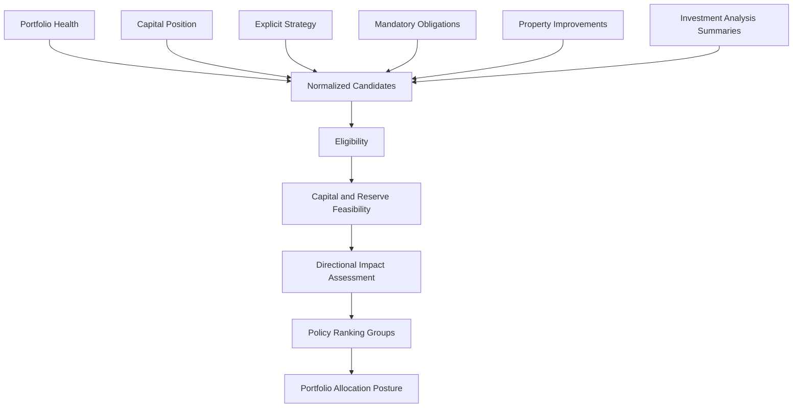
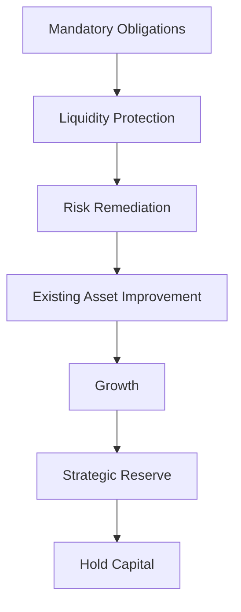
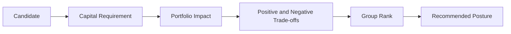

# PI-003 — Capital Allocation Engine

## Purpose

PI-003 establishes Capital Allocation as a distinct, immutable Portfolio Intelligence assessment. It answers where verified portfolio capital should be deployed across mandatory obligations, liquidity protection, risk remediation, existing-asset improvements, acquisition growth, strategic reserves, and deliberate non-deployment.

The engine proposes a posture and candidate ordering. It does not execute a transaction, approve an acquisition, create an Action, issue a recommendation command, mutate Portfolio, mutate an opportunity, or advance an acquisition pipeline.

PI-003 consumes PI-002’s public `PortfolioHealthAssessment`. It uses overall health, limiting dimensions, findings, attention priorities, and confidence without recalculating Portfolio Health.

## Allocation flow



The pure engine accepts only canonical sources, candidates, a compatible health assessment, an explicit policy, and an evaluation time. Loading and authorization remain application concerns.

## Decision hierarchy



This order is policy data, not incidental sort behavior. Feasibility is evaluated before this hierarchy. An infeasible required or growth option receives no normal rank.

Mandatory options do not use the discretionary weighted-return model. A contractual or critical obligation does not need a projected financial return to be required.

## Allocation purposes

V1 supports:

- mandatory obligation;
- liquidity reserve;
- risk remediation;
- property improvement;
- property expansion;
- new acquisition;
- acquisition closing;
- strategic reserve;
- defer deployment.

Debt reduction is intentionally absent because the current Portfolio boundary does not represent debt obligations with enough fidelity. No debt-service or refinance model is invented.

## Candidate normalization

`CapitalAllocationCandidate` is purpose-neutral and contains:

- deterministic candidate identity;
- portfolio identity;
- purpose and classification;
- an opaque portfolio, property, opportunity, acquisition, or obligation subject reference;
- an explicit known or unknown capital requirement;
- timing and delay impact;
- financial, health, strategy, diversification, risk, and operational impact;
- source evidence;
- source confidence;
- source name, version, and update time.

No Property, Investment Opportunity, Acquisition Pipeline, provider DTO, or persistence row enters the contract.

Unknown capital is represented as:

```text
status: unknown
reasonCode: ALLOCATION_REQUIREMENT_UNKNOWN
```

It is never converted to zero. A zero requirement is valid only for the synthetic preserve-capital option.

### Source builders

Application builders normalize:

- purchase and rental-arbitrage analysis summaries;
- property improvement needs;
- mandatory and acquisition-closing obligations;
- preserve-capital.

Acquisition builders preserve upstream required capital, cash flow, NOI, return, recommendation, route, confidence, and analysis lineage. They do not recalculate underwriting. Rejected, exited, and acquired opportunities are excluded from active candidate evaluation.

Risk, compliance, and capital-maintenance improvements are protective. Other supported improvements are growth uses. Missing costs create blocking gaps; no estimate is fabricated.

## Capital position and deployable capital

The v1 calculation is:

```text
verified available capital
− required minimum reserve
− existing committed capital
− near-term obligations
= deployable capital
```

All calculations use Platform `Money` and USD minor-unit precision. Reserved, committed, allocated, unverified, and deployable capital remain distinct.

Negative raw deployable capital becomes:

- zero deployable capital;
- an explicit positive capital shortfall;
- a critical constraint;
- a liquidity-preservation posture.

Unverified capital is reported through confidence but is never added to verified deployable capital.

## Reserve policy

PI-003 v1 supports a fixed `Money` reserve. Percentage-of-cost, months-of-cost, and strategy-derived reserves are rejected as unsupported until canonical operating-cost inputs exist.

The versioned policy defines:

- minimum reserve method and value;
- warning and critical reserve coverage;
- whether reserve breach can ever be conditional;
- candidate staleness;
- whether unfunded mandatory obligations prohibit discretionary deployment.

The default policy prohibits reserve breach and prohibits discretionary allocation while mandatory obligations remain unfunded.

## Mandatory coverage

Mandatory coverage is evaluated before candidate scoring.

It reports:

- total required;
- verified funded amount;
- unfunded amount;
- coverage percentage;
- bounded obligation assessments ordered by urgency and stable ID.

Funding is assigned sequentially in deterministic order, so the same verified capital is never shown as funding multiple obligations. Existing committed and near-term amounts are compared with normalized candidate obligations using the larger represented total to avoid duplicate counting.

An unknown mandatory amount makes the assessment posture `insufficient-data`. An unfunded known obligation makes the posture `fund-mandatory-obligations` and prevents discretionary ranking.

## Feasibility

Each candidate receives exactly one status:

- `feasible`;
- `conditionally-feasible`;
- `infeasible`;
- `insufficient-data`.

Checks include:

- explicit known requirement;
- requirement bounds;
- staged total consistency;
- unsupported recurring normalization;
- candidate expiration;
- source staleness;
- verified deployable capital;
- reserve protection;
- mandatory coverage;
- committed-candidate duplication.

Staged amounts must equal the expected requirement. Recurring requirements remain unevaluable until an explicit normalization period exists.

Conditional feasibility exposes conditions and blockers, such as verifying an estimate or refreshing an aging source. Urgency never changes infeasibility into feasibility.

## Discretionary impact dimensions

Feasible non-mandatory candidates use Platform `Score`, `Weight`, `ScoreComponent`, and `ScoreBreakdown` across:

| Dimension | Weight |
| --- | ---: |
| Portfolio-health impact | 25% |
| Financial efficiency | 20% |
| Strategic alignment | 15% |
| Risk adjustment | 15% |
| Diversification impact | 10% |
| Liquidity impact | 10% |
| Timing | 5% |

### Portfolio-health impact

The engine consumes directional impact and whether the candidate addresses a PI-002 limiting dimension or critical finding. It does not project a future health score.

### Financial efficiency

Financial efficiency uses an authoritative upstream projected return or cash-flow-to-capital relationship when present. Missing financial impact stays unevaluable and lowers confidence. Obligations and risk avoidance may be evaluated without a return.

### Strategy

Only explicit goals enter candidate strategy impact. Missing strategy is `unevaluable`, not aligned.

### Diversification

Candidates state whether they improve, preserve, worsen, or have unknown exposure impact. Increasing concentration is distinct from an unchanged portfolio.

### Risk

Risk remediation can outrank growth even without a quantified return. Introduced, resolved, and residual risk remain explicit.

### Liquidity and timing

Liquidity uses the candidate’s share of verified deployable capital. Timing distinguishes immediate, near-term, planned, and optional uses, but cannot override a capital or reserve blocker.

## Ranking

Deterministic ordering uses:

1. feasibility status;
2. policy group precedence;
3. mandatory classification;
4. discretionary score within compatible groups;
5. confidence;
6. urgency;
7. lower required capital;
8. stable candidate ID.

Input order never affects results. Candidates are bounded at 100 under v1 policy. At most one feasible primary candidate is returned, with at most three feasible alternatives. Infeasible and insufficient-data candidates have `rank: null`.

Mandatory, protective, growth, reserve, and hold options retain their group identity. Their scores are not presented as if a closing obligation and optional acquisition were economically interchangeable.

## Preserve-capital option

The application service always adds a synthetic `defer-deployment` candidate. It:

- deploys zero capital;
- preserves reserve coverage;
- has no fake projected return;
- can become primary when liquidity is constrained;
- is treated as a valid assessment outcome, not a failure.

Its bounded opportunity costs identify delayed growth, unresolved risk, expiring opportunities, or strategy delay using competing candidate evidence. No precise lost value is fabricated.

## Trade-offs



Trade-offs retain separate positive and negative effects. V1 supports evidence-backed relationships such as:

- growth versus liquidity;
- diversification versus unquantified return;
- liquidity preservation versus strategic delay.

Collections are policy bounded and deterministically ordered.

## Confidence and data gaps

Allocation confidence combines:

- PI-002 health confidence;
- verified capital confidence;
- candidate-source confidence;
- candidate coverage;
- source freshness;
- typed penalties.

Confidence and candidate score remain separate. Missing requirements, strategy, impacts, or optional candidate sources can never increase confidence. Blocking gaps prevent normal ranking.

Optional acquisition, improvement, and strategy reader failures degrade into explicit gaps. Portfolio, compatible health, capital, and mandatory-obligation failures are fatal.

## Portfolio posture

The output posture is one of:

- fund mandatory obligations;
- preserve liquidity;
- remediate portfolio risk;
- improve existing assets;
- pursue growth;
- allocate selectively;
- defer deployment;
- insufficient data.

Posture selection is deterministic. It produces no command and does not authorize execution.

## Application boundary

The owner-scoped application service:

1. validates the query and policy;
2. authorizes and loads the portfolio projection;
3. loads a health assessment for the same portfolio version;
4. requires a verified capital position;
5. requires the mandatory-obligation source;
6. degrades optional candidate and strategy sources;
7. normalizes candidates;
8. adds preserve-capital;
9. invokes the pure engine once;
10. returns a Platform `Result`;
11. records instrumentation outside assessment content.

No UI formatting, provider call, persistence, or aggregate mutation occurs.

## Lineage, fingerprint, and comparison

Assessments record:

- portfolio ID and aggregate version;
- optional health assessment ID;
- health policy version;
- allocation policy version;
- evaluation time;
- deterministic snapshot fingerprint.

The fingerprint includes canonical health lineage, capital facts, sorted normalized candidates, policy version, and semantic evaluation time. It excludes input order and runtime metadata.

Comparison requires the same portfolio and compatible health/allocation policy versions. It reports:

- primary-candidate change;
- posture change;
- newly feasible and infeasible candidates;
- rank changes;
- new and resolved constraints.

Different policy versions return `comparable: false`.

## Determinism and boundedness

The pure engine performs no:

- clock lookup;
- random ID generation;
- environment access;
- repository access;
- persistence;
- provider call.

Candidate IDs are derived deterministically by builders from source identity. Policy bounds candidates, alternatives, findings, trade-offs, data gaps, and opportunity costs.

## Deferred work

PI-003 introduces no:

- scenario simulation or future health-score projection;
- multi-year forecast;
- debt-product selection;
- tax or treasury optimization;
- live interest-rate, FX, or provider lookup;
- user-configurable weights;
- AI narrative;
- autonomous recommendation;
- Action creation;
- transaction execution;
- database migration.
