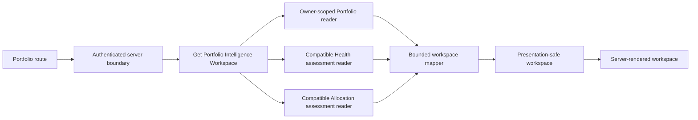
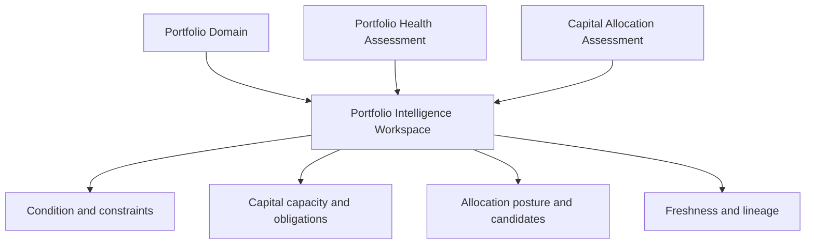
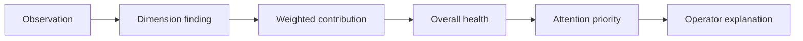
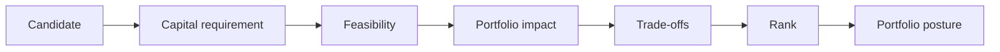

# PI-004 — Portfolio Intelligence Workspace

## Purpose

PI-004 establishes `/dashboard/portfolio` as the canonical operator entry point for understanding a hospitality business as a portfolio. It composes the PI-001 Portfolio aggregate boundary, PI-002 Portfolio Health assessment, and PI-003 Capital Allocation assessment. It does not reproduce their calculations.

The workspace answers, in order:

1. How is the portfolio positioned?
2. What is limiting it?
3. What capital is safely deployable?
4. Which mandatory obligations are covered?
5. Which allocation options are feasible?
6. What posture, primary option, alternatives, and trade-offs were assessed?
7. How current and reliable is the result?

## Route and navigation ownership

`/dashboard/portfolio` is a business destination in the **Understand** lifecycle stage. It appears as **Portfolio Intelligence** in the flat Business navigation group. This follows navigation Option B: a business destination with lifecycle ownership, without adding a second nested global navigation tree.

The existing `/dashboard/investments/portfolio` route is preserved. It is an Investment Intelligence opportunity list and continues to answer questions about individual acquisitions. It is not redirected or renamed because that would blur bounded contexts and break existing links.

Only the initial composed route is introduced. Health, allocation, properties, opportunities, and history child routes remain deferred.

## Architecture



The production composition accepts PI-001 `PortfolioRepository` and immutable PI-002/PI-003 assessment readers. No database migration is introduced. A deployment without those adapters returns a safe unavailable state; it does not infer membership from property or acquisition tables.

Authorization occurs before the single bounded source read. Cross-owner access is concealed as not found. Owner identity is resolved from trusted server authentication and never accepted from the browser.

## Workspace composition



The application projection is deeply read-only and bounded:

- attention priorities: 8
- property contributions: 12
- allocation candidates: 8
- findings per group: 6
- exposure assessments: 8

No aggregate, persistence row, provider DTO, assessment fingerprint, owner ID, or unbounded evidence graph reaches presentation.

## Health experience

Health remains distinct from performance and allocation. The workspace presents:

- qualitative overall band, with score as secondary context;
- confidence and assessment freshness;
- all seven canonical dimensions;
- evaluated, insufficient-data, and not-applicable states;
- limiting dimensions;
- strengths, risks, and warnings as separate collections;
- ranked attention priorities;
- evidence-backed stable finding explanations; and
- explicit health data gaps.

Missing dimension data displays **Not evaluated**, never zero or Critical. Presentation labels and concise explanations map stable domain codes to operator language; they do not alter assessment meaning.



## Capital experience

Capital uses authoritative PI-002/PI-003 values. The presentation displays the equation:

```text
available
− protected reserves
− commitments
− near-term obligations
= deployable capital
```

Available, reserved, committed, allocated, required reserve, obligations, deployable capital, and unfunded amounts remain separate. Mandatory coverage displays required, funded, unfunded, and percentage coverage. Presentation derives only the label Protected, Constrained, or Overcommitted from the already-mapped projection; it introduces no new score.

## Allocation experience

PI-003 posture, feasibility, rank, required capital, post-allocation liquidity, confidence, directional health impact, strategic alignment, diversification direction, strengths, weaknesses, blockers, and trade-offs are mapped into bounded candidate projections.



The primary candidate must already have been selected by PI-003. React does not rank candidates. Alternate IDs are mapped in engine order. Infeasible and insufficient-data candidates remain visible in an expandable section and have no normal rank. The `defer-deployment` candidate is labeled as a legitimate preserve-capital option. The workspace never approves, executes, mutates, or creates an Action.

## Composition and contribution

The composition section shows active property and opportunity counts, property-count distributions, explicit concentration bases, top exposure, top-three exposure, and bounded portfolio-relative property contribution.

Historical properties and terminal opportunities do not inflate active counts. Every exposure names its basis. A property-count distribution is never labeled as revenue exposure.

A single-property portfolio receives a structural concentration explanation without invalidating its performance or capital assessment. An empty portfolio receives no health score. A portfolio with active opportunities but no operating properties is presented as formation stage, retaining capital and allocation sections where available.

## Freshness and lineage

The mapper preserves:

- Portfolio version
- health policy version
- allocation policy version
- health evaluation time
- allocation evaluation time
- observation window
- compatibility and freshness

Health is stale when its Portfolio version differs from the current aggregate. Allocation is stale when the Portfolio version differs or health was evaluated after allocation. Allocation is incompatible when its health policy lineage differs from the current Health assessment. Stale and incompatible states generate limitations and reevaluation guidance. Fingerprints remain internal.

## Degradation

Fatal query outcomes are authentication failure, concealed/not-found Portfolio, invalid query, and unavailable canonical Portfolio source.

Expected assessment absence is a successful degraded workspace state:

- `health-unavailable`
- `allocation-unavailable`
- `insufficient-data`
- `formation-stage`

Optional assessment reads may fail independently. Their absence becomes a visible limitation and never a default score, capital amount, or posture.

## Accessibility and responsive behavior

The route uses the platform’s existing main landmark and adds semantic section headings, lists, definition lists, status and alert regions, explicit rank text, textual feasibility, and visible unavailable wording. No condition relies on color alone. Loading uses section skeletons with a screen-reader status and disables animation under reduced-motion preferences.

Layouts begin as a single column, become two-column summaries at larger breakpoints, and never require horizontal tables. Candidate details and trade-offs stack on mobile. Native `details`/`summary` provides keyboard-operable disclosure for infeasible candidates. Existing platform focus-visible treatment remains in force.

## Loading, performance, caching, and telemetry

Initial rendering uses one server query. The page does not directly access a repository and components never load data. Collections are bounded, there is no N+1 property query, and no full aggregate or assessment graph is serialized.

The production integration should cache with the existing conventions under:

- `portfolio:{portfolioId}`
- `portfolio-health:{portfolioId}`
- `portfolio-allocation:{portfolioId}`
- `portfolio-workspace:{portfolioId}`

Only the affected Portfolio workspace should be revalidated after membership, capital, strategy, compatible assessment, or acquisition commitment changes. This milestone defines the centralized boundary but does not introduce persistence or cache infrastructure that the repository does not yet provide.

The query observer records `portfolio_workspace_opened` with result status and limitation count only. Financial values, property names, Portfolio IDs, strategy text, and risk details are excluded. More granular interaction telemetry is deferred until interactive drill-downs exist.

## Security

- server-resolved owner identity;
- authorization before reads;
- cross-owner concealment;
- no owner ID in standard workspace DTOs;
- no direct Supabase use in the page or presentation;
- no provider or persistence detail in errors;
- no internal fingerprints in the standard UI;
- no high-cardinality or financial telemetry.

## Deliberately deferred

- portfolio membership, capital, strategy, and goal editing;
- assessment persistence migrations;
- assessment history UI;
- recommendation engine;
- Action creation;
- allocation execution;
- acquisition approval or commands;
- scenario modeling, forecasts, and simulations;
- AI narrative generation;
- user-adjustable policy weights;
- cross-portfolio comparison;
- child routes and advanced charts.

## Validation posture

Architecture tests assert that React imports neither engine implementation nor repository/provider infrastructure, that contracts are bounded, and that no mutation or command control exists. Query tests cover authorization order, cross-owner concealment, empty and formation states, independent degradation, bounds, composition semantics, lineage, compatibility, and deterministic projection. Presentation tests cover unavailable-versus-poor semantics, empty/formation language, and accessible progressive loading.
