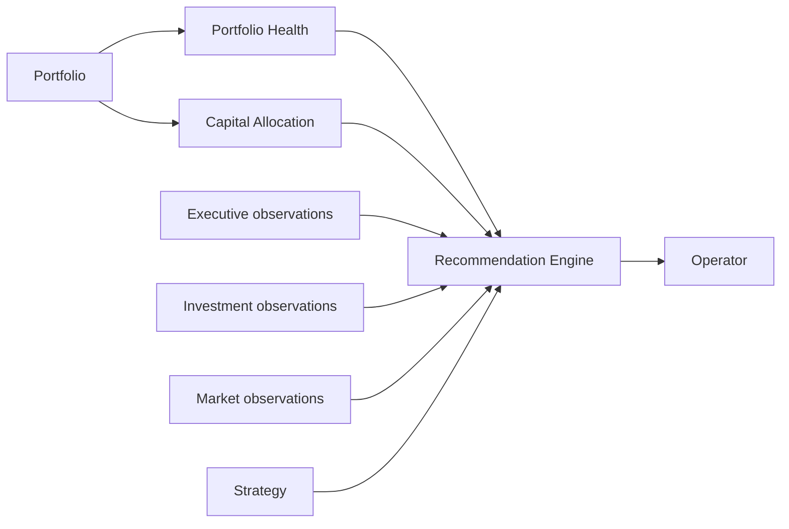
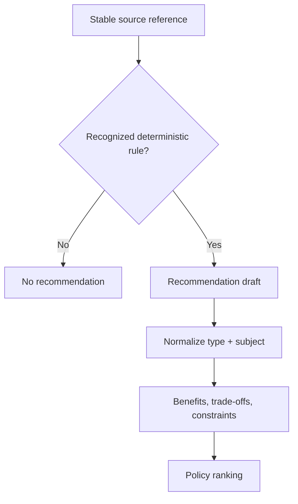
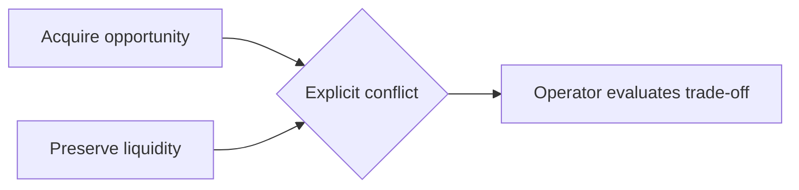
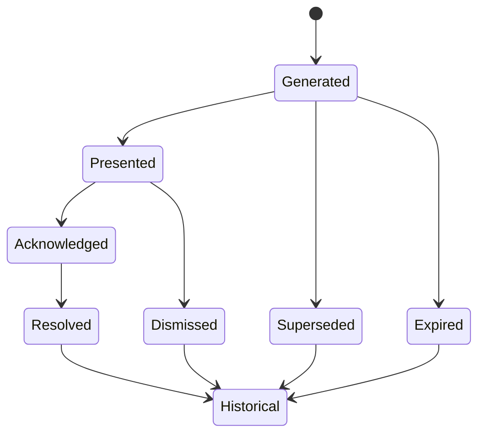

# PI-005 — Portfolio Recommendations Engine

## Purpose

PI-005 introduces a distinct recommendation capability within Portfolio Intelligence. It transforms current Portfolio Health, Capital Allocation, explicit strategy state, and normalized Executive, Investment, and Market observations into bounded, evidence-backed recommendations.

Health still answers **how healthy is the portfolio?** Allocation still answers **where can capital go?** Recommendations answer **what should the operator consider doing next?**

The output is advisory. It does not mutate Portfolio, approve an acquisition, execute capital deployment, create an Action, issue a command, send a notification, or generate an AI narrative.



## Bounded capability

The recommendation domain lives under `portfolio-intelligence/domain/recommendations`. It imports public Health and Allocation contracts and Platform confidence primitives. It imports no React, Next.js, Supabase, provider DTO, aggregate repository, assessment engine implementation, environment value, clock, or random generator.

External sources enter through application reader ports:

- owner-scoped Portfolio version;
- latest compatible Health;
- latest compatible Allocation;
- strategy;
- Executive observations;
- Market observations; and
- Investment observations.

The pure engine performs no I/O. Authentication and source loading occur in the application service before evaluation.

## Canonical contracts

Every `PortfolioRecommendation` contains:

- deterministic identity;
- exactly one category and type;
- policy-derived priority;
- Platform `ConfidenceAssessment`;
- evidence references, never copied evidence bodies;
- qualitative benefits;
- qualitative trade-offs;
- independent constraints;
- a reversible recommended-action description;
- stable supporting finding codes;
- affected object references;
- directional estimated impact;
- rationale and ignored-impact codes;
- deterministic rank;
- explicit conflict references;
- policy version and evaluation time.

Canonical categories are Acquire, Improve, Preserve, Reduce Risk, Increase Liquidity, Diversify, Hold, Investigate, and Monitor.

The v1 types are Acquire Opportunity, Delay Acquisition, Increase Reserve, Renovate Property, Address Concentration, Resolve Capital Shortfall, Reduce Revenue Dependence, Improve Occupancy, Reevaluate Strategy, Collect Missing Data, Wait, Resolve Portfolio Risk, and Monitor Portfolio Condition.

## Evidence policy



V1 recognizes only evidence for which the repository has explicit public meaning:

- Health findings for critical risk, overcommitment, low reserve, market concentration, revenue concentration, and single-property dependency;
- Health data gaps;
- Allocation mandatory shortfall, posture, and primary feasible candidate;
- explicit missing strategy;
- unavailable strategy source as a data-collection need;
- `EXECUTIVE_OCCUPANCY_DECLINING`;
- `INVESTMENT_ANALYSIS_INCOMPLETE`; and
- `MARKET_CONCENTRATION_HIGH`.

Unknown observation codes are ignored. They cannot create a recommendation merely because their text appears important. Evidence is represented by kind, reference ID, and optional source version; no source payload is copied into the recommendation.

## Rules and policy versioning

The default policy is `portfolio-recommendations-1`. It owns:

- stable rules and baseline priorities;
- ranking weights;
- maximum recommendation, evidence, and conflict counts;
- observation staleness threshold.

The ranking weights are:

| Dimension | Weight |
| --- | ---: |
| Priority | 30% |
| Confidence | 15% |
| Health impact | 20% |
| Capital impact | 15% |
| Risk reduction | 15% |
| Urgency | 5% |

Weights must total 100%. Collection bounds and rule uniqueness are validated. Policy changes require a new version.

Priority order is Critical, High, Medium, Low, Informational. UI code does not assign or change priority.

## Confidence

Recommendation confidence derives from referenced source confidence, Health confidence, Allocation confidence, freshness, and constraints. Stale evidence introduces a `stale-data` constraint and lowers confidence. Optional source failures lower assessment confidence and remain in `sourceLimitations`.

Health quality and Allocation confidence remain inputs; neither is copied as the recommendation confidence. Missing information can never raise confidence.

## Suppression

Recommendations normalize by recommendation type, affected subject type, and stable subject ID:

```text
type:subject-type:subject-id
```

Multiple findings producing the same normalized recommendation become one recommendation. Evidence, benefits, trade-offs, constraints, confidence inputs, and finding codes are merged and sorted deterministically. The assessment records the normalized key and source count for every suppressed duplicate.

## Conflicts

Growth recommendations (Acquire or Improve) conflict with capital-protection recommendations (Preserve, Increase Liquidity, or Hold). Both remain visible. The assessment stores bounded conflict pairs and each recommendation references its conflicting recommendation IDs.

Conflict detection never silently removes the lower-ranked option and never decides for the operator.



## Ranking and posture

The engine evaluates rules, suppresses duplicates, computes a policy score, and sorts by:

1. weighted policy score;
2. priority;
3. urgency;
4. normalized stable key.

Input order cannot affect output. Recommendations are capped at 12.

The portfolio recommendation posture is:

- **Protect** when critical risk or liquidity recommendations exist;
- **Stabilize** when liquidity or preservation is material;
- **Optimize** for improvement or diversification;
- **Grow** for acquisition;
- **Observe** when monitoring is the appropriate next posture.

Posture is an assessment summary, not an execution instruction.

## Determinism and identity

Recommendation IDs use an FNV-1a hash of their normalized recommendation key. The assessment fingerprint uses canonical Portfolio version, Health and Allocation lineage, strategy, sorted observation references, policy version, observation window, evaluation time, and sorted limitations.

The engine never calls the system clock, accesses the environment, generates a UUID, queries a repository, or depends on collection input order.

## Lifecycle and immutable history



Lifecycle events are append-only value records. Every transition returns a new frozen history. Dates must be chronological. Invalid transitions are rejected. Dismissed, Superseded, and Expired are supported alongside the required Generated, Presented, Acknowledged, Resolved, and Historical states.

Persistence remains optional. PI-005 defines a future history repository contract but introduces no migration.

## Comparison

Recommendation comparison uses semantic identity—type plus affected subject—rather than generated rank or array position. Compatible assessments identify:

- new;
- resolved;
- escalated;
- downgraded;
- unchanged recommendations; and
- posture change.

Different Portfolio IDs or recommendation policy versions are not comparable. Changes are returned in deterministic order.

## Application orchestration and degradation

The application service:

1. validates the query;
2. selects policy;
3. authorizes access;
4. loads owner-scoped Portfolio version;
5. loads compatible Health and Allocation;
6. loads optional strategy and normalized observation sources;
7. records every optional failure as a limitation;
8. invokes the pure engine once; and
9. returns the immutable assessment.

Missing Portfolio, Health, Allocation, or policy is fatal. Strategy, Executive, Market, and Investment sources are degradable. An unavailable strategy source produces a Collect Missing Data recommendation, not a claim that strategy is absent. A successfully loaded but explicitly undefined strategy may produce Reevaluate Strategy.

Instrumentation records policy version, outcome, recommendation count, and limitation count. It excludes Portfolio IDs, financial values, property names, strategy text, and evidence bodies.

## Security and architecture

- authorization precedes all source reads;
- owner identity stays in application contracts;
- no raw aggregate enters recommendation contracts;
- no provider or persistence row enters the domain;
- no copied evidence payload is returned;
- output collections are bounded;
- all recommended actions are explicitly reversible descriptions;
- no Action or domain command is created;
- no Portfolio, Opportunity, Pipeline, or assessment is mutated.

## Deferred functionality

- PI-006 command-center presentation;
- AI or generated narrative;
- chat;
- recommendation automation;
- Action Center conversion;
- acquisition approval;
- capital execution;
- notifications or email;
- persistence migrations;
- live provider integrations;
- user-adjustable weights;
- free-form strategy interpretation;
- unsupported observation rules.
