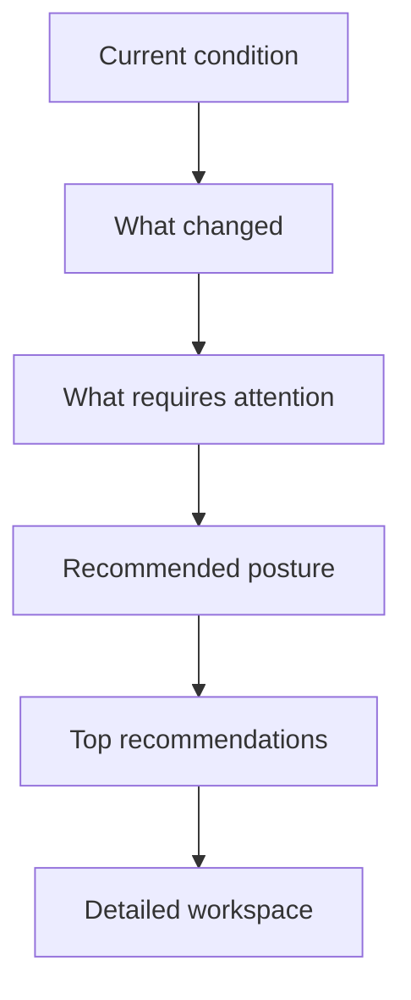
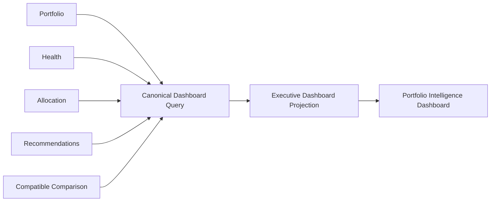
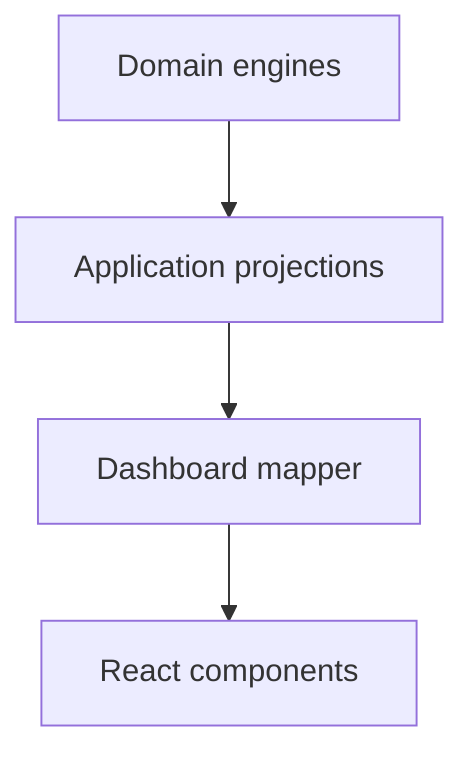
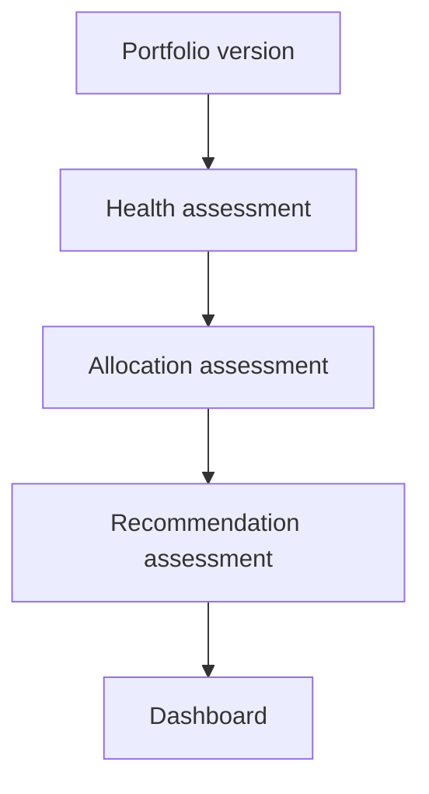

# PI-006 — Portfolio Intelligence Dashboard

## Purpose

PI-006 is the executive orientation surface for Portfolio Intelligence. It answers what condition the portfolio is in, what changed, what requires attention, how capital is positioned, and what the operator should consider next.

The dashboard is deliberately narrower than the PI-004 workspace:

| Dashboard | Workspace |
| --- | --- |
| Rapid executive orientation | Detailed investigation |
| Current condition and material change | Full dimensions and evidence |
| Deployable capital and constraints | Complete capital composition |
| Allocation posture and primary candidate | Complete candidate analysis |
| Top three active recommendations | Detailed portfolio exploration |

## Route and navigation ownership

`/dashboard/portfolio` is the canonical executive dashboard and remains the single Portfolio Intelligence navigation destination.

`/dashboard/portfolio/workspace` contains the detailed PI-004 workspace. Dashboard summaries link into that route. No second global Portfolio navigation item was introduced.

PI-006 v1 is read-only. Recommendation lifecycle controls, Action creation, and intelligence refresh orchestration are explicitly unavailable until canonical command and persistence boundaries exist.

## Decision hierarchy

The first viewport contains overall Health, comparable movement, the primary constraint, capital status, Allocation posture, and the highest-ranked active recommendation.

## Query architecture

The authenticated route invokes one application query. Authorization completes before the reader performs any sensitive fan-out. The reader composes existing bounded public projections; the mapper returns one presentation-safe dashboard state.

The production composition deliberately returns a safe unavailable result until a persistent Portfolio adapter is approved. No migration or fabricated demonstration data was added.

## Dashboard projection

The immutable projection contains:

- portfolio identity, lifecycle, counts, reporting currency, and observation window;
- executive conclusions;
- compact Health and comparable movement;
- authoritative Capital and Allocation outputs;
- active, bounded Portfolio Recommendations;
- material changes;
- attention items;
- positive, constraining, opportunity, and exposure drivers;
- freshness, lineage, capabilities, and limitations.

Application-enforced default bounds are three recommendations, five attention items, five changes, three positive drivers, three constraining drivers, three exposure highlights, and three limiting dimensions. Subject hydration is also bounded.

## Presentation boundaries

Presentation does not:

- calculate a Health score or band;
- calculate deployable capital;
- determine feasibility or Allocation posture;
- rank candidates or recommendations;
- generate recommendations or business priorities;
- query repositories or Supabase;
- mutate Portfolio, Opportunity, or Acquisition state.

Money and stable codes are formatted only at the presentation boundary. Unknown inputs remain unavailable rather than becoming zero or critical.

## Health and comparable change

Health is mapped from PI-002. The dashboard shows its band, score when evaluated, confidence, limiting dimensions, compact dimension states, and evaluation time.

Movement uses the PI-002 comparison contract only when portfolio identity, Health policy, and observation windows are compatible. Otherwise the dashboard reports a specific no-comparison state. “No comparable assessment” is never presented as “no change.”

## Capital and Allocation

Capital values are mapped from PI-002 and PI-003 outputs. The capital equation presents authoritative available, protected, committed, near-term-obligation, and deployable values without repeating the calculation in React.

Mandatory shortfalls receive priority treatment before discretionary growth. The Allocation section preserves the PI-003 posture, constraints, primary candidate, feasibility, directional Health effect, liquidity result, strategic alignment, and primary trade-off. It never turns posture into an execution command.

## Recommendations and conflicts

PI-005 provides Recommendation posture, ranks, priorities, evidence references, benefits, trade-offs, confidence, conflicts, and lifecycle history. Resolved, dismissed, superseded, expired, and historical recommendations are excluded from the active list. The dashboard preserves authoritative rank and limits the list to the requested bounded maximum.

Conflicts remain visible. The dashboard does not silently choose between opposing recommendations and does not acknowledge, dismiss, defer, accept, or execute them.

## Attention, drivers, and exposure

The attention mapper combines already-ranked upstream Health priorities, mandatory capital constraints, critical or high Recommendations, blocking data gaps, and stale-intelligence notices. It applies only stable cross-source presentation precedence and duplicate suppression; it does not invent a new domain recommendation.

Drivers preserve Portfolio-relative contribution and upstream concentration bases. Every exposure states whether it is based on revenue, NOI, capital, property count, or another explicit canonical basis.

## Intelligence lineage and freshness

The dashboard validates:

- Portfolio version against Health, Allocation, and Recommendations;
- Health policy referenced by Allocation and Recommendations;
- Allocation policy referenced by Recommendations;
- evaluation sequence;
- requested observation window;
- compatible prior Health assessment.

A Portfolio change makes downstream intelligence stale. An incompatible policy makes the affected section incompatible. Internal fingerprints are retained upstream for lineage but are never exposed in the standard dashboard.

## Degraded, empty, formation, and single-property states

Missing optional assessments produce a useful degraded dashboard rather than a page failure. Missing conclusions are not manufactured.

An empty Portfolio receives no Health score or Recommendation. A formation-stage Portfolio can show capital, commitments, opportunities, and supported posture without mature operating assumptions. A single-property Portfolio presents valid performance and capital intelligence while describing concentration as structural rather than an error.

## Accessibility and responsive behavior

The dashboard uses semantic landmarks and ordered headings, text labels in addition to color, announced loading and stale states, accessible ranks and priorities, keyboard-visible focus, and reduced-motion skeleton behavior. Desktop emphasizes the executive first viewport; tablet and mobile collapse to reading-order-aligned cards without mandatory horizontal scrolling.

Charts were not introduced. All current conclusions are understandable through accessible text and structured values.

## Security, performance, caching, and telemetry

Owner identity is resolved at the server boundary. Cross-owner reads are concealed, and authorization precedes data composition. No aggregate, persistence row, provider DTO, raw strategy text, fingerprint, or unbounded evidence graph reaches presentation.

The route performs one initial dashboard query. Collections and reference hydration are bounded, and presentation performs no N+1 reads. The existing Portfolio-scoped cache model remains the intended invalidation boundary; no broad dashboard revalidation was added.

Telemetry records only bounded operational outcomes such as success, denial, invalid input, not found, unavailable source, and unexpected failure. It excludes owner IDs, portfolio IDs, property names, exact financial values, recommendation text, risk content, and fingerprints.

## Deferred functionality

The following remain deferred:

- recommendation acknowledgement, deferral, dismissal, or Action handoff;
- intelligence refresh orchestration and persistence;
- scenario modeling and forecasting;
- cross-portfolio comparison;
- complete assessment history;
- notifications and AI narrative generation;
- editing Portfolio membership, capital, or strategy.
