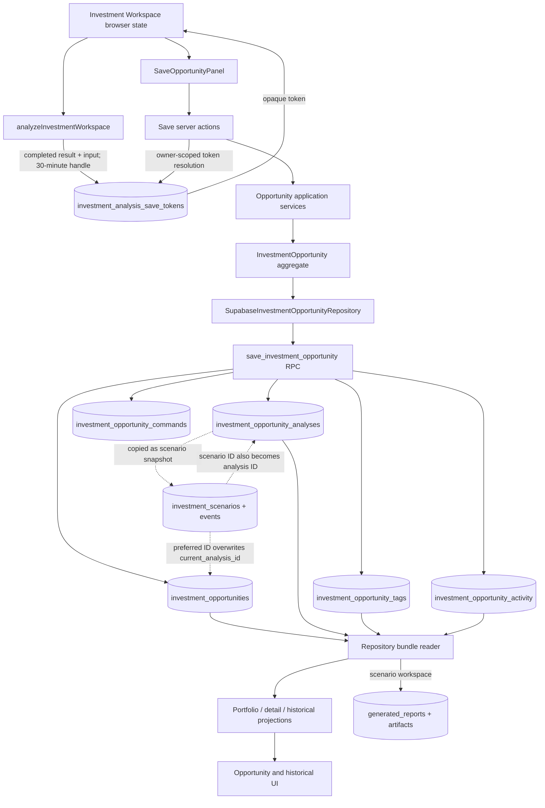
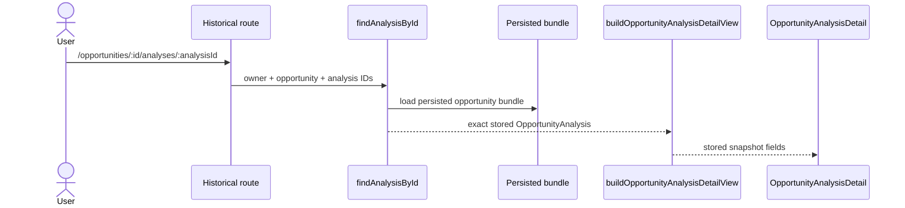
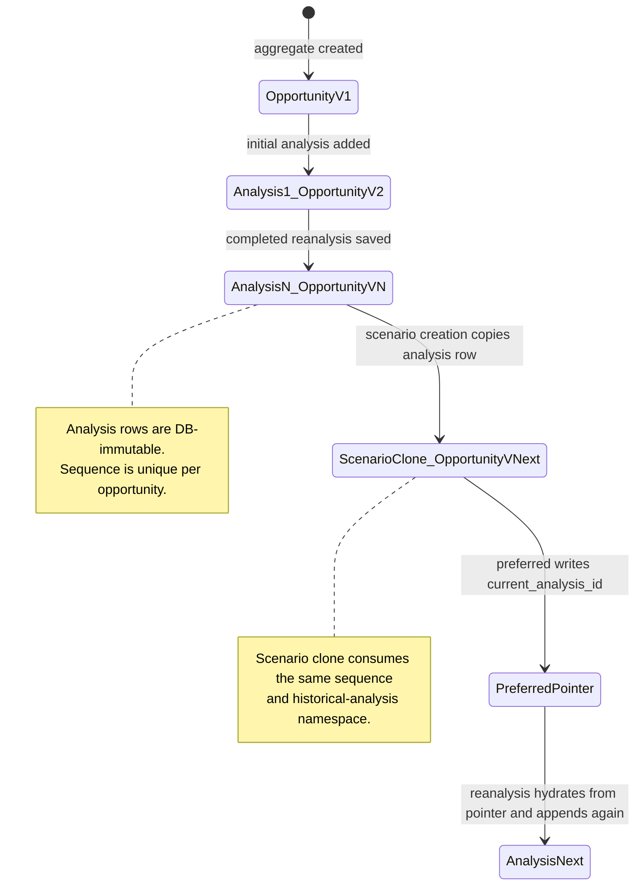
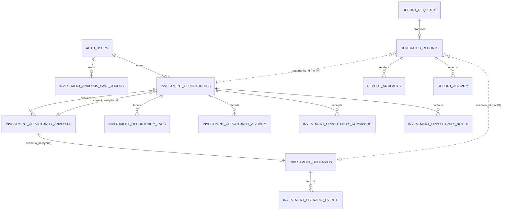

# SA-001A — Saved Analysis Persistence Audit

**Status:** Complete static audit; production data verification remains explicitly unverified  
**Priority:** P0  
**Capability:** Investment Intelligence  
**Milestone:** Functional Recovery  
**Audit date:** 2026-07-27  
**Behavior/schema changes:** None

## 1. Executive finding

The normal completed-analysis save path is implemented and reaches durable Supabase storage through one atomic RPC:

`SaveOpportunityPanel` → save server action → opportunity application service → `InvestmentOpportunity` aggregate → Supabase repository → `save_investment_opportunity` → opportunity, immutable analysis, activity, tags, and command receipt.

The primary architectural failure is downstream of that boundary: operational scenarios are stored by copying analysis rows into `investment_opportunity_analyses`, and selecting a preferred scenario writes the scenario row ID into `investment_opportunities.current_analysis_id`. The same table and pointer are then used as the Saved Analysis history/current-version model. Consequently:

- scenario creation increments Saved Analysis sequence and analysis count;
- scenario clones appear as historical analyses;
- “current analysis” can mean “preferred scenario” rather than latest completed analysis;
- reanalysis can hydrate from a scenario clone;
- report generation reads the scenario/analysis hybrid read model;
- source-analysis lineage is overwritten rather than retained as an explicit parent relation.

This is the first failing architectural boundary to repair in SA-001B. It is not detected by the passing unit tests because those tests characterize the in-memory/domain projections and do not execute the production scenario SQL against the Saved Analysis repository.

Two additional save-boundary failures are verified statically:

1. Save idempotency receipts are returned by the database but discarded by the gateway. A replay of “save as new” can return and redirect to a newly generated, non-persisted opportunity ID; a replay of “save to existing” is rejected by the domain as a duplicate before the database receipt is consulted.
2. Saving a new opportunity with an optional note uses two transactions. The opportunity and Analysis 1 can commit while note persistence fails, after which the action reports the whole operation as failed.

No repository code, database migration, or runtime behavior was changed during this audit.

## 2. Verification method and limits

Evidence was collected from:

- browser components and Next.js server actions;
- application services, domain aggregates, mappers, repositories, and production composition;
- Supabase migrations, RPCs, constraints, indexes, triggers, grants, and RLS policies;
- Saved Analysis, scenario, reporting, authorization, and workspace tests;
- local focused test execution and TypeScript compilation.

Verification run on 2026-07-27:

```text
vitest: 4 files passed, 26 tests passed
tsc --noEmit: passed
```

Focused suites:

- `src/features/investment-opportunity/tests/workflow.test.ts`
- `src/features/investment-opportunity/tests/scenarios.test.ts`
- `src/app/actions/investment-workspace-security.test.ts`
- `src/app/actions/investment-workspace-schema.test.ts`

Limits:

- No production database was queried or mutated.
- Current production migration state, row counts, orphans, actual RLS outcomes, query plans, and logs were not remotely verified.
- There is no Saved Analysis-specific remote verification harness. The existing acquisition verification script inventories acquisition-pipeline tables only.
- Findings labeled “verified” below are verified from executable source/migrations or local tests, not from production telemetry.

## 3. Canonical persistence architecture



The dashed edges are the architecture divergence. A scenario is not linked to an Analysis Version; it is implemented as another Analysis Version row.

## 4. Save path inventory

| Boundary | File / function | Responsibility | Input | Output |
|---|---|---|---|---|
| Browser state | `src/features/investment-intelligence/components/investment-workspace-state.tsx:129`, `analyzeInvestment` | Submits assumptions, retains completed result and token, invalidates token when inputs change | Workspace values | Runtime result, `analysisSaveToken`, `analyzedAt` |
| Save UI | `src/features/investment-opportunity/components/save-opportunity-panel.tsx:8`, `SaveOpportunityPanel` | Selects new/existing mode, creates client idempotency key, invokes save action, redirects | Token, name/tags/note or opportunity/version | Mutation result |
| Analysis action | `src/app/actions/investment-workspace.ts:35`, `analyzeInvestmentWorkspace` | Authenticates, validates, calls live providers and investment engine, stores save payload | Analysis command | Result plus opaque token |
| Transient durable handoff | `src/app/actions/investment-analysis-save-store.ts:8`, `storeInvestmentAnalysis` | Hashes token and stores exact result/input for 30 minutes | Owner, result, input, analysis time | Raw bearer token |
| New save action | `src/app/actions/investment-opportunity-workflow.ts:31`, `saveAnalysisAsNewOpportunityAction` | Validates token and command, builds snapshot, creates opportunity/initial version, optionally adds note | Save command | IDs, aggregate version, redirect |
| Existing save action | `src/app/actions/investment-opportunity-workflow.ts:43`, `saveAnalysisToOpportunityAction` | Resolves token, optimistic-concurrency saves another version | Token, opportunity, expected version, command key | IDs, sequence, aggregate version, redirect |
| Request composition | `src/app/actions/investment-opportunity-runtime.ts:44`, `getInvestmentOpportunityRequestContext` | Gets authenticated Supabase user and constructs production repositories | Session | Owner-scoped repositories |
| Application service | `src/features/investment-opportunity/application/services.ts:13`, `createInvestmentOpportunity`; `:22`, `saveOpportunityAnalysis` | Creates/loads aggregate, checks ownership/version, adds immutable analysis | Command plus stored result | Updated aggregate |
| Domain | `src/features/investment-opportunity/domain/investment-opportunity.ts:8`, `create`; `:27`, `addAnalysis` | Enforces route, compatibility, duplicate lifecycle ID, monotonic sequence, archive status; emits activity | Domain values | Versioned aggregate |
| Snapshot mapper | `src/features/investment-opportunity/application/snapshot-builder.ts:33`, `buildOpportunityAnalysisSnapshotFromWorkspace` | Projects completed result, provider evidence gaps, and user assumptions into snapshot v1 | Workspace analysis | Serializable snapshot |
| Persistence mapper | `src/features/investment-opportunity/infrastructure/mappers/opportunity-persistence-mapper.ts:7`, `toInvestmentOpportunityPersistence` | Maps aggregate to four table payloads | Aggregate | RPC JSON payload |
| Repository | `src/features/investment-opportunity/infrastructure/persistence/supabase-investment-opportunity-repository.ts:14`, `save` | Calls gateway, translates serialization/persistence errors | Aggregate/version/key | `void` |
| Gateway | `src/app/actions/investment-opportunity-runtime.ts:10`, `saveAtomic` | Calls database RPC; currently discards returned receipt | Persistence payload | Error only |
| Database transaction | `supabase/migrations/20260722090000_investment_opportunity_foundation.sql:97`, `save_investment_opportunity` | Auth check, idempotency lookup, row lock, optimistic concurrency, all core writes | JSON payload/version/key | JSON receipt |
| Returned projection | `src/features/investment-opportunity/application/portfolio-view.ts:20`, `loadOpportunityDetail` | Selects current version, prior versions, and activity for UI | Rehydrated aggregate | `OpportunityDetailView` |

## 5. Persistence inventory

### 5.1 Saved Analysis core

| Object | Purpose / owner | Key and relations | Mutability / lifecycle |
|---|---|---|---|
| `investment_analysis_save_tokens` | Short-lived, owner-scoped durable handoff from calculation to save | PK `token_hash`; `owner_id → auth.users`; index `(owner_id, expires_at)` | Insert/read/delete permitted by owner RLS. Payload is mutable in principle because no update trigger exists, although application only inserts/reads. Expires logically after 30 minutes; no cleanup or consumption. |
| `investment_opportunities` | Aggregate root; directly owned by `owner_id`, not workspace | Text PK; owner FK; deferred composite FK `(id,current_analysis_id) → analyses(opportunity_id,id)` | Name, status, current pointer, archive time, updated time, and version mutate via RPC. Property/route/creation fields are retained on updates. No hard delete path. |
| `investment_opportunity_analyses` | Immutable Saved Analysis snapshots and, currently, scenario clones | Text PK; `opportunity_id` FK; unique `(opportunity_id, sequence)` and `(opportunity_id,id)`; unique lifecycle expression | Append-only trigger blocks update/delete. Created on initial save, reanalysis, and scenario creation. |
| `investment_opportunity_tags` | Mutable aggregate labels | Composite PK `(opportunity_id, normalized_value)`; opportunity FK | Entire set deleted/reinserted on every aggregate save. |
| `investment_opportunity_activity` | Append-only aggregate audit stream | Text PK; opportunity FK; indexes by opportunity/time | Append-only trigger. Created for opportunity, analysis save, status/name/tag/note/archive/restore. |
| `investment_opportunity_commands` | Owner-scoped save idempotency receipt | PK `(owner_id, command_id)`; opportunity FK | Insert-only through RPC in observed code. Stores only opportunity ID, not analysis ID/version/result. No expiry. |
| `investment_opportunity_notes` | Operator note content | Text PK; opportunity FK | Reads are owner/admin. Schema permits `updated_at`, but no audited update workflow is present. Initial optional note is a separate RPC/transaction. |

### 5.2 Scenario persistence

| Object | Purpose / owner | Key and relations | Mutability / lifecycle |
|---|---|---|---|
| `investment_scenarios` | Mutable metadata overlay for a row in the analysis table | `scenario_id` is both PK and FK to `investment_opportunity_analyses.id`; opportunity FK | Name/description/notes/status/revision mutate in place. Archive/restore are metadata state changes. There is no immutable Scenario Version table. |
| `investment_scenario_events` | Append-only scenario event stream | Text PK; scenario and opportunity FKs | Immutable trigger; create/duplicate/save/preferred/archive/restore events. |
| `investment_scenario_comparison_sessions` | User comparison selection | See `20260726150000_scenario_comparison_sessions.sql` | Mutable per-user UI selection; not Saved Analysis lineage. |
| Scenario outcome/learning tables | Actuals and learning downstream of scenarios | Opportunity/scenario relations in `20260726160000_scenario_outcome_learning.sql` | Separate operational/learning lifecycle; consumes scenario identity. |

### 5.3 Report persistence

| Object | Purpose / owner | Key and relations | Mutability / lifecycle |
|---|---|---|---|
| `report_requests` | Workspace-scoped generation request | Text PK; workspace/profile/template context | Request status mutates; source context is captured JSON. |
| `generated_reports` | Immutable report projection snapshot | Text PK; request/workspace/template/supersedes FKs; `opportunity_id`, `scenario_id` are un-constrained text columns | Snapshot fields protected by update trigger; status/archive can change. No FK guarantees Saved Analysis/scenario source integrity. |
| `report_artifacts` | Rendered HTML/PDF/preview metadata | Text PK; report FK; unique storage path; one active artifact/type | Artifact status lifecycle; physical storage is external to this audit. |
| `report_activity` | Append-only reporting audit | Text PK with optional request/report/job/share FKs | Immutable trigger. Separate from opportunity activity. |
| `report_command_receipts` / jobs | Report idempotency and processing | Text PKs/unique keys and report/request relations | Operational lifecycle, separate from Saved Analysis receipt. |

## 6. Save sequence

```mermaid
sequenceDiagram
    actor User
    participant UI as SaveOpportunityPanel
    participant Action as Save server action
    participant Token as investment_analysis_save_tokens
    participant Service as Opportunity service
    participant Domain as InvestmentOpportunity
    participant Repo as Supabase repository
    participant RPC as save_investment_opportunity
    participant DB as Core tables

    User->>UI: Save
    UI->>Action: token + command + idempotency key
    Action->>Action: require admin/owner + Zod validation
    Action->>Token: hash token; match owner; expires_at > now
    Token-->>Action: exact completed result/input or null
    Action->>Service: create opportunity or append analysis
    Service->>Domain: validate owner/version/route/property/duplicate/archive
    Domain-->>Service: aggregate + activity + incremented version
    Service->>Repo: save(aggregate, expectedVersion, commandId)
    Repo->>RPC: complete aggregate JSON
    RPC->>RPC: auth, idempotency lookup, row lock, version check
    RPC->>DB: opportunity + analyses + tags + activity + command
    DB-->>RPC: atomic commit
    RPC-->>Repo: JSON receipt (discarded)
    Repo-->>Action: void
    opt Initial note
        Action->>DB: second add-note RPC and transaction
    end
    Action-->>UI: IDs/version/redirect
```

### 6.1 Inputs and validation

- UI prevents saving absent/stale results and clears the token on input mutation.
- Server Zod schemas constrain strings, tags, note, IDs, expected version, and command key.
- Only profile roles `admin` and `owner` pass `workflowContext`.
- Token lookup requires its SHA-256 hash, authenticated owner ID, and a future expiration.
- Domain checks route/property compatibility, duplicate lifecycle-result identity, monotonic sequence, and archive state.
- Existing saves require exact optimistic aggregate version in application and RPC.
- Database checks JSON object shapes, allowed enums, lengths, positive sequence/version, uniqueness, FKs, and auth ownership.

### 6.2 Expected writes

New save without note:

- one `investment_opportunities` row;
- one `investment_opportunity_analyses` row (sequence 1);
- zero-to-20 tag rows;
- two activity rows (`opportunity-created`, `analysis-saved`);
- one command receipt;
- the token remains present and replayable.

Existing save:

- update opportunity current pointer/version/time;
- append one analysis row;
- rewrite all tag rows even though tags did not change;
- append one `analysis-saved` row;
- append one command receipt.

New save with note adds, in a second transaction:

- one note row;
- one `note-added` activity row;
- a second opportunity version increment.

### 6.3 Failure/transaction boundaries

- Token creation is a separate transaction from analysis calculation and from final save.
- The core save RPC is atomic.
- The optional initial note is not atomic with the core save.
- Reads used to build an existing aggregate are four independent queries and do not share a snapshot transaction.
- Client navigation occurs only after action success; stale canonical revalidation includes legacy `/portfolio` paths, not all canonical `/opportunities` paths.

## 7. Read workflow

```mermaid
sequenceDiagram
    actor User
    participant Route as Opportunity route
    participant Context as Request context
    participant Repo as Supabase repository
    participant DB as Supabase/RLS
    participant Mapper as Persistence mapper
    participant Projection as Read projection
    participant UI as Workspace UI

    User->>Route: Open opportunity
    Route->>Context: resolve authenticated user
    Context->>Repo: owner-scoped repository
    Repo->>DB: opportunity by id + owner
    par bundle reads
        Repo->>DB: analyses ordered by sequence
        Repo->>DB: tags
        Repo->>DB: activity ordered by time/id
    end
    DB-->>Mapper: rows allowed by RLS
    Mapper-->>Projection: restored aggregate
    Projection->>Projection: choose current_analysis_id; sort history
    Projection-->>UI: latest/current, previous, activity
```

Repositories and projections:

- Legacy opportunity page uses `loadOpportunityDetail` directly.
- Canonical opportunity page uses the acquisition workspace query handler, which also consumes the Saved Analysis aggregate as acquisition source context.
- `ServerSupabaseOpportunityGateway.loadBundle` reads the root, analyses, tags, and activity.
- `fromInvestmentOpportunityPersistence` restores the domain aggregate.
- `loadOpportunityDetail` selects the row matching `current_analysis_id`; if missing, it falls back to highest sequence.
- Portfolio cards use only the row matching `current_analysis_id`.

Authorization:

- Application queries always add `.eq("owner_id", authenticatedUserId)`.
- RLS independently allows the opportunity owner or global `public.is_admin()`.
- Because application owner scoping remains in place, a global admin does not read another owner’s opportunity through these repository methods.
- Workspace membership and property grants are not resolved by this subsystem.

Read consistency:

- Bundle reads are not transactional. A concurrent save can produce a root row from one version and child collections from another.
- The mapper does not assert that `current_analysis_id` exists among loaded analyses, that sequences are contiguous, or that activity aggregate versions agree with the root.

## 8. Historical workflow



Verified result: the historical page reads a persisted `result_snapshot`; it does not call RentCast, Market Intelligence, or the calculation engine. The UI explicitly states that opening the page does not rerun analysis.

Qualification: because scenario clones occupy the same analysis table, a scenario row is also routable and displayable as a “Historical investment analysis.” This is persisted, but semantically incorrect.

## 9. Reanalysis workflow

```mermaid
sequenceDiagram
    actor User
    participant History as Opportunity/current version
    participant Bootstrap as buildOpportunityReanalysisInput
    participant Workspace as Investment Workspace
    participant Providers as Market providers
    participant Save as Existing-save action
    participant DB as New analysis version

    User->>Bootstrap: Reanalyze opportunity
    Bootstrap->>History: select current_analysis_id
    History-->>Bootstrap: property + saved userAssumptions
    Bootstrap-->>Workspace: partial initial values
    User->>Workspace: Calculate
    Workspace->>Providers: refresh property/market evidence
    Providers-->>Workspace: new completed result
    Workspace->>Save: new token + opportunity/version
    Save->>DB: append analysis; set current_analysis_id
```

Verified:

- Market/property providers are refreshed during reanalysis.
- The save creates another immutable analysis row and `analysis-saved` activity.
- The snapshot stores assumptions whose resolved source is exactly `"user"`.

Failures/gaps:

- The source Analysis Version ID is not passed to or stored on the new version. Only a new lifecycle ID and market/context IDs are stored, so parent-version lineage is absent.
- Bootstrap selects `current_analysis_id`; after scenario preference this is the preferred scenario clone, not necessarily the latest completed analysis.
- `toWorkspaceValues` hydrates only purchase price, closing costs, monthly lease, security deposit, startup costs, ADR, occupancy, down payment, and interest rate. It omits persisted user assumptions including furnishing budget, property characteristics, loan term, lease term, utilities flag, length of stay, management fee, utilities, insurance, taxes, cleaning, software, supplies, maintenance reserve, and capital reserve.
- The reanalysis notice claims “User-provided assumptions were restored,” which is false for the omitted fields.
- No distinct `reanalysis-started`/`reanalysis-saved` activity or explicit source version is emitted.

## 10. Authorization audit

### 10.1 Effective behavior

| Actor | Analyze/save actions | Read repository | Database RLS | Verified result |
|---|---|---|---|---|
| Direct owner (`profiles.role=owner`) | Allowed | Owner ID scoped | Owner rows allowed | Allowed |
| Global admin (`profiles.role=admin`) | Allowed | Still scoped to admin’s own user ID | `is_admin()` could allow all | Cross-owner access is effectively blocked by application `.eq(owner_id, user.id)` |
| Workspace administrator membership | Not consulted | Not consulted | Not consulted by opportunity policies | No access unless global profile role is also owner/admin and direct `owner_id` matches |
| Workspace operator | Rejected by `requireRole(["admin","owner"])` | Repository has no membership path | Opportunity RLS has no workspace role path | Rejected |
| Restricted contributor/viewer/member | Rejected | No membership/property grant resolution | No workspace/property policy | Rejected |
| Other workspace/direct other owner | Rejected/not found | Owner filter returns no row | RLS rejects | Rejected |
| Anonymous | Redirect/not authenticated | No context | `authenticated` grants only; RPC checks `auth.uid()` | Rejected |

### 10.2 Boundary mismatch

Saved Analysis uses direct user ownership (`owner_id`) while Reporting uses workspace authorization (`active_workspace_role`) and property access. The application also has a capability model (`create_investment_analysis`, `manage_investment_opportunities`) that is not used at Saved Analysis server-action boundaries. “Administrator,” “operator,” and restricted workspace-member acceptance criteria therefore cannot be satisfied by the current persistence model.

Property authorization is indirect only: compatibility compares property IDs/normalized addresses. No Saved Analysis action calls `can_access_workspace_property`, and the opportunity table has no workspace/property FK.

## 11. Activity audit

| Operation | Opportunity activity | Separate activity | Finding |
|---|---|---|---|
| Create opportunity | `opportunity-created` + `analysis-saved` | — | Present; both are saved atomically |
| Save/reanalysis | `analysis-saved` | — | Present, but reanalysis/source version is not distinguished |
| Rename | `name-changed` | — | Present |
| Tag | `tags-changed` | — | Present |
| Archive | `opportunity-archived` | — | Present |
| Restore | `opportunity-restored` | — | Present |
| Note | `note-added` | — | Present; separate transaction for initial note |
| Scenario create/save/prefer/archive/restore | None | `investment_scenario_events` | Separate append-only stream; not visible in opportunity activity |
| Report generate/publish/share/artifact | None | `report_activity` | Separate append-only stream; not visible in opportunity activity |

Integrity:

- Opportunity analyses, opportunity activity, scenario events, generated report snapshot fields, report activity, and report share access have immutability triggers.
- Multiple name/tag events can share one aggregate version because metadata changes are one mutation with two events.
- Event ordering uses timestamps plus IDs in the application. Timestamp chronology is not constrained by the database.
- Core save resends all activity and uses `ON CONFLICT(id) DO NOTHING`; it does not validate that an existing event with the same ID has identical content.
- The scenario RPC accepts `p_command_id` but does not store or check it; retries can duplicate mutations/events or fail on unique IDs.
- There is no unified activity projection joining opportunity, scenario, and report events.

## 12. Version lifecycle



Version semantics:

- Opportunity aggregate version starts at 1.
- Adding the initial analysis makes the aggregate version 2 before first persistence.
- Every completed analysis appends sequence `analyses.length + 1` and increments aggregate version.
- `current_analysis_id` normally selects the latest saved completed analysis.
- Scenario creation also appends to the same analysis sequence.
- Scenario metadata has a mutable integer `revision`; there is no Scenario Version snapshot table.
- Preferred-scenario mutation changes `current_analysis_id` and aggregate version.
- Report versions are separately numbered by `series_key = reportType:sourceId`; different scenarios for one opportunity share a series.

Immutable data:

- `investment_opportunity_analyses` rows (trigger-protected).
- `investment_opportunity_activity` rows.
- `investment_scenario_events`.
- Generated report projection/source/scope/version fields.

Mutable analysis-related data:

- `investment_opportunities.current_analysis_id`, status/name/archive/version.
- tags by replacement.
- scenario metadata and revision in place.
- save-token payload has no DB immutability trigger.
- opportunity notes have an `updated_at` field and no append-only trigger.

## 13. Token audit

| Requirement | Current behavior | Finding |
|---|---|---|
| Lifetime | Fixed 30 minutes from storage | Implemented |
| Validation | SHA-256 hash equality, owner equality, future expiry | Implemented; all lookup errors collapse to null |
| Replay protection | None; token is not consumed or marked used | Missing |
| Owner scoping | Application query plus owner RLS | Implemented for direct owner |
| Expiration | Expired token returns generic `ANALYSIS_TOKEN_EXPIRED` | Implemented at application level |
| Tampering | Random token hash miss returns same expired message | Safe disclosure, weak diagnostics |
| Hydration | JSON result/input revived; ISO strings globally converted to `Date` | Implemented; broad date reviver can change any date-shaped business string |
| Cleanup | No scheduled deletion found | Missing |
| Sensitive contents | Entire result and input persisted as JSON | No logging exposure found; retention after expiry is unbounded |

Expected failure behavior:

- Expired/tampered/other-owner tokens safely fail closed.
- A database read error is incorrectly reported as token expiry, preventing correct recovery and operations diagnosis.
- Duplicate use is allowed at token layer, while downstream idempotency is incomplete.

## 14. Scenario integration

Actual flow:

1. Scenario creation selects the requested source ID or `current_analysis_id` from `investment_opportunity_analyses`.
2. It copies that analysis into a new row with a new sequence.
3. It mutates `investmentLifecycleResultId` to the scenario ID.
4. It creates mutable scenario metadata keyed by that analysis ID.
5. It optionally makes that ID the opportunity current pointer (automatically only when no current pointer; explicitly when preferred).

Lineage failures:

- There is no `source_analysis_id` or `parent_scenario_id`.
- The copied row overwrites lifecycle lineage, so direct source lineage cannot be reconstructed reliably.
- `p_source_scenario_id` is a misleading name: it may identify an analysis row or scenario clone.
- Scenario metadata revision is not an immutable Scenario Version.
- Navigation works because scenario and analysis IDs are the same, but that identity is the coupling defect.

## 15. Report integration

Reporting reads a selected scenario from `getInvestmentScenarioWorkspaceRequest`, which loads the current opportunity aggregate and projects all analysis rows as scenarios. It therefore reads an Analysis Version snapshot indirectly, not merely current opportunity headline fields, but it does so through the scenario/analysis hybrid.

At generation:

- selected scenario ID and metadata revision are captured;
- `investmentProjection` reads the selected persisted snapshot;
- a full report projection is written to `generated_reports.projection_snapshot`;
- artifacts are generated from the report, not from a future live analysis request.

Failures/gaps:

- Report composition defaults to the preferred scenario, which is the overloaded `current_analysis_id`.
- `generated_reports.opportunity_id` and `scenario_id` have no FKs to opportunities/scenarios.
- Report source version records the scenario calculation/lifecycle string, not an explicit immutable Analysis Version ID plus Scenario Version ID.
- Scenario metadata can mutate after report generation; the report snapshot remains immutable, but navigation/source reconciliation is weak.
- Report generation uses an admin client after application authorization. The Saved Analysis workspace/owner model and Reporting workspace model are different authorization boundaries.

## 16. Table dependency diagram



## 17. Database audit

### Verified statically

- Core Saved Analysis save uses a single `SECURITY DEFINER` transaction.
- RPC sets `search_path=public`, checks `auth.uid()`, owner/admin, expected version, and row locks the opportunity.
- Analysis and activity rows are append-only by triggers.
- Current analysis belongs to the same opportunity through a deferred composite FK.
- Analysis sequence and lifecycle identity have unique constraints.
- Parent deletes are restricted throughout core tables.
- RLS is enabled on all inventoried core, scenario, and reporting tables.
- Authenticated users only receive direct `SELECT` on core tables; writes go through RPCs.
- Useful owner/status/route/time, analysis order, and activity order indexes exist.

### Integrity gaps

- No workspace FK exists on opportunities; no canonical property FK exists.
- Scenario clones are indistinguishable at the analysis-table type/constraint level.
- No explicit parent/source-version FK exists for reanalysis or scenario lineage.
- Report opportunity/scenario source columns lack FKs.
- Save receipts do not identify version/analysis/result and have no expiry.
- Scenario `p_command_id` is unused.
- No constraint enforces contiguous analysis sequence or correspondence between root aggregate version and activity.
- No constraint prevents `analyzed_at/expires_at/created_at` anomalies beyond token expiry-after-creation.
- The database accepts a newly inserted opportunity aggregate at any version ≥1; it does not require the expected initial version (2 when initial analysis is mandatory in product flow).

### Not verified without production access

- Applied migration parity.
- Actual orphan count.
- Existing duplicate or malformed JSON snapshots.
- RLS behavior with real owner/admin/workspace-member JWTs.
- Index use/query performance.
- Expired-token volume.

Recommended read-only production checks are listed in §22.

## 18. Failure matrix

| Failure | Detection | Current behavior | Expected behavior | Recovery / owner |
|---|---|---|---|---|
| Scenario becomes current analysis | Compare scenario SQL with read/reanalysis projections | Analysis history/current semantics diverge silently | Separate current Analysis Version and preferred Scenario pointers | Data model + scenario persistence |
| Scenario consumes analysis sequence | Inspect copied insert/max sequence | UI analysis count/history includes scenarios | Analysis versions count only completed analyses | Data model |
| Missing parent lineage | Inspect analysis/scenario lineage writes | Cannot prove source version | Explicit immutable source/parent FKs | Domain + schema |
| New-save replay | RPC returns old ID; gateway discards it | Action can redirect using newly generated unsaved ID | Return canonical persisted receipt/result | Gateway/repository/action |
| Existing-save replay | Domain duplicate check precedes RPC receipt | `ANALYSIS_ALREADY_SAVED` instead of prior success | Same command returns original success | Application idempotency boundary |
| Initial note fails after save | Two RPCs | User sees failure although opportunity/version committed | One transaction or explicit partial-success recovery | Save orchestration/RPC |
| Persistence timeout with unknown commit | Generic catch | “Try again”; replay is unsafe/inaccurate | Receipt lookup and deterministic result | Repository/action |
| Stale aggregate version | App + SQL version checks | Specific conflict message | Refresh projection and preserve user work | Implemented, UI recovery could improve |
| Archived opportunity | Domain + SQL | Specific restore-before-change for core; scenario generic mapping | Consistent typed failure | Actions/error mapping |
| Duplicate analysis | Lifecycle unique/domain policy | Specific duplicate message | Return prior idempotent result when same command; duplicate for different command | Application/database |
| Expired token | Token query | Expired message | Rerun with assumptions preserved | Partially implemented |
| Tampered/other-owner token | Hash/owner mismatch | Same expired message | Fail closed plus safe structured reason in logs | Token service/logging |
| Token DB outage | Error collapsed to null | Misreported as expired | Typed retryable persistence failure | Token service |
| Missing current projection | Projection fallback or empty | Cards may omit analysis; detail falls back to highest sequence | Integrity alarm; no silent semantic fallback | Mapper/projection |
| Torn bundle read | Four independent queries | Inconsistent aggregate possible | Transactional/read-RPC snapshot | Repository |
| Partial assumption hydration | Compare snapshot keys with route mapper | Many fields reset to defaults | Hydrate every persisted user assumption with schema/version validation | Reanalysis adapter |
| Permission mismatch | Role/capability/workspace comparison | Only direct owner/global profile roles work | Workspace role/property-aware policy matrix | Authorization architecture |
| Report source deleted/orphaned | No FK | Snapshot survives but lineage/navigation can orphan | FK or durable typed source reference | Reporting schema |
| Scenario retry | Command ID ignored | Duplicate mutation/event or unique error | Stored receipt and replay result | Scenario RPC |
| Save-token buildup | No cleanup | Expired payloads retained | Retention/cleanup policy | Operations/data lifecycle |
| Missing structured save/read logs | Source search | Generic UI errors; no trace IDs | Correlated safe logs at every boundary | Observability |

## 19. Logging audit

Existing structured-like logging is confined to analysis execution:

- `analyzeInvestmentWorkspace` calls `recordWorkspaceOperation` for started/completed/failed.
- Fields include run ID, truncated request fingerprint, route, duration, report status, confidence, comparable counts, and safe error code.

No structured log was found for:

- token creation/resolution/expiry/tampering;
- save request or command ID;
- opportunity resolution;
- version creation;
- RPC result/receipt/idempotent replay;
- persistence duration/timeout/unknown commit;
- read bundle/projection selection;
- historical hydration/reanalysis source;
- authorization decisions;
- scenario/report source linkage;
- typed save errors.

Required safe correlation fields:

- request/trace ID;
- command/idempotency ID;
- workspace ID where applicable;
- actor ID or irreversible safe fingerprint;
- opportunity ID;
- analysis/version ID and sequence;
- source/parent version ID;
- operation and outcome/error code;
- duration and idempotent-replay flag.

Do not log raw save tokens, token hashes, provider payloads, addresses, assumptions, notes, report contents, or personal data.

## 20. Known issues by severity

### Critical

**C1 — Scenario persistence corrupts Saved Analysis semantics.**  
Component: `create_investment_scenario` / `mutate_investment_scenario`, plus the overloaded analysis table and `current_analysis_id`.  
Evidence: `20260726140000_operational_investment_scenarios.sql:48-55,85`; scenario projection at `get-investment-scenario-workspace.ts:49-65`; reanalysis at `save-workflow.ts:17`.  
Impact: historical versions, current version, analysis count, reanalysis source, and report source all diverge.

**C2 — Save idempotency cannot return a reliable replay result.**  
Component: `ServerSupabaseOpportunityGateway.saveAtomic` discards the RPC JSON receipt; domain duplicate validation occurs before receipt lookup on existing save.  
Impact: retries after timeout can redirect to a nonexistent ID or report a false duplicate/failure.

### High

**H1 — Initial note makes save non-atomic.** Core save commits before note RPC.

**H2 — Reanalysis hydration silently drops many persisted user assumptions.** The workspace resets omitted values to defaults.

**H3 — Authorization model is direct-owner/global-profile based, not workspace membership/property based.** Required administrator/operator/restricted-member semantics are absent.

**H4 — Reanalysis and scenario source-version lineage is not persisted.** Exact ancestry cannot be proven.

**H5 — Production reads can be torn.** Root and child rows are loaded in independent queries.

### Medium

**M1 — Token replay/retention controls are absent and token DB failures masquerade as expiry.**

**M2 — Scenario command idempotency parameter is unused.**

**M3 — Reporting source IDs lack referential integrity and report series is opportunity-wide rather than scenario-version-specific.**

**M4 — Activity is fragmented across opportunity/scenario/report streams with no unified timeline.**

**M5 — Save/read/token/auth logging is absent.**

**M6 — Canonical `/opportunities` paths are not all revalidated by the core save helper, which targets legacy `/portfolio` paths.**

### Low

**L1 — Existing-opportunity save can be submitted before compatible candidates finish loading, yielding missing `expectedVersion`.**

**L2 — Tag rows are rewritten during every aggregate save even when unchanged.**

**L3 — Broad JSON date revival converts any ISO-shaped string to `Date`.**

**L4 — Initial database aggregate version is not constrained to product lifecycle semantics.**

## 21. Recommended SA-001B remediation order

1. Freeze the semantic contract: define separate `AnalysisVersion`, `Scenario`, `ScenarioVersion`, `currentAnalysisVersionId`, and `preferredScenarioVersionId`.
2. Separate scenario persistence from `investment_opportunity_analyses`; preserve explicit `source_analysis_version_id` and parent scenario-version lineage. Provide a verified migration/reconciliation plan before changing reads.
3. Repair idempotency end to end: persist a complete command result, return the RPC receipt through gateway/repository/service, and make replay resolution precede domain duplicate mutation.
4. Make new opportunity + initial analysis + optional note one transaction, or explicitly return a durable partial-success result that opens the committed opportunity.
5. Add explicit reanalysis parent linkage and hydrate all versioned user assumptions through a schema-aware adapter.
6. Align Saved Analysis ownership with workspace membership and property authorization; specify and test owner, administrator, operator, restricted member, other workspace, global admin, and anonymous outcomes.
7. Replace multi-query bundle reads with a consistent database read projection/RPC and enforce projection integrity.
8. Link Reporting to immutable Analysis Version and Scenario Version identities; add referential integrity appropriate to retained historical reports.
9. Establish token consumption/retention policy and typed token-resolution failures.
10. Add correlated structured logging and a unified activity/read model without placing sensitive payloads in logs.
11. Add production integration tests for RPC transactions, RLS, concurrency, replay, timeout/unknown commit, scenario lineage, report lineage, and orphan checks.

## 22. Read-only production verification checklist

These checks require separately authorized production access and are not performed by SA-001A:

1. Confirm all migrations through `20260726140000` are applied.
2. Count analysis rows whose IDs are referenced by `investment_scenarios`; compare them with displayed Saved Analysis counts.
3. Find opportunities whose `current_analysis_id` references a scenario.
4. Verify every current pointer belongs to its opportunity.
5. Find sequence gaps/duplicates and lifecycle-expression duplicates.
6. Find orphan tags, activity, notes, commands, scenarios, scenario events, report source IDs, and artifacts.
7. Count expired save tokens and oldest retained payload.
8. Exercise owner, global admin, workspace administrator, operator, restricted member, other workspace, and anonymous RLS with real JWT contexts.
9. Execute replay tests for new save, existing save, scenario mutation, and simulated post-commit timeout.
10. Capture query plans/latency for portfolio list, opportunity bundle, historical detail, and report source reads.

## 23. Acceptance and exit assessment

The repository evidence answers:

- **Where every save enters:** `SaveOpportunityPanel` and the two save server actions.
- **Which services participate:** token store, opportunity application services/domain, Supabase repository/gateway, atomic RPC, projections.
- **Which tables change:** enumerated in §§5 and 6.
- **Which rows are immutable:** enumerated in §§5, 11, and 12.
- **Which projections are read:** portfolio/detail/historical/scenario/report projections in §§7–9 and 14–15.
- **Which downstream capabilities consume saved analyses:** acquisition workspace, scenarios, scenario learning/outcomes, and reporting.
- **Which authorization boundaries are enforced:** direct owner/global profile/RLS boundaries in §10.
- **Which failures exist and who owns them:** §§18 and 20.
- **The precise first failing boundary:** scenario creation/preference persistence in `20260726140000_operational_investment_scenarios.sql`, compounded by current-version consumers.

Engineering exit criteria are met for a static, evidence-backed repository audit: no implementation, schema, or behavior changes were made. Production-state claims remain intentionally open until the read-only checklist in §22 is executed.
