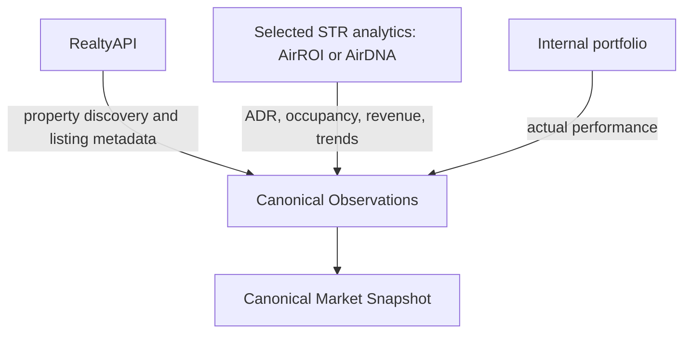
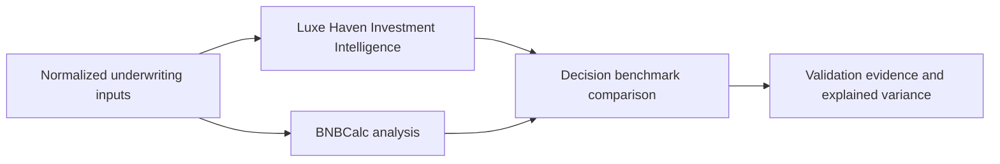
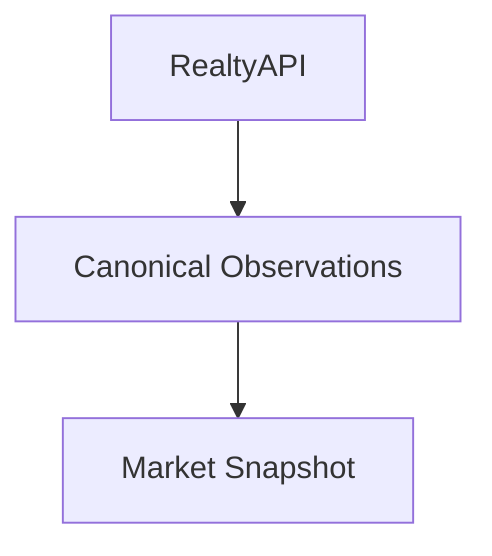

# MI-002 — STR Intelligence Provider Evaluation

## Status

- **Type:** Time-boxed provider investigation and architecture decision input
- **Status:** Planned
- **Owner:** Market Intelligence
- **Priority:** P0 — Blocks Investment Intelligence v1.0
- **Decision output:** ADR-001 — STR Intelligence Provider Strategy

> Identifier note: `II-007A` through `II-007D` already identify Investment
> Intelligence orchestration work in this repository. This investigation uses
> `MI-002` to avoid assigning the same identifier to two architectural concerns.

## Decision to make

Determine the combination of market-data providers that maximizes the quality,
trustworthiness, explainability, geographic coverage, and economic sustainability
of Luxe Haven's canonical Market Snapshot.

The investigation is not a search for one universally best API. It must answer:

> Should Luxe Haven integrate directly with individual providers, consume a
> unified data layer, or use a hybrid strategy with explicit provider
> responsibilities?

No provider may become authoritative merely because it exposes more endpoints.
Provider facts must continue to enter the platform as attributable canonical
Observations and be assembled into immutable snapshots with evidence, gaps, and
confidence.

## Business objective

Replace manually entered ADR, occupancy, and revenue assumptions with
evidence-backed market intelligence. Investment Intelligence must move from
operator assumptions to evidence-backed underwriting without importing provider
DTOs or provider decision logic.

## Current hypothesis

The leading hypothesis, not a preselected decision, is a hybrid:



This assigns each provider a bounded responsibility while retaining Luxe Haven's
control of normalization, evidence, confidence, reconciliation, and downstream
intelligence. AirROI is the leading startup-stage hypothesis and AirDNA remains the
premium benchmark; neither role is selected until the investigation is complete.

## Evaluation principles

1. Compare provider outputs at the observation level, not only by endpoint count.
2. Distinguish raw or live listing data from modeled analytics.
3. Treat ADR, occupancy, RevPAR, and historical trends as separate capabilities;
   the availability of listings must not imply the availability of these metrics.
4. Record the source platform, intermediary, endpoint, retrieval time, effective
   time, geography, sample size, methodology, and transformation lineage whenever
   available.
5. Validate production claims with documentation, contract inspection, and a
   representative proof of concept. Marketing claims alone are insufficient.
6. Evaluate provider legality, terms, source stability, and unofficial-API risk as
   first-class vendor risks.
7. Keep provider selection and fusion behind Market Intelligence ports. Investment
   Intelligence must not depend on provider DTOs or provider-selection rules.

## Providers in scope

The providers are not assumed to be direct substitutes:

| Provider/source | Primary role hypothesis |
|---|---|
| RentCast | Property and long-term-rental baseline |
| RealtyAPI | Multi-source property discovery and listing metadata |
| AirROI | Startup-stage STR analytics |
| AirDNA | Premium STR analytics benchmark |
| Mashvisor | Combined property, STR/LTR, and investment analytics |
| BNBCalc | Underwriting decision benchmark |
| Internal Portfolio | Proprietary measured performance and calibration truth |

### Tier 1 — Direct data and analytics providers

#### STR analytics — AirDNA

**Purpose:** Industry benchmark for modeled STR analytics.

Evaluate:

- ADR, occupancy, and RevPAR definitions and availability;
- historical trends and seasonality;
- market, listing, and geographic coverage;
- comparable methodology, confidence, and explainability;
- refresh cadence and effective dates;
- pricing, contract terms, quotas, and production scalability;
- API maturity, reliability, support, and enterprise readiness.

#### STR analytics — AirROI

**Purpose:** Startup-stage STR analytics candidate with a documented
self-service, usage-based API surface.

AirROI's current documentation advertises public API documentation, a downloadable
OpenAPI specification, endpoint-level pay-as-you-go pricing, listing comparables,
market metrics, revenue estimates, forward rates, and historical data. Its
coverage, depth, accuracy, reliability, and comparisons with other providers are
vendor claims to validate, not accepted findings.

Evaluate:

- comparable discovery, selection quality, similarity controls, and source
  listing identity;
- ADR definition, methodology, time grain, and treatment of fees and unavailable
  nights;
- occupancy definition, denominator, blocked-calendar treatment, and inferred
  versus booked nights;
- revenue and RevPAR definitions, derivations, and consistency with returned ADR
  and occupancy;
- historical completeness, continuity, revisions, and survivorship bias;
- forward-rate and market-pacing fitness for near-term Revenue Intelligence;
- sample size, methodology, confidence support, and explainability;
- market and property coverage in Luxe Haven target geographies;
- OpenAPI accuracy, generated TypeScript quality, pagination, errors, rate-limit
  behavior, latency, and schema stability;
- pay-as-you-go economics per complete canonical Market Snapshot;
- commercial-use, caching, attribution, retention, and derived-data rights.

#### Property and LTR baseline — RentCast

**Purpose:** Current implementation baseline.

Evaluate:

- property resolution, property details, sale comparables, and long-term rental
  evidence currently used by Luxe Haven;
- technical reliability, latency, errors, retries, and observability;
- coverage and observed data quality in target markets;
- provenance, methodology, explainability, and data gaps;
- API and documentation maturity;
- price-to-value ratio and long-term suitability;
- the explicit limitation already represented in the codebase: current RentCast
  endpoints are not authoritative STR ADR or occupancy evidence.

#### Multi-domain investment analytics — Mashvisor

**Purpose:** Evaluate a combined property, STR, LTR, comparable, market, and
investment-analysis API against narrower specialist providers.

Mashvisor's current documentation advertises property details, active listings,
short- and long-term rental analysis, rental comparables, city and neighborhood
analytics, investment metrics, and plan-dependent historical data. Evaluate:

- property, listing, STR, LTR, sales-comparable, and market coverage;
- ADR, occupancy, revenue, yield, and historical methodologies;
- separation of provider observations from Mashvisor-derived investment
  conclusions;
- comparable quality and the evidence returned behind estimates;
- decision fitness for purchase, arbitrage, and portfolio expansion;
- availability and consistency by endpoint, property, market, and geography;
- API contracts, documentation, errors, rate limits, latency, and type safety;
- monthly allowance, overage, bulk-data, and production economics;
- whether broader capability offsets cost relative to specialist providers;
- whether it is suitable as an observation supplier, decision benchmark, both, or
  neither.

### Tier 2 — Unified data layer

#### RealtyAPI

**Purpose:** Determine whether one authentication and integration surface across
provider-specific real-estate and travel APIs can simplify discovery and metadata
acquisition without weakening provenance or increasing source risk.

The provider's current documentation advertises one API key, provider-specific
base URLs, JSON responses, and public OpenAPI 3.1 specifications. It lists sources
including Airbnb, Vrbo, Redfin, Realtor, Apartments.com, and other regional real
estate and travel platforms. These are claims to verify during the investigation,
not accepted capability findings.

Evaluate the following.

#### Source and geographic coverage

- Airbnb;
- Vrbo;
- Realtor;
- Redfin;
- other supported sources relevant to STR and investment workflows;
- overlap, gaps, and source-specific differences by target geography;
- whether cross-source identifiers can be reconciled without unsafe address-only
  matching.

#### Property intelligence

- property details and physical characteristics;
- listing metadata and status;
- address search, resolution, and ambiguity handling;
- photos, amenities, and attribution requirements;
- rental, sale, calendar, availability, and market information;
- response freshness and whether data is live, cached, inferred, or modeled.

#### Market intelligence

Determine, without inference from endpoint names, whether RealtyAPI provides:

- discoverable comparable properties;
- geographic and market search;
- long-term and short-term rental listings;
- STR listing discovery;
- calendar or availability evidence;
- historical trends;
- provider-computed or derivable ADR;
- provider-computed or derivable occupancy;
- provider-computed or derivable revenue and RevPAR;
- methodology, sample size, confidence, and revision history.

For derived metrics, document the required raw observations, assumptions, minimum
sample, bias controls, and whether Luxe Haven would assume model ownership.

#### Technical quality

- consistency across provider-specific APIs and schemas;
- authentication and key rotation;
- documented and observed rate or credit limits;
- p50, p95, and p99 latency on representative calls;
- success rate, timeout behavior, retries, and availability;
- OpenAPI accuracy and compatibility with client generation;
- generated TypeScript type quality and schema stability;
- documentation completeness and examples;
- pagination, idempotency where applicable, and versioning;
- status codes, structured errors, request IDs, and retry guidance;
- webhook, bulk, export, support, and service-level options.

#### Economics

- pricing and credit model by endpoint;
- calls required for one property discovery and one complete snapshot;
- free-tier suitability for contract discovery and proof-of-concept testing;
- estimated monthly cost at development, launch, growth, and enterprise volumes;
- costs of retries, refreshes, multi-source corroboration, and expensive endpoints;
- engineering and operations cost compared with direct integrations;
- contract, overage, retention, redistribution, and caching constraints.

#### Platform fit

Classify RealtyAPI as one or more of:

- primary provider;
- supplemental or corroborating provider;
- discovery provider;
- property metadata provider only;
- not suitable.

The classification must identify responsibilities by observation type and
geography. It must not classify the provider globally when evidence supports only
a narrower role.

### Tier 3 — Proprietary benchmark

#### Internal Portfolio

**Purpose:** Establish actual Luxe Haven operating performance as both the
calibration benchmark for commercial estimates and a growing source of proprietary
market intelligence.

Internal Portfolio is not a commercial-provider substitute at launch. It has
different selection bias, coverage, and sample-size constraints. Evaluate:

- observations Luxe Haven can measure that commercial providers cannot;
- actual booked ADR, occupancy, RevPAR, revenue, lead time, length of stay,
  cancellation, channel mix, discounting, fees, and realized net performance;
- consistency of property, reservation, availability, and financial identities;
- data completeness, quality, freshness, and correction history;
- the minimum property count, stay count, time span, and market diversity required
  for statistically useful cohorts;
- the portfolio size and evidence threshold at which measured internal performance
  outperforms or should receive more weight than third-party estimates;
- which observations should remain external benchmarks, which should be fused, and
  which may eventually transition from provider-sourced to Luxe Haven-measured;
- privacy, tenant isolation, aggregation, consent, and permitted secondary use;
- survivorship, acquisition, management-quality, channel, and geographic biases;
- how internal actuals calibrate provider confidence without retroactively changing
  immutable historical snapshots.

The evaluation must distinguish three uses of internal observations:

1. **Property actuals:** authoritative measured performance for a specific managed
   property and period.
2. **Portfolio cohorts:** proprietary benchmarks for sufficiently comparable Luxe
   Haven properties.
3. **Provider calibration:** evidence used to measure and adjust trust in external
   estimates by metric, market, property type, and horizon.

### Tier 4 — Decision benchmark

#### BNBCalc

**Purpose:** Independently benchmark Luxe Haven underwriting outputs, not supply
canonical conclusions.

BNBCalc's current documentation describes strategy-specific analysis endpoints
that return projected ADR, occupancy, revenue, comparables, expenses, cash flow,
cap rate, cash-on-cash return, ROI, percentiles, and hosted reports. It also
describes itself as an analysis API rather than a broad raw listing-search feed.

Evaluate:

- purchase, rental-arbitrage, owned-property, and co-hosting analysis behavior;
- returned comparable identity, metadata, selection, and transparency;
- ADR, occupancy, revenue, expense, cash-flow, cap-rate, cash-on-cash, and ROI
  definitions;
- input assumptions, defaults, formulas, methodology, confidence, and sensitivity;
- consistency and repeatability across representative properties and markets;
- differences from Luxe Haven decisions using identical normalized inputs and
  effective periods;
- hosted-report lineage, retention, privacy, access, and redistribution;
- API contract, authentication, errors, reliability, latency, and versioning;
- per-successful-analysis economics and suitability for regression benchmarking.

BNBCalc must be classified as `Decision Benchmark`, not `Canonical Market
Provider`, unless a future investigation establishes a separate raw-observation
contract. Its cash flow, cap rate, cash-on-cash return, ROI, recommendation, and
other completed conclusions must never be imported as canonical provider
Observations or replace Luxe Haven's reasoning.

Permitted use:



The comparison may identify gaps, model drift, or assumptions requiring review. It
must not automatically alter a Luxe Haven decision, confidence score, calculation
policy, or immutable snapshot.

## Required proof of concept

Use a small, representative test set containing:

- at least three target US markets with different STR characteristics;
- urban, resort, and non-core geography where possible;
- known internal properties when authorized;
- exact-address, partial-address, coordinate, and market searches;
- active, inactive, ambiguous, and missing listings.

The first three canonical cases are fixed before any provider is scored:

| Case | Market archetype | Required subject |
|---|---|---|
| `MI002-URBAN-01` | Urban | Authorized whole-home property in a dense, year-round US market |
| `MI002-SUBURBAN-01` | Suburban | Authorized whole-home property in a car-oriented secondary US market |
| `MI002-VACATION-01` | Vacation/resort | Authorized whole-home property in a seasonal destination market |

The case manifest must pin normalized address, coordinates, bedrooms, bathrooms,
sleeps, property type, evaluation currency, availability assumption, acquisition
inputs, and evaluation timestamp. Exact addresses and provider payloads remain in
an approved non-repository evidence store when contracts or privacy require it.
Every provider receives the identical manifest; provider defaults may be recorded
but may not silently change it.

For each provider and supported workflow:

1. Save the request shape, endpoint, provider/source identity, retrieval time, HTTP
   status, latency, credit cost, response-schema version, and sanitized response
   fixture.
2. Map the response to candidate canonical Observations.
3. Record mapping loss, ambiguity, missing fields, units, currency, and time grain.
4. Compare overlapping facts and retain disagreements rather than overwriting them.
5. Test empty results, malformed input, authentication failure, rate limiting,
   timeout, upstream failure, schema drift, and partial response behavior.
6. Repeat selected calls to measure stability, freshness, and cost.
7. Where authorized internal actuals exist, compare estimates with measured
   performance using identical property identities, metric definitions, and time
   periods.
8. Run BNBCalc from the same normalized underwriting inputs used by Luxe Haven,
   compare intermediate metrics and final decisions, and explain material variance
   without feeding BNBCalc conclusions back into the canonical analysis.

Production credentials, secrets, personal data, and provider payloads prohibited by
contract must not be committed.

## Evaluation matrix

Use `Supported`, `Partial`, `Unsupported`, or `Unknown` for capability, accompanied
by evidence and scope. Do not replace `Unknown` with a marketing inference.

| Capability | RentCast | AirDNA | AirROI | RealtyAPI | Mashvisor | BNBCalc |
|---|---|---|---|---|---|---|
| Property search | To verify | To verify | To verify | To verify | To verify | Benchmark only |
| Property details | To verify | To verify | To verify | To verify | To verify | Benchmark only |
| STR comparables | To verify | To verify | To verify | To verify | To verify | To verify |
| ADR | To verify | To verify | To verify | To verify | To verify | Benchmark output |
| Occupancy | To verify | To verify | To verify | To verify | To verify | Benchmark output |
| RevPAR | To verify | To verify | To verify | To verify | To verify | Benchmark output |
| Historical trends | To verify | To verify | To verify | To verify | To verify | To verify |
| Market confidence/methodology | To verify | To verify | To verify | To verify | To verify | To verify |
| Explainability and lineage | To verify | To verify | To verify | To verify | To verify | To verify |
| Geographic coverage | To verify | To verify | To verify | To verify | To verify | To verify |
| API quality and reliability | To verify | To verify | To verify | To verify | To verify | To verify |
| Documentation | To verify | To verify | To verify | To verify | To verify | To verify |
| OpenAPI support | To verify | To verify | To verify | To verify | To verify | To verify |
| Type-safe integration | To verify | To verify | To verify | To verify | To verify | To verify |
| Cost per canonical snapshot | To verify | To verify | To verify | To verify | To verify | Not applicable |
| Cost per benchmark analysis | Not applicable | Not applicable | Not applicable | Not applicable | To verify | To verify |
| Long-term fit | To verify | To verify | To verify | To verify | To verify | Decision benchmark |

Each completed cell must link to documentation, a dated contract/specification, or
proof-of-concept evidence. Scores without evidence are invalid.

BNBCalc must not receive a canonical-provider aggregate score. Its applicable cells
measure benchmark transparency and usefulness, not eligibility to own the Market
Snapshot. Mashvisor's raw/provider observations and completed investment
conclusions must likewise be scored separately.

Internal Portfolio must be evaluated in a separate benchmark matrix because its
coverage, economics, and authority differ fundamentally from commercial providers:

| Capability | Internal Portfolio |
|---|---|
| Property and reservation identity | To verify |
| Actual ADR, occupancy, RevPAR, and revenue | To verify |
| Historical actuals and seasonality | To verify |
| Comparable cohort construction | To verify |
| Data freshness and correction lineage | To verify |
| Sample size and market diversity | To verify |
| Provider-estimate calibration | To verify |
| Privacy and permitted aggregation | To verify |
| Proprietary advantage potential | To verify |

## Weighted decision scorecard

The final report must show both raw findings and a weighted score. Initial weights
may be adjusted before testing, but not after provider results are known without an
explicit rationale.

| Dimension | Weight |
|---|---:|
| Decision fitness | 20% |
| Time horizon fitness | 10% |
| Data fitness and quality | 15% |
| STR analytics fitness | 10% |
| Explainability, provenance, and confidence | 15% |
| Coverage | 10% |
| Technical quality and reliability | 10% |
| Economics and scalability | 5% |
| Vendor, legal, and source risk | 5% |

A high aggregate score cannot override a failed gating requirement. Required gates
are acceptable usage rights, server-side credential handling, source attribution,
stable property identity, explicit metric semantics, observable failures, and the
ability to preserve immutable evidence.

## Decision fitness

Provider quality is decision-specific. A source can be valuable for property
discovery and unsuitable for underwriting, or authoritative for property actuals
and unrepresentative of a new market. The investigation must evaluate how well each
source or provider combination supports the product decisions Luxe Haven makes.

### Decision importance

| Decision | Importance |
|---|---:|
| Purchase underwriting | 5 — Critical |
| Rental arbitrage | 5 — Critical |
| Portfolio expansion | 4 — High |
| Revenue optimization | 3 — Material |
| Financial forecasting | 3 — Material |
| Executive reporting | 2 — Supporting |

Importance expresses the consequence of weak market evidence, not current feature
priority. Changes require a documented product and architecture rationale before
provider findings are scored.

### Provider decision-fitness matrix

Score each cell from `0 — Unsupported` through `5 — Decision-grade`, with evidence,
geographic scope, supported horizons, material gaps, and whether another source is
required.

| Provider/source | Purchase underwriting | Rental arbitrage | Revenue optimization | Portfolio expansion | Financial forecasting | Executive reporting |
|---|---:|---:|---:|---:|---:|---:|
| RentCast | To verify | To verify | To verify | To verify | To verify | To verify |
| AirDNA | To verify | To verify | To verify | To verify | To verify | To verify |
| AirROI | To verify | To verify | To verify | To verify | To verify | To verify |
| RealtyAPI | To verify | To verify | To verify | To verify | To verify | To verify |
| Mashvisor | To verify | To verify | To verify | To verify | To verify | To verify |
| BNBCalc decision benchmark | To verify | To verify | To verify | To verify | To verify | To verify |
| Internal Portfolio | To verify | To verify | To verify | To verify | To verify | To verify |
| Selected provider combination | To verify | To verify | To verify | To verify | To verify | To verify |

Decision fitness must be evaluated against the complete evidence required by each
decision, not merely the fields a provider returns. The selected strategy must
identify which source supplies, corroborates, or cannot satisfy each required
observation.

### Investment Intelligence authoritative-source gate

No provider may become the sole authoritative source for Investment Intelligence
unless it can directly provide, or support a documented and validated derivation
of, every required underwriting observation:

- property identity;
- subject property;
- comparable discovery;
- comparable metadata;
- comparable distance;
- bedrooms;
- bathrooms;
- sleeps;
- property type;
- ADR;
- occupancy;
- RevPAR;
- revenue;
- historical trend;
- freshness/effective period;
- confidence and methodology;
- origin attribution and delivery-intermediary provenance.

For each observation, the provider must also pass semantic, geographic, freshness,
lineage, reliability, and permitted-use requirements. A derivation passes only when
its inputs, formula, time grain, sample requirements, uncertainty, and owner are
explicit and tested.

If any required observation fails this gate, the provider:

- cannot be the sole source for Investment Intelligence;
- may still serve a bounded discovery, metadata, analytics, corroboration, or
  fallback responsibility;
- must be combined with another qualified source or leave an explicit blocking
  data gap;
- must never receive an inferred value merely to complete the underwriting input.

Passing the gate establishes minimum completeness; it does not establish that the
provider is best, authoritative for every geography, or sufficient for every
decision.

## Time horizon fitness

Market evidence must be fit for the time horizon of the decision consuming it.
Current listing discovery, near-term pricing, annual underwriting, and multi-year
market selection have different freshness, history, seasonality, sample, and
forecast requirements.

### Horizon purpose

| Horizon | Primary purpose | Primary consumers |
|---|---|---|
| Live/current | Current listing and subject-property discovery | Market and Investment Intelligence |
| 30 days | Near-term pricing and availability decisions | Revenue Intelligence |
| 90 days | Revenue pacing and forecast updates | Revenue and Financial Intelligence |
| Annual | Stabilized revenue expectations and underwriting | Investment Intelligence |
| Multi-year | Historical confidence, structural trends, and market selection | Investment, Portfolio, and Executive Intelligence |

The stated horizon must represent the evidence period, forecast period, or
effective period—not merely when the API response was retrieved. A live response
containing stale annual data is not live evidence for annual expectations.

### Provider time-horizon matrix

Score each cell from `0 — Unsupported` through `5 — Decision-grade`, with the
available history, forecast window, time grain, refresh cadence, seasonal
adjustment, methodology, and confidence bounds.

| Provider/source | Live/current | 30 days | 90 days | Annual | Multi-year |
|---|---:|---:|---:|---:|---:|
| RentCast | To verify | To verify | To verify | To verify | To verify |
| AirDNA | To verify | To verify | To verify | To verify | To verify |
| AirROI | To verify | To verify | To verify | To verify | To verify |
| RealtyAPI | To verify | To verify | To verify | To verify | To verify |
| Mashvisor | To verify | To verify | To verify | To verify | To verify |
| BNBCalc decision benchmark | To verify | To verify | To verify | To verify | To verify |
| Internal Portfolio | To verify | To verify | To verify | To verify | To verify |
| Selected provider combination | To verify | To verify | To verify | To verify | To verify |

For every supported horizon, determine:

- whether the value is observed, provider-modeled, or Luxe Haven-derived;
- the historical lookback, forecast window, and time grain;
- how seasonality, events, listing churn, and incomplete calendars are handled;
- whether confidence degrades as the horizon extends;
- whether the provider exposes revisions or vintage history;
- whether the evidence is appropriate for the named product decision;
- which source supplies the baseline and which sources corroborate or calibrate it.

Investment Intelligence requires decision-grade annual expectations, historical
confidence, and underwriting quality. Revenue Intelligence requires stronger
near-term pricing and availability evidence. A provider must not be treated as
globally authoritative when it is fit for only one horizon.

## Public documentation evidence baseline

**Evidence checked:** 2026-07-29. These findings establish POC eligibility only.
They do not establish accuracy, production reliability, permitted retention, or
decision-grade fitness.

| Provider | Publicly verified capability | Publicly verified commercial/technical evidence | Still blocking |
|---|---|---|---|
| RentCast | US property records, sale and long-term rental listings, AVMs, sale/LTR comparables, and ZIP-level sale/LTR trends | REST documentation; 50 successful requests/month on the free developer plan; paid plan and overage details require the API dashboard | No authoritative STR ADR, occupancy, RevPAR, or STR revenue surface; live baseline metrics unavailable without credentials |
| AirROI | Listing search and details, STR comparables, trailing metrics, market ADR/occupancy/RevPAR/revenue series, revenue estimate, forward rates, and pacing | Public OpenAPI 2.1.1; standard endpoint pricing from $0.01 to $1.00; $0.20 calculator estimate; public page states 100 requests/minute while another public page states 1,000, so the contract must resolve the discrepancy | Accuracy, metric methodology, source/usage rights, schema stability, observed limits, reliability, and coverage claims |
| AirDNA | ADR, occupancy, RevPAR, revenue, comparable sets, market history, Rentalizer, and future-demand views | Public methodology defines ADR, occupancy denominator, revenue inclusions, deduplication, update cadence, and source mix; API commercial terms are sales-gated | API schema/access, price, SLA, quotas, caching/retention rights, and common-property results |
| Mashvisor | Property/search, STR and LTR analysis, rental rates, trends, investment analysis, and predictive scores | REST/JSON documentation; nightly metric updates; $129/500, $249/1,000, and $599/3,000 calls monthly; $0.30 overage; 12–36 months history | Exact STR schemas and semantics, market coverage, rate limits, source rights, reliability, and separation of observations from conclusions |
| RealtyAPI | Origin-specific property and listing discovery through public OpenAPI specifications | 250 requests free; $20/20,000, $60/85,000, and $250/500,000 monthly requests; documented OpenAPI specs by origin | No public evidence that it supplies modeled STR ADR, occupancy, RevPAR, annual revenue, methodology, or confidence; origin legality and retention terms |
| BNBCalc | Address/coordinate-based buy, arbitrage, owned, and cohost analyses with ADR, occupancy, revenue, percentile ranges, and up to 50 active comparables | Public REST examples; $0 subscription and $0.20 per successful report | Methodology, confidence, repeatability, reliability, and variance against canonical inputs; remains benchmark-only |
| Internal Portfolio | Potentially authoritative actual booked ADR, occupancy, RevPAR, revenue, booking, and operational evidence | No incremental vendor charge | Authorized cohort size, metric alignment, data quality, privacy/secondary-use review, and selection-bias controls |

The baseline exposes one immediate architectural finding: RealtyAPI is eligible for
discovery/metadata evaluation but currently has no public evidence supporting a
sole-source STR underwriting role. RentCast likewise remains a property/LTR
baseline rather than an STR analytics candidate. AirROI, AirDNA, and Mashvisor
remain the candidates for primary STR observations; BNBCalc remains a decision
benchmark.

### Normalized public-price comparison

The POC cost model uses four lifecycle volumes and reports both provider invoice
cost and engineering/operations cost:

| Stage | Canonical snapshots/month | Purpose |
|---|---:|---|
| Development | 100 | Contract discovery and deterministic fixture creation |
| Launch | 1,000 | Early production underwriting |
| Growth | 10,000 | Multi-workspace underwriting and refresh |
| Enterprise | 100,000 | High-volume analysis, refresh, and corroboration |

For every provider calculate:

```text
monthly provider cost =
  fixed plan
  + Σ(successful calls by endpoint × endpoint price)
  + overage
  + required benchmark/corroboration calls
```

| Provider | Development | Launch | Growth | Enterprise |
|---|---|---|---|---|
| RentCast | Free allowance covers only 50 successful calls; dashboard quote required above that | Quote from current API dashboard | Quote from current API dashboard | Custom quote |
| AirROI | Calls × published endpoint price; a candidate full snapshot must enumerate its exact endpoint recipe | Same formula | Same formula; preferred-partner eligibility cannot be assumed | Contract and SLA review |
| AirDNA | Quote required | Quote required | Quote required | Enterprise quote required |
| Mashvisor | At least $129/month; endpoint recipe must fit 500 included calls | At least $249/month if within 1,000 calls | $599/month includes 3,000 calls, then $0.30/call unless a better plan is contracted | Enterprise quote required |
| RealtyAPI | Free up to 250 request credits, but not a complete STR snapshot | $20/month includes 20,000 request credits | $20 or $60 depending on endpoint credit weights | $250/month includes 500,000 request credits, subject to endpoint weights |
| BNBCalc | $20 per 100 benchmark runs | $200 per 1,000 benchmark runs | $2,000 per 10,000 benchmark runs | $20,000 per 100,000 benchmark runs; benchmark sampling should be evaluated |
| Internal Portfolio | No provider fee; storage, quality, privacy, and calibration compute remain | Same | Same | Same |

Public tier prices are not a production cost decision. Final costs require the
exact calls per complete snapshot, retries, refresh cadence, source corroboration,
failed-call billing, cache/retention rights, taxes, support, and SLA terms.

## Architecture options

### Option A — One STR analytics provider

AirDNA, AirROI, or another qualified STR provider supplies the required property
and STR market evidence only if it passes the sole-authoritative-source gate.

### Option B — RentCast plus selected STR analytics

RentCast supplies property, sale, and long-term rental evidence. AirROI or AirDNA
supplies STR analytics. Luxe Haven fuses their canonical Observations.

### Option C — RealtyAPI only



One commercial integration supplies source-specific data. Luxe Haven still owns
canonical mapping and snapshot construction.

### Option D — RealtyAPI plus selected STR analytics plus internal actuals

RealtyAPI supplies property discovery and listing metadata. AirROI or AirDNA
supplies modeled STR analytics. Internal portfolio systems supply actual
performance. Luxe Haven reconciles attributable Observations into the canonical
Market Snapshot. The present startup-stage hypothesis selects AirROI if it passes
the same evidence, authoritative-source, horizon, legal, and reliability gates as
AirDNA.

### Option E — Retain the current baseline

Retain RentCast for the supported scope and defer expanded STR analytics. This is a
valid outcome if no alternative passes the evidence, risk, or economic gates.

## Canonical observation mapping deliverable

The evaluation must propose, but not yet implement, a provider-neutral mapping for
each selected observation:

| Field | Required content |
|---|---|
| Observation type | Stable canonical metric or property-fact identifier |
| Value | Typed value with unit and currency where applicable |
| Subject | Canonical property, listing, market, or portfolio identity |
| Source | Origin platform and intermediary/provider |
| Source reference | Endpoint plus non-secret external record identifier |
| Retrieved at | Time Luxe Haven acquired the fact |
| Effective at/range | Time or period represented by the fact |
| Method | Reported, modeled, or Luxe Haven-derived |
| Sample/methodology | Sample size, population, filters, and provider method when available |
| Confidence | Source confidence plus Luxe Haven assessment; never silently conflated |
| Evidence | Immutable permitted fixture, digest, or source reference |
| Transformation | Mapping version and derivation inputs |
| Gaps/conflicts | Missing fields, ambiguity, disagreement, and staleness |

An aggregation provider must preserve two identities: RealtyAPI as the delivery
intermediary and Airbnb, Vrbo, Redfin, Realtor, or another platform as the origin
source. A generic `RealtyAPI` provenance value alone is insufficient.

## Vendor-risk assessment

At minimum, assess:

- official versus unofficial access to each origin platform;
- terms covering production use, caching, derived data, display, attribution,
  redistribution, and retention;
- upstream blocking or source-layout/schema change risk;
- subprocessor and geographic considerations;
- security controls, incident process, audit evidence, and key management;
- financial viability, support responsiveness, and exit assistance;
- service-level commitments versus marketing availability claims;
- concentration risk when one intermediary fronts many origin platforms;
- loss of access to one source versus loss of the entire aggregation layer.

Legal review is required before production use of any unofficial source API.

## Migration and provider onboarding

The selected strategy must support:

1. parallel-run/shadow acquisition without changing current decisions;
2. provider-specific adapters behind existing Market Intelligence ports;
3. versioned mappings into canonical Observations;
4. snapshot comparison and reconciliation before cutover;
5. feature flags and per-capability/per-geography provider selection;
6. bounded fallback that records substitution and never hides missing evidence;
7. rollback to the last known strategy without mutating historical snapshots;
8. contract tests generated or checked against provider schemas;
9. cost, latency, failure, freshness, and disagreement monitoring;
10. provider removal without rewriting downstream Investment Intelligence.

Every future provider must document supported observation types, metric semantics,
geographic scope, identity strategy, provenance, freshness, reliability, cost,
terms, failure behavior, mapping tests, and an exit plan before onboarding.

## Future provider candidates

MI-002 is the permanent qualification standard for future market-data providers,
not a closed comparison of the providers named in this version.

Every future candidate must be evaluated using the same:

- authoritative-source gate;
- capability and evidence matrix;
- decision-fitness matrix;
- time-horizon fitness matrix;
- canonical observation and provenance mapping;
- proof-of-concept property set;
- cost, reliability, legal, vendor, and source-risk assessment;
- migration, shadowing, rollback, and removal requirements.

Adding or replacing a provider must not require changes to Investment Intelligence,
Revenue Intelligence, Financial Intelligence, Portfolio Intelligence, Executive
Intelligence, or Learning Intelligence. The normal onboarding surface is:

1. a provider adapter behind Market Intelligence ports;
2. a versioned canonical Observation mapping;
3. provider contract and mapping tests;
4. composition-root registration and bounded selection policy;
5. operational monitoring, cost controls, and documented rollback.

A provider that requires downstream capabilities to import its DTOs, metric
vocabulary, selection logic, confidence, or conclusions fails the architecture
gate regardless of its data quality.

## Execution sequence

1. Validate the current RentCast implementation and document its measured
   strengths, limits, reliability, cost, and supported observation contract.
2. Build proof-of-concept integrations for AirROI, RealtyAPI, Mashvisor, and
   BNBCalc against the same representative property set. Evaluate AirDNA through
   the same evidence contract when access is available.
3. Compare provider estimates with authorized Internal Portfolio actuals where
   identities, metric definitions, and effective periods align.
4. Populate the capability matrices, decision-fitness scores, time-horizon
   evaluations, authoritative-source gates, and normalized cost model with
   evidence.
5. Write ADR-001 with the selected provider responsibilities, rejected
   alternatives, migration strategy, and review triggers.
6. Implement the selected provider strategy only after ADR-001 is accepted.

Evidence collection and contract-level proof of concept are authorized by this
charter. Production provider adoption, canonical-model changes, and downstream
intelligence rewrites are not.

### Current execution gates

| Gate | State on 2026-07-29 | Unblocking evidence |
|---|---|---|
| Common property manifest | Blocked | Three authorized subject properties and normalized assumptions |
| Provider credentials | Blocked | POC keys for RentCast, AirROI, AirDNA, RealtyAPI, Mashvisor, and BNBCalc as applicable |
| Live POC results | Blocked | Successful, failure-mode, repeatability, latency, schema, and sanitized fixture runs |
| Internal calibration | Blocked | Authorized aligned actuals with adequate identity, period, and metric quality |
| Commercial/legal | Blocked | Current quotes plus caching, retention, attribution, derived-data, redistribution, SLA, and exit terms |
| Final scorecard | Blocked | Completed evidence-linked matrices after the preceding gates |
| ADR approval | Blocked | Named cross-functional reviewers approve the completed ADR |

Public documentation research is complete enough to begin credentialed contract
discovery. It is not sufficient to select a production provider.

## Required outputs

- completed capability matrix with evidence links;
- normalized cost model at defined snapshot volumes;
- representative proof-of-concept results and sanitized fixtures;
- canonical observation mapping;
- provider responsibility map;
- completed decision-fitness and authoritative-source gate assessments;
- completed time-horizon fitness assessment by provider and product consumer;
- Internal Portfolio benchmark and proprietary-data maturity thresholds;
- BNBCalc decision-benchmark comparison with explained variance and no canonical
  conclusion ingestion;
- reliability and schema-quality report;
- vendor, legal, and source-risk assessment;
- recommendation among Options A–E, including rejected alternatives;
- migration and rollback plan;
- `ADR-001 — Market Data Strategy`.

## ADR-001 acceptance criteria

The ADR must state:

- why the strategy was selected;
- the responsibility of each provider by capability and geography;
- decision fitness by product decision and the evidence required for each;
- time horizon fitness and responsibility for live, near-term, annual, and
  multi-year evidence;
- authoritative-source gate results for Investment Intelligence;
- canonical observation and provenance mapping;
- conflict resolution, confidence, substitution, and staleness policies;
- the role of Internal Portfolio actuals, calibration thresholds, and the path from
  external estimates to measured proprietary observations;
- the bounded role of any decision-benchmark service and confirmation that its
  conclusions do not become canonical observations or decisions;
- cost assumptions and sensitivity at multiple volumes;
- vendor and source risks with mitigations;
- migration, shadowing, cutover, and rollback steps;
- future provider onboarding and removal guidelines;
- review triggers, including price, coverage, terms, reliability, or schema changes.

### Required section — Why This Is Not a Vendor Decision

The ADR must explicitly state that the decision establishes a market-data strategy,
not permanent dependence on a vendor.

Luxe Haven owns:

- canonical Observations;
- confidence assessment;
- evidence and lineage;
- reconciliation and conflict policy;
- immutable Market Snapshots;
- explainability.

Providers supply attributable observations within bounded capabilities,
geographies, and time horizons. They do not own Luxe Haven's canonical models,
confidence, reconciliation, snapshots, or downstream decisions. Provider
responsibilities may evolve without requiring Investment, Revenue, Portfolio,
Financial, or Executive Intelligence to be rewritten.

The ADR remains `Proposed` until the proof of concept, cost model, and risk review
are complete. Option D is the current hypothesis, not the recorded decision.

## Documentation baseline

The following first-party provider documentation establishes only the public
evidence baseline and must be rechecked on the evaluation date:

- [RentCast API introduction](https://developers.rentcast.io/reference/introduction)
- [RentCast billing and pricing](https://developers.rentcast.io/reference/billing-and-pricing)
- [RentCast property valuation](https://developers.rentcast.io/reference/property-valuation)
- [RealtyAPI introduction](https://www.realtyapi.io/docs/introduction)
- [RealtyAPI OpenAPI specifications](https://www.realtyapi.io/docs/integrations/openapi)
- [RealtyAPI pricing](https://www.realtyapi.io/pricing)
- [AirROI API documentation](https://www.airroi.com/api/documentation/)
- [AirROI API pricing](https://www.airroi.com/api/pricing)
- [AirDNA data sources](https://help.airdna.co/en/articles/15480669-where-is-our-data-sourced-from)
- [AirDNA ADR methodology](https://help.airdna.co/en/articles/8062173-how-does-airdna-calculate-average-daily-rate-adr)
- [AirDNA occupancy methodology](https://help.airdna.co/en/articles/8062178-how-does-airdna-calculate-occupancy-rate)
- [AirDNA revenue methodology](https://help.airdna.co/en/articles/8374548-how-does-airdna-calculate-revenue)
- [AirDNA Rentalizer methodology](https://help.airdna.co/en/articles/10559022-rentalizer-revenue-calculator)
- [BNBCalc REST API](https://www.bnbcalc.com/rest-api)
- [Mashvisor API documentation](https://www.mashvisor.com/api-doc-v2)
- [Mashvisor API pricing](https://www.mashvisor.com/api-plans)
